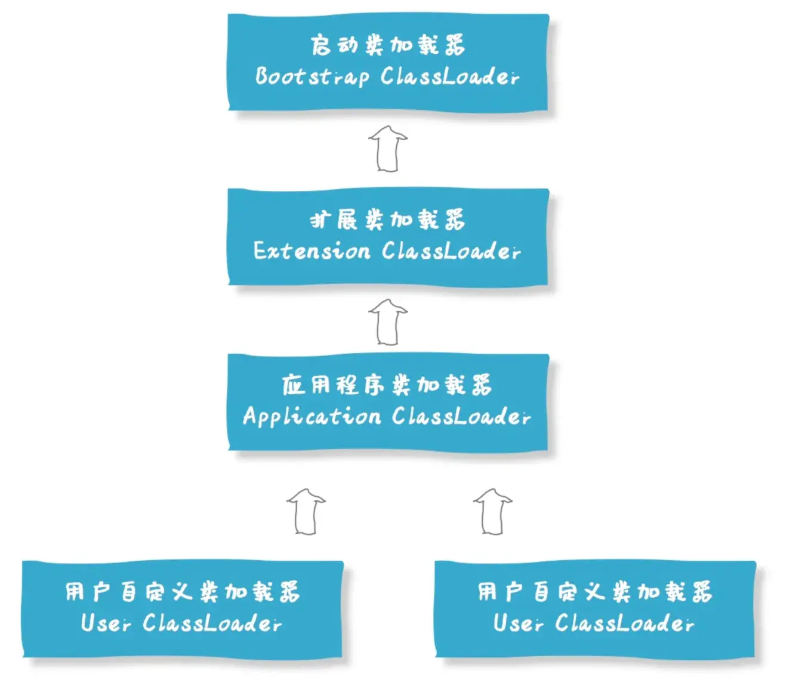
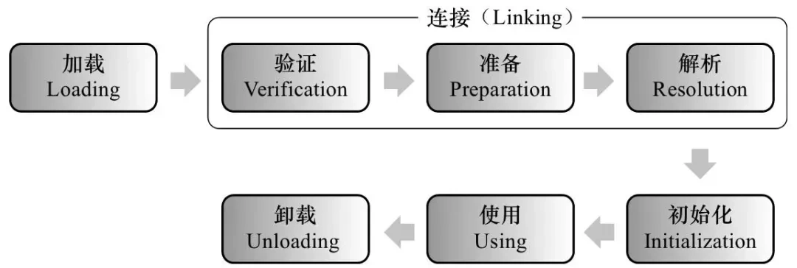
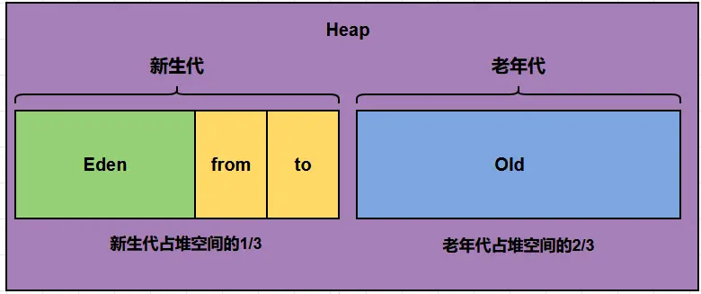

# 概述

Java虚拟机(Java Virtual Machine)。主要负责加载并运行 Java 字节码文件（.class 文件），并在运行时提供内存管理、线程管理、异常处理和安全支持。

- JVM是一个软件，不同操作系统有不同的版本。

**Java程序跨平台原理**

Java的跨平台能力依赖于Java虚拟机(JVM)。Java源码在经过编译后会生成`.class`字节码文件，字节码无法直接运行，而是通过JVM将字节码翻译成特定平台下的机器码然后运行。也就是说，Java通过JVM这一中间层，屏蔽了底层操作系统的差异，从而实现了一次编译即可在不同平台上运行的特性。

- 跨平台的是Java程序，不是JVM，JVM是使用C/C++开发的，是编译后的机器码，无法跨平台，不同平台下需要安装不同版本的JVM

## 核心功能

**解释和运行**

- 逐条解释字节码文件中的字节码指令，通过 JVM 自身已编译好的本地实现代码来执行对应的字节码语义

**内存管理**

- 自动为对象、方法等分配内存
- 自动的垃圾回收机制，自动回收不再使用的对象，释放内存。

**即时编译(JIT)**

Java 字节码通常由解释器逐行解释执行。但在 JVM 中存在一个“**方法调用计数器**”，用于统计每个方法的调用次数。当某个方法的调用次数超过设定的阈值时，JVM 会将其判定为“热点方法”。这时，**JIT（即时编译器）**会将该方法的字节码编译为本地机器码，并将其缓存。之后再调用该方法时，JVM 会直接执行缓存的机器码，从而大幅提升执行性能。

- 对热点代码进行优化，直接将其编译为机器码缓存起来，提升执行效率。
- 所以Java既是编译型语言也是解释型语言，默认采用了解释器与编译器混合的模式

## 常见JVM

所有Java虚拟机均需要遵循**Java虚拟机规范**，它是由`Oracle`制定，规定了Java虚拟机在设计和实现时需要遵守的规范，主要包含class字节码文件的定义、类和接口的加载和初始化、指令集等内容。

|             名称             |  作者   |           支持版本           | 社区活跃度 (github star) |                             特性                             |               适用场景                |
| :--------------------------: | :-----: | :--------------------------: | :----------------------: | :----------------------------------------------------------: | :-----------------------------------: |
|    HotSpot (Oracle JDK版)    | Oracle  |           所有版本           |         高(闭源)         |  使用最广泛,稳定可靠,社区活跃 JIT支持 Oracle  JDK默认虚拟机  |                 默认                  |
|     HotSpot (Open JDK版)     | Oracle  |           所有版本           |        中(16.1k)         |                 同上 开源,Open JDK默认虚拟机                 |       默认 对JDK有二次开发需求        |
|           GraalVM            | Oracle  |    11, 17, 19 企业版支持8    |        高(18.7k)         |      多语言支持Ruby、Python、C++等高性能、JIT、AOT支持       | 微服务、云原生架构 需要多语言混合编程 |
| Dragonwell       JDK (龙井)  | Alibaba | 标准版8, 11, 17 扩展版11, 17 |         低(3.9k)         | 基于OpenJDK的增强 高性能、bug修复、安全性提升  JWarmup、ElasticHeap、Wisp特性支持 | 电商、物流、金融领域 对性能要求比较高 |
| Eclipse  OpenJ9   (原IBM J9) |   IBM   |      8, 11, 17, 19, 20       |         低(3.1k)         |               高性能、可扩展 JIT、AOT特性支持                |          微服务、云原生架构           |

# 组成

JVM 主要由**类加载子系统**、**运行时数据区**、**执行引擎**以及**本地方法接口（JNI）**和**本地方法库**组成。


## 类加载子系统

> 负责把 `.class` 文件加载到 JVM 中，并将其转换为 JVM 可以直接使用的 `Class` 对象。

### 类加载器

类加载子系统中包含多层类加载器，它们负责将字节码文件加载到内存。

- 这里的层级并不是指继承关系，而是职责委派关系。

**`ClassLoader`**

> 抽象类，Java中类加载器的顶层父类，定义了类加载器的具体行为，可以通过本地方法调用JVM方法加载类

**`SecureClassLoader`**

> ClassLoader的实现类，使用证书机制提升了类加载的安全性

**`URLClassloader`**

> SecureClassLoader的子类。利用`URL`获取目录下或者指定的`jar`包加载类。




**启动类加载器(Bootstrap Class Loader)**

最顶层的类加载器，使用C++编写，由JVM提供。负责加载Java的核心库（`jre/lib`下的jar包，如`rt.jar`,`tools.jar`）。

- 启动类加载器无法被Java程序直接引用。由启动类加载器加载的类，调用其`getClassLoader`方法返回`null`。
- 可以通过虚拟机参数`-Xbootclasspath/a:jar包目录`扩展启动类加载器的加载范围，使用启动类加载器加载用户jar包。

**扩展类加载器（Extension Class Loader)**：使用Java语言实现，继承自`URLClassLoader`类，负责加载Java扩展目录（`jre/lib/ext`目录）下的jar包。

- 扩展类加载器由启动类加载器加载。
- 可以通过JVM参数`-Djava.ext.dirs=jar包目录`扩展指定类加载器的加载范围，默认会覆盖掉原始目录，可以用;(windows)或:(macos/linux)追加多个目录。

**系统类加载器(System Class Loader)**

又称为应用程序类加载器（Application Class Loader)。也是使用Java语言实现，继承自`URLClassLoader`类。负责加载用户类路径（ClassPath）下的jar包，是我们平时编写Java程序时默认使用的类加载器。可以通过`ClassLoader.getSystemClassLoader()`方法获取到。

- 应用程序类加载器与扩展类加载器均位于`sun.misc.Launcher`类内部

**自定义类加载器（CustomClassLoader）**

开发者可以根据需求定制类的加载方式，比如从网络加载`.class`文件、数据库、甚至是加密的文件中加载类等。自定义类加载器可以用来扩展Java应用程序的灵活性和安全性。

**类加载器加载过程**

1. 读取字节码文件的二进制字节流并保存到内存中。
2. `ClassLoader` 将二进制字节流交给 JVM，JVM 根据字节流解析并创建类的运行时数据结构：在方法区创建对应的 `InstanceKlass` 对象，保存类的字段、方法、常量池等信息；在堆中创建与之关联的 `Class` 对象，作为 Java 层访问该类元数据的入口。
   - `ClassLoader` 通过调用native方法将字节流提交给 JVM 执行上述操作。

#### 双亲委派机制

双亲委派机制指当一个类加载器接到类加载请求时，它不会自己直接加载，而是先将请求委托给父类加载器；父类加载器如果能加载就返回，如果不能再由当前加载器自己去加载。

- 在由`Java`代码实现的类加载器中，均有一个`parent`字段，指向其双亲委派时的父类加载器，而扩展类加载器的`parent`字段为`null`,但启动类加载器仍然是其逻辑上的父类加载器。

当一个类中需要加载其他类时，默认会调用加载自己的类加载器进行加载，即**谁加载我，我就使用谁加载其他类**。

**双亲委派模型的作用**

- 保证了类的唯一性和安全性：双亲委派机制确保了所有类加载请求都会传递到启动类加载器，避免了不同类加载器重复加载相同类，也防止自定义类覆盖Java核心类库的可能。
- 形成了清晰的类加载层次结构：不同层次的类加载器服务于不同的类加载请求，保证了各个层级类加载器的职责清晰，便于维护和扩展。

**打破双亲委派机制的方法**

- 自定义类加载器并重写`loadClass`方法
- 利用线程上下文加载器
- 使用Osgi框架的类加载器

**破坏双亲委派模型的场景有什么，为什么要破坏双亲委派模型**

**典型场景包括：**

- **SPI / JDBC**：接口在 JDK，实现类在应用层，需要在接口中使用子加载器加载实现类。
- **Web 容器（如Tomcat）**：实现 Web 应用之间的类隔离
  - 一个Tomcat容器中可以运行多个Web程序，如果多个应用中出现了相同限定名的类，在双亲委派机制下，只会加载其中一个类，导致出现错误。
  - `Tomcat`会为每个Web应用分配独立的类加载器，且这个类加载器在收到类加载请求时不会进行双亲委派，而是直接加载。
- **插件系统 / 热部署**：支持插件的动态加载、卸载与独立依赖
- **自定义字节码加载**：运行时生成或加密类只能由自定义加载器加载

破坏双亲委派后，可以实现：

- 实现类隔离，避免不同应用间相互影响，使同名类在不同作用域中共存
- 满足框架层定义接口、应用层提供实现的需求
- 支持模块化、热部署和动态卸载
- 提高系统的扩展性和灵活性

#### 自定义类加载器

**自定义类加载器的目的**

- 从非 classpath 位置加载类（磁盘、网络、加密文件等）
- 实现类隔离（插件系统、热部署）
- 破坏双亲委派
- 实现自定义字节码处理（加密 / 解密 / 增强）

1. 继承`ClassLoader`类

   ```
   public class MyClassLoader extends ClassLoader {
   }
   ```

   - `ClassLoader`提供了`defineClass`方法将二进制字节数组转换为`Class`对象

2. 决定加载策略

   - 如果遵循双亲委派模型，则重写`findClass`方法，`findClass`定义了类加载器自己加载类的逻辑。

     获得`.class`文件读取出的二进制字节数组，最终调用`defineClass`将字节码信息保存到方法区与堆中。

     ```java
     //自定义加载器加载类的行为由findClass定义
         @Override
         protected Class<?> findClass(String name) throws ClassNotFoundException {
             try {
                 // com.example.Hello → com/example/Hello.class
                 String classPath = name.replace('.', '/') + ".class";
                 Path fullPath = classDir.resolve(classPath);
     
                 byte[] classBytes = Files.readAllBytes(fullPath);
     
                 return defineClass(name, classBytes, 0, classBytes.length);
             } catch (IOException e) {
                 throw new ClassNotFoundException(name, e);
             }
         }
     ```

   - 如果想要打破双亲委派模型，则重写`loadClass`方法

     ```java
     public class MyClassLoader extends ClassLoader{
     
         @Override
         public Class<?> loadClass(String name) throws ClassNotFoundException {
     
         }
     }
     ```

   - `loadClass`提供了双亲委派机制，默认行为是首先委派父加载器进行加载，如果父加载器无法加载，才调用`findClass`加载

- 自定义类加载器如果不指定其父类加载器，则默认为应用程序加载器

#### 类加载器在不同JDK版本的变化

在JDK8及以前的版本中，扩展类加载器和应用程序类加载器均是`rt.jar`包中的`sun.misc.Launcher.java`类的静态内部类。此时它们均继承了`URLClassLoader`中

在JDK9开始，引入了`module`的概念，类加载器不再从`jar`包中加载类，而是从`jmod`文件中加载类。此时启动类加载器使用Java代码实现，且扩展类加载器被平台类加载器所替换。

### 类的生命周期

类的生命周期描述了类从被 JVM 引入到被卸载的全过程。

**一个类完整的生命周期可分为加载、连接、初始化、使用、卸载5个阶段**

- 加载，连接，初始化可统称为类加载。




**加载**

类加载器通过类的全限定名获取该类字节码文件的二进制字节流，JVM将字节码中类的相关信息转换为`InstanceKlass`对象保存到方法区中，并在堆内存中生成一个代表该类的`Java.lang.Class`对象，作为方法区中这个类的相关数据的访问入口。

- Java允许类加载器从不同的渠道获得字节码文件的二进制字节流，如磁盘文件，动态代理生成，网络传输等。
- `InstanceKlass`对象与`Class`对象相互对应，互相持有引用。`InstanceKlass`对象存储了类的元数据。由于`InstanceKlass`对象是由C++编写的对象，通过Java代码无法直接访问和操作它，因此提供了`Class`对象作为访问`InstanceKlass`对象的入口。`Class`对象保存了指向 `InstanceKlass` 的引用，并通过暴露必要接口控制了开发者对`InstanceKlass`中数据的访问范围。
- JDK8开始，类的静态字段值存储在`Class`对象中。

**连接**

连接可分为三个阶段：**验证**、**准备**、**解析**

- **验证：**检测字节码文件的内容是否遵守《Java虚拟机规范》中的约束。校验内容主要包含四个部分：
  - 文件格式校验：魔数是否正确，主次版本号是否满足当前JVM版本要求。
  - 元数据验证：比如类必须有父类
  - 字节码指令验证
  - 符号引用验证：比如是否访问了其他类中private方法
- **准备：**为静态字段分配内存并设置初始值(基本数据类型初始值为二进制全0，引用类型初始值为`null`)
  - 类中的静态变量是存储在`Class`对象中的
  - `static final`修饰并且通过常量赋值的字段会直接进行赋值，因为编译时已经确定了值。
- **解析：**将常量池中的符号引用替换为直接引用

**初始化**

初始化是类加载的最后一个阶段。此阶段会为静态变量赋值，并执行静态代码块

- 静态变量赋值与静态代码块的逻辑会在编译阶段整理为`clinit`方法存储在字节码文件中，JVM初始化类时，直接执行`clinit`方法的字节码指令即可。

- `clinit`中指令的执行顺序与`Java`代码保持一致

  ```java
  //最终value值为1
  public class Demo1 {
      static {
          value = 2;
      }
      public static int value = 1;
  }
  ```

- 如果类中无静态代码块也没有静态变量的赋值语句(可以有声明语句)，不会生成`clinit`方法，也就不会执行初始化阶段

JVM遵循按需加载的原则，只有JVM真正执行需要这个类时，才会加载该`.class`文件

| 触发条件           | 说明                                       |
| ------------------ | ------------------------------------------ |
| 1️⃣ 创建类的实例     | 使用 `new` 关键字创建对象                  |
| 2️⃣ 访问类的静态字段 | 如 `SomeClass.staticField`                 |
| 3️⃣ 调用类的静态方法 | 如 `SomeClass.staticMethod()`              |
| 4️⃣ 反射调用         | 如 `Class.forName("com.xxx.SomeClass")`    |
| 5️⃣ 初始化其子类     | 如果子类被初始化，其父类也会被加载和初始化 |
| 6️⃣ 作为主类执行     | 包含 `main()` 方法并被 JVM 启动的类        |

**类初始化的触发条件**

类加载后不是一定会被初始化的，除少数场景，类加载后均会执行初始化。

- 访问类的静态变量或静态字段
  - 访问`static final`修饰的并且等号右边是常量的字段不会触发初始化
  - 通过子类访问父类的静态变量也不会触发子类的初始化
- 调用`Class.forName`方法
  - `Class.forName(String name, boolean initialize, ClassLoader loader)`可以控制是否执行初始化
- new该类的对象
- 执行Main方法的类一定会被初始化

**使用**

使用类或者创建对象

**卸载**

一个类要被JVM卸载，条件非常苛刻，需要同时满足以下三点：

- **该类及其子类的所有的实例都已经被回收：**这是最显而易见的前提。如果堆中还存在这个类的任何一个实例对象，那么定义这个对象的Class对象肯定不能被卸载。
- **加载该类的ClassLoader已经被回收：**这是最关键也是最难满足的条件。类与其加载器是双向绑定的共生系。一个类由哪个类加载器加载，这个信息是存储在Class对象里的。要卸载一个类，必须先卸载加载它的类加载器。
- **类对应的Java.lang.Class对象没有任何地方被引用：**不能在任何地方通过反射（如静态字段、全局变量）、静态变量、JNI等途径引用到这个Class对象。一旦这个Class对象还存在强引用，GC就不会回收它，那么这个类也就不会被卸载。

#### `InstanceKlass`

> 类加载到虚拟机时，由JVM创建的用于保存字节码中信息的对象。这个对象存储在方法区中。

- 主要保存字节码的基本信息，常量池，字段，方法和虚方法表。虚方法表是实现多态的基础。

- 在 JDK8 以前，类静态字段的元信息和值均存储在 InstanceKlass 中；从 JDK8 开始，`InstanceKlass` 对象中只存储静态字段的元信息和在 `Class` 对象中的偏移量，真正的静态字段值存储在 `Class` 对象中。

  ```tex
  JDK8开始访问静态变量的过程
  1. 通过常量池符号引用定位到 InstanceKlass
  2. 在 InstanceKlass 的 FieldInfo 中找到 static 字段 x
  3. 读取 x 对应的 offset
  4. 通过 InstanceKlass → mirror(Class 对象)
  5. 用 offset 直接取值
  ```

## 运行时数据区

> 运行时数据区是JVM 为支持JAVA程序运行而在内存中划分出的一组逻辑内存区域，用于存放程序运行期间所需的数据

为了便于对程序运行期间的数据进行管理和隔离，JVM 按照不同的功能用途，将运行时数据区划分为若干个逻辑内存区域。

**根据JVM规范，JVM将运行时数据区划分为`虚拟机栈`,`堆`,`方法区`,`程序计数器`,`本地方法栈`等五个区域。还有一部分内存不属于运行时数据区，但由 JVM 负责申请，并通过相关机制间接触发其释放，称为`直接内存`,属于操作系统的本地内存。**

- 内存划分只是逻辑上的划分，并不是将内存分成多个固定的块，而是虚拟机在运行时动态请求分配。

- JVM规范定义的是逻辑上的抽象模型，具体的物理内存分配、实现方式由JVM实现自行决定。


### 程序计数器

> 程序计数器(Program Counter Register)又称为PC寄存器。线程创建时JVM会为其分配一块私有的内存作为程序计数器，用于存储当前线程正在执行的字节码指令地址。

- 如果线程执行的是Native方法，计数器值为null。
- 是唯一一个在Java虚拟机规范中没有规定任何`OutOfMemoryError`情况的区域
- 生命周期与线程相同。

### 虚拟机栈

> 当线程创建时，JVM会为线程分配一块内存，作为线程自己独立的虚拟机栈，用来保存方法运行时的基本信息。
>
> 每个方法调用都会产生一个栈帧，用于存储局部变量表、操作数栈、动态链接、方法出口等信息。虚拟机栈遵循先进后出的特性，方法调用时在栈顶产生栈帧，方法结束时从栈顶移除栈帧。

- 生命周期与线程相同。
- 可能会抛出`StackOverflowError` 和 `OutOfMemoryEror`异常。

<h3>栈帧的组成</h3>

栈帧中保存了方法运行时的基本信息，主要包括局部变量表，操作数栈和帧数据。

**局部变量表**

本质是一个数组，索引从0开始，存放方法参数变量和方法中的局部变量。数组中的每一个位置称为槽(slot),`long`和`double`类型的变量占用两个槽，其他类型占用一个槽。

- 如果方法为类成员方法，则会在第一个槽中存放实例对象的引用(this)
- 在编译期时就可以确定局部变量表所需的最大槽数，从而在执行时正确分配内存大小

**操作数栈**

操作数栈存放指令执行过程中产生的临时数据。

- 在编译期时就可以确定操作数栈的最大深度，从而在执行时正确分配内存大小

**帧数据**

主要包含动态链接，方法出口，异常表。

- **动态链接：**保存了符号引用和直接引用的映射关系，便于在字节码执行时将符号引用解析到直接引用。
- **方法出口：**保存了上一个栈帧中的下一条指令的地址。方法结束时，当前栈帧被弹出，会将程序计数器置为方法出口中保存的地址，从而继续执行未结束的方法。
- **异常表：**保存了方法中的异常处理信息，包含了异常捕获的生效范围以及异常发生后跳转到的字节码指令位置。

不同的JVM的帧数据内容不同，会根据自己的需要添加数据。

### 本地方法栈

> 与虚拟机栈类似，存储的是本地方法调用时产生的栈帧。

- 与虚拟机栈一样，可能出现`StackOverflowError`和`OutOfMemoryError` 两种错误。

**在HotSpot虚拟机中，虚拟机栈和本地方法栈合并为同一块内存区域，Java方法和本地方法共用同一个栈空间，统一管理。**

### 堆

> 堆(Heap)是JVM中最大的一块内存区域，被所有线程共享，用于存放对象实例和数组。

默认情况下，JVM不会在程序启动时为堆分配最大内存，而是会在程序运行时根据需要动态扩展堆的大小。如果在堆中没有足够内存存储新的对象实例，并且堆也无法扩展时会抛出`OutOfMemoryError`异常。

- 在堆的已使用内存远小于最大内存时，就会出现内存溢出错误。

从内存回收角度，堆被划分为新生代(Young Generation)和老年代(Old Generation)。



- **新生代：**分为Eden区和两个Survivor区（`From`和`To`)。大多数新创建的对象首先存放在`Eden`区。`Eden`区相对较小，当`Eden`区满时，会触发`Minor GC`(新生代垃圾回收)。在每次`Minor GC`后，存活下来的对象会被移动到`Survivor`的其中一个区中，`Eden`和`Survivor`轮流充当对象的中转站，帮助区分短暂存活的对象和长期存活的对象。
- **老年代：**经历过一次或多次GC仍存活的对象会被移动到老年代。老年代中的对象生命周期较长，因此MajorGC（也称为FullGC，涉及老年代的垃圾回收）发生的频率相对较低，但其执行时间通常比MinorGC长。老年代的空间通常比新生代大，以存储更多的长期存活对象。

<h4>为什么堆空间要拆分为年轻代和老年代</h4>

主要是为了优化垃圾回收效率。年轻代中存放的大多数是短生命周期对象，可以通过复制算法快速回收；老年代中存放的通常是大对象和长生命周期对象，采用标记-整理或标记-清理算法回收。分代后，可针对不同寿命的对象采用更为合适的回收算法，并且不用每次对整个堆进行回收，减少了停顿时间，提高了回收效率。

**大对象通常会直接分配到老年代。**

- 新生代主要用于存放生命周期较短的对象，并且其内存空间相对较小。如果将大对象分配到新生代，可能
  会很快导致新生代空间不足，从而频繁触发MinorGC。而每次MinorGC都需要进行对象的复制和移动操作，这会带来一定的性能开销。将大对象直接分配到老年代，可以减少新生代的内存压力，降低MinorGC 的频率。
- 大对象通常需要连续的内存空间，如果在新生代中频繁分配和回收大对象，容易产生内存碎片，导致后续
  分配大对象时可能因为内存不连续而失败。老年代的空间相对较大，更适合存储大对象，有助于减少内存
  碎片的产生。

**逃逸分析（Escape Analysis）**

Java 语言规范规定，所有通过 `new` 创建的对象在**语义上**均分配在堆中。但在 JVM 的具体实现时，在 **JIT 编译阶段**，可能通过逃逸分析对对象的分配方式进行优化。

如果 JIT 发现某个对象满足以下条件：

- 对象 **不会逃出当前方法**
- 不会发生线程逃逸（即不会被其他线程访问）
- 不会被返回、赋值给成员字段、存入集合等

此时称该对象为 **不可逃逸对象**。此时 JIT 可能进行如下优化：

**消除堆分配（常称为栈上分配）**，使用**标量替换**将对象拆解为若干个基本类型字段直接存储在栈帧或寄存器中

- 对象不再分配到堆中
- 对象生命周期随方法栈帧结束而结束
- 不会产生堆内存分配，从而降低 GC 压力

### 方法区

> 方法区用于存放已被JVM加载的类的元数据,字符串常量池和即时编译后的代码，被所有线程共享。

- 内存不足时会抛出`OutOfMemoryError`异常。

**类元数据**

类元数据会在JVM加载字节码时保存为一个`InstanceKlass`对象存储在方法区中

**运行时常量池**

字节码文件中的常量池被称为静态常量池，类加载时，会将静态常量池加中的字面量和符号引用保存到运行时常量池中，并在解析阶段将符号引用解析为直接引用。它具备一定的运行期动态性，可以在运行期间向常量池中添加新的常量。

**字符串常量池**

字符串常量池用于存放被 JVM 维护的字符串对象，以实现字符串复用。

- 字节码文件中静态常量池中的字符串常量会在类加载时被加载到字符串常量池中
- 也可以使用字符串的`String.intern()`方法手动将字符串放入字符串常量池中，并返回该字符串在常量池中的引用。
  - 在JDK6及以前，字符串常量池位于方法区，此时调用`intern`方法会在方法区创建一个相同的字符串对象并返回；JDK7开始，字符串常量池被移入堆中，调用`intern()`方法时，如果此字符串常量在字符串常量池中不存在，则会直接将字符串的引用放入字符串常量池中，不会再创建一个对象。

在JDK6及以前，字符串常量池位于方法区(即永久代中)，属于运行时常量池的一部分；JDK7开始，字符串常量池被单独迁移到Java堆中。

**在`HotSpot`虚拟机中，JDK 7 及以前方法区通过永久代（PermGen）实现，直接使用Java堆的一部分内存；JDK8开始，永久代被元空间取代，使用操作系统的本地内存。**

**为什么要用元空间（Metaspace）取代永久代（PermGen）**

- 永久代使用堆内存，受 `-XX:MaxPermSize=[size]` 限制，在大量动态类加载（如反射、代理、各类框架）场景下很容易触发 OOM，而且需要人为估算大小，调优成本较高。

- 元空间使用操作系统的本地内存，在默认情况下只受物理内存限制，不再受 Java 堆大小限制，可以按需扩展，并且可通过 `-XX:MaxMetaspaceSize=[size]` 设置上限，从而显著降低了内存溢出的风险。

**方法调用过程**

当程序中通过对象或类直接调用某个方法时，主要包括以下几个步骤

1. **解析方法调用**：JVM会根据方法的符号引用找到实际的方法地址（如果之前没有解析过的话）。
2. **栈帧创建**：在调用一个方法前，JVM会在当前线程的虚拟机栈中为该方法分配一个新的栈帧，用于存储局部变量、操作数栈、动态链接、方法出口等信息。
3. **执行方法**：执行方法内的字节码指令
4. **返回处理**：方法执行完毕后，可能会返回一个结果给调用者，并清理当前栈帧，恢复调用者的执行环境。

## 直接内存

直接内存不属于JVM运行时数据区

- 直接内存受到本机总内存的限制，若分配不当，可能导致`OutOfMemoryError`异常。

直接内存的最大分配大小由`-XX:MaxDirectMemorySize=[size]`配置。默认不设置该参数的情况下，JVM会自动选择最大分配大小

------

**堆与栈的区别**

- **用途**：栈主要用于存储局部变量、方法调用的参数、方法返回地址以及一些临时数据。每当一个方法被调用，一个栈帧（`stackframe`）就会在栈中创建，用于存储该方法的信息，当方法执行完毕，栈帧也会被移除。堆用于存储对象的实例（包括类的实例和数组）。当使用new关键字创建一个对象时，就会在堆中分配一块内存存储对象实例。
- **生命周期**：栈中的数据具有确定的生命周期，当一个方法调用结束时，其对应的栈帧就会被销毁，栈中
  存储的局部变量也会随之消失。当一个线程执行完毕后，分配的栈内存也会被回收。而堆中对象生命周期不确定，对象会在垃圾回收机制（Garbage Collection,GC）检测到对象不再被引用时才被回收。
- **存取速度**：栈的存取速度通常比堆快，因为栈遵循先进后出（LIFO，`LastInFirstOut`）的原则，操作简
  单快速。堆的存取速度相对较慢，因为对象在堆上的分配和回收需要更多的时间，而且垃圾回收机制的
  运行也会影响性能。
- **存储空间**：栈的空间相对较小，且分配后即固定，由操作系统管理。当栈溢出时，通常是因为递归过深或局部变量过大。堆的空间较大，动态扩展，由JVM管理。堆溢出通常是由于创建了太多的大对象或未能及时回收不再使用的对象。
- **可见性**：栈中的数据对线程是私有的，每个线程有自己的栈空间。堆中的数据对线程是共享的，所有线程都可以访问堆上的对象。

栈（Stack）主要用于管理线程的局部变量和方法调用的上下文，而堆（(Heap）则是用于存储所有类的实例和数组。栈中只会直接存储基本类型的数据，而如果数据是引用数据类型，则栈中会存储这个数据在堆中的地址(又称为引用)，指向堆中实际存储的数据。

## 执行引擎

> 执行引擎负责解释与编译字节码文件并执行，包含即时编译器(JIT)、解释器、垃圾回收器
>

## 本地方法接口（JNI）

>  JVM 与 C/C++ 本地代码交互的桥梁,用于调用本地已经编译的C/C++等其他语言实现的方法

## 本地方法库

> 存放被调用的本地方法实现。

# 字节码文件

> 字节码文件（`.class`）是 Java 源代码经过编译后生成的、面向 JVM 的中间指令文件。

## 内容

> 一个完整的字节码文件包含**基础信息**、**常量池**、**字段**、**方法**、**属性**等五部分

- Java中一个类对应一个字节码文件

## 基础信息

包含魔数、字节码文件对应的Java版本号、访问标识(public final等等)以及类的父类和接口等内容

<h3>魔数</h3>

软件一般会通过文件开头的几个字节(文件头)校验文件类型。在`.class`文件中，将文件头称为称为 magic (魔数)。

- 魔数为`.class`文件的前4个字节，内容固定为十六进制数`CAFEBABE`。

- Java通过检查魔数判断文件的类型是否正确

<h3>主副版本号</h3>

主副版本号用来标识编译字节码文件的JDK工具版本号。主版本号标识大版本号，副版本号是主版本号相同时作为区分不同版本的标识，一般只关心主版本号

- JDK1.2的主版本号为46，从JDK1.2开始，每升级一个大版本就将主版本号加1。
- 版本号的主要作用是判断当前字节码版本和运行时的JDK版本是否兼容。

**低版本JDK无法运行高版本的字节码文件，而高版本JDK对低版本字节码文件是兼容的**

<h3>访问标识</h3>

标识当前字节码文件是类还是、接口、注解、枚举、模块。以及类定义时的标识符(`public`,`final`,`abstract`等)。

<h3>类索引/父类索引</h3>

类名，父类名在常量池中的地址。

## 常量池

**字节码常量池（Constant Pool）**是 `.class` 文件中的一张**带类型的常量表**，用于保存编译期可确定的各种常量值和对类、字段、方法等的**符号引用**。

- 常量池避免了字节码文件重复存储相同的字符串。

**常量池中的每一个数据都有一个编号，编号从1开始。在字节码文件的其他位置和字节码指令中可以通过编号快速找到对应的数据。**

- 常量池中的字符串字面量(字节码文件中的`CONSTANT_String_info`类型常量)会在字节码加载时解析为`String`对象并被纳入到JVM中的字符串常量池中。

<h4>符号引用</h4>

**符号引用（Symbolic Reference）**，是一种**以符号形式（名称、描述符等）表示目标的引用**，**不依赖目标在内存中的实际地址**。

符号可以是任何形式的字面量，只要使用的时候可以无歧义地定位到目标即可。直接引用可以是直接指向目标的指针、相对偏移量或是一个能间接定位到目标的句柄。

字节码指令通过常量池中的符号引用来描述所访问的类、字段和方法。JVM 在类加载后的解析阶段或首次使用时， 将这些符号引用解析为直接引用。

<h3>字段</h3>

当前类或接口声明的字段信息

<h3>方法</h3>

当前类或接口声明的方法信息,包含方法的字节码指令，局部变量表等。

**局部变量表**

本质是一个数组，索引从0开始，存放方法参数变量和方法中的局部变量。

`class`文件中的只是局部变量表的结构描述信息，用于在编译时做安全性的校验(比如是否在局部变量生效范围外使用局部变量)，可在编译时痛过`javac -g:none`参数去掉。

真正的局部变量表在程序运行时创建，存在于栈帧中。

可以通过字节码文件中的局部变量表确定其大小，从而在程序执行时为局部变量表正确分配内存。

<h3>属性</h3>

类的属性，比如源码的文件名，内部类的列表等

# 字节码指令

**常用字节码指令**

```java
	iconst_n //在操作数栈中放入数字n
	istore_n //将操作数栈栈顶的元素弹出并存放在局部变量表的n索引
    iload_n //加载局部变量表索引n处的元素到操作数栈
    iadd //将操作数栈顶的两个元素相加并合并
    iinc i by n //将局部变量表索引i处的元素增加n
    putstatic #n //将操作数栈中的元素弹出赋值给#n标识的静态变量
    return //方法结束，返回
```

- 操作数栈是用于数据计算和临时存放的地方，遵循先进后出的特性

# 垃圾回收

> Java为了简化对象内存的释放，引入了自动垃圾回收(Garbage Collection,简称GC)机制，通过执行引擎中的垃圾回收器对不再使用的对象进行自动回收，无需再手动释放内存，降低了程序开发的复杂度。

- 垃圾回收器主要负责对堆上的内存进行回收，也会负责方法区中类的卸载。

**自动垃圾回收**

- **优点：**降低了程序开发的复杂度，也降低了内存泄漏的可能性
- **缺点：**程序员无法手动控制内存回收的及时性

**手动垃圾回收**

- **优点：**由程序员把控回收的时机，及时性高
- **缺点：**回收不当容器出现悬空指针，重复释放，内存泄漏等问题。

**手动触发垃圾回收**

通过JDK提供的API`System.gc()`方法手动触发垃圾回收，

- 调用方法后不一定会立即进行垃圾回收，仅仅是向JVM发送一个垃圾回收的请求，具体是否执行JVM会自行判断

## 垃圾回收算法

垃圾回收首先需要进行垃圾判定，即判断对象是否可被回收。常见的垃圾判定策略主要有两种：①**引用计数法**②**可达性分析法**

<h3>引用计数法</h3>

每个对象维护一个引用计数器，记录有多少引用指向它。当计数器为 0 时，说明对象没有在任何地方被引用，可以回收。

**优点**

- 实现简单，实时性强。

**缺点**

- 无法处理循环引用
- 维护计数器有性能开销。

<h3>可达性分析法</h3>

可达性分析法将堆中的对象分为两类：垃圾回收的根对象(GC Root)和普通对象。根对象与普通对象会形成引用链。如果普通对象与根对象存在引用链(也就是普通对象相对于根对象是可达的)，则不可以被回收；否则就可以被回收。

**Java采用可达性分析法判断对象是否可被回收**,Java中的GC Root对象是4类固定的对象：

- Thread对象，它会引用线程栈帧中的方法参数，局部变量等。
- 系统类加载器加载的`Class`对象，它会应用类中的静态变量
- 监视器对象，它会引用`synchronized`关键字持有的对象。
- 本地方法调用时使用的全局对象。

**优点**

- 性能高

### 引用类型

Java 中对象的引用除了“普通引用”，还有一些特殊引用类型，它们会影响垃圾回收器对对象的处理。Java 在 **`java.lang.ref` 包**中定义了 4 种引用类型：

|            引用类型             | 强度 |                        GC 对象可达性                        |                            特点                            |
| :-----------------------------: | ---- | :---------------------------------------------------------: | :--------------------------------------------------------: |
| **强引用（Strong Reference）**  | 最强 |                GC 不会回收，只要有强引用存在                |      普通的对象引用，如 `Object obj = new Object();`       |
|  **软引用（Soft Reference）**   | 较强 |                  只有在内存不足时才会回收                   |                常用于缓存，保证尽量不被回收                |
|  **弱引用（Weak Reference）**   | 弱   | GC 一旦发现只被弱引用引用的对象，无论内存是否充足，都会回收 |          适合做注册表、ThreadLocal等，生命周期短           |
| **虚引用（Phantom Reference）** | 最弱 |      无法通过虚引用访问对象，GC 回收时会被加入引用队列      | 主要用于对象回收前的清理操作（配合 `ReferenceQueue` 使用） |

<h4>强引用</h4>

是 Java 默认的引用类型，只要对象有强引用存在，GC 不会回收。

```java
Object obj = new Object();
```

<h4>软引用</h4>

如果一个对象只有软引用关联到它，则垃圾回收器会在程序内存不足时，将软引用的对象回收。

```java
SoftReference<MyObject> softRef = new SoftReference<>(new MyObject());
softRef.get()//获得软引用对象
```

- `SoftReference`对象需要被强引用关联，否则它也会被回收，进而导致它引用的对象被回收。

- 当软引用对象被回收时，应该将`SoftReference`也一起回收。Java定义了`ReferenceQueue<T>`队列，当创建软引用时，可以传入这个队列。当软引用对象被回收时，会将`SoftReference`放入这个队列。可以再程序中通过轮询队列来回收`SoftReference`对象。

  ```
  
  ```

<h4>弱引用</h4>

只被弱引用关联的对象，在垃圾回收时无论内存是否充足一定会被回收掉。

```java
WeakReference<MyObject> weakRef = new WeakReference<>(new MyObject());
```

- 弱引用也提供了队列的机制，可以通过队列将`WeakReference`对象回收。

<h4>虚引用</h4>

虚引用也叫幽灵引用/幻影引用，不能通过虚引用对象获取到包含的对象。虚引用唯一的用途是当对象被垃圾回收器回收时可以接收到对应的通知。Java中使用`PhantomReference`实现了虚引用

- 直接内存中为了及时知道直接内存对象不再使用，从而回收内存，使用了虚引用来实现。

<h4>终结器引用</h4>

终结器引用不是一种引用类型，而是 JVM为了处理 `finalize()` 而引入的延迟回收机制。

当 GC 发现对象可被回收时，如果对象覆盖了 `finalize()`，则不会立即回收。JVM 会将该对象放入 **Finalizer Reference 队列**，等待单独的 Finalizer 线程执行 `finalize()` 方法。`finalize()` 执行完后，对象才会真正进入可回收状态。

- 仅用于在对象被回收前执行清理逻辑。
- 无法保证 `finalize()` 会立即执行，也不保证一定执行（GC 不一定触发）。
- 已经被 Java 官方标记为**不推荐使用**（Java 9+ 推荐使用 `Cleaner` 或 `PhantomReference`）。

<h4>垃圾回收算法的评价标准</h4>

衡量GC算法的性能，主要从三个方面考虑:

**吞吐量**

吞吐量指的是CPU用于执行用户代码的时间与CPU总执行时间的比值，即吞吐量=执行用户代码时间/(执行用户代码时间+GC时间)。吞吐量越高，垃圾回收的效率就越高。

**最大暂停时间**

Java垃圾回收会通过单独的`GC`线程来完成，但是不管使用哪种垃圾回收算法，都会有部分阶段需要停止所有的用户线程。这些阶段称为`Stop The World`，简称`STW`。如果STW时间过长则会影响用户的使用。

最大暂停时间指在垃圾回收过程中STW时间的最大值。最大暂停时间越短，用户使用时受到的影响就越小。

**堆使用效率**

堆内存中真正被“存活对象”有效占用的比例，反映 GC 对堆空间的利用程度。

**吞吐量，最大暂停时间和堆使用效率不可兼得。要根据具体的使用场景，选择合适的垃圾回收算法**

### 常见垃圾回收算法

<h3>标记-清除算法</h3>

标记-清除算法分为两个阶段:

- **标记阶段：**通过可达性分析法，从`GC Root`开始通过引用链遍历并标记存活对象。
- **清除阶段：**扫描堆内存，回收没有被标记的对象，也就是非存活对象。

**优点**

- 实现简单，只需为每个对象维护一个标志位，在**标记阶段**修改标志位，**清除阶段**时只需要检查标志位判断是否需要回收。

**缺点**

- **内存碎片化问题：**在对象被删除后，原本连续的内存可能会出现许多细小的内存碎片。这些内存碎片无法被分配给较大的对象。
- **分配速度慢：**需要维护一个链表保存每一个内存碎片所占有的内存空间。在分配内存时，需要遍历链表来寻找合适的内存空间。

<h3>复制算法</h3>

复制算法基于可达性分析法实现。经典半区复制算法将内存分为等大的两块，分别为`From`空间和`To`空间。在进行内存分配时，只能使用`From`空间。

**复制算法流程**

1. 从 **GC Roots** 出发，做可达性分析
2. 将 **存活对象** 从 From 区 **复制** 到 To 区
3. 清空整个 `From` 区
4. 交换 `From / To` 的角色

**优点**

- **吞吐量高：**只需要遍历一次引用链将存活对象复制到`To`空间即可
- **不会产生内存碎片：**复制算法会按顺序将存活对象复制到一块连续的新空间中，并在复制完成后整体释放旧空间。

**缺点**

- **内存使用效率低：**只能有一半的内存空间被存活对象有效占用。

<h3>标记-整理算法</h3>

又称为标记-压缩算法。是对标记-清除算法中产生内存碎片问题的一种优化。

**标记-整理算法的执行流程可分为两个阶段：**

- **标记阶段：**使用可达性分析法，从`GC Root`遍历引用链并标记出所有存活对象
- **整理阶段：**将所有存活对象移动到内存的一端，并回收非存活对象的内存空间。

**优点**

- 内存使用率高
- 不会产生内存碎片

**缺点**

- **整理阶段效率低：**需要遍历多次堆内存。
  - 整理算法有多种。Lisp2整理算法需要对整个堆中的对象搜索3次，整体性能不佳。可以通过Two-Finger、表格算法、ImmixGc等高效的整理算法优化此阶段的性能

<h3>分代GC算法</h3>

现代优秀的垃圾回收算法，通常会组合多种垃圾回收算法。其中应用最广的就是分代GC算法。

JVM中的分代垃圾回收算法将整个堆内存划分为年轻代(新生代，Young Gen)和老年代(Old Gen)。对不同的区域采用不同的垃圾回收算法。

**新生代**

存放存活时间较短的对象。新生代又可分为三个区域:

- `Eden`区： 对象刚被创建出来时，首先会被放入`Eden`区。
  - 部分大对象（如超过 `PretenureSizeThreshold`）**可能直接进入老年代**，不经过 Eden。
- 两个等大的`Survivor`区:分别称为`S0`和`S1`。这两个区域用于实现复制算法，轮流担任复制算法的`From`和`To`。

`Eden`区与单个`Survivor`区的大小比例默认为8:1。

**老年代**

在JVM默认设置中，老年代要远大于新生代，用于存放存活时间较长的对象。随着对象存活时间变长，JVM会将对象从新生代搬运到老年代

**分代GC执行流程**

对象刚被创建出来时，首先会被放入`Eden`区。随着`Eden`区中的对象越来越多，当`Eden`区占满后，新创建的对象无法被放入，会触发年轻代的垃圾回收，称为`Minor GC`或`Young GC`。

`Minor GC`流程：

1. 通过可达性分析法判断`Eden`区和`From`区中的存活对象，并将其顺序复制到`To`区中。然后将`Eden`区和`From`区清空。
   - 这是一次 **Stop-The-World** 操作（但时间通常较短）
   - 同时会**更新对象引用地址**
2. 交换S0和S1的角色：To变成新的 From，原 From 变成新的 To。

每次在`Minor GC`中存活的对象都会增加他的年龄，初始值为0，每次GC加1。当年龄达到阈值时，对象会被移置老年代存放。

- 年龄阈值由 `MaxTenuringThreshold` 控制（默认 15）
- 对象头中的 **age 字段** 会记录年龄

- 当 `To` 区空间不足以容纳本次 `Minor GC` 的存活对象时，部分对象会被直接移置到老年代存放(即使未到年龄阈值)。

在 `Minor GC` 前，JVM 会估算此次 `Minor GC` 可能产生的晋升对象在老年代是否有足够空间容纳。 如果**估算老年代空间足以容纳 `Minor GC` 后产生的晋升对象**，则 **JVM 会执行一次 `Minor GC`**； 否则，**将直接触发 `Full GC`** 对整个堆进行垃圾回收。 如果 `Full GC` 后老年代空间仍然不足，当继续将对象放入老年代时，就会抛出 `OutOfMemoryError` 异常。

**为什么要将堆分为新生代和老年代**

- 可以通过调整老年代和新生代的比例以适应不同类型的应用程序，提高内存利用率和性能
- 新生代和老年代可以根据各自的特点使用不同的垃圾回收算法。新生代一般选择复制算法，老年代可以选择标记-清除算法或标记-整理算法，灵活度高
- 分代的设计允许JVM在大部分情况下只对新生代进行垃圾回收，只有在老年代不足以容纳晋升对象时才对整个堆进行回收，有利于减少STW。

## 垃圾回收器

垃圾回收器（Garbage Collector）是 JVM 中负责执行垃圾回收的组件，属于 JVM 执行引擎的一部分。 JVM 提供了多种垃圾回收器，它们基于不同的垃圾回收算法实现，并针对不同的应用场景进行优化。

JVM将堆分为年轻代和老年代，它们通常会使用不同的垃圾回收算法，因此JVM为年轻代和老年代各自实现了多种垃圾回收器，它们需要组合使用，才能完成对整个堆的垃圾回收。


常用的三种年轻代与老年代垃圾回收器的组合为：

- `Serial`与`Serial Old`
- `ParNew`与`CMS`
- `Parallel Scavenge`与`Parallel Old`
- `G1`既负责年轻代的垃圾回收，也负责老年代的垃圾回收

**垃圾回收器的选择**

JDK8及之前：

- 关注暂停时间：ParNew+CMS
- 关注吞吐量：Parallel Scavenge + Parallel Old

JDK9之后

- G1

### `Serial`

`Serial`是一种用于年轻代的单线程串行垃圾回收器，使用复制算法进行垃圾回收。

`Serial`在进行垃圾回收时，用户线程会完全暂停，垃圾回收线程进行GC，直到垃圾回收结束用户线程才会恢复。

**优点**

- 单核CPU下吞吐量出色

**缺点**

- 多核CPU下吞吐量不如其他垃圾处理器。堆如果偏大会让用户线程处于长时间等待。

**适用场景**

Java编写的客户端程序或者硬件配置有限的场景。

### `Serial Old`

是`Serial`垃圾回收器的老年代版本，采用单线程串行执行垃圾回收。使用标记-整理算法进行垃圾回收

**优点**

- 单核CPU下吞吐量出色

**缺点**

- 多核CPU下吞吐量不如其他垃圾处理器。堆如果偏大会让用户线程处于长时间等待。

**适用场景**

与Serial垃圾回收器搭配使用

### `ParNew`

是对`Serial`垃圾回收器在多核CPU下的优化，使用多线程进行垃圾回收。用于年轻代，采用复制算法进行垃圾回收。

**优点**

- 多核CPU下停顿时间较短

**缺点**

- 吞吐量和停顿时间不如G1，所以在JDK9之后不建议使用

**适用场景**

- JDK8及之前的版本中，与CMS老年代垃圾回收器搭配使用

### `CMS`

全称`Coucurrent Mark Sweep`。用于老年代的垃圾回收器，采用标记-清除算法。

`CMS`使用多线程进行垃圾回收，并且允许用户线程和垃圾回收线程在垃圾回收的某些阶段中并行执行，减少了`STW`时间。

**垃圾回收流程**


**优点**

- `STW`时间短，用户体验好

**缺点**

- **内存碎片问题：**标记-清除算法会产生内存碎片，不过CMS会在`Full GC`时进行碎片整理，但这会导致用户线程暂停
  - 使用`-XX:CMSFullGCsBeforeCompaction=N` (默认0)调整N次Full GC之后再整理。
- **退化问题：**当老年代内存不足时，会退化为`Serial Old`这种单线程串行垃圾回收器。
- **浮动垃圾问题：**并发清理阶段可能产生新的垃圾，必须等待下一次垃圾回收清理。

**适用场景**

用于用户请求数据量大、频率高的服务器系统。

### `Parallel Scavenge`

是JDK8默认的年轻代垃圾回收器。使用多线程并行回收，采用复制算法。

`PS`垃圾回收器可以自动调整堆内存大小，以控制系统的最大STW和吞吐量。

**优点**

- 吞吐量高，而且手动可控。为了提高吞吐量，虚拟机会动态调整堆的参数

**缺点**

- 不能保证单次的停顿时间

**适用场景**

后台任务，不需要与用户交互，并且容易产生大量的对象。比如：大数据的处理，大文件导出

### `Parallel Old`

JDK8默认的老年代垃圾回收器，通常与`Paralle Scavenge`组合使用，对老年代进行垃圾回收，采用标记-整理算法。

**优点**

- 在多核CPU下效率高

**缺点**

- 暂停时间较长

**适用场景**

与`Parallel Scavenge`配合使用

### `G1`

G1(Garbage Firsrt)是JDK9之后默认的垃圾回收器，在JDK7发布。它既负责年轻代的垃圾回收，也负责老年代的垃圾回收。无论对年轻代还是老年代，都是用复制算法进行垃圾回收。具有以下特点：

- 在堆空间巨大时仍然具有较高的吞吐量
- 支持多线程并行垃圾回收
- 允许设置最大暂停时间

在G1出现之前，垃圾回收器划分堆内存时通常不同区域是连续的。而G1会将整个堆划分成多个大小相等的区域，称之为区(Region)。多个区域共同组成一个区，但不必连续。每个`Region`的大小默认为`堆空间大小/2048`，也可通过`-XX:G1HeapRegionSize=32m`指定。其中，Region的大小必须是2的指数幂，取值范围从1M-32M。


**年轻代垃圾回收**

采用复制算法对Eden区和Survivor区进行垃圾回收。会导致STW，G1中可以通过参数`-XX:MaxGCPauseMillis=n`（默认200） 设置每次垃圾回收时的最大暂停时间毫秒数，G1垃圾回收器会尽可能地保证暂停时间。

1. 新创建的对象会存放在Eden区。当G1判断年轻代区不足（max默认60%），无法分配对象时需要回收时会执行Young GC。
   - 部分对象如果大小超过Region的一半，会直接放入老年代，这类老年代被称为Humongous区。如果对象过大会横跨多个Region。
2. 标记出Eden和Survivor区域中的存活对象，
3. 根据配置的最大暂停时间选择某些区域将存活对象复制到一个新的Survivor区中（年龄+1），清空这些区域。

G1在进行Young GC的过程中会去记录每次垃圾回收时每个Eden区和Survivor区的平均耗时，以作为下次回收的参考依据。这样就可以根据配置的最大暂停时间计算出本次回收时最多能回收多少个Region区域了。比如 `-XX:MaxGCPauseMillis=n`（默认200），每个Region回收耗时40ms，那么这次回收最多只能回收4个Region。

4. 后续Young GC时与之前相同，只不过Survivor区中存活对象会被搬运到另一个Survivor区。
5. 当某个存活对象的年龄到达阈值（默认15），将被放入老年代。

**混合回收**

多次回收之后，会出现很多Old老年代区，此时总堆占有率达到阈值时（-XX:InitiatingHeapOccupancyPercent默认45%）会触发混合回收MixedGC。回收所有年轻代和部分老年代的对象以及大对象区。采用复制算法来完成。

混合回收分为：初始标记（initial mark）、并发标记（concurrent mark）、最终标记（remark或者Finalize
Marking）、并发清理（cleanup）

G1对老年代的清理会选择存活度最低的区域来进行回收，这样可以保证回收效率最高，这也是G1（Garbage first）名称的由来。


**Full GC**

如果清理过程中发现没有足够的空Region存放转移的对象，会出现Full GC。单线程执行标记-整理算法，此时会导致用户线程的暂停。所以尽量保证应该用的堆内存有一定多余的空间

**优点**

- 对比较大的堆如超过6G的堆回收时，延迟可控
- 不会产生内存碎片
- 并发标记的SATB算法效率高

**缺点**

- JDK8及之前还不够成熟

**适用场景**

- JDK9及之后均建议使用G1

<h4>为什么 G1、ZGC 等新 GC 弱化分代设计</h4>

传统分代GC把堆分年轻代和老年代，是为了短命对象快回收、长寿对象慢回收。这存在老年代 Full GC 停顿时间不可控；对象晋升策略复杂，容易导致老年代膨胀；大对象或生命周期异常的对象不适用；GC 回收必须按代进行，不够灵活等缺点。

新一代GC弱化了分代设计，将堆拆分成多个相等大小的区(Region)，基于存活率和优先级回收区域，而不是按照代的划分，这可以减少停顿并提高吞吐量；还可以并发回收和整理，更适合大堆和复杂应用。

## 方法区垃圾回收

> 方法区中可回收的内容主要是不再使用的类。

一个类要被卸载，条件非常苛刻，需要同时满足以下三点：

- **该类及其子类的所有的实例都已经被回收：**这是最显而易见的前提。如果堆中还存在这个类的任何一个实例对象，那么定义这个对象的Class对象肯定不能被卸载。
- **加载该类的ClassLoader已经被回收：**这是最关键也是最难满足的条件。类与其加载器是双向绑定的共生系。一个类由哪个类加载器加载，这个信息是存储在Class对象里的。要卸载一个类，必须先卸载加载它的类加载器。
- **类对应的Java.lang.Class对象没有任何地方被引用：**不能在任何地方通过反射（如静态字段、全局变量）、静态变量、JNI等途径引用到这个Class对象。一旦这个Class对象还存在强引用，GC就不会回收它，那么这个类也就不会被卸载。


# 虚拟机参数

**打印出加载并初始化的类**

```
-XX:+TraceClassLoading
```

|        部分         |        含义        |
| :-----------------: | :----------------: |
|       `-XX:`        |  JVM 高级选项前缀  |
| `TraceClassLoading` |       选项名       |
|      `+`或`-`       | **布尔开关：开启** |

**设置虚拟机栈大小**

```
-Xss[size]<单位>
-XX:ThreadStackSize=[size]<单位>
```

- 默认单位为字节，必须是1024的倍数(如果不是启动时会报错)。也可以手动指定单位k或K(KB),m或M(MB),g或G(GB)。
- JVM对栈的大小有要求，如果超过最大值或小于最小值会自动调整。
- 推荐在一般情况下将栈大小设置为`256K`。

**设置堆大小**

```
//设置堆的最大大小
-Xmx[size]<单位>
//设置堆的初始大小
-Xms[size]<单位>
```

- 默认情况下，堆的最大内存为系统内存的1/4，初始内存为系统内存的1/64。
- 在实际应用中，一般都需要手动设置堆的大小
- 默认单位为字节，必须是1024的倍数(如果不是启动时会报错)。也可以手动指定单位k或K(KB),m或M(MB),g或G(GB)。
- JVM要求堆的最大内存必须大于2MB，初始内存必须大于1MB。

在服务器程序中，通常将最大内存与初始内存设置为同样的大小，减少JVM申请并分配内存的时间开销，也不会出现内存过剩后收缩的情况。

| 参数名                             | 参数含义                                                     | 示例                                                         |
| ---------------------------------- | ------------------------------------------------------------ | ------------------------------------------------------------ |
| -Xms                               | 设置堆的最小和初始大小，必须是1024倍数且大于1MB              | 比如初始大小6MB的写法：     -Xms6291456     -Xms6144k     -Xms6m |
| -Xmx                               | 设置最大堆的大小，必须是1024倍数且大于2MB                    | 比如最大堆80 MB的写法：     -Xmx83886080     -Xmx81920k     -Xmx80m |
| -Xmn                               | 新生代的大小                                                 | 新生代256 MB的写法：     -Xmn256m     -Xmn262144k     -Xmn268435456 |
| -XX:SurvivorRatio                  | 伊甸园区和幸存区的比例，默认为8     新生代1g内存，伊甸园区800MB,SO和S1各100MB | 比例调整为4的写法：     -XX:SurvivorRatio=4                  |
| -XX:+PrintGCDetails     verbose:gc | 打印GC日志                                                   | 无                                                           |

# GC调优

GC调优指的是对垃圾回收（GarbageCollection）进行调优。GC调优的主要目标是避免由垃圾回收引起程序性能下降。

GC调优的核心分成三部分：

- 通用JVM参数设置
- 特定垃圾回收器的JVM参数设置
- 解决由频繁的`FULL GC`引起的程序性能下降问题。

## 核心指标

<h3>业务吞吐量</h3>

指一段时间内程序完成的业务数量。

保证高业务吞吐量的常规手段有两种：

- 优化单次业务执行性能与时间
- 优化垃圾回收吞吐量

<h3>垃圾回收吞吐量</h3>

即CPU用于执行用户代码的时间与CPU总执行时间的比值，即：

<p align="center">垃圾回收吞吐量 = 执行用户代码时间 / (执行用户代码时间 + GC时间)</p>

反映了垃圾回收的效率，垃圾回收吞吐量越高，垃圾回收效率越高。

<h3>延迟</h3>

指从用户发起请求到接收响应所经历的时间。

<p align="center">延迟 = GC停顿时间 + 业务执行时间</p>

<h3>内存使用量</h3>

指Java应用所占用系统内存的最大值。在满足吞吐量与延迟的前提下，这个值越小越好。

# `Java Agent`

**Java Agent** 是一种在 **Java 程序运行前或运行时**，对字节码进行**拦截、修改、增强**的机制。

- `Java Agent` 以独立 Jar包 形式存在，通过 Instrumentation API 在类加载或类重定义阶段注册字节码转换器，从而对内存中的字节码进行动态增强。

## 应用场景

Java Agent 可以在不修改源码的情况下，动态增强已有类的行为。常用于：

- 性能监控（方法耗时统计）
- APM 监控（链路追踪）
- 日志增强
- 热修复
- 字节码插桩
- 动态修改类结构

## 使用模式

`Java Agent`根据 **加载时机** 不同有两种使用模式，分别应用于不同的场景

<h3>启动时加载（premain，静态加载模式）</h3>

在 **JVM 启动时** 加载 `Agent`，常用于APM 性能监控，链路追踪，全局日志增强

- 在业务类加载前执行
- 可以拦截所有后续加载的类

<h4>使用方式</h4>

通过`-javaagent:<Jar包>`指定需要加载的`Agent`包。

```bash
java -javaagent:agent.jar -jar app.jar
```

`JVM`会在主线程中优先于`main`方法之前调用`Agent`中的`premain`方法

```
public static void premain(String agentArgs, Instrumentation inst)
```

<h3>运行时加载（agentmain，动态加载模式）</h3>

在 **JVM 已经运行后** 动态注入 `Agent`。常用于线上问题排查，热修复，临时性能分析。

- 可以修改已加载类（通过 retransform）

<h4>使用方式</h4>

指定目标Java进程的`pid`，动态的加载`Agent`。

```java
VirtualMachine.attach(pid);
vm.loadAgent("agent.jar");
```

`Agent`中有一个`agentmain`方法，加载`Agent`后，`JVM`会启动一个单独的`attach`线程调用`agentmain`方法

```
public static void agentmain(String agentArgs, Instrumentation inst)
```

## `Java Agent`编写

<h3>静态加载模式</h3>

**示例**

1. 在`pom.xml`中添加`maven-assembly-plugin`插件，用于打包`Java Agent`类型的jar包

   ```xml
       <build>
           <plugins>
               <plugin>
                   <groupId>org.apache.maven.plugins</groupId>
                   <artifactId>maven-assembly-plugin</artifactId>
                   <configuration>
   <!--                    将所有依赖都打入一个jar包-->
                       <descriptorRefs>
                           <descriptorRef>jar-with-dependencies</descriptorRef>
                       </descriptorRefs>
   <!--                    指定java agent相关配置文件-->
                       <archive>
                           <manifestFile>src/main/resources/MANIFEST.MF</manifestFile>
                       </archive>
                   </configuration>
               </plugin>
           </plugins>
       </build>
   <!--貌似上面的配置在assembly3.x版本失效了，无法将原始jar包打入agent -->
       <build>
           <plugins>
               <plugin>
                   <groupId>org.apache.maven.plugins</groupId>
                   <artifactId>maven-assembly-plugin</artifactId>
                   <version>3.6.0</version>   <!-- ✅ 新增 -->
   
                   <configuration>
                       <descriptorRefs>
                           <descriptorRef>jar-with-dependencies</descriptorRef>
                       </descriptorRefs>
   
                       <!-- ✅ 明确包含当前项目生成的 jar -->
                       <includeProjectArtifact>true</includeProjectArtifact>
   
                       <archive>
                           <manifestFile>src/main/resources/MANIFEST.MF</manifestFile>
                       </archive>
                   </configuration>
   
                   <!-- ✅ 绑定到 package 阶段 -->
                   <executions>
                       <execution>
                           <id>make-assembly</id>
                           <phase>package</phase>
                           <goals>
                               <goal>single</goal>
                           </goals>
                       </execution>
                   </executions>
   
               </plugin>
           </plugins>
       </build>
   ```

2. 编写`premain`方法

   ```java
   public class Main {
       public static void premain(String agentArgs, Instrumentation inst) {
           System.out.println("执行了...");
       }
   }
   ```

3. 编写`MANIFEST.MF`文件，用于描述`java agent`的配置属性，比如使用哪一个类的`premain`方法

   ```yaml
   Comment: 当前配置文件版本
   Manifest-Version: 1.0
   Comment: 指定需要执行哪一个类的premain方法
   Premain-Class: com.example.Main
   Comment: 指定需要执行哪一个类的agentmain方法
   Agent-Class: com.example.Main
   Comment: 开启重新定义类功能
   Can-Redefine-Classes: true
   Comment: 开启转换已有类功能
   Can-Retransform-Classes: true
   Comment: 能不能使用本地方法
   Can-Set-Native-Method-Prefix: true
   ```

4. 使用`maven-assembly-plugin`插件打包

<h3>动态加载模式</h3>

**示例**

1. 在`pom.xml`中添加`maven-assembly-plugin`插件，用于打包`Java Agent`类型的jar包

   ```xml
       <build>
           <plugins>
               <plugin>
                   <groupId>org.apache.maven.plugins</groupId>
                   <artifactId>maven-assembly-plugin</artifactId>
                   <configuration>
   <!--                    将所有依赖都打入一个jar包-->
                       <descriptorRefs>
                           <descriptorRef>jar-with-dependencies</descriptorRef>
                       </descriptorRefs>
   <!--                    指定java agent相关配置文件-->
                       <archive>
                           <manifestFile>src/main/resources/MANIFEST.MF</manifestFile>
                       </archive>
                   </configuration>
               </plugin>
           </plugins>
       </build>
   <!--貌似上面的配置在assembly3.x版本失效了，无法将原始jar包打入agent -->
       <build>
           <plugins>
               <plugin>
                   <groupId>org.apache.maven.plugins</groupId>
                   <artifactId>maven-assembly-plugin</artifactId>
                   <version>3.6.0</version>   <!-- ✅ 新增 -->
   
                   <configuration>
                       <descriptorRefs>
                           <descriptorRef>jar-with-dependencies</descriptorRef>
                       </descriptorRefs>
   
                       <!-- ✅ 明确包含当前项目生成的 jar -->
                       <includeProjectArtifact>true</includeProjectArtifact>
   
                       <archive>
                           <manifestFile>src/main/resources/MANIFEST.MF</manifestFile>
                       </archive>
                   </configuration>
   
                   <!-- ✅ 绑定到 package 阶段 -->
                   <executions>
                       <execution>
                           <id>make-assembly</id>
                           <phase>package</phase>
                           <goals>
                               <goal>single</goal>
                           </goals>
                       </execution>
                   </executions>
   
               </plugin>
           </plugins>
       </build>
   ```

2. 编写`agentmain`方法

   ```java
   public class Main {
       public static void agentmain(String agentArgs, Instrumentation inst) {
           System.out.println("执行了...");
       }
   }
   ```

3. 编写`main`方法

   ```
   public class AttachMain {
       public static void main(String[] args) throws IOException, AttachNotSupportedException, AgentLoadException, AgentInitializationException {
           VirtualMachine vm = VirtualMachine.attach("pid");
           vm.loadAgent("Agent路径");
       }
   }
   ```

4. 编写`MANIFEST.MF`文件，用于描述`java agent`的配置属性，比如使用哪一个类的`premain`方法

   ```yaml
   Comment: 当前配置文件版本
   Manifest-Version: 1.0
   Comment: 指定需要执行哪一个类的premain方法
   Premain-Class: com.example.Main
   Comment: 指定需要执行哪一个类的agentmain方法
   Agent-Class: com.example.Main
   Comment: 开启重新定义类功能
   Can-Redefine-Classes: true
   Comment: 开启转换已有类功能
   Can-Retransform-Classes: true
   Comment: 能不能使用本地方法
   Can-Set-Native-Method-Prefix: true
   ```

5. 使用`maven-assembly-plugin`插件打包

# 小知识

## Gceasy

自动生成与分析Java垃圾回收相关指标的工具

## Arthas

> 一款线上监控诊断产品，通过全局视角实时查看应用 load、内存、gc、线程的状态信息，并能在不修改应用代码的情况下，对业务问题进行诊断和修复，大大提升线上问题排查效率。

- `Arthas`是一个jar包，可以通过`java`命令启动。

`Arthas`会搜索系统中正在运行的`Java`程序并展示，可选择目标`Java`程序进入其控制台，通过命令查看程序信息并进行操作。

## 内存泄露/内存溢出

**内存泄露：**指程序在运行过程中不再使用的对象仍然被引用，而无法被垃圾收集器回收，从而导致可用内存逐渐减少。

- 少量的内存泄露是可容忍的也是很难避免的。但如果发生持续的内存泄露，会导致可用内存逐渐减少，最终导致内存溢出。

**内存溢出：**指 JVM 在程序运行过程中申请内存时，无法分配到足够的内存空间，从而引发 `OutOfMemoryError`。

<h3>内存泄露产生原因</h3>

**内部类引用外部类**

- 非静态的内部类会持有外部类引用，尽管代码上不再使用外部类，但是有地方引用了非静态内部类，会导致外部类也被引用，垃圾回收时无法回收这个外部类。

- 匿名内部类对象如果在非静态方法中被创建，会持有调用者对象引用，垃圾回收时无法回
  收调用者。

**ThreadLocal的使用**

对于手动创建的线程，就算没有调用ThreadLocal的`remove`方法清理数据，当线程被回收时，线程中存储的数据也同样被回收，不会产生内存泄露。

但是如果使用线程池，线程池中的线程会一直存在，如果不手动调用`remove`方法，线程中存储的数据也会一直存在，导致内存泄露。

**通过静态字段保存对象**

如果大量的数据在静态变量中被长期引用，数据就不会被释放，如果这些数据不再使用，就成为了内存
泄漏。
**资源没有正常关闭**

由于资源没有调用elese方法正常关闭，导致的内存溢出

<h3>在线内存分析</h3>

无需生成内存快照，整个过程对用户的影响较小。

- 无法查看到详细的内存信息
- 需要通过`arthas`或`btrace`工具调测发现问题产生的原因。

1. 使用`jmap -histo:live 进程 ID > [文件路径]`命令将内存中存活对象以直方图的形式保存到文件中，整个过程中会影响程序，但是时间较短暂。
2. 分析直方图，一般内存占用最多的对象，就是可怀疑的造成内存泄露的对象。
3. 使用`arthas`的`stack`命令追踪对象创建时的调用路径，找到对象创建的根源，也可用`btrace`编写脚本追踪方法的执行过程。


<h3>内存溢出产生原因</h3>

**内存泄露**

**并发请求问题**

并发请求问题指的是用户通过发送请求向Java应用获取数据，正常情况下Java应用将数据返回之后，这部分数据就可以在内存中被释放掉。但是由于用户的并发请求量有可能很大，同时处理数据的时间很长，导致大量的数据堆积于内存中，最终超过了内存的上限，导致内存溢出。

**String的intern方法**

JDK6中字符串常量池位于堆内存中的PermGen(永久代)中，如果不同字符串的`intern`方法被
大量调用，字符串常量池会不停的变大，超过永久代内存上限之后就会产生永久代内存溢出问题。

- 字符串常量池也会参与垃圾回收，因此这种情况很少出现，除非很多字符串被同时使用(比如保存到一个静态集合中)

<h3>内存泄露/溢出监控</h3>

<h4><code>Top</code></h4>

`Linux`系统下用来查看系统信息的命令，可以实时查看系统资源和进程信息

- 进程使用的内存等于`RES)常驻内存_ - SHR(共享内存)`

**优点**

- 操作简单
- 系统自带，无需安装

**缺点**

- 只能查看最基础的进程信息，无法查看到每个部分的内存占用（堆、方法区、堆外）

<h4><code>visual VM</code></h4>

`visual VM`是多功能合一的Java故障排除工具，整合了命令行JDK工具和轻量级分析功能

- `visual VM`在OracleJDK6~8中自带，但是在OracleJDK9之后移除，需要单独下载。下载地址：https://visualvm.github.io/
- `Idea`中有`visual VM`插件，可以在`DEBUG`下快速启动`visual VM`。需要配置自己下载的`visual VM`。

**优点**

- 功能丰富，实时监控CPU、内存、线程等详细信息
- 支持Idea插件，开发过程中也可以使用

**缺点**

- 对大量集群化部署的Java进程需要手动进行管理

<h4><code>Arthas</code></h4>

`Arthas`中提供了`tunnel`功能来管理多个需要监控的程序。

`Tunnel`是一个单独的服务，需要将被监控的Java程序注册到`Tunnel`服务，`Tunnel`服务提供网页端展示监控数据。

**使用步骤**

1. 在SpringBoot程序中添加arthas的依赖，在配置文件中添加tunnel服务端的地址

   ```xml
           <dependency>
               <groupId>com.taobao.arthas</groupId>
               <artifactId>arthas-spring-boot-starter</artifactId>
               <version>3.7.1</version>
           </dependency>
   ```

   ```yml
   arthas:
   	#tunnel地址，目前是部署在同一台服务器，正式环境需要拆分
   	tunnel-server:ws://localhost:7777/ws
   	#tunnel显示的应用名称，直接使用应用名
   	app-name:${spring.application.name}
   	#arthas http访问的端口和远程连接的端口
   	http-port:8888
   	telnet-port:9999
   ```

2. 将tunnel服务端程序部署在某台服务器上并启动。

   ```
   nohup java -jar -Darthas.enable-detail-pages-true arthas-tunnel-server-3.7.1-fatjar.jar &
   ```

3. 启动java程序

4. 打开tunnel的服务端页面，查看所有的进程列表，并选择进程进行arthas的操作。

<h4><code>Prometheus + Grafana</code></h4>

Prometheus+Grafana是企业中运维常用的监控方案，其中Prometheus用来采集系统或者应用的相关数据，同时具备告警功能。Grafana可以将Prometheus采集到的数据以可视化的方式进行展示。

**优点**

- 支持系统级别和应用级别的监控，比如linux操作系统、Redis、MySQL、Java进程。
- 支持告警并允许自定义告警指标，通过邮件、短信等方式尽早通知相关人员进行处理

**缺点**

- 环境搭建较为复杂，一般由运维人员完成

<h3>内存泄露/溢出分析</h3>

**正常情况下**

- 堆内存的使用大小时会出现上下起伏，业务对象频繁创建内存会升高，
  触发MinorGC之后内存会下降。
- 手动执行FULLGC之后，内存大小会骤降，而且每次降完之后的大小是接近的。
- 长时间观察内存曲线应该是在一个范围内。

**出现内存泄露**

- 处于持续增长的情况，即使MinorGC也不能把大部分对象回收
- 手动FULLGC之后的内存量每一次都在增长
- 长时间观察内存曲线持续增长

<h4>堆内存快照</h4>

添加`-XX:+HeapDumpOnOutOfMemoryError`虚拟机参数，当发生`OOM`时，自动生成`heap profile`内存快照文件，由`-XX:HeapDumpPath=<path>`指定文件的输出路径。使用MAT打开hproft文件，并选择内存泄露检测功能，MAT会根据内存快照中保存的数据分析内存泄露根源。

`-XX:+HeapDumpBeforeFullGC`可以在`GC`之前生成内存快照

JDK自带的`jmap -dump:live,format=b,file=<Path> 进程ID`生成内存快照

通过`arthas`的`heapdump --live <Path>`生成内存快照

## 线上应用内存突然飙高可能原因及排查方法

- 短时间大量临时对象被创建，如未分页的大批量查询、大`byte[]`、突发流量导致请求对象堆积
- 对象被长期持有，无法回收，常见原因有缓存策略不当，静态集合和`ThreadlLocal`使用不当等

1. 使用 `jstat -gc` 观察`GC`行为：重点关注`Full GC` 后是否下降,用于区分是**瞬时内存占用问题**还是**内存泄漏类问题**。
2. 使用`jmap -histo <pid>`生成内存快照，定位占用内存最多的对象,判断问题方向
3. 结合业务代码与业务日志定位具体问题点。

## MAT

 全称**Eclipse Memory Analyzer Tool**，是一款**专门用来分析 JVM 堆内存（heap dump）** 的工具，主要用于**排查内存泄漏和大对象问题**。

### MAT内存泄露检测原理

MAT中通过**支配树(Dominator Tree)**检测内存泄露。支配树是由`GC Root引用链`转换而来的对象图。支配树展示的是对象实例间的支配关系。在引用链中，如果所有由`GC Root`指向对象B的路径都经过对象A，则认为对象A支配对象B。在支配树中表现为`A -> B`。


支配树中每一个对象本身占用的空间称为浅堆(Shallow Heap),支配树中对象的子树也就是所有被该对象支配的对象和对象本身所占用的空间称为深堆(Retained Heap),又称为保留级(Retained Set)。

深堆的大小表示该对象如果可以被回收，能释放多大的内存空间。


MAT会从根节点开始遍历支配树，如果发现深堆的大小超过整个堆内存的一定比例阈值，就会将其标记成内存泄露的嫌疑对象。

## BTrace

BTrace是一个在Java平台上执行的追踪工具，可以有效地用于线上运行系统的方法追踪，具有侵入性小、对性能的影响微乎其微等特点。
项目中可以使用btrace工具，打印出方法被调用的栈信息。
使用方法：
1、下载btrace工具,官方地址:https://github.com/btraceio/btrace/releases/latest2、编写btrace脚本，通常是一个java文件。
3、将btrace工具和脚本上传到服务器，在服务器上运行`btrace 进程ID 脚本文件名`。
4、观察执行结果。

## 堆内存状态

- 正常状态：堆内存大小呈锯齿状上升下降，并且下降后内存大小接近，存留的对象较少

- 缓存对象过多：内存大小呈锯齿状上升下降，并且下降后的内存大小接近，存留的对象很多

- 内存泄露：堆内存大小呈锯齿状上升下降，每次下降后内存的占用越来越大。

- 持续的`FullGC`：在某个时间点产生多次`Full GC`，内存呈锯齿状不断上升，一段时间后恢复正常

  原因是在某个时间段内用户请求激增，导致垃圾回收速度无法匹配对象创建速度，从而频繁触发`FullGC`。

- 元空间不足导致`FullGC`：堆内存正常，但是莫名频繁`FullGC`。通常由于元空间不足，导致`FullGC`回收元空间。

## 火焰图

一种展示方法调用关系和调用时间的图表，用以分析是哪个方法拖累了方法的执行。

在火焰图中，每一个方法调用都是一个矩形，矩形越宽，代表方法的调用时间越长；下面的方法会调用上面的方法。