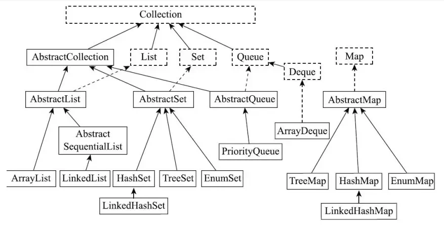
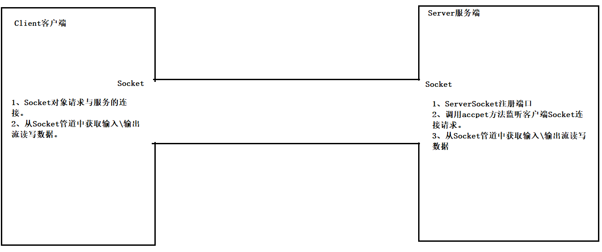
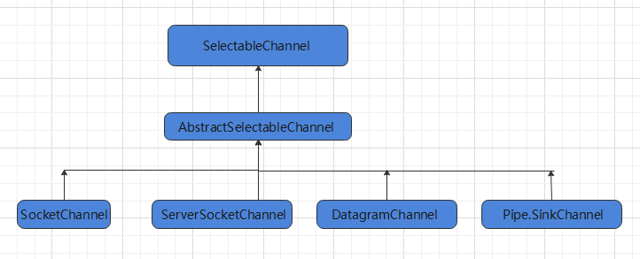
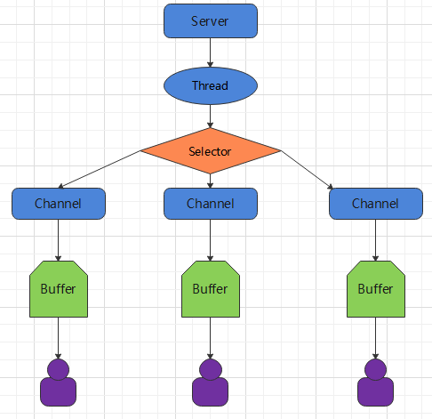

# 概述

## 特点

### 优势

- **跨平台：**“一次编译，随处运行"是其最大的特点之一。Java编译器将源代码编译成字节码，该字节码文件可以在任何安装了Java虚拟机的系统上运行

- **面向对象(Object-Oriented)：**Java是一门严格的面向对象编程语言。在Java中，除了基本数据类型外，一切皆对象。面向对象编程（OOP）的特性使得代码更易于维护和重用。

- **内存管理：**Java具有垃圾回收机制，自动管理内存和回收不再使用的对象。无需开发者手动管理内存。减少了内存泄漏等内存问题

- **安全性：**沙箱机制

- **多线程：**提供JUC框架，方便并发编程

- **生态系统丰富强大**

### 劣势

- **运行性能差：**Java程序依赖JVM运行，相比原生编译型语言，有一定的额外开销。
- **语法繁琐**
- **内存消耗大：**JVM本身需要占有一定内存，对于资源有限环境不友好。
- **面向对象过于严格：**虽然Java8引入了函数式编程，但仍未解决此问题
- **开发效率相比其他语言更低**

## JVM，JDK，JRE的区别

**JVM（Java Virtual Machine）**

Java虚拟机，是一种能够执行Java字节码(由Java编译器生成)的虚拟机。JVM提供了内存管理，垃圾回收，安全性等功能，也是Java实现跨平台特性的关键。

**JRE（Java Runtime Environment）**

Java运行时环境,是Java程序运行所需的最小环境，包含JVM和Java标准类库。

**JDK（Java Development Kit）**

Java开发工具包，包含JVM，Java标准类库以及编译器（javac）、调试器（jdb）等开发工具，提供了开发、编译、调试和运行Java程序所需的全部工具和环境。


# 字面量

> 字面量是指在代码中直接写出的常量值，是数据的直接表示

| 字面量类型 |                 说明                  |       程序中的写法       |
| :--------: | :-----------------------------------: | :----------------------: |
|  整数类型  |           不带小数点的数字            |           666            |
|  小数类型  |            带小数点的数字             |          13.14           |
|  字符类型  |    必须使用单引号,有且仅能一个字符    | ‘ A', ‘O', ‘我','\u0041' |
| 字符串类型 |            必须使用双引号             |       "HelloWorld"       |
|  布尔类型  | 布尔值,表示真假,只有两个值:true,false |       true、 false       |
|   空类型   |           一个特殊的值,空值           |           null           |

- Java中浮点数字面量的默认类型为`double`，声明一个`float`类型的字面量需要在字面量末尾添加`F`或`f`。
- Java中的整数字面量默认类型为`int`,如果字面量的取值超过了`int`范围或想要声明一个`long`类型的字面量需要在字面量末尾添加`L`或`l`。
- 可以通过`0x`,`0b`等标识符指定整数字面量的进制，默认不指定为十进制
- Java中的字符采用Unicode编码，因此除了使用字符声明字符字面量，还可以使用为`'\uXXXX'`的Unicode 转义序列声明字符字面量。转义序列末尾为一个4位16进制数，表示该转义序列对应字符的Unicode编码
- Java支持在数字中加入`_`来标识位数，增强可读性，如`1_000_000`。

# 数据类型

> Java支持的数据类型分为两类：基本数据类型与引用数据类型。


## 基本数据类型

基本数据类型是是预定义的，不需要实例化就可以使用，基本数据类型的变量直接存储数据本身。Java中的基本数据类型有八种，大致可分为数值型，字符型，布尔型。

| 数据类型 |         占用大小(字节)         |    位数    |                           取值范围                           |                             描述                             |
| :------: | :----------------------------: | :--------: | :----------------------------------------------------------: | :----------------------------------------------------------: |
|   byte   |               1                |     8      |                   -128(-2^7) 到127(2^7-1)                    | 是最小的整数类型,用于需要节省内存的场景,例如在处理文件或网络流时存储小范围整数数据。 |
|  short   |               2                |     16     |                -32768(-2^15)到32767 (2^15-1)                 |  较少使用,通常用于在需要节省内存且数值范围在该区间的场景。   |
|   int    |               4                |     32     |          -2147483648(-2^31)到2147483647 (2^31 - 1)           |   最常用的整数类型,可满足大多数日常编程中整数计算的需求。    |
|   long   |               8                |     64     | -9223372036854775808(-2^63)到     9223372036854775807(2^63-1) | 用于表示非常大的整数,当int 类型无法满足需求时使用,定义时需要在常量后加L或l。 |
|  float   |               4                |     32     |                    1.4E-45到3.4028235E38                     | 单精度浮点数,用于表示小数,精度相对较低,定义时需要在字面量后需加 F 或 f。 |
|  double  |               8                |     64     |               4.9E-324到1.7976931348623157E308               |   双精度浮点数,精度比float高,是Java中表示小数的默认类型。    |
|   char   |               2                |     16     |               `'\u0000'`(0)到`\uffff'` (65535)               |   用于表示单个字符,采用Unicode 编码,可表示各种语言的字符。   |
| boolean  | 无明确字节大小     (理论上1位) | 无明确位数 |                       `true`或`false`                        | 用于逻辑判断,只有两个取值,常用于条件判断和循环控制等逻辑场景。 |

- `char`本质是无符号整数，因此除了使用字符字面量对其赋值，还可以使用取值范围内的整数字面量对其赋值。

## 引用数据类型

引用数据类型需要自己定义(Java也提供了一部分)，引用数据类型的变量中存储的是对象的引用(也就是地址)。变量和对象本身是分开存储的。

## 类型转换

### 基本数据类型转换

基本数据类型转换改变的是数值的存储格式与精度。

- Java中的各种数值类型(包括整数型，浮点数型和`char`)均可以相互转换，而`boolean`不可以与其他类型转换。

**自动类型转换(隐式转换)**

当目标类型的范围大于源类型时，Java会自动将源类型转换为目标类型，不需要显式声明

**强制类型转换(显式转换)**

当目标类型的范围小于源类型时，需要使用强制类型转换将源类型转换为目标类型。

```
目标类型 变量名 = (目标类型) 源类型
```

- 可能会产生数据溢出，精度损失等问题

### 引用数据类型转换

引用类型转换改变的是变量所能访问的成员范围，只能访问当前类型定义的成员（不会改变对象本身）。

- 引用类型转换基于**继承或接口实现关系**。只有在同一继承体系或同一接口体系内才允许转换。
- 转换后调用方法的实际执行逻辑仍由对象真实类型决定，这称为多态。

**向上转型**

使用父类或接口类型变量接收子类或实现类对象。

- 隐式的，可以自动转换
- 只能访问父类 / 接口中定义的成员

**向下转型**

将父类或接口类型的引用强制转换回其实际的子类或实现类类型。

```
目标类型 变量名 = (目标类型) 源类型变量
```

- 显示的，需要强制转换

- 转换后可访问子类的特有成员

- 若实际类型与目标类型不兼容会抛出`ClassCastException`，为保证转换安全，可以使用`instanceof`关键字检查实际类型，检查通过再进行转换

  ```java
  //属于返回true，不属于返回false
  变量名 instanceof 目标类型
  ```

# 运算符

## 位运算符

- Java中位运算符的优先级小于数字运算符

**`>>>`**

无符号右移n位

```java
8 >>> 2 //表示将8无符号右移2位
```

- 右移时高位补零，低位舍弃。
- 左移时低位补0
- 不存在无符号左移，因为与算数左移行为一致。

**`<<`/`>>`**

算数左移(右移)n位

```java
8 >> 2 //表示8算术右移2位
```

- 右移时，低位舍弃。如果是正数，高位补0；负数高位补1。
- 左移时，低位补0。

**`^/^=`**

按位异或运算符/布尔运算符。

- 任何数与0异或等于自身
- 相同数异或等于0

```java
	true ^ false //返回boolean值
	111 ^ 112 //用于整数类型，对齐二进制位后(高位补零)，逐位执行异或运算并返回结果的十进制数
```

- 可用于快速交换两个整数

  ```java
  		int x = 10, y = 20;
          x = x ^ y; // x = 10^20
          y = x ^ y; // y = (10^20)^20 = 10
          x = x ^ y; // x = (10^20)^10 = 20
  ```

- 可用于快速找出数组中只出现一次的数(其他数均出现两次)

  ```java
        int[] arr = {2, 3, 2, 4, 4};
          int unique = arr[0];
          for (int i = 1 ; i < arr.length ; i++) {
              unique ^= arr[i]; // 相同数异或为0，0异或任何数等于自身
          }
  ```
- 可用于快速生成两两交换的数字序列
  ```
  0 -> 1 -> 2 -> 3 -> 4
  0 ^ 1 -> 1 ^ 1 -> ...
  1 -> 0 -> 3 -> 2 -> 5
  ```

# 关键字

## final

final可以用于修饰类，方法和变量

- **修饰类：**表示这个类不能被继承，是类继承体系的最终形态

- **修饰方法：**表示该方法不能在子类中被重写

- **修饰变量：**表示该变量只能赋值一次，不能再对其进行重新赋值操作，否则编译时会报错

## instanceof

`instanceof` 是一个**二元操作符**，用来判断一个对象是否是某个类或接口的实例，返回 **boolean 类型**。

```java
object instanceof Class
```

- 如果对象是该类型或其子类的实例，返回 `true`
- 如果对象不是该类型或其子类的实例，返回 `false`
- 对于接口，也可以判断对象是否实现了该接口
- 如果对象为 `null`，永远返回 `false`

**Java14中，instanceof增加了新特性，可以在判断成功的同时定义一个变量对原变量进行向下转型**

```java
//判断成功的同时将对象强转为Class类存储到name引用中
obj instanceof Class name
```

## `volatile`

- 禁止指令重排

- 保证变量的线程可见性

# Object

> Java中所有类的父类。

## 拷贝

拷贝指创建一个对象的副本，其属性与源对象相同。拷贝分为浅拷贝(Shallow Copy)与深拷贝(Deep Copy)。

**浅拷贝**

浅拷贝直接复制源对象的所有属性，引用类型属性也会直接复制引用。因此浅拷贝出的对象与源对象的引用属性指向同一个对象，修改引用类型的成员会影响原对象。

Java 通过 `Object.clone()` 为类提供浅拷贝功能，需要实现 `Cloneable` 接口并重写`clone`方法，在方法中调用`Object.clone()`。

```java
class Person implements Cloneable {
    String name;
    int[] scores;

    @Override
    protected Object clone() throws CloneNotSupportedException {
        return super.clone(); // 浅拷贝
    }
}
```

**深拷贝**

深拷贝在复制引用类型属性时，会将引用的对象也拷贝一份生成一个新对象，而不是共享引用。即深拷贝会递归复制对象内部引用属性，生成一个新的对象及其内部的所有对象。

- 深拷贝的源对象与拷贝对象完全独立，其中任何一个对象的改动都不会对另外一个对象造成影响

<h4>深拷贝实现</h4>

**实现Cloneable接口并重写clone方法**

```java
class MyClass implements Cloneable {
    private String field1;
    private NestedClass nestedObject;
    @Override 
    protected Object clone() throws CloneNotSupportedException {
        MyClass cloned = (MyClass) super.clone();
         // 深拷贝内部的引用对象
        cloned.nestedObject = (NestedClass) nestedObject.clone();
         return cloned; }
}
    
	class NestedClass implements Cloneable {
    private int nestedField;
    @Override 
        protected Object clone() throws CloneNotSupportedException {
        return super.clone(); }
}
```

- `clone()`方法是属于Object类的，使用C/C++底层实现，而且被protected修饰,只能在类内使用。
- `Cloneable`是一个标志接口，本身不定义方法，只是表示该类可以使用`clone()`方法，否则编译器会抛出`CloneNotSupportedException`异常
- `Object.clone()`方法本身只实现浅拷贝，如果想要实现深拷贝，需要重写`clone()`方法，在其中递归调用`clone()`方法。

**序列化与反序列化**

通过将对象序列化为字节流，再从字节流反序列化为对象实现深拷贝。要求对象及其所有引用类型字段实现Serializable接口。

```java
class MyClass implements Serializable { 
    private String field1; 
    private NestedClass nestedObject; 
    public MyClass deepCopy() { 
        try { 
            ByteArrayOutputStream bos = new ByteArrayOutputStream(); 					
            ObjectOutputStream oos = new ObjectOutputStream(bos); 
            oos.writeObject(this); 
            oos.flush(); 
            oos.close(); 			
            ByteArrayInputStream bis = new ByteArrayInputStream(bos.toByteArray()); 
            ObjectInputStream ois = new ObjectInputStream(bis); 
            return (MyClass) ois.readObject(); 
        } 
        catch (IOException | ClassNotFoundException e) { 
            e.printStackTrace(); 
            return null;
        } 
    } 
} 
class NestedClass implements Serializable { 
    private int nestedField; 
}
```

**手动递归复制**

针对特定对象结构，手动递归复制对象及其引用类型字段。适用于对象结构复杂度不高的情况。

```java
class MyClass { 
    private String field1; 
    private NestedClass nestedObject; 
    public MyClass deepCopy() { 
        MyClass copy = new MyClass(); 
        copy.setField1(this.field1); 
        copy.setNestedObject(this.nestedObject.deepCopy()); 
        return copy; 
    } 
} 
class NestedClass { 
    private int nestedField; 
    public NestedClass deepCopy() { 
        NestedClass copy = new NestedClass(); 
        copy.setNestedField(this.nestedField); 
        return copy; 
    } 
}
```

# 异常

异常是程序运行中出现的问题。在Java中，通过类定义异常,所有异常均继承自`Throwable`类


**`Throwablle`有两个子类，表示两类不同的异常：**

- **`Error`**表示系统级别的错误(属于严重问题)，程序是无法处理的。
- **`Exception`**表示程序可能出现的问题，`Exception`的子类又可分为两类：
  - `RuntimeException`及其子类称为运行时异常。在编译阶段不会对其进行异常检查，不是必须处理。
  - `RuntimeException`外的其他异常被称为编译时异常或受检异常，在编译阶段需要对其显示的处理。如果不进行处理，则编译失败

运行时异常通常由程序逻辑错误导致，例如参数非法、空指针、越界等。这类问题在编译阶段无法确定，因此 **编译器不要求强制处理**

编译时异常通常与外部环境相关，例如文件访问、网络通信、类加载等。这些情况在运行前编译器已经能发现 “可能出错”，因此 **Java 要求必须在编译阶段显式处理（try-catch 或 throws）**，以提醒程序员提前做好异常预案。

## 异常处理

**当程序运行时发生异常，系统会创建一个异常对象，并沿着方法调用栈从栈顶到栈底逐层抛出。如果在传播链中的任何一层都未被 `try-catch` 捕获，最终到达方法调用栈底(主线程的`main`方法或子线程的`run`方法)仍未处理，则异常由 JVM 接管，JVM会终止异常的线程并打印异常信息**

`Error`类异常属于系统级别的错误，程序一般不应该进行处理。大多数`Error`只会导致线程终止，少部分致命`Error`会导致JVM崩溃。

`Exception`类异常是可以通过代码进行处理的，只要合理的对其进行处理，即使出现异常，程序也可以继续运行。

**因此异常处理是对`Exception`类异常的处理。**

<h3><code>try-catch</code></h3>

在当前方法内部捕获异常并处理，不再向上抛给调用者。

```
    try {
        FileInputStream fis = new FileInputStream("file.txt");
        // 处理文件
    } catch (IOException e) {
        System.out.println("文件读取失败：" + e.getMessage());
        // 异常在这里被处理
    }
```

<h3><code>throws</code></h3>

声明异常继续向上抛出，由调用者处理

```
public void readFile() throws IOException {
    FileInputStream fis = new FileInputStream("file.txt");
    // 异常可能抛给调用者
}
```

- 编译时异常必须进行`try-catch`或`throws`，否则编译报错。

# 泛型

> 泛型是JDK5中引入的特性，是 **一种在定义类、接口或方法时，不指定具体数据类型，而在使用时再指定的机制**。会在编译阶段约束操作的数据类型，并进行检查。

- 本质上，泛型就是一种编译时类型检查机制。

```java
//使用
数据类型<引用数据类型> = new 数据类型<>();
```

- 泛型中只能是引用数据类型。
- 如果使用时不指定泛型参数，默认为`Ojbect`。

**作用**

- 将类型参数化，适用于多种数据类型执行相同的代码，避免了方法重载
- 提供了类型检查的机制，并且保留类型信息，避免了强制类型转换可能出现的异常。

## 泛型定义

泛型可以定义在类、接口或方法，当类、接口、方法具有泛型时，会被称为泛型类、泛型接口、泛型方法。

<h3>泛型类/泛型接口</h3>

```java
修饰符 class 类名<泛型类型参数1 [,...]> {

}

修饰符 interface 接口名<泛型类型参数> {

}
```

- 之后可以在类和接口的方法和字段中使用泛型参数

泛型接口和泛型类在实现和继承体系中有两种使用方式：

- 在其子类或实现类中给出具体类型
- 子类或实现类中延续泛型，创建对象时再确定类型。

<h3>泛型方法</h3>

```
修饰符<泛型类型参数> 返回值类型 方法名() {

}
```

- 泛型方法的类型会在方法被调用时自动推导出来

## 通配符

默认情况下，泛型可以接收任何引用类型；在使用泛型时，可以通过泛型通配符（`?`）限定可接收的数据类型范围

泛型通配符可以用于方法参数、变量类型和方法返回值处，但不能用于泛型定义处。

```java
//无界通配符 <?>
List<?> list;
//上界通配符 <? extends T>
List<? extends Number> list;
//下界通配符 <? super T>
ist<? super Integer> list;

//示例,表示此方法可接收泛型为Number及其子类的List
public static void method(List<? extends Number list) {
    
}
```

## 泛型擦除

是 Java 编译器在编译泛型代码时的一种处理机制，它会 **在编译期移除泛型类型参数信息**，将泛型类型参数替换为上界类型(如果没有指定上界,则替换为`Object`)，并在必要时插入类型转换，以保证泛型在运行时不影响 JVM 的运行。

```java
public class Box<T> {
    private T value;

    public void set(T value) { this.value = value; }
    public T get() { return value; }
}
//编译后
public class Box {
    private Object value; // T -> Object

    public void set(Object value) { this.value = value; }
    public Object get() { return value; }
}
//使用泛型的代码
Box<Integer> box = new Box<>();
box.set(123);
Integer x = box.get();
//编译后
Box box = new Box();       
box.set(123);               // set(Object value)
Integer x = (Integer) box.get();  // 自动插入强制类型转换
```

**为什么要擦除泛型**

- **兼容性：**Java 泛型是在 JDK 5 引入的，而 JVM 本身并不支持泛型类型，如果没有擦除，老版本 JVM 将无法运行泛型代码。泛型擦除保证了泛型代码可以在 **任何 JVM 上运行**。

**泛型擦除的影响**

- **不能创建泛型数组**：泛型编译后会被擦除，而数组在运行时必须知道元素的具体类型

```java
List<String>[] arr = new List<String>[10]; // ❌ 编译错误
/*如果泛型数组存在，那么在 T = String 的场景下，JVM 必须把一个真实的 Object[] 当成 String[] 使用，而这是JVM明确禁止的非法数组转换，因此 Java 从语言层面禁止了泛型数组的创建。
*/
T[] arr = new T[10]; // ❌ 编译错误
```

- **泛型只能是引用数据类型：**Java泛型在编译后会被擦除为`Object`类型，而`Object`只能接收引用类型，不能接收基本数据类型。

泛型擦除后，仍然可以通过反射获得类的泛型信息，这是因为编译器在编译时会将泛型信息以 `Signature` 的形式保存在 class 文件中（包括类、字段、方法的泛型声明）。因此可以通过反射读取这些元数据，从而获取泛型信息。

# 集合

> 集合是用于管理和存储大量对象的工具，在Java中以类来实现。集合相关类及接口均位于`java.util`包下，统称为Java Collections Framework(JCF,Java集合框架)。

- Java中的集合均只可以存储对象，如果需要存储基本数据类型，则需要将其转为对应的包装类。

**数组与集合的区别**

- 数组是固定长度的数据结构，一旦创建就无法改变；集合是动态长度的数据结构，可以动态地增加或减少元素
- 数组可以存储基本类型数据和对象；集合中只能存储对象

**Java集合框架组成**

|          部分          |                     描述                     |                             特点                             |
| :--------------------: | :------------------------------------------: | :----------------------------------------------------------: |
|      **单列集合**      | 由顶层接口`Collection`及其子接口和实现类组成 |  用于存储单个元素，允许或不允许重复，是否有序由具体实现决定  |
|      **双列集合**      |    由顶层接口`Map`及其子接口和实现类组成     |   用于存储键值对；key 不重复；根据实现不同可保持顺序或排序   |
| **工具类（操作容器）** |     所有方法封装在`Collections`工具类中      | 提供操作集合的常用静态方法，包括排序、查找、替换、翻转、同步化、不变集合等 |

**Java集合继承体系**



## `Collection`

> Collection是所有单列集合的顶层接口，单列集合可以用来存储独立的元素。

在`Collection`的基础上，根据不同单列集合的特点，又扩展了四类子接口。

**`List`**

- 有序
- 支持索引访问元素

**`Set`**

- 无序
- 元素不可重复

**`Queue`**

- 单端队列，只能从一头进，从另一头出

**`Deque`**

- 是`Queue`的子接口，表示双端队列


- 相比于`Queue`，`Deque`两头都能进，也都能出。

### `List`

#### `ArrayList`

> `List`的实现类,又称为动态数组，底层使用数组存储元素。

**适合需要频繁随机访问数据并且主要在尾部插入删除数据的场景**

**特点**

- 支持快速随机访问
- 自动扩容
- 插入和删除速度慢

**自动扩容原理**

当元素个数到达数组容量时,会自动调用`grow`方法对创建一个长度为原数组1.5倍的数组，并将元素复制到新数组中。

#### `LinkedList`

> `List`的实现类，底层使用双向链表存储元素

**适合频繁在头尾插入删除元素的场景，如队列，栈等数据结构的实现**

**特点**

- 双向链表需要遍历查找数据，访问性能差
- 在头尾增加或删除快，随机插入较慢

#### `Vector`

> 实现了`List`接口，底层使用数组存储元素。相比于`ArrayList`，`Vector`通过在方法上添加`synchronized`保证线程安全，且扩容策略不同。

**自动扩容**

当数组容量到达阈值时,，默认会自动调用`grow`方法对创建一个长度为原数组2倍的数组，并将元素复制到新数组中。扩容的倍数可以在构造方法中通过增长因子指定。

### `Set`

#### `HashSet`

> `Set`的实现类，基于`HashMap`实现

`HashSet`对`HashMap`进行了包装，`HashMap`的`key`为存储的元素，`value`均使用相同的值(一个名为`PRESENT`的Object常量)。`HashMap`可以保证`key`具有唯一性，但不保证`key`的有序性

#### `LinkedHashSet`

> `LinkedHashSet`继承自`HashSet`,基于`LinkedHashMap`实现,会使用一个双向链表维护元素的插入顺序。

#### `TreeSet`

> `TreeSet`基于`TreeMap`实现，添加元素时会按照排序规则将其插入到合适的位置。

### `Queue`

#### `PriorityQueue`

> 优先队列，可以按照一定顺序对元素进行排序。

### `Deque`

## `Map`

> 用来存储`<键,值>`对类型的元素，又称为双列集合。

- 在Java中，通过`Entry`类来定义键值对，所有Map中存储的元素均是一个`Entry`对象。


### `HashMap`

底层使用数组来存储键值对，键值对在数组中的位置通过键值对中`key`的`hashcode % (table.length -1)`来决定，又称为哈希桶。

- HashMap支持`null`键和值，如果键为`null`,则其`hashCode`为0

**哈希冲突**

哈希冲突指不同的元素通过哈希函数映射到相同的哈希值，导致数据存储在哈希表中发生冲突。

- 当且仅当`hashCode`一致且`equals`方法返回`true`时，此时新元素会覆盖旧元素。

**常见解决哈希冲突的方法**

- 链接法：使用链表或其他数据结构来存储冲突的键值对，将它们链接在同一个哈希桶中。
- 开放寻址法：在哈希表中找到另一个可用的位置来存储冲突的键值对。常见的开放寻址方法包括线性探测、二次探测和双重散列。
- 再哈希法（Rehashing）：当发生冲突时，使用另一个哈希函数再次计算键的哈希值，直到找到一个空槽来存储键值对。
- 哈希桶扩容：当哈希冲突过多时，可以动态地扩大哈希桶的数量，重新分配键值对，以减少冲突的概率。

在`HashMap`中，会通过链表或红黑树来解决哈希冲突。

**负载因子**

负载因子是 0~1 之间的数，当 HashMap 中 **元素个数 ≥ 数组长度 × 负载因子** 时，下一次插入操作就会触发扩容。

它对`HashMap`的影响很大，太小会导致频繁扩容，太大会因为扩容过晚导致哈希表空间利用率过高，使得哈希冲突增多，链表增长，影响性能。

`HashMap`默认初始容量为16，默认负载因子为0.75，扩容方法为`resize(2 * table.length)`：

1. 新建一个原数组两倍大小的新数组
2. 将原数组的元素重新哈希迁移到新数组

**重写`hashcode`和`equals`方法的要求**

- `hashcode`值相同时，`equals`并不一定返回true
- `equals`返回`true`时，`hashcode`一定相同

<h4>为什么<code>HashMap</code>采用二倍扩容</h4>

`HashMap`的容量始终保持2的幂，可以通过`(n - 1) & hash`快速计算元素所处的数组索引位置，n为数组长度。相比于取余运算，效率高得多。而且还可以均匀的把之前的冲突节点分散到了新的数组中

<h4>JDK7前和JDK8后的HashMap实现变化</h4>

**哈希冲突解决方式**

在 Java 7 及以前，HashMap 的底层由数组和链表组成。当多个 key 经过 hash 计算落到同一个数组下标且不相等时，这些 Entry 会通过 `next` 指针串成链表，查询时要先根据 key 的 hash 定位到数组下标，再在链表中逐个比较 key，冲突严重时查询复杂度可能退化为 O(n)。

Java 8 对此进行了优化，在数组和链表的基础上引入红黑树。当某个桶的链表长度达到 8 且数组容量至少为 64 时，链表会转化为红黑树，使查询复杂度从 O(n) 降到 O(log n)。如果红黑树中的节点减少到 6 或以下，又会退化回链表，从而降低维护成本。这种链表与红黑树的动态切换保证了 HashMap 在高冲突场景下既高效又节省空间。

**扩容**

在JDK1.7及以前，扩容时会将每个元素重新哈希后插入新数组；

JDK1.8时，对这个过程进行了优化：因为数组长度始终为2的幂，只需通过判断 `(hash & oldCapacity)` 是否为 0，即可确定元素是留在原位置还是迁移到 `原位置 + oldCapacity`，无需重新计算 hash，从而显著提升扩容效率。

**链表插入方式**

JDK1.7中的HashMap使用头插法向链表插入元素，在多线程的环境下，扩容的时候有可能导致环形链表的出现，形成死循环。

JDK1.8使用尾插法插入元素，在扩容时会保持链表元素原本的顺序，不会出现环形链表的问题。

<h4>为什么JDK8中HashMap使用红黑树而不是AVL树</h4>

因为`AVL`树是严格平衡的二叉树，维护成本较高，而红黑树平衡策略相对宽松，是实际工程中的最佳折中实践。

<h4>为什么JDK8不直接取消链表，全部使用红黑树</h4>

红黑树相比于链表需要占用更多的内存，且当节点较少时，链表与红黑树的查询效率相差很小。

<h4>HashMap在多线程环境下可能出现的问题</h4>

JDK1.7中的HashMap使用头插法向链表插入元素，在多线程的环境下，扩容的时候有可能导致环形链表的出现，形成死循环。因此，JDK1.8使用尾插法插入元素，在扩容时会保持链表元素原本的顺序，不会出现环形链表的问题。

多线程同时执行put操作，如果计算出来的索引位置是相同的，可能造成`key`覆盖，从而导致元素的丢失。此问题在JDK1.7和JDK1.8中都存在。

### `HashTable`

> 实现方式与`HashMap`一致，底层使用数组存储数据，但是为所有方法添加了`synchronized`关键字，保证线程安全。

**特点**

- 线程安全，但是由于使用`synchronized`，性能较低
- 键和值均不能为`null`

### `TreeMap`

> 底层使用红黑树存储元素。可以对键进行排序默认按照自然顺序排序，也可以指定比较器进行排序。

### `LinkedHashMap`

> 继承自`HashMap`，底层仍然使用数组存储数据，但额外维护了一个双向链表结构，可以按照键值对的插入顺序或访问顺序遍历元素。

## `Iterator`

Java中的单列集合均实现了`Iterable`接口，这个接口提供了`iterator()`方法和`forEach()`方法使用迭代器快速遍历集合。实现了该接口的集合，均可以使用增强`for`遍历。

<h4><code>ConcurrentModificationException </code></h4>

在 **一些迭代器遍历集合的过程中**，如果集合结构被修改（增加或删除元素），会抛出此异常，这一类迭代器称为`Fail-fast Iterator`。

- 一些迭代器支持`remove`方法，可以在迭代时安全的删除最后一次`next`返回的元素。

如果在遍历时修改集合，且不抛异常，迭代器遍历出的结果可能和实际集合不一致：

- 某些元素会被重复遍历

- 某些元素可能被跳过

- 最坏情况下可能出现死循环

抛出异常的目的是**快速发现集合在遍历时被修改导致的不一致问题**，提醒开发者用安全的遍历方式或者显式处理修改导致的异常，从而保护集合内部的一致性。

## 集合遍历方法

**普通`for`循环**

```java
List<String> list = List.of("A", "B", "C");

for (int i = 0; i < list.size(); i++) {
    System.out.println(list.get(i));
}
```

- 只适用于带有索引的集合，如`List`

**`Iterator`迭代器**

```java
List<String> list = List.of("A", "B", "C");
Iterator<String> it = list.iterator();

while (it.hasNext()) {
    System.out.println(it.next());
}
/*
下面是使用迭代器间接遍历Map
*/
Map<String, Integer> map = Map.of("A", 1, "B", 2);

// 遍历 key
Iterator<String> keyIt = map.keySet().iterator();
while (keyIt.hasNext()) {
    System.out.println(keyIt.next());
}

// 遍历 value
Iterator<Integer> valueIt = map.values().iterator();
while (valueIt.hasNext()) {
    System.out.println(valueIt.next());
}

// 遍历 entry
Iterator<Map.Entry<String, Integer>> entryIt = map.entrySet().iterator();
while (entryIt.hasNext()) {
    Map.Entry<String, Integer> e = entryIt.next();
    System.out.println(e.getKey() + " = " + e.getValue());
}
```

- 迭代器遍历的能力来自`Iterable`接口，集合的顶层接口`Collection`是其子接口，因此所有`Collection`的实现类都可以通过迭代器遍历
- `Map`没有实现迭代器，但是可以通过`map.values`,`map.entries`,`map.keySet`方法获得`Map`的`key`的集合,`value`的集合，`entry`的集合，使用迭代器遍历这些集合间接遍历`Map`。

**增强`for`循环**

```java
List<String> list = List.of("A", "B", "C");

for (String s : list) {
    System.out.println(s);
}
Map<String, Integer> map = Map.of("A", 1, "B", 2);

for (Map.Entry<String, Integer> entry : map.entrySet()) {
    System.out.println(entry.getKey() + " = " + entry.getValue());
}
```

- 本质是一种语法糖，底层仍然是使用迭代器。

**`foreach`**

```java
List<String> list = List.of("A", "B", "C");
list.forEach(s -> System.out.println(s));

Map<String, Integer> map = Map.of("A", 1, "B", 2);
map.forEach((k, v) -> System.out.println(k + " = " + v));
```

- 在Java8引入的API，支持传入一个`Lambda`表达式对元素进行处理

**`Stream`流**

```java
List<String> list = List.of("A", "B", "C");
list.stream()
    .filter(s -> s.contains("A"))
    .map(String::toLowerCase)
    .forEach(System.out::println);
    
Map<String, Integer> map = Map.of("A", 1, "B", 2);
map.entrySet().stream()
   .filter(e -> e.getValue() > 1)
   .forEach(e -> System.out.println(e.getKey() + " = " + e.getValue()));
```

- Java8提供的API，可以快速对集合进行函数式操作，如过滤，映射等。

# Java标准类库常用类

## `String`

<h4><code>String</code>为什么设计为不可变类</h4>

**`String`不可变的体现**

- `String`底层使用`char`数组存储字符串，这个`char`数组被`private final`修饰，并且`String`没有暴漏任何修改`char`数组内容的方法。
- 所有字符串操作均会返回一个新的`String`对象，而不会影响原数据。获取`String`底层的`char`数组时，也是复制一个新数组进行返回，原数组也不会受到任何影响。
- `String`本身使用`final`修饰，不可被继承，杜绝了子类覆盖父类行为的可能

**为什么这样设计**

- **配合字符串常量池：**如果 `String` 可变，那么多个引用指向同一常量池对象时，一旦一个修改，其他引用也会受到影响，这破坏了常量池的安全性。
- **保证哈希码稳定：**不可变性保证了字符串的内容一旦创建，**它的哈希值就不会改变**。因此计算一次哈希值后就可以将其缓存下来，多次使用，性能更高，也提高了`String`配合哈希表使用的安全性。
- **线程安全：**不可变字符串在**多线程环境下天然线程安全**，无需额外同步。

<h4><code>String,StringBuilder,StringBuffer</code>的区别</h4>

**`String`不可变**，每次修改都会创建新对象，当需要对字符串进行大量操作时，性能低。

为了解决这一问题，Java提供了`StringBuilder`这一可变的字符串类型，它继承自`AbstractStringBuilder`,提供了许多方法直接修改字符串。`StringBuilder`底层同样使用`char`数组存储字符串数据，修改操作直接在原对象上进行，不会创建新对象。

- 当使用`String`进行字符串拼接时，底层会创建`StringBuilder`对象并调用`append`方法完成。

`StringBuilder`是一个可变类，因此其在多线程下不安全，所以Java提供了`StringBuffer`。它与`StringBuilder`一样，也继承自`AbstractStringBuilder`，可以直接在自身修改数据，但通过 `synchronized` 保证操作原子性，多线程安全。

|      类型       |           特点           |              适用场景              |
| :-------------: | :----------------------: | :--------------------------------: |
|    `String`     |     不可变，线程安全     |    操作少量数据或不需要操作数据    |
| `StringBuilder` |     可变，线程不安全     | 需要频繁操作数据目不用考虑线程安全 |
| `StringBuffer`  | 可变，线程安全，性能较低 | 需要频繁操作数据目需要考虑线程安全 |


## 包装类

包装类将基本数据类型封装为一个对象，以便在需要对象的地方使用。

**八种基本数据类型均有其对应包装类，分别为:**

| 基本类型 |  包装类   |
| :------: | :-------: |
|   byte   |   Byte    |
|  short   |   Short   |
|   int    |  Integer  |
|   long   |   Long    |
|  float   |   Float   |
|  double  |  Double   |
|   char   | Character |
| boolean  |  Boolean  |

**自动装箱/自动拆箱**

装箱(Boxing)与拆箱(Unboxing)是基本数据类型与其对应包装类之间转换的过程。在Java1.5前，基本数据类型与包装类之间的必须手动进行转换。

从Java1.5开始，提供了自动装箱与自动拆箱机制，基本数据类型与包装类之间的转换由Java编译器自动完成：当Java编译器检测到要对象的场景下但提供了基本类型，或需要基本类型的场景下但提供了包装类对象时，会自动插入语句将其转换为需要的类型。

- 自动拆箱时不会检测被拆箱的包装类是否为`null`,因此有空指针异常的风险，最好在自动拆箱前手动检查空指针

- 频繁的装箱/拆箱操作会创建大量无用的包装类对象，影响性能并且加重了垃圾回收的工作量。因此要注意当前操作是否会导致频繁的自动装箱与自动拆箱

  ```java
  Integer sum = 0;
  for(int i = 0; i< 5000; i++) {
  	sum +=i
  }
  ```

  

**包装类的优点**

- 将数据与处理数据的方法封装在一起，符合面向对象的思想
- Java是一门面向对象的语言，其中很多类或方法只能用于处理对象，无法接收基本数据类型。包装类提供了基本类型数据使用这些类或方法的途径。
  - 如Java中的集合类只可以存储对象，无法存储基本数据类型
- Java的泛型机制只接收引用数据类型。

**包装类的缺点**

- 相比基本类型，**操作速度更慢**。
- 包装类是对象，**引用与对象分开存储**，占用更多内存。
- 因此，**包装类的读写效率和存储效率都不如基本类型**。

### Integer

**Integer缓存**

`Integer`类内部实现了一个静态缓存池，存储了特定范围内的整数值对应的Integer对象。默认范围为`-128`~`127`，当通过`Integer.valueOf(int)`方法创建一个在这个范围内的整数对象时，并不会每次都生成新的对象实例，而是复用缓存池中的现有对象.

## BigDecimal

> BigDecimal表示一个浮点数，提供了一系列方法用于浮点数的精确计算。

**为什么用BigDecimal不用double**

计算机中浮点数使用二进制存储，而二进制无法准确表示所有小数，因此运算时会出现误差

BigDecimal对象之间的运算不会出现任何误差。所以牵扯到精确计算,如金钱的计算，需要使用BigDecimal

------

### 使用事例

```java
BigDecimal b1 = new BigDecimal("0.1");
BigDecimal b2 = new BigDecimal("0.5");
System.out.println(b1.add(b2));
```

### **构造方法**

|                    构造方法                     |                      示例                       |                      说明                      |
| :---------------------------------------------: | :---------------------------------------------: | :--------------------------------------------: |
|            `BigDecimal(String val)`             |           `new BigDecimal("123.45")`            |    用字符串构造，最常用方式，避免浮点误差。    |
|              `BigDecimal(int val)`              |              `new BigDecimal(10)`               |             使用 int 构造，精确。              |
|             `BigDecimal(long val)`              |             `new BigDecimal(100L)`              |             使用 long 构造，精确。             |
|             `BigDecimal(double val`             |              `new BigDecimal(0.1)`              | 使用 double 构造，会保留 double 的二进制误差。 |
|          `BigDecimal(BigInteger val)`           |   `new BigDecimal(BigInteger.valueOf(12345))`   |        使用 `BigInteger `构造整数部分。        |
| `BigDecimal(BigInteger unscaledVal, int scale)` | `new BigDecimal(BigInteger.valueOf(12345), 2)`  |         直接指定底层整数值和小数位数。         |
|    `BigDecimal(String val, MathContext mc)`     |         `new BigDecimal("12.345", mc)`          |      通过字符串构造并指定精度/舍入规则。       |
|  `BigDecimal(BigInteger val, MathContext mc)`   | `new BigDecimal(BigInteger.valueOf(12345), mc)` |       使用 `BigInteger` 构造并指定精度。       |

- 为避免保留浮点数二进制误差，通常不会使用`double`类型参数构造`BigDecimal`


## 时间日期类

> 在JDK8以前，Java中有关时间日期的类有`Date`,`SimpleDateFormat`,`Calendar`;JDK8时，新增了

**JDK8以前与以后的时间日期类的区别**

以前的代码麻烦，且多线程环境下会导致数据安全问题；JDK8后的时间日期类API简单,且时间日期对象都是不可变的，不会导致线程安全问题。

### `Date`

> 由JDK提供的JavaBean类，表示一个时间点,精确到毫秒

**构造方法**

|                   |                                                              |
| ----------------- | ------------------------------------------------------------ |
| `Date()`          | 创建一个表示系统当前时间的Date对象                           |
| `Date(long time)` | 创建一个表示特定时间的Date对象,`time`为这个特定时间从时间原点开始所经过的毫秒值 |

- Date类底层使用一个`long`类型的成员变量存储从计算机时间原点(1970年1月1号0:00)开始所经过的毫秒值
- Date类本身不包含时区信息,但是其`toString()`方法会 **根据系统默认时区** 来格式化输出。

**成员方法**

|                                  |                      |      |
| -------------------------------- | -------------------- | ---- |
| `public void setTime(long time)` | 设置毫秒值           |      |
| `public long getTime()`          | 获取Date对象的毫秒值 |      |
|                                  |                      |      |

### SimpleDateFormat

> 用于将默认的时间展示格式化或将字符串表示的时间转换为Date对象

**构造方法**

|                                         |                                           |      |
| --------------------------------------- | ----------------------------------------- | ---- |
| public SimpleDateFormat()               | 构造一个Java默认格式的SimpleDateFormat    |      |
| public SimpleDateFormat(String pattern) | 通过指定`pattern`构造一个SimpleDateFormat |      |

- 格式化字符串中有些字符具有特殊意义:`y`对应年，`M`对应月，`d`对应日，`H`对应时，`m`对应分，`s`对应秒

**成员方法**

|                                       |                                        |      |
| ------------------------------------- | -------------------------------------- | ---- |
| public final String format(Date date) | 依据Date对象格式化为指定模式           |      |
| public Date parse(String source)      | 将时间字符串根据指定模式解析为Date对象 |      |

### Calendar

> 一个抽象类，表示一个日历对象，可以用于单独修改/获取时间中的年，月，日。

**获得对象**

|                                        |                        |      |
| -------------------------------------- | ---------------------- | ---- |
| `public static Calendar getInstance()` | 获得当前时间的日历对象 |      |

- Calendar将时间的相关属性单独封装为一个个属性其中年，月，日等属性封装到了一个数组里
- 其中月份为`0~11`，加1表示实际月份
- 星期为`1~7`，其中1表示星期日
- Calendar直接使用当前系统的时区，且无法修改时区

**成员方法**

| 方法名                                  | 说明                                                         |
| --------------------------------------- | ------------------------------------------------------------ |
| `public int get(int field)`             | 获取某个字段的值。field参数表示获取哪个字段的值，<br />可以使用`Calender`中定义的常量来表示：<br />`Calendar.YEAR` : 年<br />`Calendar.MONTH `：月<br />`Calendar.DAY_OF_MONTH`：月中的日期<br />`Calendar.HOUR`：小时<br />`Calendar.MINUTE`：分钟<br />`Calendar.SECOND`：秒<br />`Calendar.DAY_OF_WEEK`：星期 |
| `public void set(int field,int value)`  | 设置某个字段的值                                             |
| `public void add(int field,int amount)` | 为某个字段增加/减少指定的值                                  |
| `public final Date getTime()`           | 根据Calendar获得日期对象                                     |
| `public final void setTime(Date date`)  | 通过日期对象设置日历对象的时间                               |
| `public long getTimeInMillions()`       | 获取时间毫秒值                                               |
| `public long setTimeInMillions()`       | 设置日历对象的时间毫秒值                                     |

- 设置字段值时，如果超出当前字段的表示范围，会自动进位。

**下面为JDK8后新增的时间类**

### ZoneId

> 表示一个时区，Java中以`国家名(洲名)/城市名`的形式定义时区。

**常用方法**

|                                                   |                                  |      |
| ------------------------------------------------- | -------------------------------- | ---- |
| `public static Set<String> getAvailableZoneIds()` | 获得Java中定义的所有时区的名字   |      |
| `public ZoneId systemDefault()`                   | 获得系统默认时区                 |      |
| `public static ZoneId of (String zoneId)`         | 根据`zoneId`获得一个指定时区对象 |      |

### ZoneOffset

> 为没有时区的时间对象（如 `LocalDateTime`）指定**相对于 UTC 的固定偏移量**，从而可以将本地无时区时间映射为 UTC 时间

- 与时区（`ZoneId`）类似，但**直接使用固定偏移量**（如 +08:00、-05:30），而不是依赖地理位置或夏令时规则。

### Instant

> 表示 **UTC 时间线上的一个绝对时间点**

|                   方法名                   |                 说明                  |
| :----------------------------------------: | :-----------------------------------: |
|          `static  Instant now()`           | 获取当前时间的Instant对象（标准时间） |
| `static  Instant ofXXXX(long epochMilli)`  |  根据（秒/毫秒/纳秒）获取Instant对象  |
|    `ZonedDateTime  atZone(ZoneId zone)`    |  指定时区,返回一个带有时区的时间对象  |
|   `boolean  isXxx(Instant otherInstant)`   |            判断系列的方法             |
| `Instant  minusXxx(long millisToSubtract)` |          减少时间系列的方法           |
| `Instant  plusXxx(long millisToSubtract)`  |          增加时间系列的方法           |

### ZonedDateTime

> 表示一个带有时区的时间

| 方法名                                 | 说明                            |
| -------------------------------------- | ------------------------------- |
| `static  ZonedDateTime now()`          | 获取当前时间的ZonedDateTime对象 |
| `static  ZonedDateTime ofXXXX(。。。)` | 获取指定时间的ZonedDateTime对象 |
| `ZonedDateTime  withXXXX(时间)`        | 修改时间系列的方法              |
| `ZonedDateTime  minusXXXX(时间)`       | 减少时间系列的方法              |
| `ZonedDateTime  plusXXXX(时间)`        | 增加时间系列的方法              |

### DaeTimeFormatter

> JDK8中用于时间格式化的类,对应JDK7中的`SimpleDateFormatter`

|                                                      |                    |      |
| ---------------------------------------------------- | ------------------ | ---- |
| `static DateTimeFormatter ofPattern(String pattern)` | 获取时间格式化对象 |      |
| `String format(JDK8后的时间对象)`                    | 解析时间对象       |      |

I/O操作

> Java提供了多个I/O相关库以支持文件输入输出操作

|              类/接口              |              用途              |
| :-------------------------------: | :----------------------------: |
|          `java.io.File`           | 表示文件或目录（但不执行读写） |
|       `java.nio.file.Files`       |    执行高效文件读写（推荐）    |
| `java.io.BufferedReader`/`Writer` |     适合读取/写入文本内容      |
|        `java.util.Scanner`        |       快速读取文本行或词       |

### LocalDate,LocalTime,LocalDateTime

> 这三个类功能对应JDK7中的Calendar类，只是封装的字段不同,但是API基本一致。

- LocalDate中封装了年，月，日三个字段
- LocalTime中封装了时，分，秒三个字段
- LocalDateTime封装了年，月，日，时，分，秒六个字段

**获取对象** 

- Local系列对象不包含时区信息，只是表示一个本地时间点

**常用方法**

| 方法名                        | 说明                                     |
| ----------------------------- | ---------------------------------------- |
| `static  LocalDateTime now()` | 获取当前时间的日历对象                   |
| `static  XXX of(fields...)`   | 获取指定时间的日历对象                   |
| `getXXX()`                    | 获取日历中的年、月、日、时、分、秒等信息 |
| `isBefore(),  isAfter()`      | 比较两个 LocalDateTime                   |
| `withXXX()`                   | 修改时间系列的方法                       |
| `minusXXX()`                  | 减少时间系列的方法                       |
| `plusXXX()`                   | 增加时间系列的方法                       |

### **Duration,Period,ChronoUnit**

> 这三个为JDK8新增的操作时间对象的工具类，均表示或计算一个时间间隔

- Duration用于时间间隔(秒，纳秒)
- Period用于计算时间间隔(年，月，日)
- ChronoUnit是一个枚举类，底层使用Duration计算时间间隔(所有单位)

**常用方法**

|                                             |                               |      |
| ------------------------------------------- | ----------------------------- | ---- |
| `long  ChronoUnit.XXX.between(date1,date2)` | 计算两个时间的间隔，XXX为单位 |      |
|                                             |                               |      |

## `DelayQueue`

延迟队列，其中的元素会在一定时间延迟后才可以被获取。

通过`take`方法从延迟队列中取元素，如果元素未到延迟时间，则方法阻塞，直到元素到达延迟时间

**`Delayed`**

延迟队列中存储的元素必须实现的接口，提供两个方法

|              |                                      |      |
| :----------: | :----------------------------------: | ---- |
|  `getDelay`  |          获取实时的延时时间          |      |
| `compaareTo` | 不同元素比较来确定在延迟队列中的位置 |      |

```java
public class DelayTask<D> implements Delayed {
    private D data;
    private long deadlineNanos;

    public DelayTask(D data, Duration duration) {
        this.deadlineNanos = System.nanoTime() + duration.toNanos();
        this.data = data;
    }

    @Override
    public long getDelay(TimeUnit unit) {
        return unit.convert(Math.max(deadlineNanos - System.nanoTime(),0), TimeUnit.NANOSECONDS);
    }

    @Override
    public int compareTo(Delayed o) {
        long l = this.getDelay(TimeUnit.SECONDS) - o.getDelay(TimeUnit.SECONDS);
        if (l > 0) {
            return 1;
        } else if (l < 0) {
            return -1;
        } else {
            return 0;
        }
    }
```

## `Properties`

`Properties`用于读取配置文件并将配置文件加载为`Properties`对象，以方便在程序中使用。

```java
Properties properties = new Properties();
properties.load(new FileInputStream("prop.properties"));
```

## `Stream`

Java8时提供

<h4>原理</h4>

<h4>特性</h4>

- **延迟执行：**`Stream` 的中间操作仅记录操作逻辑，只有在调用终结操作时才会一次性执行，避免中间结果的反复创建，从而提升性能。
- **不改变数据源且不可变：**`Stream` 是不可变的，每次中间操作都会返回一个新的流；同时，`Stream` 不会修改原始数据源。
- **流水线式：**`Stream` 本身不存储数据，而是记录对数据的操作描述，在终结操作触发时，通过管道从数据源按需依次获取元素并执行相应操作。
- **可并行：**支持并行处理，充分利用多核CPU优势。

<h4><code>Stream</code>与<code>for</code>的区别</h4>

- `Stream`相比`for`更加简洁，但`debug`更加麻烦，可读性也更差
- `Stream`在数据量较小或只是执行简单操作时，性能差于`for`；但是在执行复杂操作以及大数据量的场景下，性能远高于`for`。
- `Stream`自身提供并行能力，`for`需要自己结合线程池等方式实现。

### 中间方法

是对集合的中间处理步骤，方法调用后，仍然返回一个`Stream`，还可以继续调用其他方法。

```
Stream<R> flatMap(Function<? super T, ? extends Stream<? extends R>> mapper)
```

### 终结方法

是对集合处理的最终步骤，方法调用后，不可以再调用其他方法。

## `ThreadLocal`


### `TTL`

全称`TransmittableThreadLocal`,是阿里开源的一个增强版 `ThreadLocal`。相比于`ThreadLocal`，它可以实现跨线程(尤其是线程池)的上下文传递。

**原理**

`TransmittableThreadLocal` 将 `Runnable` 和 `Callable` 包装为 `TtlRunnable` 和 `TtlCallable`。在任务**提交（包装）时**捕获当前线程的 `ThreadLocal` 上下文，并在任务执行前将上下文设置到执行线程中；任务执行结束后，再恢复或清理执行线程原有的上下文，从而实现跨线程的上下文安全传递。

- `TTL`只会捕获和传递 `TransmittableThreadLocal` 的值，普通的 `ThreadLocal` 不会被捕获和传递。

<h4>使用示例</h4>

`TTL`与`ThreadLocal`主要的使用区别是，如果希望在线程之间传递上下文，在提交任务时需要使用`TtlRunnable`或`TtlCallable`包装原始任务。

```java
static TransmittableThreadLocal<String> ttl = new TransmittableThreadLocal<>();
ExecutorService executor = Executors.newFixedThreadPool(1);
ttl.set("userA");
executor.submit(TtlRunnable.get(() -> {
    System.out.println("TTL: " + ttl.get());
}));
```

## 引用类型

Java 中除了直接使用对象类型的引用接收对象，还提供了一些特殊引用类型，它们会影响垃圾回收器对对象的处理。Java 在 **`java.lang.ref` 包**中定义了 4 种引用类型：

|            引用类型             | 强度 |                        GC 对象可达性                        |                            特点                            |
| :-----------------------------: | ---- | :---------------------------------------------------------: | :--------------------------------------------------------: |
| **强引用（Strong Reference）**  | 最强 |                GC 不会回收，只要有强引用存在                |      普通的对象引用，如 `Object obj = new Object();`       |
|  **软引用（Soft Reference）**   | 较强 |                  只有在内存不足时才会回收                   |                常用于缓存，保证尽量不被回收                |
|  **弱引用（Weak Reference）**   | 弱   | GC 一旦发现只被弱引用引用的对象，无论内存是否充足，都会回收 |          适合做注册表、ThreadLocal等，生命周期短           |
| **虚引用（Phantom Reference）** | 最弱 |      无法通过虚引用访问对象，GC 回收时会被加入引用队列      | 主要用于对象回收前的清理操作（配合 `ReferenceQueue` 使用） |

<h4>强引用</h4>

是 Java 默认的引用类型，只要对象有强引用存在，GC 不会回收。

```java
Object obj = new Object();
```

<h4>软引用</h4>

如果一个对象只有软引用关联到它，则垃圾回收器会在程序内存不足时，将软引用的对象回收。

```java
SoftReference<MyObject> softRef = new SoftReference<>(new MyObject());
softRef.get()//获得软引用对象
```

- `SoftReference`对象需要被强引用关联，否则它也会被回收，进而导致它引用的对象被回收。

- 当软引用对象被回收时，应该将`SoftReference`也一起回收。Java定义了`ReferenceQueue<T>`队列，当创建软引用时，可以传入这个队列。当软引用对象被回收时，会将`SoftReference`放入这个队列。可以再程序中通过轮询队列来回收`SoftReference`对象。

  ```
  
  ```

<h4>弱引用</h4>

只被弱引用关联的对象，在垃圾回收时无论内存是否充足一定会被回收掉。

```java
WeakReference<MyObject> weakRef = new WeakReference<>(new MyObject());
```

- 弱引用也提供了队列的机制，可以通过队列将`WeakReference`对象回收。

<h4>虚引用</h4>

虚引用也叫幽灵引用/幻影引用，不能通过虚引用对象获取到包含的对象。虚引用唯一的用途是当对象被垃圾回收器回收时可以接收到对应的通知。Java中使用`PhantomReference`实现了虚引用

- 直接内存中为了及时知道直接内存对象不再使用，从而回收内存，使用了虚引用来实现。

<h4>终结器引用</h4>

终结器引用不是一种引用类型，而是 JVM为了处理 `finalize()` 而引入的延迟回收机制。

当 GC 发现对象可被回收时，如果对象覆盖了 `finalize()`，则不会立即回收。JVM 会将该对象放入 **Finalizer Reference 队列**，等待单独的 Finalizer 线程执行 `finalize()` 方法。`finalize()` 执行完后，对象才会真正进入可回收状态。

- 仅用于在对象被回收前执行清理逻辑。
- 无法保证 `finalize()` 会立即执行，也不保证一定执行（GC 不一定触发）。
- 已经被 Java 官方标记为**不推荐使用**（Java 9+ 推荐使用 `Cleaner` 或 `PhantomReference`）。

**I/O操作**

- 文件读取

  ```java
  //一次读取全部
  List<String> list = Files.readAllLines(Paths.get("txt/info.txt"));
  list.forEach(System.out::println);
  //或逐行读取
  try (BufferedReader reader = Files.newBufferedReader(path)) {
      String line;
      while ((line = reader.readLine()) != null) {
          System.out.println(line);
      }
  }
  ```

- 保存文件

  ```java
  String content = textArea.getText();
  Path path = Paths.get("data/output.txt");
  
  try {
      Files.createDirectories(path.getParent()); // 确保文件夹存在
      Files.write(path, content.getBytes(StandardCharsets.UTF_8),
                  StandardOpenOption.CREATE, StandardOpenOption.TRUNCATE_EXISTING);
  } catch (IOException e) {
      e.printStackTrace();
  }
  
  ```

  > 注意:
  >
  > - `StandardOpenOption.CREATE` 表示如果文件不存在就创建，`TRUNCATE_EXISTING` 表示覆盖原内容。

## 相关类

### `Path`

> `Path`对象用于表示一个文件路径。在JDK7引入

- `Path`支持相对路径和绝对路径,同时支持`/`和`\`表示的路径,还支持`.`表示当前路径和`..`表示上一级路径。

|                    |                                                              |      |
| :----------------: | :----------------------------------------------------------: | ---- |
| `Path normalize()` | 将路径中的特殊字符转化，即将路径正常化，返回一个新`Path`实例 |      |
|                    |                                                              |      |
|                    |                                                              |      |

#### `Paths`

> `Path`的工具类，用于获取`Path`实例。

```java
Path get(String first, String... more) //拼接多个路径生成一个Path实例
```

### `Files`

> 用于文件相关操作的工具类,在JDK7引入

**根据路径判断文件是否存在**

```java
static boolean exists(Path path, LinkOption... options)
```

**创建一级目录**

```java
static Path createDirectory(Path dir, FileAttribute<?>... attrs)
```

- 如果目录已存在,抛出`FileAlreadyExistsException`
- 不能一次创建多级目录，否则抛出`NoSuchFileException`

**创建多级目录**

```java
Path createDirectories(Path dir, FileAttribute<?>... attrs)
```

**拷贝文件**

```java
static Path copy(Path source, Path target, CopyOption... options)
```

- 默认如果目标文件存在,会抛出`FileAlreadyExistsException`

- 可以通过添加选项(`StandardCopyOption`枚举类)来改变默认行为。

  |                  |                                                  |
  | :--------------: | :----------------------------------------------: |
  | REPLACE_EXISTING |      Replace an existing file if it exists       |
  | COPY_ATTRIBUTES  |         Copy attributes to the new file          |
  |   ATOMIC_MOVE    | Move the file as an atomic file system operation |

**移动文件**

```java
static Path move(Path source, Path target, CopyOption... options)
```

**删除文件/目录**

```java
static void delete(Path path)
```

- 文件/目录不存在,会抛出`NoSuchFileException`。
- 如果目录中仍然存在文件，会抛出`DirectoryNotEmptyException`

**遍历目录**

通过遍历API可以快速遍历/删除/拷贝目录。

```java
static Path walkFileTree(Path start, FileVisitor<? super Path> visitor)
/**
	start:遍历起点
	visitor:遍历时的行为
*/
//返回一个Stream，通过StreamAPI遍历目录
Stream<Path> walk(Path start, FileVisitOption... options) 
```

- `visitor`:指定遍历时的行为的接口，具有多个方法，指定不同时机的行为。具有一个实现类`SimpleFileVisitor`提供了默认空方法,可以重写此实现类方重写所需方法而无需实现所有方法。

  ```
  
  ```

# `Java I/O`

**Java I/O（Input/Output）** 是 Java 提供的一套 API，用于 **数据的输入和输出**。它可以处理 **文件、内存、网络等多种数据源**。

## BIO

`Blocking IO`,一种同步阻塞式IO模型，以流模型处理数据，也就是`IO`流。输入/输出操作是阻塞的。`java.io`包下提供了其相关API。

**特点**

- 代码简单，直观
- IO的效率和扩展性低，容易成为应用性能瓶颈。

<h3>体系</h3>

根据流的方向，可将其分为输入流和输出流，Java提供了`InputStream/Reader`和`OutputStream/Writer`四个抽象类作为基类。

- 输入流的方向是外界输入到程序，输出流的方向是程序输出到外界。

根据流中处理的数据单位，可分为字节流和字符流，Java提供了`InputStream/OutputStream`和`Reader/Writer`四个抽象类作为基类。

- 字节流处理原始二进制，字符流自动处理二进制根据编码转换为字符

在基类的基础上，Java实现了低级流。低级流是直接操作数据源的流，是基类的实现类。

在低级流的基础上，Java通过装饰器模式对节点流进行包装实现了高级流，提供缓冲、数据类型支持对象序列化等高级功能。

### 网络BIO

> 实现模式即为一个线程处理一个连接，即客户端有连接请求时服务端就需要启动一个线程进行处理。

- 每建立一个连接就需要创建一个线程进行处理，多线程上下文切换影响性能
- 适用于连接数目比较小且固定的架构

**缺点**

- 内存占用高
- 线程上下文切换成本高
- 只适合连接数少的场景

**`Socket`**

> `Socket` 表示一条 TCP 连接的本地对象，用于与远端主机进行双向数据通信。建立通信连接后，应用层即可基于`Socket`使用 TCP 或 UDP 收发数据。

- Java Socket 是全双工的：在任意时刻，线路上存在`A 到 B` 和 `B 到 A` 的双向信号传输。即使是阻塞 IO，读和写是可以同时进行的，只要分别采用读线程和写线程即可，读不会阻塞写、写也不会阻塞读

**`ServerSocket`**

> `ServerSocket` 用于在服务器端监听端口，接收客户端发起的`Socket`连接请求，并为每个连接返回一个`Socket`，用于与该客户端进行通信。

|                   |                                              |                                        |
| :---------------: | :------------------------------------------: | -------------------------------------- |
| `Socket accept()` | 接收客户端连接请求，创建一个`Socket`与其通信 | 方法调用后会一直阻塞，直到有客户端连接 |

**通过Socket加输入输出流可以实现网络BIO**



1. 服务端创建`ServerSocket`监听客户端`Socket`的连接请求。

   ```
   ServerSocket serverSocket = new ServerSocket(10086);
   Socket socket = serverSocket.accept();
   ```

2. 客户端通过`Socket`连接到服务端

   ```
   Socket socket = new Socket("127.0.0.1",10086);
   ```

3. 建立连接后，客户端与服务端可以从`Socket`中获得输入输出流进行读写数据。

   ```
   OutputStream os = socket.getOutputStream();
   PrintStream ps = new PrintStream(os);
   ps.println("Hello,World");
   ```

## NIO

> NIO（Non-blocking IO）模型是一种同步非阻塞式的 I/O 模型，通过`Channel`表示一条可读写数据的双向数据连接，使用缓冲区（Buffer）暂存数据，并通过事件复用器（Event Multiplexer）管理 I/O 操作，实现高效非阻塞的数据传输。


Java在1.4引入`NIO`模型，基于I/O多路复用实现，可以使用一个线程处理多个I/O。位于`java.nio`包下。

**在Java的NIO实现中有三大核心部分：**

- Channel(通道):**Channel（通道）** 是一种用于读写数据的双向数据通道，它可以理解为 **升级版的流（Stream）**。
- Buffer(缓冲区)：对应NIO模型中的缓冲区，暂存数据，解耦 I/O 与业务处理，所有数据读写必须经过 Buffer
- Selector(选择器)：对应NIO模型中的事件复用器（Event Multiplexer），通过事件驱动管理多个 Channel 的就绪状态，实现单线程多路复用

### Buffer

> 缓冲区本质是一个被包装的数组，封装了一些方便操作的API。

`nio`包下提供了不同类型的缓冲区，用以存储不同基本数据类型，它们均是`Buffer`抽象类的子类：

* `ByteBuffer` 
* `CharBuffer `
* `ShortBuffer `
* `IntBuffer `
* `LongBuffer `
* `FloatBuffer `
* `DoubleBuffer `

#### 创建缓冲区

`Buffer`的各种实现类中提供了`allocate`静态方法用于创建一个容量为`capacity`的缓冲区。

```java
static XxxBuffer allocate(int capacity) //获取非直接内存缓冲区
static XxxBuffer allocateDirect(int capacity) //创建直接内存缓冲区
static XXXBuffer.wrap(data) //创建一个缓冲区并直接将data写入，将缓冲区置为读模式
static StandardCharsets.XXX.encode(data) //创建一个缓冲区，根据XXX编码将data写入并切换为读模式
ByteBuffer Charset.encode(String data) //创建一个缓冲区，根据XXX编码将data写入并切换为读模式
```

- 直接内存缓冲区使用直接内存，不受GC影响，分配效率更低，但是读写效率更高，创建一个`DirectxxxBuffer`对象
- 非直接内存缓冲区使用堆内存,受GC影响，效率更低，创建一个`HeapXXXBuffer`对象

#### 基本属性

- **容量 (capacity)** ：作为一个内存块，Buffer具有一定的固定大小，也称为"容量"，缓冲区容量不能为负，并且创建后不能更改。 
- **限制 (limit)**：表示缓冲区中可以操作数据的大小（limit后数据不能进行读写，包括limit位置）。缓冲区的限制不能为负，并且不能大于其容量。 **写入模式，限制等于buffer的容量。读取模式下，limit等于写入的数据量**。
- **位置 (position)**：下一个要读取或写入的数据的索引。缓冲区的位置不能为负，并且不能大于其限制 
- **标记 (mark)与重置 (reset)**：标记是一个索引，通过 Buffer 中的 mark() 方法 指定 Buffer 中一个特定的 position，之后可以通过调用 reset() 方法恢复到这 个 position.

**标记、位置、限制、容量遵守以下不变式： 0 <= mark <= position <= limit <= capacity**

#### 常用API

**属性设置**

|                    |                                                              |                                                              |
| :----------------: | :----------------------------------------------------------: | ------------------------------------------------------------ |
|  `Buffer clear()`  |    清空缓冲区并返回对缓冲区的引用(即将缓冲区设置为写模式)    | `clear`只是将`position`恢复到起始位置，不会直接清空数据。之后写入数据会覆盖之前的数据。 |
|  `Buffer flip()`   | 将缓冲区的界限设置为当前位置，并将当前位置重置为 0(即将缓冲区设置为读模式) | 本质将`limit`置为`position`的，`position`置为0               |
| `Buffer compact()` |   清空已读数据，将未读数据移至缓冲区开头，然后切换为写模式   | 实质是将`position`置为未读数据后一个位置，将`limit`设置为容量，然后就可以开始在未读数据后写了 |
| `Buffer rewind()`  |          将`position`移到起始位置,取消设置的 `mark`          |                                                              |
|  `Buffer mark()`   |                       对缓冲区设置标记                       |                                                              |
|  `Buffer reset()`  |        将位置 position 转到以前设置的 mark 所在的位置        |                                                              |


```java

int capacity() 返回 Buffer 的 capacity 大小
boolean hasRemaining() 判断缓冲区中是否还有元素
int limit() 返回 Buffer 的界限(limit) 的位置
Buffer limit(int n) 将设置缓冲区界限为 n, 并返回一个具有新 limit 的缓冲区对象

int position() 返回缓冲区的当前位置 position
Buffer position(int n) 将设置缓冲区的当前位置为 n , 并返回修改后的 Buffer 对象
int remaining() 返回 position 和 limit 之间的元素个数

```

**数据操作**

`Buffer`提供了两个用于数据操作的方法：`get()`和`put()` 方法

```java
取获取 Buffer中的数据
get() ：读取单个字节，并将位置向后移一个
get(byte[] dst)：批量读取多个字节到 dst 中
get(int index)：读取指定索引位置的字节(不会移动 position)

放到 入数据到 Buffer 中 中
put(byte b)：将给定单个字节写入缓冲区的当前位置
put(byte[] src)：将 src 中的字节写入缓冲区的当前位置
put(int index, byte b)：将指定字节写入缓冲区的索引位置(不会移动 position)
CharBuffer Charset.decode(ByteBuffer bb) //将ByteBuffer中的内容根据字符编码解码为CharBuffer
```

**使用Buffer读写数据一般遵循以下四个步骤：**

1. 写入数据到Buffer
2. 调用`flip()`方法，转换为读取模式
3. 从Buffer中读取数据
4. 调用`buffer.clear()`方法或者`buffer.compact()`方法清除缓冲区

### `Channel`

> **Channel（通道）** 是一种用于读写数据的双向数据连接，它可以理解为 **升级版的流（Stream）**。

- `Channel`底层仍然使用`Socket`维护TCP连接。

所有`Channel`均是`Channel`接口的实现类，针对不同的IO场景，提供了不同的实现类:

* `FileChannel`：用于读取、写入、映射和操作文件的通道。
* `DatagramChannel`：通过 UDP 读写网络中的数据通道。
* `SocketChannel`：通过 TCP 读写网络中的数据。
* `ServerSocketChannel`：可以监听 TCP 连接，对每一个新进来的连接都会创建一个 `SocketChannel`,用于与客户端进行进行通信 

获取通道的一种方式是对支持通道的对象调用`getChannel()` 方法。支持通道的类如下：

* `FileInputStream`，此时获得的`channel`只能读
* `FileOutputStream`，此时获得的`channel`只能写
* `RandomAccessFile`，读写根据构造`RandomAccessFile`的设置决定
* `DatagramSocket`
* `Socket`
* `ServerSocket`

获取通道的其他方式是使用 Files 类的静态方法` newByteChannel()` 获取字节通道。或者通过通道的静态方法 `open()` 打开并返回指定通道

**Channel必须借助缓冲区才能读写数据**

#### `FileChannel`

|                                                              |                                              |                                              |                                                              |
| :----------------------------------------------------------: | :------------------------------------------: | :------------------------------------------: | :----------------------------------------------------------: |
|                  `int read(ByteBuffer dst)`                  |        从`Channel`中读取数据到缓冲区         |                                              |         返回读取的字节数，如果已读到末尾，则返回`-1`         |
|                      `long position() `                      |                 返回当前位置                 |                                              |                                                              |
|               `FileChannel position(long p) `                |             设置此通道的文件位置             |                                              |                                                              |
|                        `long size() `                        |         `返回此通道的文件的当前大小`         |                                              |                                                              |
|               `void force(boolean metaData) `                | 强制将所有对此通道的文件更新写入到存储设备中 |                                              | 处于性能考虑，写入操作不会立刻更新到磁盘，而是先写到缓冲区，由操作系统决定何时更新 |
| `long transferTo(long position, long count,WritableByteChannel target)` |   将此通道的文件内容传输到目标通道的文件中   | 返回实际传输的字节数,`count`为最大传输字节数 |        传输时会利用操作系统的零拷贝进行优化，效率更高        |

```java
 从 从  Channel 到 中读取数据到  ByteBuffer,返回-1表示没有内容可读
long  read(ByteBuffer[] dsts) 将  Channel  中的数据“分散”到  ByteBuffer[]
int  write(ByteBuffer src) 将 将  ByteBuffer 到 中的数据写入到  Channel
long write(ByteBuffer[] srcs) 将 将  ByteBuffer[] 到 中的数据“聚集”到  Channel
FileChannel truncate(long s) 将此通道的文件截取为给定大小
```

**将磁盘文件映射到JVM进程虚拟内存**

```java
MappedByteBuffer map(MapMode mode, long position, long size)
```

- 返回一个`MappedByteBuffer`,通过它可以直接操作虚拟内存,此时虚拟内存直接映射到`page cache`，对`page cache`写就相当于对文件写，由操作系统决定何时真正刷写到磁盘中。
- 执行`map`方法后，只是建立了 JVM 进程虚拟内存与文件 page cache 之间的映射关系，文件内容会按照需求一页一页加载进内存。

```java
MemorySegment map(MapMode mode, long offset, long size, Arena arena)
```


#### `SocketChannel`

- `SocketChannel`默认是阻塞式的，通过`configureBlocking(boolean block)`方法设置其是否阻塞

```
boolean connect(SocketAddress remote)
```

- 与服务端建立连接
- 非阻塞模式下,`connect`会立即返回，不会等待连接完成。因此`connect`返回false，并不一定代表失败，也有可能是连接正在进行，还没完成(如正在进行TCP三次握手)。因此非阻塞模式下，一定要判断连接是否完成再进行后续操作，否则会爆出NotYetException

```
int read(ByteBuffer buffer)
```

- 将数据读取到缓冲区，返回读取的字节数
- 如果配置为非阻塞模式且没有数据可读，直接返回0
- 当客户端连接断开时(无论是正常断开或异常断开)，都会产生一个读事件。此时调用`read`读，如果为异常断开，则直接抛出异常；如果是正常断开(close)，则返回-1
- 如果缓冲区过小未读完数据，会再次触发读事件，并发送未读的数据。

```
int write(ByteBuffer buffer)
```

- 通过缓冲区向通道写数据
- 返回值为实际写入的字节数

```java
SelectionKey register(Selector sel, int ops, Object att)
```

- `Selector sel` → 指定注册到哪个选择器，用于轮询事件。
- `int ops` → 指定关注的事件类型（读、写、连接、接收）。
- `Object att` → 附加对象，可存状态或缓冲区，事件就绪时可通过`SelectionKey.attachment()`取回。
- 返回一个`SelectionKey`,封装了通道，监听事件，附加对象等信息。

#### `ServerSocketChannel`

- `ServerSocketChannel`默认是阻塞式的，通过`configureBlocking(boolean block)`方法设置其是否阻塞

**创建对象**

```java
static ServerSocketChannel open() //打开一个服务器套接字通道，返回ServerSocketChannel对象
bind(SocketAddress local) //绑定端口
```

**常用方法**

```java
SocketChannel accept()
```

- 接收连接，返回一个用于此连接的`SocketChannel`
- 如果`ServerSocketChannel`为非阻塞并且无连接时，直接返回`null`。

### `Selector`

> `Selector`称为多路复用器，Selector可以同时监控多个`SelectableChannel`的IO状况，并在发生事件时通知单线程进行处理，从而实现IO多路复用。



**只有`SelectableChannel`才可以借助`Selector`实现多路IO复用，也就是说只有网络IO可以实现多路复用，磁盘IO是不能的**

**创建`Selector`**

```
Selector selector = Selector.open();
```

**使用`Selector`**

```java
//1. 获取通道
ServerSocketChannel ssChannel = ServerSocketChannel.open();
//2. 切换非阻塞模式
ssChannel.configureBlocking(false);
//3. 绑定连接
ssChannel.bind(new InetSocketAddress(9898));
//4. 获取选择器
Selector selector = Selector.open();
//5. 将通道注册到选择器上, 并且指定“监听接收事件”
ssChannel.register(selector, SelectionKey.OP_ACCEPT);
```

`Selector`基于事件监听实现，可以通过`SelectionKey`中的常量指定需要监听的事件类型：

* 可读 : `SelectionKey.OP_READ` （1）

* 可写 : `SelectionKey.OP_WRITE` （4）

* 可连接 : `SelectionKey.OP_CONNECT` （8）

* 可接收 : `SelectionKey.OP_ACCEPT` （16）

* 若监听的事件不止一个，则可以使用`|`连接多个常量(在这里本质是相加)

  ```java
  SelectionKey.OP_READ|SelectionKey.OP_WRITE 
  ```

```java
int select()
int select(long timeout) //最多阻塞timeout毫秒
int selectNow() //不会阻塞，立刻返回，根据返回值判断是否有事件发生
```

- 如果注册在`Selector`上的`Channel`没有事件发生，则`select`阻塞，直到有事件发生
- 返回发生事件的数量

```java
Set<SelectionKey> selectedKeys()
```

- 返回具有未处理事件的`SelectionKey`集合
- 处理完事件后，要将`SelectionKey`从集合中移除

`Selector`中有两个集合，一个集合`keys`维护所有有效的`SelectionKey`,另一个集合`selectdeKeys`维护具有未处理事件的`SelectionKey`,当事件处理完毕后,只会将`SelectionKey`中的事件标记删除，不会将`SelectionKey`从集合中删除，因此需要手动删除。

```
Selector wakeup()
```

- 唤醒处于阻塞状态的`Selector`

**Selector在多线程中阻塞问题**

Selector中存在同步锁，当`select`方法阻塞时，不会释放锁，此时其他线程若向`Selector`进行注册或其他操作，会因为锁竞争而阻塞，直到`select`方法监测到事件，执行完毕锁才能被释放。

通常使用`wakeup`方法唤醒阻塞的`Selector`

**`SelectionKey`**

> 封装了`Channel`注册在`Selector`的信息，包括通道，监听事件类型，附加对象,发生的事件类型等

`SelectionKey`是`Channel`与`Selector`交互的桥梁，当`Channel`注册到`Selector`时，会返回一个对应的`SelectionKey`，此后当事件发生时,`Selector`会返回同一个`SelectionKey`。

|                                     |                                  |      |
| :---------------------------------: | :------------------------------: | ---- |
| `SelectionKey interestOps(int ops)` | 设置`SelectionKey`的监听事件类型 |      |
|         `int interestOps()`         |         返回监听事件类型         |      |
|    `SelectableChannel channel()`    |  获得对应的`SelectableChannel`   |      |
|           `void cancel()`           |   将`Channel`从`Slector`中删除   |      |
|       `boolean isReadable()`        |           通道是否可读           |      |
|       `boolean isWritable()`        |           通道是否可写           |      |
|      `boolean isAcceptable()`       |          通道是否可连接          |      |
|        `attach(Object att)`         |     为`SelectionKey`添加附件     |      |
|        `Object attachment()`        |     获得`SelectionKey`的附件     |      |

### 网络NIO

> 网络NIO的最大特点，是基于`Selector`实现了IO多路复用，即通过一个线程处理多个连接。

- 适合连接数特别多，但是流量低的场景



**服务端流程**

1. 获取`ServerSocketChannel`,监听连接

   ```
   ServerSocketChannel ssChannel = ServerSocketChannel.open();
   ```

2. 切换非阻塞模式

   ```
    ssChannel.configureBlocking(false);
   ```

3. 绑定监听端口

   ```
    ssChannel.bind(new InetSocketAddress(9999));
   ```

4. 获得选择器

   ```
   Selector selector = Selector.open();
   ```

5. 将通道注册到选择器上, 并且指定“监听接收事件”

   ```
   ssChannel.register(selector, SelectionKey.OP_ACCEPT);
   ```

6. 轮询式的获取选择器上已经“准备就绪”的事件

   ```java
   //轮询式的获取选择器上已经“准备就绪”的事件,select方法会阻塞直到至少有一个通道发生注册事件
    while (selector.select() > 0) {
           //7. 获取当前选择器中所有注册的“选择键(已就绪的监听事件)”
           Iterator<SelectionKey> it = selector.selectedKeys().iterator();
           while (it.hasNext()) {
               //8. 获取准备“就绪”的是事件
               SelectionKey sk = it.next();
               //9. 判断具体是什么事件准备就绪
               if (sk.isAcceptable()) {
                   //10. 若“接收就绪”，获取客户端连接
                   SocketChannel sChannel = ssChannel.accept();
                   //11. 切换非阻塞模式
                   sChannel.configureBlocking(false);
                   //12. 将该通道注册到选择器上
                   sChannel.register(selector, SelectionKey.OP_READ);
               } else if (sk.isReadable()) {
                   //13. 获取当前选择器上“读就绪”状态的通道
                   SocketChannel sChannel = (SocketChannel) sk.channel();
                   //14. 读取数据
                   ByteBuffer buf = ByteBuffer.allocate(1024);
                   int len = 0;
                   while ((len = sChannel.read(buf)) > 0) {
                       buf.flip();
                       System.out.println(new String(buf.array(), 0, len));
                       buf.clear();
                   }
               }
               //15. 删除处理完毕的选择键 SelectionKey
               it.remove();
           }
       }
   }
   ```

   

**客户端流程**

1. 获取通道

   ```
   SocketChannel sChannel = SocketChannel.open(new InetSocketAddress("127.0.0.1", 9999));
   ```

2. 切换非阻塞模式

   ```
   sChannel.configureBlocking(false);
   ```

3. 分配指定大小的缓冲区

   ```
   ByteBuffer buf = ByteBuffer.allocate(1024);
   ```

4. 发送数据给服务端

   ```java
   Scanner scan = new Scanner(System.in);
   while(scan.hasNext()){
   	String str = scan.nextLine();
   	buf.put((new SimpleDateFormat("yyyy/MM/dd HH:mm:ss").format(System.currentTimeMillis())
   			+ "\n" + str).getBytes());
   	buf.flip();
   	sChannel.write(buf);
   	buf.clear();
   }
   //关闭通道
   sChannel.close();
   ```


**黏包与半包**

> 数据在接收时，不同批次发送的数据被同时接收称为黏包；同一批次发送的数据被截断为多次接收成为半包。

当遇到黏包或半包时，需要处理数据的边界，通常有以下几种方法：

* 固定消息长度，数据包大小一样，服务器按预定长度读取，缺点是浪费带宽
* 按分隔符拆分，缺点是效率低
* TLV 格式，即 Type 类型、Length 长度、Value 数据，类型和长度已知的情况下，就可以方便获取消息大小，分配合适的 buffer，缺点是 buffer 需要提前分配，如果内容过大，则影响 server 吞吐量
  * Http 1.1 是 TLV 格式
  * Http 2.0 是 LTV 格式

```java
//简单处理方法，效率较低    
private static void split(ByteBuffer source) {
        source.flip();
        for (int i = 0; i < source.limit(); i++) {
            //找到一条完整消息
            if (source.get(i) == '\n') {
                int length = i + 1 - source.position();
                //把这条完整消息存入新的ByteBuffer
                ByteBuffer target = ByteBuffer.allocate(length);
                // 从 source读，向target 写
                for (int j = 0; j < length; j++) {
                    target.put(source.get());
                }
                source.compact();
            }
        }
    }
```

**NIO/BIO对比**

- `stream`VS`Channel`
  - stream 不会自动缓冲数据，channel 会利用系统提供的发送缓冲区、接收缓冲区（更为底层）
  - stream 仅支持阻塞 API，channel 同时支持阻塞、非阻塞 API，网络 channel 可配合 selector 实现多路复用
  - 二者均为全双工，即读写可以同时进行

**零拷贝**

> 零拷贝指的是在数据传输过程中，避免数据在用户态与内核态之间的拷贝，让数据在内核态直接传输（或通过 DMA 直接搬运），从而减少 CPU 拷贝开销与上下文切换。

- 零拷贝的核心是避免用户态与内核态之间不必要的数据拷贝，减少 CPU 参与的数据复制。

比如`磁盘->网卡`的数据传输，传统 I/O 会：
 磁盘 → 内核缓冲区（1次拷贝）内核缓冲区 → 用户缓冲区（2次拷贝） 用户缓冲区 → Socket 缓冲区（3次拷贝）Socket 缓冲区 → 网卡（4次拷贝）

**零拷贝减少成只有：磁盘 → 内核缓冲区 → 网卡**
 **用户态完全不参与，少了两次拷贝和一次上下文切换。**

如`FileChannel.transferTo`，如果平台为`Linux`，且传输目标为`SocketChannel`,底层会调用系统函数`sendFile`，实现了`磁盘 → 内核缓冲区 → 网卡`的数据流动路径，中间的数据搬运完全依赖于DMA。

## AIO

> `asynchronous IO`,一种异步非阻塞IO模型，基于事件和回调机制实现，即应用操作后直接返回，当后台处理完成后，操作系统通知相应线程执行后续操作。在java1.7引入。

# JDK相关工具

## 命令

- 所有JDK命令均可以通过`-help`选项查看帮助信息。

**反编译字节码文件，解析字节码文件的内容**

```
javap
```

**启动Java程序**

```
java
```

**查看当前系统所有的Java程序进程**

```
jps
```

```
jstack
```

```
jconsole
```

## Jar包

**`hsdb`**

用于查看JVM内存信息。位于JDK安装目录的`./lib/sa-jdi.jar`。

```
java -cp sa-jdi.jar sun.jvm.hotspot.HSDB
```

- `hsdb`要求`jar`包与运行jar包的JVM和运行目标Java程序的JVM版本一致。

# 注解

注解(`Annotation`)是 Java 中的一种**元数据机制**，用来给代码元素（类、方法、字段、参数等）添加额外的信息，但不直接改变程序逻辑。

- 注解类似于注释，用于给程序元素添加额外信息，但它可以被**编译器、IDE 或框架读取并处理**，从而对程序的编译检查或运行行为产生影响。
- 注解在JDK5时引入。

**元数据**

元数据（Metadata）是**描述数据的数据**，用来提供关于数据的附加信息，如数据的结构、含义、约束和行为，而不是数据本身。

<h3>使用</h3>

注解可以附加在代码元素上（如类、方法、字段、方法参数等），相当于为它们添加额外的辅助信息。

```java
//注解带有参数
@注解名(参数名 = 参数值) //如果只需要传一个参数，且参数名为value，则可以直接传参数值
public void hello() {
    
}
//注解无参
@注解名
public void hello() {
    
}
```

- 通过反射，可以在运行时访问和处理这些信息，实现动态行为或自动化功能。

## JDK内置注解

**`@Override`**

```java
@Override
public void hello() {
}
```

- 方法注解，标识这个方法是重写其超类中的方法，否则编译器会生成错误信息

**`@Deprecated`**

```
@Deprecated
public void hello() {
}
```

- 可用于方法，属性和类上，表示不鼓励使用这个元素，通常因为它很危险或存在更好的选择。
- 在JDK中常用来标识一个方法或类已经被废弃，不推荐使用

**`@SuppressWarnings`**

```
@SuppressWarnings(String[] value)
```

- 用于抑制编译时的警告信息

- `value`可选值,可使用数组同时指定多个值

  |               |      |
  | :-----------: | ---- |
  |     `all`     |      |
  |  `unchecked`  |      |
  | `deprecation` |      |

## 元注解

元注解(meta-annotation)是一种特殊的注解，只能附加在注解定义上，描述这个注解的行为规则

Java定义了4个元注解

**`@Target`**

定义注解的使用位置

```
@Target(ElementType[] value)
```

- 如果不添加`@Target`注解，则表示注解可以使用在任何地方

**`@Retention`**

定义注解的生命周期，表示需要在什么级别保存该注解信息

```
@Retention(RetentionPolicy value)
```

- `RetentionPolicy`有三个值，由小到大分别为`SOURCE < CLASS < RUNTIME`

**`@Document`**

表示该注解将被包含在`javadoc`中

**`@Inherited`**

表示子类可以继承父类中的该注解

## 自定义注解

注解本质是一个接口，且继承了`java.lang.annotation.Annotation`接口，通过`@interface`定义。

1. 通过`@interface`定义注解

   ```java
   public @interface MyAnnotation {
   }
   ```

2. 添加元注解定义注解的行为规则

   ```java
   @Target(ElementType.METHOD)
   @Documented
   public @interface MyAnnotation {
   }
   ```

3. 添加方法声明注解的配置参数。

   ```java
   @Target(ElementType.METHOD)
   @Documented
   public @interface MyAnnotation {
   
       String value() default "";
       String arg1();
   }
   ```

   - 方法的返回值就是参数的类型，返回值只能是基本类型，`Class`，`String`，`Enum`以及它们的数组
   - 可以通过`defalut`关键字声明参数的默认值，如果不声明默认值，则在使用时，必须为其传值。
   - 如果注解只有一个参数或者通常只需要传一个参数，通常将此参数命名为`value`,因为当注解只接收一个参数时且该参数名为`value`时，使用时可以省略参数名直接传参数值。

# 反射

**反射（Reflection）** 是 Java 提供的一种 **运行时自省机制**，允许程序在运行期间**动态地获取类的元数据，并通过这些元数据访问和操作类的成员和对象数据**。

反射使`Java`具有了一定的动态性，利用反射机制可以实现类似动态语言的特性，使编程更加灵活，因此Java可称为**准动态语言**

**动态语言**

在运行时可以动态改变其代码结构的语言。简而言之，就是在运行时代码可以根据某些条件改变自己的内容，如引入新的代码，添加新的函数等。

- 常见动态语言有`Object-C`,`C#`,`JavaScript`,`PHP`,`Python`。

**静态语言**

运行时代码结构不可变的语言。

- 常见静态语言有`Java`,`C`,`C++`。

**反射的功能**

- 在运行时判断任意一个对象所属的类
- 在运行时构造任意一个类的对象
- 在运行时判断任意一个类所具有的成员变量和方法
- 在运行时获取泛型信息
- 在运行时调用任意一个对象的成员变量和方法
- 在运行时处理注解
- 生成动态代理

**反射的优点**

- 可以实现动态创建对象和编译，增强了Java代码的灵活性

**反射的缺点**

- 对性能有影响。

**反射的用途**

1. 获取一个类里面所有的信息，获取到了之后，再执行其他的业务逻辑
2. 结合配置文件，动态的创建对象并调用方法

## `Class`

`Class` 类是 JVM 在运行期为每一个被加载的类或接口创建的“元数据访问入口”，是反射机制的核心。当类被加载到JVM时，JVM会在堆中为该类创建全局唯一的`Class`对象，通过这个对象可以获得类中的所有信息。

- `Class`对象又称为字节码对象。

**具有Class对象的数据类型**

- 类
- 接口
- 注解
- 数组
- `void`

**获取Class对象的方法**

```java
//方法1，最常用
Class.forName("全类名");
//方法2,常用于作为参数传递
类名.class
//方法3，继承自Object的方法	
对象.getClass();
//方法4，包装类中封装了Type属性为包装类对应的Class对象
Integer.TYPE
```

### 常用方法

|               方法名                |                           功能说明                           |
| :---------------------------------: | :----------------------------------------------------------: |
| `static  ClassforName(String name)` |               根据全类名获得指定类的Class对象                |
|       `Object  newInstance()`       |              调用无参构造函数，返回类的一个实例              |
|             `getName()`             | 返回此Class对象所表示的实体（类，接口，数组类或void）的名称。 |
|       `Class getSuperClass()`       |                 获得当前类的父类的Class对象                  |
|     `Class[]  getInterfaces()`      |                 获取当前类的接口的Class对象                  |
|   `ClassLoader  getClassLoader()`   |                      返回该类的类加载器                      |

#### Constructor

> Java中，构造方法也是一个对象，通过Constructor类描述。常用API如下:

|               方法               |                             描述                             |
| :------------------------------: | :----------------------------------------------------------: |
| T newInstance(Object... initrgs) |                  根据指定的构造方法创建对象                  |
|   setAccessible(boolean flag)    | 设置为true,表示取消访问检查，可以使用私有的构造方法创建对象，称为暴力反射 |
|        int getModifiers()        |                   获取构造方法的权限修饰符                   |


### 反射获取构造方法

- 常用方法

  > 以下方法均属于Class对象，用于获得构造方法对象

  |                             方法                             |              描述              |
  | :----------------------------------------------------------: | :----------------------------: |
  |              Constructor<?>[]getConstructors()               | 返回所有公共构造方法对象的数组 |
  |          Constructor<?>[]getDeclaredConstructors()           |   返回所有构造方法对象的数组   |
  |    Constructor<T>getConstructor(Class<?>..parameterTypes)    |    返回单个公共构造方法对象    |
  | Constructor<T>getDeclaredConstructor(Class<?>...parameterTypes) |      返回单个构造方法对象      |

### Field

> Java中，成员变量也是一个对象，通过Field类描述。

- 常用API

  |               方法                |            描述             |
  | :-------------------------------: | :-------------------------: |
  | void set(Object obj,Object value) |            赋值             |
  |      Object get(Object obj)       |           获取值            |
  |    setAccessible(boolean flag)    | 设置为true,表示取消访问检查 |

  

### 反射获取成员变量

- 常用方法

  |                方法                 |              描述              |
  | :---------------------------------: | :----------------------------: |
  |         Field[] getFields()         | 返回所有公共成员变量对象的数组 |
  |     Field[] getDeclaredFields()     |   返回所有成员变量对象的数组   |
  |     Field getField(String name)     |    返回单个公共成员变量对象    |
  | Field getDeclaredField(String name) |      返回单个成员变量对象      |

### Method

> Java中，成员方法也是一个对象，通过Method类描述。

- 常用API

  |                                          |          |                                                              |
  | ---------------------------------------- | -------- | ------------------------------------------------------------ |
  | Object invoke(Object obj,Object... args) | 运行方法 | 参数一：用obj对象调用该方法 <br/>参数二：调用方法的传递的参数（如果没有就不写）<br/>返回值：方法的返回值（如果没有就不写 |
  |                                          |          |                                                              |
  |                                          |          |                                                              |

  

### 反射获取成员方法

- 常用方法

  |                             方法                             |                    描述                    |
  | :----------------------------------------------------------: | :----------------------------------------: |
  |                    Method[] getMethods()                     | 返回所有公共成员方法对象的数组，包括继承的 |
  |                Method[] getDeclaredMethods()                 |  返回所有成员方法对象的数组，不包括继承的  |
  |  Method getMethod(String name, Class<?>... parameterTypes)   |          返回单个公共成员方法对象          |
  | Method getDeclaredMethod(String name, Class<?>...parameterTypes) |            返回单个成员方法对象            

# 小知识

## 工作目录

即ava程序的启动目录，即执行启动Java程序命令的目录

**获得工作目录**

```
System.out.println(System.getProperty("user.dir"));
```

- 通常程序中的相对路径都是基于工作目录的
- 在Idea中，工作目录为项目根目录		

## 解释型语言与编译型语言

这是现代高级语言的两种类别

- 编译型语言

  > 在程序执行之前，将整个程序源码编译为机器码或字节码，生成可执行文件。执行时直接与性能编译后的机器码，速度快，跨平台能力差

- 解释型语言

  > 在程序执行时，逐行解释执行源代码，不生成独立的可执行文件。通常由解释器动态解释并执行代码，跨平台能力强，执行速度相对较慢。

## 面向对象的设计原则

- 单一职责原则(SRP)

  > 一个类应该只负责一项职责

- 开放封闭原则(OCP)

  > 对扩展开放，对修改封闭

- 里氏替换原则(LSP)

- 接口隔离原则(ISP)

  > 接口应该小而专

- 依赖倒置原则(DIP)

  > 高层模块不应该依赖低层模块，二者都应该依赖于抽象；抽象不应该依赖于细节，细节应该依赖于抽象

- 最少知识原则(Law of Demeter)

## 创建对象的多种方式

**new关键字**

通过new关键字调用类的构造方法创建对象

```java
MyClass obj = new MyClass();
```

**`Class`类的`newInstance`方法**

基于反射机制，使用Class类的`newInstance()`方法创建对象

```java
MyClass obj = (MyClass) Class.forName('com.example.MyClass').newInstance();
```

- Class.newInstance()方法自Java9已弃用

**`Constructor`类的`newInstance`方法**

基于反射机制，使用`Constructor`类的`newInstance()`方法创建对象。

```java
Constructor<MyClass> constructor = MyClass.class.getConstructor();
MyClass obj = constructor.newInstance();
```

**clone**

类实现`Cloneable`接口后，可以使用`Object.clone()`方法复制对象

```java
MyClass obj1 = new MyClass(); 
MyClass obj2 = (MyClass) obj1.clone();
```

**反序列化**

通过将对象序列化到文件或流中，然后再进行反序列化来创建对象。

```JAVA
// SerializedObject.java 
ObjectOutputStream out = new ObjectOutputStream(new FileOutputStream("object.ser")); 
out.writeObject(obj); 
out.close(); 
// DeserializedObject.java 
ObjectInputStream in = new ObjectInputStream(new FileInputStream("object.ser")); 
MyClass obj = (MyClass) in.readObject(); 
in.close();
```

## 格林尼治时间

简称GMT(Greenwich Mean Time)，以位于本初子午线(即0°经线)处的格林尼治天文台处的时间作为标准时间，将世界分为24个时区(东西各有12个时区),每个时区在标准时间的基础上进行加或减N小时得到本时区的时间。中国位于东八区(在标准时间的基础上加8个小时)

## 世界标准时间

简称UTC，由铯原子的震动频率计算出的时间。

## `new`关键字的执行流程

`new`关键字在编译为字节码文件后，对应`new`和`invokespecial`两个字节码指令，分别用于创建对象和调用构造方法。

1. **类加载检查：**虚拟机遇到 `new` 指令时，首先检查指令参数是否能在运行时常量池中定位到类的符号引用，并检查该类是否已被加载、连接和初始化。如果没有，先加载类。
2. **分配内存：**JVM在堆中为对象分配所需内存空间，用于存储对象的实例变量。
   - 对象所需的内存大小在类加载完成后便可确定
3. **初始化零值：**JVM将分配的内存空间初始化为零值（不包括对象头），保证实例字段具有默认值，无需手动初始化就可以使用。
4. **设置对象头：**写入对象头信息，对象头中的信息包括类元数据指针、哈希码、GC 年龄、锁信息。
5. **执行构造方法：**完成上述步骤后，从JVM来说，对象已生成，但从 Java 程序视角来看，对象的创建刚刚开始。虚拟机会按顺序执行实例字段显式初始化，实例代码块和构造方法，对对象进行初始化，真正可用的对象才算创建完成。

## `twr`

> `try-with-source`,Java的新语法，可以在代码块结束时，自动关闭与资源的连接。

- 本质是在`try`块后加入一个`finally`块释放资源

```java
        try(FileChannel from = new FileInputStream(fromFile).getChannel();
            FileChannel to = new FileOutputStream(toFile).getChannel()
        ) {
            from.transferTo(0,from.size(),to);
        } catch (IOException e) {
            throw new RuntimeException(e);
        }
```

## 获得CPU核数

通常通过`Runtime.getRuntime().availableProcessors()`获得CPU核数。但如果程序部署在docker容器上，因为容器不是物理隔离的，此时这些方法会获得物理机CPU核数，而不是容器申请时的核(JDK10时这个问题被修复）。最好通过JVM参数`-UserContainerSupport`手动指定CPU核数。

## SPI

Service Provider Interface，是JDK内置的一种服务提供发现机制。用于自动加载由JDK定义接口而厂商提供实现的服务。

**原理**

1. **暴漏接口实现类：**在`classpath`下的`META-INF/services`文件夹中，以接口的全限定名来命令文件，文件中写该接口实现类的全限定名
2. **使用`ServiceLoader`加载实现类：**只需要调用`ServiceLoader.load`方法并传入目标接口的字节码对象，会自动扫描`classpath`下的`META-INF/services`文件中以该接口为名的文件并加载内部声明的实现类。

`ServiceLoader`底层会调用`Thread.currentThread().getContextClassLoader()`获取线程上下文类加载器，默认情况下JVM会在线程创建后将当前程序的应用程序类加载器设置为线程上下文类加载器，因此可以通过线程上下文加载器在任何地方快速获得应用程序加载器。也可以通过`setContextClassLoader`修改线程的线程上下文加载器

## 延迟任务

不立即执行，而是在指定的未来时间点（或时间段后）才会被执行的任务。本质是把需要执行的任务存起来，附带一个执行时间，到达时间再执行。

**延迟任务常见的实现方案有多种：**

<h4><code>DelayQueue</code></h4>

JDK自带的延迟队列类，存入队列的元素可以指定延迟获取的时间

**优点**

- 由JDK提供，无需依赖第三方工具，速度快

**缺点**

- `DelayQueue`中的元素直接保存在JVM管理的内存中，当元素较多时，可能影响JVM的内存占用

<h4><code>Redisson</code></h4>

一个基于Redis实现的工具包，提供了基于Redis模拟的`DelayQueue`。

**优点**

- 基于Redis实现，天然支持分布式系统

**缺点**

- 依赖Redis服务的健壮性

<h4><code>MQ</code></h4>

一些MQ支持延迟消息，如`RocketMQ`，`RabbitMQ`也可以通过添加插件来实现延迟消息

<h4>时间轮</h4>

一种算法，可以实现延迟或定时任务。

## 本地缓存

直接使用JVM内存建立的缓存

**优点**

无需网络查询，速度非常快

**缺点**

- 只适用于**数据量小**、**更新不频繁**的数据

简单的本地缓存实现，直接使用集合存储缓存的数据即可。但是维护起来麻烦，而且需要实现缓存淘汰策略。

### `Caffeine`

> 一个基于Java8开发的，提供了近乎最佳命中率的高性能的本地缓存库

<h4>相关依赖</h4>

**`Caffeine`**

```xml
<dependency>
    <groupId>com.github.ben-manes.caffeine</groupId>
    <artifactId>caffeine</artifactId>
    <version>3.2.3</version>
</dependency>
```

- `Java`11或以上的版本中，使用`3.x`。

 <h4>使用示例</h4>

```java
@Test
void testBasicOps() {
    // 构建cache对象
    Cache<String, String> cache = Caffeine.newBuilder().build();
    // 存数据
    cache.put("gf", "迪丽热巴");
    // 取数据
    String gf = cache.getIfPresent("gf");
    System.out.println("gf = " + gf);

    // 取数据，包含两个参数：
    // 参数一：缓存的key
    // 参数二：Lambda表达式，参数就是缓存的key，方法体是查询数据的逻辑
    // 优先根据key查询JVM缓存，如果未命中，则执行参数二的Lambda表达式
    String defaultGF = cache.get("defaultGF", key -> {
        // 根据key去数据库查询数据并将查询到的数据进行缓存
        return "柳岩";
    });
    System.out.println("defaultGF = " + defaultGF);
}
```

#### 缓存淘汰策略

`Caffeine`中提供了三种缓存淘汰策略。

- **基于容量**：设置缓存的数量上限 ，达到容量后淘汰之前的数据。

  ```
  Cache<String, String> cache = Caffeine.newBuilder()
      .maximumSize(1) // 设置缓存大小上限为 1
      .build();
  ```

-  **基于时间**：设置缓存的有效时间 

  ```
  // 创建缓存对象
  Cache<String, String> cache = Caffeine.newBuilder()
      // 设置缓存有效期为 10 秒，从最后一次写入开始计时 
      .expireAfterWrite(Duration.ofSeconds(10)) 
      .build();
  ```

- **基于引用**：设置缓存为软引用或弱引用，利用GC来回收缓存数据。性能较差，不建议使用。 

**在默认情况下，当一个缓存元素过期的时候，Caffeine不会自动立即将其清理和驱逐。而是在一次读或写操作后，或者在空闲时间完成对失效数据的驱逐。**

## RPC

远程过程调用(`Remote Process Call`)是一种通信模型,允许用户像调用本地方法一样，调用另一个远程项目的接口，而不需要了解数据的传输处理过程和底层网络通信细节。

- `RPC`的核心思想就是**远程调用本地化**

## 雪花算法

**雪花算法（Snowflake）** 是 Twitter 提出的一种 **分布式唯一 ID 生成算法**，用于在**高并发、分布式系统**中生成 **全局唯一、趋势递增** 的 ID。

雪花算法最终会生成一个64位`long`型整数ID，格式为

```
| 1 bit 符号位 | 41 bit 时间戳 | 5 bit 数据中心ID | 5 bit 工作机器ID | 12 bit 序列号 |
```

- 符号位固定为 0
- 时间戳单位是毫秒
- 同一毫秒同一台机器的同一个进程每生成一个ID，序列号加一，所以最多每毫秒可生成 **4096 个 ID**

**优点**

- **分布式唯一**
- **趋势递增**，适合作为数据库主键
- **性能高**，不依赖数据库
- **占用空间小**（`BIGINT`）

**缺点**

- **依赖系统时间**
- 需要处理**时钟回拨**问题
- 需要合理规划 `WorkerId / DatacenterId`


lambda表达式要求内部引用的外部局部变量必须是`final`不变的

## 获取资源路径的多种方法

|                     写法                     |                  查找位置                  |              说明               |
| :------------------------------------------: | :----------------------------------------: | :-----------------------------: |
| `getClassLoader().getResource("config.yml")` |          `classpath:/config.yml`           |   路径**相对 `classpath `根**   |
|   `Result.class.getResource("config.yml")`   | `classpath/Result.class 所在包/config.yml` |         相对类的包路径          |
|  `Result.class.getResource("/config.yml")`   |          `classpath:/config.yml`           | 绝对路径，从 `classpath` 根开始 |

- `classpath` 是指编译后class文件的根路径。

## 语法糖

`Syntactic Sugar`是指在不改变语言表达能力的前提下，为了提高代码可读性、简洁性和开发效率而引入的一种简化语法，它在编译阶段会被转换为等价的基础语法结构。

## Log4j

`Log4j` 是 `Apache`基金会开发的开源日志记录工具，用于记录 Java 程序运行时的各类数据。

# 面试题

<h2><code>Java</code>如何调用其他语言的代码</h2>

可以大致分为两种方式：远程调用和本地调用。

远程调用是指通过网络进行跨进程通信，常见方式包括：
使用 HTTP 接口、使用 RPC 框架、或者通过消息队列进行异步调用。这种方式解耦性强、扩展性好，是生产环境的主流方案。

本地调用是指在同一台机器上完成调用，又可以分为两种：

一种是通过 `ProcessBuilder` 等方式启动目标语言的进程，通过标准输入输出进行交互，这种方式本质上仍然是进程间通信，只是发生在本机；另一种是嵌入式调用，即通过 JNI 或类似 `GraalVM` 这样的多语言运行时，在同一进程内直接执行其他语言代码，这种方式性能更高，但实现复杂，实际使用较少。

