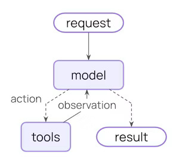

# 概述

## 相关包

<h3><code>langchain</code></h3>

<h3><code>langchain-[platform]</code></h3>

`LangChain`用于适配各平台模型的依赖包

## 使用示例

# `Agent`

`Agent`是一个可以在循环中调用工具，直到完成指定任务为止的模型。



## 创建`Agent`

`langchain`中可以通过`create_agent`快速创建一个可高度自定义的`agent`。

```python
create_agent(
    model: str | BaseChatModel,
    tools: Sequence[BaseTool | Callable[..., Any] | dict[str, Any]] | None = None,
    *,
    system_prompt: str | SystemMessage | None = None,
    middleware: Sequence[AgentMiddleware[StateT_co, ContextT]] = (),
    response_format: ResponseFormat[ResponseT] | type[ResponseT] | dict[str, Any] | None = None,
    state_schema: type[AgentState[ResponseT]] | None = None,
    context_schema: type[ContextT] | None = None,
    checkpointer: Checkpointer | None = None,
    store: BaseStore | None = None,
    interrupt_before: list[str] | None = None,
    interrupt_after: list[str] | None = None,
    debug: bool = False,
    name: str | None = None,
    cache: BaseCache[Any] | None = None,
    transformers: Sequence[TransformerFactory] | None = None,
) -> CompiledStateGraph[
    AgentState[ResponseT], ContextT, _InputAgentState, _OutputAgentState[ResponseT]
]
```

# `Model`

`Model`即`LLM`的封装。`langchain`中的`Model`为不同平台的`LLM`提供了统一的调用接口。

`Model`通常有两种使用方式：

- 在`Agent`中使用：作为`Agent`的推理引擎。
- 单独使用：直接被调用以完成一些简单的任务，如文本生成。

## 创建`Model`

`Langchain`中提供了多种方式初始化一个`Model`，最简单的方式是调用`init_chat_model`方法，它可以以相同的方式创建不同平台的`Model`。

```python
model = init_chat_model("gpt-5.4")
```

还可以直接创建不同平台对应的`Model Class`:

```python
model = ChatOpenAI(model="gpt-5.4")
model = ChatAnthropic(model="claude-sonnet-4-6")
```

## 核心方法

**`invoke`**

调用一次模型，完全生成响应后返回输出消息。

```python
invoke(
        self,
        input: LanguageModelInput,
        config: RunnableConfig | None = None,
        *,
        stop: list[str] | None = None,
        **kwargs: Any,
    ) -> AIMessage
```

**`stream`**

调用一次模型，但是实时地流式输出返回消息。

```

```

**`batch`**

一次性向模型发送一批请求，以提高调用效率。

```

```

## 核心参数

模型的全部参数取决于其提供商和具体模型，但所有模型都具有以下标准参数:

<h4>model</h4>

目标模型的标识符名称，`string`类型，必需。可以使用`:`一起声明提供商和模型，如`open:o1:`。

<h4>api_key</h4>

在访问模型时用于身份认证的密钥，`string`类型，可选。通常使用环境变量传递。

<h4>temperature</h4>

模型温度，决定模型输出的随机性，`number`类型，可选。温度越高模型输出越随机。

<h4>max_tokens</h4>

限制模型在一次响应中输出的最大`token`数，`number`类型，可选。

<h4>timeout</h4>

等待模型响应的最大超时时间，单位为秒，`number`类型，可选。

<h4>max_retries</h4>

请求失败的最大重试次数，`number`类型，可选，默认为6。

```
model = init_chat_model(
    "claude-sonnet-4-6",
    # Kwargs passed to the model:
    temperature=0.7,
    timeout=30,
    max_tokens=1000,
    max_retries=6,  # Default; increase for unreliable networks
)
```

## 工具调用

可以使用`bind_tools`方法为模型绑定`tool`。

```python
from langchain.tools import tool

@tool
def get_weather(location: str) -> str:
    """Get the weather at a location."""
    return f"It's sunny in {location}."


model_with_tools = model.bind_tools([get_weather])


```

当模型绑定工具后，其响应会包含请求调用工具的消息。对于单独使用的模型，需要手动调用工具并将调用结果返回给模型用于后续推理。对于`agent`，它可以在循环中自动处理工具调用消息。

# 记忆

