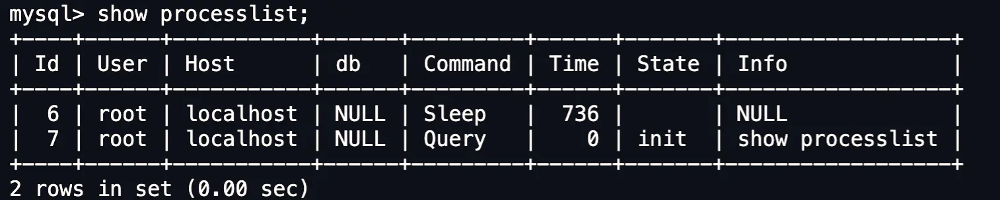

# 概述

> Mysql是一个开源的关系型数据库管理系统

## 长连接/短连接

> Mysql的连接跟Http一样，有短链接与长连接的概念。

对于短连接，每次执行sql前，都会连接mysql服务(即进行TCP三次握手)，并在执行SQL后断开Mysql服务(即执行TCP四次挥手)；对于长连接，在连接mysql服务后，连接会一直保持，在此期间，执行sql无需重新连接。

```java
//短连接
连接mysql服务（TCP三次握手）
执行sql
断开mysql服务（TCP 四次挥手）
//长连接
连接mysql服务（TCP三次握手）
执行sql
执行sql
执行sql
断开mysql服务（TCP四次挥手）
```

长连接可以减少建立连接和断开连接的过程，更推荐使用长连接。

但是，Mysql会使用内存管理连接对象，这些连接对象只有在连接断开时才会释放。如果长连接过多，将导致mysql服务占用内存太大，可能被系统强制杀死，导致发生Mysql服务异常重启的现象。

**解决长连接内存占用过多问题**

- 方式一:定期断开长连接
- 方式二:客户端主动重置连接。在Mysql5.7时为客户端实现了`mysql_reset_connection()`函数接口，调用后可重置连接，达到释放内存的效果。过程中无需重连和重新权限验证，只是会将连接恢复到刚刚创建时的状态。这个函数可能实现在各语言客户端中。

# SQL

结构化查询语言（Structured Query Language，SQL）是一种用于**管理和操作关系型数据库管理系统**的标准化编程语言。

它定义了一套操作关系型数据库管理系统的统一标准，使得底层实现机制不同、内部结构各异的关系型数据库系统，都可以通过相同的 SQL 语法进行数据的定义、查询和管理。

- 各数据库管理系统在实现SQL标准操作的基础之上，还会引入了各自的方言（Dialect）与扩展能力，以优化性能或添加高级功能，因此一条SQL不语句一定在所有数据库管理系统中都能运行。

**以下语句只针对MYSQL，可能在其他数据库实现中并不适用**

**通用语法**

- 一条 SQL 语句可以写在一行里，也可以拆成多行写,最终以分号`;`作为语句结束符。
- SQL语句可以使用空格/缩进来增强语句的可读性。
- MySQL数据库的SQL语句不区分大小写，关键字建议使用大写。
- 注释:
  - 单行注释：`--注释内容`或 `#注释内容`(MySQL特有）。
  - 多行注释：`/*注释内容*/`
- 字符串常量必须用引号包裹,`'`和`"`都可以
- 字段名或表名可以使用<code>`</code>包裹以特殊标识，一般表名或字段名会使用字母，数字和下划线的组合。

  - 如果表名或字段名为SQL关键字或包含空格、连字符、中文等特殊字符时，必须使用反引号<code>`</code>包裹。

## SQL分类

根据`SQL`语句的功能，可将`SQL`分为四类

| 分类    |           英文全称           | 主要作用                                             |
| ------- | :--------------------------: | :--------------------------------------------------- |
| **DDL** |   Data Definition Language   | 数据定义语言，定义和管理数据库对象(数据库，表，字段) |
| **DML** |  Data Manipulation Language  | 数据操作语言，对数据库表中数据进行**增删改**         |
| **DQL** |     Data Query Language      | 数据查询语言，查询数据库中表的数据                   |
| **DCL** |    Data Control Language     | 数据控制语言，控制访问权限和安全性                   |
| **TCL** | Transaction Control Language | 事务控制语言，管理事务的提交与回滚                   |

## DDL

数据定义语言，主要用于定义和管理数据库，数据库表和字段。

<h3>数据库相关语句</h3>

**查询所有数据库**  

```mysql
show databases;
```

**查询当前使用的数据库** 

```mysql
select database();
```

 **创建数据库**  

```mysql
create database/schema [if not exists] 数据库名 [DEFAULT CHARSET 字符集] [COLLATE 排序规则];
```

**删除数据库**  

```
drop database/schema [if exists] 数据库名;
```

**切换使用的数据库**

```
use 数据库名;
```

<h3>数据库表相关语句</h3>

**查询当前数据库的所有表**  

```mysql
show tables;  
```

 **查看指定表结构**  

```mysql
desc 表名;  
```

**查询指定表的建表语句**  

```mysql
show create table 表名; 
```

 **创建表**

```mysql
create table 表名(	
	字段1 字段类型 [约束] [comment 注释],	
    ....
    字段n 字段类型 [约束]  [comment 注释] 
) [comment 表注释];
```

- 注释是字符串常量，必须用`"`或`'`包裹

**删除表**  

```mysql
DROP TABLE [IF EXISTS] 表名;
```

**删除表后重新创建表**  

```mysql
TRUNCATE TABLE 表名;  
```

**为表添加新字段**  

```mysql
ALTER TABLE 表名 ADD 字段名 数据类型 [COMMENT 注释] [约束];  
```

**修改表中已存在字段的数据类型**  

```mysql
ALTER TABLE 表名 MODIFY 字段名 新数据类型;  
```

 **修改表中已存在字段的字段名和字段类型**  

```mysql
ALTER TABLE 表名 CHANGE 旧字段名 新字段名 类型 (长度) [COMMENT 注释] [约束];  
```

**删除表中字段**  

```mysql
ALTER TABLE 表名 DROP 字段名; 
```

**修改表名** 

```mysql
ALTER TABLE 表名 RENAME TO 新表名;  
```

## DML

数据操作语言，用于对数据库表中数据进行**增删改**

<h3>添加数据</h3>

```mysql
INSERT INTO 表名 [(字段名1,字段名2...)] VALUES (值1,值2)[,...];
-- 根据SQL查询结果插入数据，INSERT ... SELECT ...，常用于数据迁移、归档、分表、数据同步
INSERT INTO table_name (col1, col2)
SELECT col1, col2 FROM another_table;
```

- 可以指定字段名，为指定的字段设置字段值，其余字段为空或默认值

<h3>修改数据</h3>

```mysql
UPDATE 表名 SET 字段名1=值1 [,...] [WHERE 条件];
```

- 修改时只会修改符合`Where`条件的记录，如果不添加`Where`条件，则会修改整张表的每条记录。

<h3>删除</h3>

```mysql
DELETE FROM 表名 [WHERE 条件];
```

- 只会删除符合`Where`条件的记录，如果不添加`Where`条件，则会删除整张表的所有数据。

<h4>处理重复数据插入</h4>

为字段添加<code>UNIQUE</code>约束后，可以通过不同条件的`INSERT`语句处理重复数据插入。

<h5>方式一：<code>INSERT</code></h5>

插入重复值时，会返回错误

<h5>方式二：使用<code>INSERT... ON DUPLICATE KEY UPDATE</code></h5>

插入重复值时，更新现有记录

```sql
INSERT INTO users (email,name) VALUES('example@example.com','John Doe')
ON DUPLICATE KEY UPDATE name = VALUES(name)；
```

<h5>方式二：使用<code>INSERT IGNORE</code></h5>

插入重复值时，忽略此条插入语句

```sql
INSERT IGNORE INTO users (email,name)
VALUES('example@example.com'，'John Doe');
```

## DQL

数据查询语言，用于查询数据库中表的数据

```mysql
SELECT 字段列表|函数列表 FROM 表名列表 [WHERE 条件列表] [GROUP BY 分组字段列表] 
[HAVING 分组后条件列表] [ORDER BY 排序字段列表] [LIMIT 分页参数]
```

- 如果需要查询所有字段,可以直接使用通配符`*`代替字段列表
- 可以使用`AS`关键字对字段和表名设置别名，如`username AS name`,`AS`可以省略,如` username name`,别名可以在`SQL`中使用，并且返回结果中列名将会替换为别名。

**执行顺序**

```sql
(9) SELECT
(10) DISTINCT <column>,
(6) AGG_FUNC <column> or <expression>,.
(1) FROM <left_table> 
(3)<join_type>JoINKright_table>
(2) ON<join_condition>
(4) WHERE <where_condition> 
(5) GROUP BY <group_by_list>
(7) WITH[CUBE|ROLLUP}
(8) HAVING <having_condtion>
(11) ORDER BY <order_by_list>
(12) LIMIT <limit_number>;
```

- 在查询语句的执行过程中，每个步骤都会生成一个虚拟表，这个虚拟表作为	下一个执行步骤的输入，最后一个步骤产生的虚拟表即为输出结果
- 因此表的别名可以在`SQL`中任意位置使用，而字段别名只能在`ORDER BY`中使用

<h3>基本查询</h3>

**查询整张表中的数据**

```mysql
SELECT [DISTINCT] 字段1[,...] FROM 表名;
```

- `DISTINCT`用于去除重复记录

<h3>条件查询</h3>

**只查询符合条件的记录**

```mysql
SELECT 字段列表 FROM 表名 WHERE 条件列表
```

- 为了增强可读性，可将相关条件使用`()`包裹

  ```mysql
  SELECT * FROM emp where (age betwen 1 and 2) and (gender = 1);
  ```

条件格式为:**`字段名/别名 比较运算符 比较值`**

条件中可用的运算符有：

|     比较运算符      |                             功能                             |
| :-----------------: | :----------------------------------------------------------: |
|          >          |                             大于                             |
|         >=          |                           大于等于                           |
|          <          |                             小于                             |
|         <=          |                           小于等于                           |
|          =          |                             等于                             |
|      <> 或 !=       |                            不等于                            |
| BETWEEN ... AND ... | 在某个范围之内(含最小、最大值),BETWEEN后跟最小值，AND后跟最大值 |
|       IN(...)       |                    是否为`()`中指定值之一                    |
|     LIKE 占位符     |         模糊匹配(`_`匹配单个字符,` %`匹配任意个字符)         |
|       IS NULL       |                            是NULL                            |
|     IS NOT NULL     |                           不是NULL                           |

多个条件需要使用逻辑运算符连接起来，可用逻辑运算符有：

| 逻辑运算符 |            功能            |
| :--------: | :------------------------: |
|  AND 或&&  |   并且(多个条件同时成立)   |
|   OR或II   | 或者(多个条件任意一个成立) |
|  NOT 或!   |          非,不是           |

<h3>分组查询</h3>

分组查询将查询到的记录按照字段值分组并对分组后的记录进行过滤。

```mysql
SELECT 字段列表 FROM 表名 [WHERE 条件] GROUP BY 分组字段列表 [HAVING 分组后过滤条件];
```

- 分组查询通常配合聚合函数使用，在分组查询中使用聚合函数时，会先分组，再对每个分组执行聚合函数，最后输出每个分组的聚合结果。
- `Mysql8+`中默认开启`ONLY_FULL_GROUP_BY`模式，要求分组查询里的`SELECT` / `HAVING` `Order BY`出现的字段要么是聚合函数，要么出现在 `GROUP BY` 中，否则报错；
  - 这是因为在不使用`GROUP BY`的情况下，聚合函数只会产生一个聚合结果，而普通的表字段会对应多条记录，如果想要返回结果，只能随机挑选一个记录的字段值与聚合结果一起返回，SQL标准不允许模棱两可的查询。

**WHERE 和 HAVING 的区别**

- 执行时机不同：where是分组之前进行过滤，不满足where条件，不参与分组；而having是分组之后对分组结果进行过滤。
-  判断条件不同：where不能对聚合函数进行判断，而having可以。  

**执行顺序为：**`WHERE` > 聚合函数 > `HAVING`。

<h4>聚合函数</h4>

聚合函数将查询到的多条记录的列作为一个整体，进行纵向计算。

```mysql
SELECT 聚合函数(字段列表) FROM 表名;
```

- 聚合函数的结果会作为一个字段展示。

常见聚合函数有：

| 函数  |   功能   |
| :---: | :------: |
| count | 统计数量 |
|  max  |  最大值  |
|  min  |  最小值  |
|  avg  |  平均值  |
|  sum  |   求和   |

- 字段值为`NULL`的记录不参与聚合函数的计算。

<h3>排序查询</h3>

排序查询根据字段值对查询结果进行升序或降序排序

```mysql
SELECT 字段列表 FROM 表名 ORDER BY 字段1 排序方式1[,字段2,排序方式2...]
```

- 排序方式有两种：`ASC`(升序，默认值,可省略);`DESC`(降序)
- 多字段排序时，前面的字段相同，才会比较后面的排序规则。

<h3>分页查询</h3>

```mysql
#查询从起始索引开始，往后N条记录(包括起始索引)
SELECT 字段列表 FROM 表名 LIMIT 起始索引,查询记录数;
#查询从索引0开始，往后N条记录
SELECT 字段列表 FROM 表名 LIMIT 查询记录数;

#Mysql支持两种分页写法：
#SQL标准定义写法
SELECT 字段列表 FROM 表名 LIMIT 查询记录数 OFFSET 起始索引;
#简写语法
SELECT 字段列表 FROM 表名 LIMIT 起始索引,查询记录数;
```

- 分页查询属于数据库的方言，不同的数据库实现方式不同，MYSQL中使用`LIMIT`
- 起始索引从0开始，`起始索引 = (查询页码 - 1) * 每页的记录数`

<h3>多表查询</h3>

在项目开发中，由于不同业务模块之间存在关联，所以各个表之间也存在者各种联系，可将表之间的联系分为三种：

- **一对多：**如部门与员工的关系 ，一个部门可对应多个员工，一个员工只对应一个部门。
  - 通常会建立外键约束维护**一对多**的关系，在多的一方建立外键，指向一的一方的主键。
- **多对多：**比如学生与课程的关系，一个学生可以选修多门课程，一门课程也可以供多个学生选择。
  - 通常建立第三张中间表，中间表至少包含两个外键，分别关联两方主键维护这种关系。
- **一对一：**多见于单表拆分，将一张宽表的基础字段放在一张表中，其他字段放在另一张表中，以提升操作效率
  - 通常在任意一方加入外键约束，关联另一方的主键，并且设置外键字段为`UNIQUE`。

多表查询根据其实现方式可分为两类：

- 连接查询
- 子查询

<h4>连接查询</h4>

对多张表做笛卡尔积，即表的每一行与另一张表的每一行进行组合，生成结果集。然后根据表之间的联系用WHERE或JOIN 条件过滤无效结果

**笛卡尔积：**在数学中，笛卡尔积会计算两个集合中元素的所有组合。

SQL 标准定义了多种JOIN操作来描述多表查询的语义，而 MySQL 在实现上仅支持其中部分连接类型及相关特性。

**内连接**

```mysql
#隐式内连接
SELECT 字段列表 FROM 表1,表2[,...] WHERE 条件;
#显示内连接
SELECT 字段列表 FROM 表1 [INNER] JOIN 表2 ON 连接条件;
```

只保留**匹配成功**的行，不符合条件的行直接丢弃

**外连接**

```mysql
#左外连接
SELECT 字段列表 FROM 表1 LEFT [OUTER] JOIN 表2 ON 连接条件;
#右外连接
SELECT 字段列表 FROM 表1 RIGHT [OUTER] JOIN 表2 ON 连接条件;

#全外连接，Mysql不支持全外连接，需使用UNION实现
SELECT 字段列表 FROM 表1 LEFT [OUTER] JOIN 表2 ON 连接条件
UNION
SELECT 字段列表 FROM 表1 RIGHT [OUTER] JOIN 表2 ON 连接条件;
```

可分为左外连接，右外连接和全外连接：

- 左外连接保留**左表所有行**，与右表匹配不到的行字段值补`NULL`。
- 右外连接保留**右表所有行**，与左表匹配不到的行字段值补`NULL`。
- 全外连接保留两张表中的所有行，匹配不到的行字段补`NULL`，本质就是左外连接和右外连接结果合并后去重。

**自连接**

自连接本质是同一张表和自己做笛卡尔积后根据JOIN或WHERE条件过滤结果，需要为表起两个不同的别名，按需要使用 INNER/OUTER JOIN。

```mysql
SELECT 字段列表 FROM 表 别名1 [INNER] | [LEFT|RIGHT OUTER] JOIN 表 别名2 ON 条件;
```

<h4>子查询</h4>

子查询会在`SQL`语句中嵌套`SELECT`语句，又称为嵌套查询。

```mysql
SELECT * FROM talbe1 WHERE column1 = (SELECT column1 FROM table2)
```

- 子查询主要可用在`WHERE`子句，`SELECT`子句,`FROM`子句,`INSERT`子句中

根据子查询返回结果不同，可分为：

- 标量子查询（子查询结果为单个值）
- 列子查询(子查询结果为一列)
- 行子查询(子查询结果为一行)
- 表子查询(子查询结果为多行多列)

根据嵌套查询语句的位置不同，可分为：

- `WHERE`之后的子查询
- `FROM`之后的子查询
- `SELECT`之后的子查询

**标量子查询**

子查询返回的结果为单个值，可使用`= <> > >= < <= `操作符连接子查询语句

```mysql
SELECT * FROM talbe1 WHERE column1 = (SELECT column1 FROM table2 where id = 1)
```

**列子查询**

子查询返回的结果是一列，可使用`IN 、NOT IN 、 ANY 、SOME 、 ALL`等操作符连接子查询语句

```mysql
SELECT * FROM talbe1 WHERE column1 比较操作符 [ANY|SOME| ALL] (SELECT column1 FROM table2)
```

| **操作符** |                **描述**                |
| :--------: | :------------------------------------: |
|     IN     |      在指定的集合范围之内，多选一      |
|   NOT IN   |         个在指矩的集台范围之内         |
|    ANY     |  子查询返回列表中，有任意一个满足即可  |
|    SOME    | 与ANY等同，使用SOME的地方都可以使用ANY |
|    ALL     |    子查询返回列表的所有值都必须满足    |

**行子查询**

子查询返回的结果是一行，可使用`= 、<> 、IN 、NOT IN`等操作符连接子查询语句

```mysql
SELECT * FROM talbe1 WHERE (column1,column2,...) = (SELECT column1,column2 FROM table2 where id = 1)
```

- 要保证操作符两边的字段数一致。

**表子查询**

表子查询返回的结果是多行多列，通常使用`IN`操作符连接子查询语句或将子查询结果作为一张临时表放在`FROM`后面与其他表连接查询。

```mysql
SELECT * FROM (子查询语句) as 别名 JOIN|WHERE
#效果类似行子查询，不同的是范围匹配。
SELECT * FROM 表名 WHERE (字段1,字段2...) IN (子查询语句);
```

<h3>联合查询</h3>

联合查询会组合多个查询语句，将多次查询结果合并。

```mysql
SELECT 字段列表 FROM 表A ...
UNION [ALL]
SELECT 字段列表 FROM 表B...;
```

- 这要求多个查询语句返回记录的列数一致
- 如果不添加`ALL`关键字，会对合并后的结果进行去重；如果添加了`ALL`关键字，则直接合并所有结果。

## DCL

数据控制语言，用于管理数据库用户，控制数据库的访问权限

<h4>用户管理</h4>

所有用户信息均存放在`mysql`数据库下的`user`表中,`MYSQL`中使用用户名+主机名唯一标识一个用户,主机名表示该用户可以在哪个主机上访问数据库

- 主机名为`localhost`表示当前主机
- 主机名为`%`表示任意主机

**查询用户**

```mysql
USE mysql;
select * from mysql.user; 
```

**创建用户**

创建一个用户，指定用户能在哪个主机上访问数据库以及访问密码。

```mysql
CREATE USER '用户名'@'主机名' IDENTIFIED BY '密码'; 
```

**修改用户密码**

```mysql
ALTER USER '用户名'@'主机名' IDENTIFIED WITH mysql_native_password BY '新密码' ;
```

**删除用户**

```mysql
DROP USER '用户名'@'主机名' ; 
```

<h4>权限管理</h4>

|      权限类型       |        说明        |
| :-----------------: | :----------------: |
| ALL, ALL PRIVILEGES |      所有权限      |
|        USAGE        |    没有任何权限    |
|       SELECT        |      查询数据      |
|       INSERT        |      插入数据      |
|       UPDATE        |      修改数据      |
|       DELETE        |      删除数据      |
|        ALTER        |       修改表       |
|        DROP         | 删除数据库/表/视图 |
|       CREATE        |   创建数据库/表    |

**查询权限**

```mysql
SHOW GRANTS FOR '用户名'@'主机名' ;
```

**授予权限**

```mysql
GRANT 权限列表 ON 数据库名.表名 TO '用户名'@'主机名'; 
```

- 可以使用`*`表示所有数据库或所有表

**撤销权限**

```mysql
REVOKE 权限列表 ON 数据库名.表名 FROM '用户名'@'主机名'; 
```

## TCL

## 高级语法

### 公共表表达式`CTE`

`Common Table Expression`,给一个子查询起名字，后面可以像普通表一样在后续子查询和主SQL语句中使用。当需要串联多个子查询时，公共表表达式有助于编写出更清晰的查询。

```sql
WITH t1 AS (子查询),
     t2 AS (...)
主SQL
```

- 只在当前 SQL 中有效，不会创建真实表。

### 窗口函数

窗口函数是在不改变结果集行数的前提下，对指定窗口内的数据进行计算的函数。

```sql
函数() OVER (
    [--在逻辑上分组
    PARTITION BY ... ]
    [--排序
    ORDER BY ...]
    [ROWS BETWEEN ...]
)
```

<h4>常用窗口函数</h4>

**排名函数**

根据 `OVER (ORDER BY ...)` 指定的排序规则，为结果集生成从1开始的序号。

| 函数         | 作用       |
| ------------ | ---------- |
| ROW_NUMBER() | 唯一编号   |
| RANK()       | 并列跳号   |
| DENSE_RANK() | 并列不跳号 |

- 生成的结果默认会按照`OVER ()`中的排序规则返回，如果没有重新排序的话。

 **聚合型窗口函数**

| 函数    |
| ------- |
| SUM()   |
| AVG()   |
| MAX()   |
| MIN()   |
| COUNT() |

# 数据类型

Mysql中的表字段的数据类型可以分为三类：

<h3>数值类型</h3>

|               类型                | 存储大小 |                    取值范围 / 精度                     |     说明     |    使用场景    |
| :-------------------------------: | :------: | :----------------------------------------------------: | :----------: | :------------: |
|             `TINYINT`             |  1 字节  |           -128 ~ 127或 0 ~ 255（`UNSIGNED`）           |    小整数    | 状态值、布尔值 |
|            `SMALLINT`             |  2 字节  |             -32,768 ~ 32,767或 0 ~ 65,535              |   中小整数   |   计数器、ID   |
|            `MEDIUMINT`            |  3 字节  |        -8,388,608 ~ 8,388,607或 0 ~ 16,777,215         |   中等整数   |  中等范围数据  |
|         `INT` / `INTEGER`         |  4 字节  |   -2,147,483,648 ~ 2,147,483,647或 0 ~ 4,294,967,295   |   常用整数   | 主键、普通整数 |
|             `BIGINT`              |  8 字节  | -9,223,372,036,854,775,808 ~ 9,223,372,036,854,775,807 |    大整数    |  金额、日志ID  |
| `DECIMAL(p, s)` / `NUMERIC(p, s)` |   可变   |             精确小数，p为总位数，s为小数位             |   精确存储   | 财务数据、金额 |
|              `FLOAT`              |  4 字节  |                      单精度浮点数                      |  非精确小数  |    科学计算    |
|         `DOUBLE` / `REAL`         |  8 字节  |                      双精度浮点数                      |  非精确小数  | 科学计算、统计 |
|             `BIT(n)`              |   n 位   |                         0 或 1                         | 存储二进制位 |  标志位、权限  |

- 数值类型默认是有符号的，在类型后加`UNSIGNED`关键字可变为无符号。
- DECIMAL
- `INT`可通过`INT(N)`指定显示宽度，不会改变底层的存储方式。仅在定义字段时配合`ZEROFILL`关键字定义字段补零显示：如果宽度小于N，会用前导零补至指定宽度；如果宽度大于等于N，也不会截断显示。

<h3>字符串类型</h3>

|      类型      |         最大长度          |                       说明                       |          使用场景          |
| :------------: | :-----------------------: | :----------------------------------------------: | :------------------------: |
|  **CHAR(n)**   |          n ≤ 255          |           定长字符，长度不足自动补空格           | 性别、状态码、固定长度字段 |
| **VARCHAR(n)** | n ≤ 65535（取决于行大小） |                   可变长度字符                   |      姓名、邮箱、标题      |
| **TEXT 系列**  |             -             |              文本类型，存储大量字符              |    内容字段、文章、评论    |
|   `TINYTEXT`   |         255 字节          |                      小文本                      |        短描述、备注        |
|     `TEXT`     |        65,535 字节        |                     普通文本                     |         评论、日志         |
|  `MEDIUMTEXT`  |      16,777,215 字节      |                     中等文本                     |        长文章、文档        |
|   `LONGTEXT`   |    4,294,967,295 字节     |                     超长文本                     |       大型文档、日志       |
| **BLOB 系列**  |             -             | 二进制大对象，存储二进制数据（不可直接作为字符） |   图片、音频、视频、文件   |
|   `TINYBLOB`   |         255 字节          |                  小型二进制数据                  |        小图片、图标        |
|     `BLOB`     |        65,535 字节        |                  普通二进制数据                  |         文档、音频         |
|  `MEDIUMBLOB`  |      16,777,215 字节      |                  中等二进制数据                  |       视频、较大文件       |
|   `LONGBLOB`   |    4,294,967,295 字节     |                  超大二进制数据                  |       超大文件、备份       |
|    **ENUM**    |         1-2 字节          |              枚举类型，只能取预设值              |        性别、状态码        |
|    **SET**     |         1-8 字节          |                    可多选枚举                    |       标签、多选权限       |

- `CHAR`相比于`VARCHAR`性能更高，因为`CHAR`是定长，存储时长度不足会在末尾补足空格,适合存储长度固定的数据。而`VARCHAR`是可变长度，需要计算存储所占用的空间
- `varchar`等类型后面的数字代表字符个数，而不是字节数，具体可存储的字节长度取决于所使用的字符集

<h3>日期时间类型</h3>

在为日期时间类型赋值时使用符合格式的字符串常量

|    类型     | 存储大小 |         格式          |            说明             |      使用场景      |
| :---------: | :------: | :-------------------: | :-------------------------: | :----------------: |
|   `DATE`    |  3 字节  |     'YYYY-MM-DD'      |           仅日期            | 出生日期、注册日期 |
| `DATETIME`  |  8 字节  | 'YYYY-MM-DD HH:MM:SS' |         日期 + 时间         | 订单时间、日志时间 |
| `TIMESTAMP` |  4 字节  | 'YYYY-MM-DD HH:MM:SS' | 日期 + 时间，带时区自动转换 |    系统记录时间    |
|   `TIME`    |  3 字节  |      'HH:MM:SS'       |           仅时间            |   持续时间、工时   |
|   `YEAR`    |  1 字节  |        'YYYY'         |            年份             | 出生年份、年份统计 |

| 类型        | 存储大小 | 格式                  | 说明                                                |
| ----------- | -------- | --------------------- | --------------------------------------------------- |
| `DATETIME`  | 8 字节   | `YYYY-MM-DD HH:MM:SS` | 存储日期和时间，**不受时区影响**                    |
| `TIMESTAMP` | 4 字节   | `YYYY-MM-DD HH:MM:SS` | 存储日期和时间，**受时区影响**，自动转换为 UTC 存储 |

| 比较项   | DATETIME                                          | TIMESTAMP                                                 |
| -------- | ------------------------------------------------- | --------------------------------------------------------- |
| 存储方式 | 直接存储日期时间                                  | 存储 UTC 时间戳（秒数）                                   |
| 时区     | 不随时区变化                                      | 会随服务器时区转换                                        |
| 存储大小 | 8 字节                                            | 4 字节                                                    |
| 支持范围 | `'1000-01-01 00:00:00'` ~ `'9999-12-31 23:59:59'` | `'1970-01-01 00:00:01 UTC'` ~ `'2038-01-19 03:14:07 UTC'` |
| 默认值   | 不自动赋值                                        | 可以自动赋值为 `CURRENT_TIMESTAMP`                        |
| 自动更新 | 需要显式触发                                      | 可以使用 `ON UPDATE CURRENT_TIMESTAMP` 自动更新时间       |
| 用途     | 普通时间字段                                      | 记录插入/修改时间（审计、日志）                           |

# 函数

函数是由`MYSQL`定义好的一些可供用户调用的操作，它接收零个或多个输入，执行一系列操作后返回一个输出，聚合函数就是函数的一种。

函数应用在`SQL`语句中，接收的输入可以是字段名或常量。输入为字段名时，会为每一个符合`WHERE`条件记录的字段值执行此操作

- 多个函数嵌套时，为了增强可读性，可以使用`()`包裹函数。

## 字符串函数

|               函数               |                             功能                             |
| :------------------------------: | :----------------------------------------------------------: |
|       CONCAT(S1,S2,...Sn)        |          字符串拼接,将s1,s2,.. .Sn拼接成一个字符串           |
|           `LENGTH(s)`            |                   返回字符串的长度(字符数)                   |
|            LOWER(str)            |                   将字符串str全部转为小写                    |
|            UPPER(str)            |                   将字符串str全部转为大写                    |
|         LPAD(str,n,pad)          |     左填充,用字符串pad对str的左边进行填充,使其长度达到N      |
|         RPAD(str,n,pad)          |     右填充,用字符串pad对str的右边进行填充,使其长度达到N      |
|            TRIM(str)             |                  去掉字符串头部和尾部的空格                  |
|     SUBSTRING(str,start,len)     | 返回从字符串str从start位置起的len个长度的字符串,start从1开始 |
| `REPLACE(str, from_str, to_str)` |            将字符串中的某部分替换为另一个字符串。            |

## 数值函数

|         函数          |                功能                |
| :-------------------: | :--------------------------------: |
|      `ABS(num)`       |          返回数字的绝对值          |
| `POWER(num,exponent)` |      返回指定数字的指定幂次方      |
|        CEIL(x)        |              向上取整              |
|       FLOOR(x)        |              向下取整              |
|       MOD(x,y)        |            返回x/y的模             |
|        RAND()         |         返回0~1内的随机数          |
|      ROUND (x,y)      | 求 参数x的四舍五入的值,保留y位小数 |

## 日期函数

|                函数                 |                             功能                             |
| :---------------------------------: | :----------------------------------------------------------: |
|              CURDATE()              |                         返回当前日期                         |
|              CURTIME()              |                         返回当前时间                         |
|                NOW()                |                     返回当前日 期和时间                      |
|             YEAR(date)              |                      获取指定date的年份                      |
|             MONTH(date)             |                      获取指定date的月份                      |
|              DAY(date)              |                      获取指定date的日期                      |
| DATE_ADD(date,  INTERVAL expr type) | 返回一个日期/时间值加上一个时间间隔expr后的时间值，如`DATE_ADD(now(), INTERVAL 7 DAY)` |
|        DATEDIFF(date1,date2)        | 返回起始时间date1和结束时间date2之间相差的天数，`date1-date2`(可能出现负数) |

## 流程控制函数

可以在SQL语句中实现条件筛选，从而提高语句的效率

|                             函数                             |                           功能                            |
| :----------------------------------------------------------: | :-------------------------------------------------------: |
|                       IF(expr1, t, f)                        |            如果expr1为true,则返回t,否则返回 f             |
|                   IFNULL(value1 , value2)                    |        如果value1不为空,返回value1,否则返回value2         |
|   CASE WHEN [ val1 ] THEN [res1] ... ELSE [ default ] END    |    如果val1为true,返回 res1,...否 则返回default默认值     |
| CASE [expr] WHEN [ val1 ] THEN [res1] ... ELSE [ default ] END | 如果expr的值等于val1,返回 res1, ... 否则返回default默认值 |

# 约束

约束是作用于表中字段的规则，用于限制存储在表中的数据，以保证数据库中数据的正确、有效和完整。

常用约束有：

|           约束            |                          描述                           |     关键字     |
| :-----------------------: | :-----------------------------------------------------: | :------------: |
|         非空约束          |               限制该字段的数据不能为null                |    NOT NULL    |
|         唯一约束          |         保证该字段的所有数据都是唯一、不重复的          |     UNIQUE     |
|         主键约束          |         主键是一行数据的唯一标识,要求非空且唯一         |  PRIMARY KEY   |
|         默认约束          |      保存数据时,如果未指定该字段的值,则采用默认值       | DEFAULT 默认值 |
| 检查约束(8.0.16版本 之后) |                保证字段值满足某一个条件                 | CHECK (表达式) |
|         外键约束          | 用来让两张表的数据之间建立连接,保证数据的一致性和完整性 |  FOREIGN KEY   |

- 主键约束的字段还可以使用`AUTO_INCREMENT`关键字指定主键自增，如果在添加时不指定主键值，则添加数据的主键在从1开始自增。只有整数类型的主键可以使用自增关键字
- 为一个字段指定多个约束时，用空格分隔。

约束在建表或修改表中字段时为字段指定：

```mysql
create table 表名(	
	字段1 字段类型 [约束] [comment 注释],	
    ....
    字段n 字段类型 [约束]  [comment 注释] 
) [comment 表注释];
```

<h3>外键约束</h3>

外键约束可以让两张表的数据建立联系，从而保证数据的一致性和完整性。

在外键约束中，被引用称为父表，子表中的列会引用父表中的数据，外键用来约束“子表”的某一列，必须引用“父表”中已经存在的数据。

外键约束是加在子表的。

```mysql
create table 表名(
	field,type,
    ...
    [CONSTRAINT] 外键名称 FOREIGN KEY (子表字段名) REFERENCES 父表(父表被引用的字段名)
)
ALTER TABLE 表名 ADD CONSTRAINT 外键名称 FOREIGN KEY(子表字段名) REFERENCES 父表(父表字段名)

```

- 被外键引用的列，必须有索引，并且该索引必须是唯一索引

外键约束会在插入与删除时对数据进行约束

- 插入时，不允许子表插入外键字段值在父表中不存在的记录，会报错
- 删除时，不允许父表删除在子表中仍然被外键字段引用的记录，会报错

**外键的级联规则**

当父表的数据被 `DELETE` 或 `UPDATE` 时，数据库应该如何自动处理子表中对应的记录。

```mysql
create table 表名(
	field,type,
    ...
    [CONSTRAINT 外键名称] FOREIGN KEY (子表字段名) REFERENCES 父表(父表被引用的字段名)
    [ON UPDATE 级联规则] [ON DELETE 级联规则]
)
```

|  **行为**   |                           **说明**                           |
| :---------: | :----------------------------------------------------------: |
|  NO ACTION  | 当在父表中删除/更新对应记录时，首先检查该记录是否有对应外键，如果有则不允许删除/更新。（与RESTRICT —致）默认行为 |
|  RESTRICT   | 当在父表中删除/更新对应记录时，首先检查该记录是否有对应外键，如果有则不允许删除/更新。（与NO ACTION —致）默认行为 |
|   CASCADE   | 当在父表中删除/更新对应记录时，首先检查该记录是否有对应外键，如果有，则也删除/更新外键在子表中的记录。 |
|  SET NULL   | 当在父表中删除对应记录时，首先检杳该记录是否有对应外键，如果有则设置子表中该外键值为null （这就要求该夕卜键允许取null）。 |
| SET DEFAULT | 父表有变更时，子表将外键列设置成一个默认的值（InnoDB不支持） |

# 关键字

# 命令

**连接Mysql服务**

```
mysql -h$ip -u$user -p$password
```

- 密码不是必输项，可以先不填写密码，在交互对话中输入密码连接。

**查看连接客户端信息**

```
show processlist
```



- `Sleep`表示该连接为空闲连接，`Time`列为空闲时长，当空闲时长超过`wait_timeout`参数(默认8小时),则Mysql会自动断开连接。

**手动断开连接**

```
kill connection +[id]
```


# 架构

Mysql的架构通常分为两层:**Server层和存储引擎层**


Server层负责建立连接、分析和执行SQL。MySQL大多数的核心功能模块都在这实现，主要包括连接器，查询缓存、解析器、预处理器、优化器、执行器等。另外，所有的内置函数（如日期、时间、数学和加密函数等）和所有跨存储引擎的功能（如存储过程、触发器、视图等）都在Server层实现。

存储引擎层负责数据的存储和提取。索引数据结构，是由存储引擎层实现的。Mysql支持`InnoDB`、`MyISAM`、`Memory`等多个存储引擎，不同的存储引擎共用一个Server层。从MySQL5.5版本开始，`InnoDB`成为了MySQL的默认存储引擎。不同的存储引擎支持的索引类型也不相同，比如`InnoDB`支持索引类型是B+树，且默认使用，也就是说在数据表中创建的主键索引和二级索引默认使用的均是B+树索引。

**Mysql执行一条`SELECT`语句的流程**

1. **建立连接**。客户端与`连接器`基于TCP协议建立连接。进行`TCP`三次握手并验证账户与密码成功后，连接器会获取该账户的权限并保存起来，此后该用户在连接里的任何操作都会基于连接开始时保存的权限进行权限逻辑判断，即使管理员途中修改了该用户的权限。
   - 连接器只会在第一次建立连接时才会执行完整的认证流程，后续再执行sql语句时，连接器只会进行轻量级的验证
2. **查询缓存**，Mysql会解析SQL语句的第一个字段，判断出是什么类型的语句。如果是查询语句，则首先去查询缓存，如果缓存命中，则直接返回，否则继续向下执行
   - 缓存`key-value`形式保存在内存中，`key`是查询语句，`value`为查询语句对应的值。
   - 一个表只要有更新操作，这个表的查询缓存就会被清空。所以对于更新频繁的表，查询的命中率很低。因此Mysql8.0版本移除了查询缓存。
   - 在Mysql8.0前，可以通过将`query_cache_type`参数设置为`DEMAND`关闭查询缓存
3. **解析器解析SQL。**
   - 首先进行词法分析，此时会对SQL进行分词，识别出其中的关键字与非关键字
   - 之后根据词法分析的结果，进行语法分析，根据语法规则，判断SQL是否满足语法，如果没有问题则会构建出SQL语法树,方便后续模块读取表名，字段，语句类型；否则会报错。
   - 此阶段不会解析表或者字段是否存在，只是进行单纯的词法和语法解析
4. **执行SQL**。这时SQL语句正式开始执行。可分为三个阶段:
   - prepare 阶段，也就是预处理阶段，由预处理器执行：检查查询语句中的表或字段是否存在，将`select *`中的`*`扩展为表中的所有列
   - optimize 阶段，也就是优化阶段。由优化器执行：优化器会选择查询成本最小的执行计划((如使用哪个索引)，可以在语句前加`explain`关键字查看执行方案	
   - execute阶段，也就是执行阶段。由执行器完成：执行器会根据执行计划，调用存储引擎接口进行数据读写操作，并对结果进行必要的处理后返回给客户端。

# 事务

> 事务是一组数据库操作的集合，是数据库中执行业务的最小单位。事务会把所有操作作为一个整体一起向系统提交或撤销。

- 事务是由存储引擎实现的，并不是所有存储引擎都支持事务，如MYSQL的`MyISAM`引擎。

- 一个事务中的所有操作，要么同时成功，要么同时失败
- 默认MYSQL的每一条语句都会自动开启并提交事务，即当执行一条DML语句时，MySQL会隐式的开启事务并提交事务。
- 只有提交事务后，操作才会真正生效

**查看/设置当前会话的事务提交方式**

```sql
select @@autocommit;
set @@autocommit = 0; 
```

- `@@autocommit`默认值为1，表示事务会在每条语句执行完毕后自动提交
- 将其设置为0即可关闭自动提交

**提交事务**

```sql
commit;
```

**回滚事务**

```sql
rollback;
```

- 当事务中的操作出现异常时，此时不可提交事务，而是回滚事务恢复数据

**手动开启事务** 

```sql
start transaction ;
-- 或
begin;
```

- 此时需要手动提交事务才可以保证操作生效

## 事务特性

事务必须遵守四大特性，分别为原子性(Atomicity)，一致性(Consistency)，隔离性(Isolation)，持久性(Durability)，统称为ACID。

<h4>原子性(Atomicity)</h4>

事务是不可分割的最小操作单元，要么全部成功，要么全部失败

<h4>一致性(Consistency)</h4>

事务执行前后，数据库必须从一个一致的状态转变为另一个一致的状态。

<h4>隔离性(Isolation)</h4>

多个事务并发执行时，一个事务的操作不会被其他事务随意干扰。

<h4>持久性(Durability)</h4>

事务一但处理结束，它对数据库中的数据的改变是永久的 

<h3><code>MYSQL</code>中分别通过以下技术保证事务的四大特性：</h3>

- 持久性通过redo log（重做日志）保证；
- 原子性通过undo log（回滚日志）保证；
- 隔离性通过MVCC（多版本并发控制）和锁机制保证；
- 一致性则通过持久性+原子性+隔离性保证；

## 并发事务问题

当多个事务并行执行时可能引发的一些数据安全问题，常见问题有以下三个

<h4>脏</h4>

一个事务读到了另一个未提交事务修改过的数据。

<h4>不可重复读</h4>

一个事务内多次查询同一条记录，出现了前后两次查询数据不一致的情况

<h4>幻读</h4>

一个事务内多次查询符合某个查询条件的记录数量，出现了前后两次记录数量不一致的情况。

## 事务隔离级别

事务隔离级别是数据库为了解决 **多个事务并发执行时的相互干扰问题**，所规定的“事务之间的可见性规则”。包括四种隔离级别，由上到下，执行效率逐渐下降，数据安全性逐渐提高。

- 事务隔离级别是由`SQL`标准定义的，不同数据库根据标准有不同的实现，可能与标准有一定程度的出入。标准上,可重复读是无法防止幻读的，但是MySQL的实现中，可重复读可以很大程度上防止幻读。

<h3>Read Uncommitted（读未提交）</h3>

一个事务还未提交时，它做的变更就能被其他事务看到。可能发生脏读，不可重复读和幻读现象。

<h3>Read Committed（读已提交）</h3>

一个事务提交后，它做的变更才能被其他事务看到（Oracle 默认）。不会发生脏读现象，但可能发生不可重复读和幻读现象。

<h3>Repeatable Read（可重复读）</h3>

一个事务执行过程中看到的数据，一直跟这个事务启动时看到的数据是一致的。

- 可能发生幻读现象，不会发生脏读和不可重复读现象

- MySQL的`InnoDB`引擎 默认的事务隔离级别，它通过`MVCC`在很大程度上避免了幻读，但是不能完全解决幻读问题。

<h4><code>MYSQL</code>可重复读隔离级别下幻读例子</h4>

`MYSQL`通过`MVCC`在很大程度上避免了幻读，但是不能完全解决幻读问题。

1. 事务A开启事务后执行`SELECT * FROM table where id = 5`查询id为5的数据，假设并不存在。
2. 此时事务B插入了一条id为5的数据并提交了事务。
3. 事务A执行`UPDATE`语句更新id为5的数据。虽然它此时看不到这条数据，但是更新成功了。
4. 然后事务A再次查询id为5的数据，可以查询到，发生了幻读。

发生的原因是因为当事务A第一次执行`select`时生成了一个`ReadView`，之后事务B插入了新的记录并提交。此时，事务A无法查询到这条新记录。接着，事务A对id为5的记录执行更新操作，这条记录的`trx_id`隐藏字段更新为事务A的事务ID。之后事务A再次执行`select`语句查询数据，由于`trx_id`已经更新为事务A的id，对比`ReadView`该数据对当前事务可见，就发生了幻读现象。

<h4>MYSQL在可重复读级别下，怎么保证不发生幻读</h4>

在开启事务后，马上执行`SELECT...FOR UPDATE`这类锁定读语句，将目标区间锁住，防止其他事务插入新数据。

<h3>Serializable（串行化）</h3>

通过加锁保证所有事务按顺序串行执行，效果等同于没有并发。不会发生脏读，不可重复读和幻读现象。

**查看事务隔离级别**

```sql
select @@TRANSACTION_ISOLATION;
```

**设置事务隔离级别**

```sql
set [SESSION|GLOBAL] TRANSACTION ISOLATION LEVEL {READ UNCOMMITTED | READ COMMITTED | REPEATABLE READ | SEIALIZABLE};
```

# 海量数据存储方案

> 当单表数据特别大时，会影响数据库执行效率。阿里巴巴开发规范建议，单表记录不得超过500万行，单表占用存储空间不得超过2GB。因此，当数据量特别大时，需要通过一些解决方案对数据库进行优化，常见方案有:

- **分区:**数据库按照规则对表做水平拆分
- **分表:**开发者按需求对表做水平或垂直拆分
- **集群:**给读写压力较大的数据库搭建主从集群
- **分库:**原本存放在一个数据库实例中的数据拆分到多个数据库实例中

## 分区

表分区(Partition)是一种数据存储方案，数据库根据一定规则将同一张表的数据水平拆分到不同表中存储，用以解决单表数据较多的问题。

- Mysql5.1开始支持表分区功能。

**优点**

- 可以提高数据检索，统计的性能
- 打破磁盘容量限制，同一张表的数据分区后可以存储到不同磁盘的子表中。
- 根据分区清理数据效率高
- 分区由数据库完成，因此业务逻辑(即sql语句)与单表没有任何区别，数据库可以自行转换。

**缺点**

- 分区字段必须是索引的一部分或全部
- 数据库支持的分区方式不够灵活
- 只支持水平拆分

## 分表

分表指将单张表拆分成多张表，每个表只存储一部分数据。主要为了解决单表数据量过大，导致查询性能下降的问题。

分表时可以从竖直和水平两种维度进行拆分：

- **垂直分表：**针对表中字段较多的宽表进行垂直拆分，一般把宽表中比较独立的字段或不常用的字段拆分到单独的表中。拆分后可以减少每一行的长度，数据库可以一次性加载更多数据到内存中，减少磁盘IO，提升查询效率。
- **水平分表：**同一个数据库内，把一张大数据量的表按一定规则，拆分成多个结构完全相同表，每个表只存存储原表的一部分数据。主要解决单表数据量过大导致查询性能下降的问题，但子表仍然位于同一数据库实例中，还在竞争同一个物理机资源。要想进一步提升性能，就需要将拆分后的表分散到不同的数据库中，达到分布式的效果。

**优点**

- 拆分方式灵活
- 既支持水平拆分，也支持竖直拆分，可以解决字段多和数据多引起的各种问题。数据多则水平拆分，字段多则垂直拆分。

**缺点**

- 由于是人为对表进行拆分，因此在增删改查时需要开发者自己判断操作哪张表。
- 垂直分表现需要处理事务问题，数据关联问题
- 水平分表需要处理聚合操作的数据合并问题。

**宽表**

> 表中字段特别多的表称为宽表。

- 宽表会导致一行记录所占存储空间变大，表所能存储的记录上限变小；
- 宽表还会影响查询和更新效率。由于表中字段很多，对表中单个字段的修改会锁住全部字段，影响业务的查询与更新。

## 分库

分库是一种水平扩展数据库的技术，将数据根据一定规则拆分到多个独立的数据库实例中，每个数据库只存储部分数据，实现了数据的拆分和分布式存储。主要为了解决并发连接过多，单机MYSQL无法满足的问题。

分库时可以从竖直和水平两种维度进行拆分：

- **垂直分库：**按照业务和功能的维度拆分，将不同业务数据分别存储在不同的数据库中，核心思想专库专用。
- **水平分库：**把同张表中的数据按照一定规则拆分到不同数据库中，是水平分表的扩展。通常用于解决单库存储量及性能瓶颈问题，但由于同一个表被拆分到不同数据库中，数据访问需要额外的路由工作，提升了系统复杂性。

**优点**

- 避免了不同业务间数据耦合
- 请求分流，提高了整体的并发能力

**缺点**

- 需要解决分布式事务问题

## 集群

> 当数据库的读写压力过大时，可以通过搭建 **主从集群（Master-Slave Cluster）** 来扩展读能力并提升系统稳定性。主库（Master）负责处理写入操作，而从库（Slave）通过复制机制实时同步主库的数据，用于承接查询请求。

**优点**

- 提高了读写并发能力，提高了服务可用性

**缺点**

- 会有主从数据同步问题

# 存储引擎

> 存储引擎负责数据的存储与提取。存储数据，建立索引，更新/查询数据等操作均是由存储引擎实现。

- 每个表都可以选择自己的存储引擎类型，因此存储引擎也被称为表类型

Mysql支持多种存储引擎，早期Mysql的默认存储引擎是`MyISAM`。从Mysql5.5开始，`InnoDB`成为了Mysql的默认存储引擎。

## 相关命令

**指定存储引擎**

```sql
create table 表名(
) engine = <存储引擎类型>;
```

**查看数据库支持的存储引擎**

```
show engines;
```

|    特点    |      InnoDB       | MyISAM | Memory |
| :--------: | :---------------: | :----: | :----: |
|    事务    |       支持        |   -    |   -    |
|   锁机制   |       行锁        |  表锁  |  表锁  |
| B+tree索引 |       支持        |  支持  |  支持  |
|  Hash索引  |         -         |   -    |  支持  |
|  全文索引  | 支持(5.6版本之后) |  支持  |   -    |
|  支持外键  |       支持        |   -    |   -    |

- 对于事物需求高的数据只能使用`InnoDB`引擎存储
- 以读和插入操作为主，对数据完整性，并发性要求不高，可以使用`MyISAM`
- `Memory`数据存储在内存中，对表的大小有限制，而且无法保证数据安全性，只适合用于临时表或缓存

## `InnoDB`

是一种兼顾高可靠性和高性能的存储引擎。在Mysql5.5后，`InnoDB`成为了Mysql默认的存储引擎

**特点**

- 支持事务，遵循ACID模型。
- 支持行级锁，提高了并发访问性能
- 支持外键约束，保证了数据的完整性和正确性

**表存储文件**

> 以`InnoDB`作为存储引擎的表在磁盘中均对应着一个`表名.ibd`文件，称为表空间文件。存储该表的表结构，数据和索引。 

- 新版本默认每一个表均有独立的表空间文件，这个配置由`innodb_file_per_table`变量控制，默认值为`on`。

- 查看表空间文件中的表信息

  ```
  idb2sdi <文件名>.ibd
  ```

### 逻辑存储结构


- 表空间 : `InnoDB`存储引擎逻辑结构的最高层，`ibd`文件即为一个表空间文件，在表空间中可以
  包含多个Segment(段)。
- Segment(段) : 表空间是由各个段组成的， 常见的段有数据段、索引段、回滚段等。`InnoDB`中对于段的管
  理，都是引擎自身完成，不需要人为对其控制，一个段中包含多个区。
- Extent(区) : 区是表空间的单元结构，每个区的大小为1M。 
- Page(页) : 页是组成区的最小单元，页也是`InnoDB` 存储引擎磁盘管理的最小单元，默认情况下， `InnoDB`存储引擎页大小为16K， 即一个区中一共有64个连续的页。为了保证页的连续性，`InnoDB `存储引擎每次从磁盘申请 `4-5` 个区。
- Row(行) : `InnoDB` 存储引擎是面向行的，也就是说数据是按行进行存放的。在每一行中除了定义表时
  所指定的字段以外，还包含两个隐藏字段。

**对应到物理结构，就是一个`ibd`文件，这个文件是由一个个大小固定16KB的页组成。**

## `MyISAM`

`MyISAM`是mysql早期默认的存储引擎类型

- `InnoDB`不保存表的具体行数，执行select count(*)from table时需要全表扫描。而`MyISAM`用一个变量保存了整个表的行数，执行上述语句时只需要读出该变量即可，速度很快。
- `MYISAM`不存在聚簇索引，索引和数据是完全分离存储，索引中仅保存指向行数据的指针。

**特点**

- 不支持事务，不支持外键
- 支持表锁，不支持行锁
- 访问速度快

**表存储文件**

> 以`MyISAM`作为存储引擎的每张表都对应着三个存储文件

- `表名.MYD`:存储数据
- `表名.MYI`：存储索引
- `表名_index.sdi`存储表结构信息,`index`是一个自增的序号

## `Memory`

`Memory`将表数据是存储在内存中的，因此只能将这些表作为临时表或缓存使用。

**特点**

- 数据存储在内存中
- 支持hash索引
- 不支持事务，行级锁和外键约束

**表存储文件**

`Memory`存储引擎的数据与索引均存储在内存中，因此没有对应的表存储文件。只有一个`表名_index.sdi`文件存储表结构信息。

# 索引

> 索引(index)是一种用于提升数据检索速度的数据结构。通过索引，可以在不扫描整张表的情况下快速定位所需的数据。

- 索引由存储引擎实现

**优点**

- 提高数据检索的效率，降低数据库的IO成本
- 通过索引列对数据进行排序，降低数据排序的成本，降低CPU的消耗。

**缺点**

- 索引也是要占用存储空间的。
- 索引在提高查询效率的同时，也降低了表的更新效率，因为表在更新时需要额外维护索引的有序性。

## 原理

索引根据某个字段值为表建立一个有序的数据结构，通过这个有序数据结构配合查找算法，可以快速定位目标数据

## 相关命令

**创建索引**

```
CREATE [UNIQUE|FULLTEXT] INDEX index_name ON table_name (index_col_name,...);
```

- 不指定索引类型默认为常规索引
- 一个索引可以关联多个字段，称为联合索引

**查看索引**

```mysql
SHOW INDEX FROM table_name;	
SHOW KEYS FROM table_name;
-- MYSQL的information_schema数据库中存储了所有表的元数据，其中STATISTICS中存储了索引相关信息
SELECT INDEX_NAME，COLUMN_NAME，INDEX_TYPE，NON_UNIQUE
FROM information_schema.STATISTICS
WHERE TABLE_SCHEMA='数据库名' AND TABLE_NAME='表名';
```

**删除索引**

```
DROP INDEX index_name ON table_name;
```

**强制指定使用索引**

```sql
EXPLAIN SELECT
productName, buyPrice
FROM
products
FORCE INDEX (idx_buyprice)
WHERE
buyPrice BETWEEN 10 AND 80
ORDER BY buyPrice;
```

<h4>JsonB</h4>

表示二进制JSON,这是在`PostgreSQL`中存储JSON数据的一种更高效且可索引的数据类型。

```
CREATE INDEX inx_name on table USING gin (jsonb_column)
```

- `gin`即为倒排索引，允许快速检索`JSONB`中特定数据

```
CREATE INDEX inx_name ON table USING gin(to_tsvector('engilsh',text_column))
```


## 分类

**根据索引的功能和约束特性**

|   分类   |                         含义                         |                 特点                 |    关键字     |
| :------: | :--------------------------------------------------: | :----------------------------------: | :-----------: |
| 主键索引 |               针对于表中主键创建的索引               | 只能在建表时创建，一张表最多只有一个 | `PRIMARY KEY` |
| 唯一索引 |           避免同一个表中某数据列中的值重复           |              可以有多个              |    UNIQUE     |
| 常规索引 |                   快速定位特定数据                   |              可以有多个              |               |
| 全文索引 | 全文索引查找的是文本中的关键词，而不是比较索引中的值 |              可以有多个              |   FULLTEXT    |
| 前缀索引 |        仅对字符串类型字段的前N个字符建立索引         | 减少索引占用的存储空间，提升查询效率 |               |

- 主键索引也是一个唯一索引，默认名为`PRIMARY`。

**根据索引的存储形式可分为**

|            分类            |                            含义                            |        特点         |
| :------------------------: | :--------------------------------------------------------: | :-----------------: |
| 聚簇索引(Clustered  Index) |    将数据与索引一起存储，索引结构的叶子节点保存了行数据    | 必须有,而且只有一个 |
| 二级索引(Secondary  Index) | 将数据与索引分开存储，索引结构的叶子节点存储的是对应的主键 |    可以存在多个     |

- 二级索引可以为非唯一索引，其排序规则为：如果索引值不同，则从小到大排序；如果索引值相同，按照主键值从小到大排

**`InnoDB`引擎必须存在一个聚簇索引，选择规则为**

- 如果存在主键，主键索引就是聚簇索引
- 如果不存在主键，将使用第一个唯一索引作为聚簇索引
- 如果表没有主键，也没有合适的唯一索引，则`InnoDB`会生成一个隐藏自增字段`row_id`建立聚簇索引

**如果在查询时使用了二级索引，则会先根据二级索引查询到目标数据的主键，再通过聚簇索引查询到主键对应的数据。这个过程称为回表查询**

**根据底层所使用的数据结构，可将索引分为以下几类**

|       索引结构        |                             描述                             |
| :-------------------: | :----------------------------------------------------------: |
|      B+Tree索引       |         最常见的索引类型，大部分引擎都支持 B+ 树索引         |
|       Hash索引        | 底层数据结构是用哈希表实现的，只有精确匹配索引列的查询才有效，不支持范围查询 |
|  R-tree  (空间索引)   | 空间索引是MyISAM引擎的一个特殊索引类型，主要用于地理空间数据类型，通常使用较少 |
| Full-text  (全文索引) | 是一种通过建立倒排索引，快速匹配文档的方式。类似于Lucene,  Solr, ES |

**不同存储引擎支持不同的数据结构**

|     索引     |     InnoDB      | MyISAM | Memory |
| :----------: | :-------------: | :----: | :----: |
|  B+tree索引  |      支持       |  支持  |  支持  |
|  Hash 索引   |     不支持      | 不支持 |  支持  |
| R-tree  索引 |     不支持      |  支持  | 不支持 |
|  Full-text   | 5.6版本之后支持 |  支持  | 不支持 |

- `InnoDB`引擎本身不支持hash索引，但是具有自适应hash功能，存储引擎可以根据`B+Tree`索引在指定条件下自动构建`hash`索引。

**根据索引包含的字段个数**

|                    |                    |
| :----------------: | :----------------: |
|      单列索引      | 建立在单列上的索引 |
| 联合索引(复合索引) | 建立在多列上的索引 |

**最左匹配原则**

联合索引使用多个字段作为`B+Tree`的`key`进行排序，优先按照第一个字段排序，第一个字段相同时按照后续字段排序。因此，使用联合索引时，要遵循最左前缀法则。左前缀法则要求查询条件要包含索引字段的最左列，且多个查询条件不跳过索引中的列。如果不从索引字段的最左列开始，则索引全部失效；如果跳过了某个字段，则这个字段之后(包括这列)的索引失效。如果范围查询条件包含了联合索引的字段，则此字段右侧的字段索引失效。只有`>,<`会使索引失效,`>=,<=`不会使索引失效，最左前缀法则的含义是联合索引中左侧字段的索引生效，其右侧字段的索引才有可能会生效。

### `B+Tree`

> `B+Tree`性质基本与`B-Tree`一致，不过`B+Tree`的非叶子节点仅存储用于查找记录的关键字(`key`)，不存储指向记录的信息

- 与`B-Tree`一致，一个节点可存储多个`key`。
- `B+Tree`的叶子节点与非叶子节点结构不同，非叶子节点仅存储用于查找的关键字(key)，而叶子节点不仅存储关键字(key)，还存储指向此关键字对应记录的信息。
- `B+Tree`的所有非叶子节点关键字最终都会出现在叶子节点中。
- 因此`B+Tree`查找数据时，一定会走到叶子节点才会结束。所有叶子节点连接成一个有序单向链表用于进行范围搜索。
- 在Mysql中，`B+Tree`索引的每一个节点都由存储空间的一页存储
- 所有叶子结点均位于同一层

**Mysql对B+Tree进行了优化，叶子节点连接成了一个有序双向循环链表，有利于提高区间查询和排序的效率**

------

**为什么Mysql选择使用`B+Tree`索引结构，而不是其他数据结构**

- 相对于二叉树，`B+Tree`层级更少，搜索效率更高
- `B-Tree`的叶子节点和非叶子节点都会存储数据，而`B+Tree`只有叶子节点保存数据，非叶子节点只保存排序关键字。Mysql每一页会存储一个节点，使用`B+Tree`每一页可以存储更多的键值，有利于减少树的高度，从而减少磁盘IO的次数。
- `B+Tree`每次查找均需要走到叶子节点，性能稳定
- `B+Tree`叶子结点使用链表相连，便于范围查询和顺序访问。

### `hash`

通过hash算法计算出被加索引的字段值的hash值，将hash值映射为哈希表的槽位，存储指向记录的指针。Mysql采用链表解决哈希冲突

**优点**

- 等值查询效率特别高，时间复杂度接近O(1),高于`B+Tree`索引

**缺点**

- `hash`索引只能用于等值比较(如`=`,`in`),不支持范围查询，排序和前缀匹配等操作。

<h4>自适应哈希索引(<code>AHI</code>)</h4>

`InnoDB`引擎本身不支持`hash`索引，但它提供了自适应哈希索引，会在 **Buffer Pool 内部自动构建的内存级哈希表结构**， 用于加速热点数据的等值查询。

针对热点数据的等值查询，`InnoDB`引擎在`Buffer Pool`中建立`索引键值-->记录内存缓存地址`的映射，用于绕过 `B+Tree` 查找路径，实现 O(1) 查询加速。

## 索引使用原则

MySQL 会基于统计信息选择代价最低的索引。如果存在多个单列索引可用，会评估哪个索引效率更高，选择其中一个最优索引；如果存在单列索引和联合索引，如果联合索引能够减少扫描行数、避免回表或避免排序，通常会优先选择联合索引。总的来说，优化器会根据统计信息评估查询代价来选择使用哪个索引或直接进行全表扫描。

- **最左前缀法则：**最左前缀法则要求查询条件要包含索引字段的最左列，且多个查询条件不跳过索引中的列。如果不从索引字段的最左列开始，则索引全部失效；如果跳过了某个字段，则这个字段之后(包括这列)的索引失效。如果范围查询条件包含了联合索引的字段，则此字段右侧的字段索引失效。只有`>,<`会使索引失效,`>=,<=`不会使索引失效，最左前缀法则的含义是联合索引中左侧字段的索引生效，其右侧字段的索引才有可能会生效。

- **索引字段运算：**查询条件中不要对索引字段上进行运算或函数操作，否则索引将失效

- 查询条件中如果有字符串字段匹配，比较参数要加引号，否则字符串字段上的索引会失效。因为当索引字段为字符串，而比较参数为数字时，会自动触发隐式类型转换，Mysql会优先将字符串转换为数字再比较，即使用`CAST`函数将索引列转换为数字，相当于对索引列进行了函数操作，索引失效

- **模糊查询：**如果查询条件仅仅是尾部模糊匹配，索引不会失效。如果是头部模糊匹配，索引失效

- **or连接的条件：**通过`or`连接的查询条件，只有`or`两侧查询条件的相关字段的索引均生效，才会生效；否则全部失效

- 根据数据分布情况，如果MYSQL评估使用索引比全表扫描更慢，则不使用索引

- **覆盖索引：**索引中包含了查询所需的所有字段，无需再进行回表查询，能够显著提高查询效率。

- **前缀索引：**对较长的字符串字段建立索引可能会使索引占用较大的存储空间。可以只对字符串的一部分前缀建立索引，称为前缀索引。这可以增加一个索引页中存储的索引值，有效提高查询速度，还有助于减少索引大小。

  ```
  create index idx_xxxx on table_name(column(n)) ;
  ```

  - 前缀长度可以根据索引的选择性来决定，而选择性是指不重复的索引值（基数）和数据表的记录总数的比值，索引选择性越高则查询效率越高， 唯一索引的选择性是1，这是最好的索引选择性，性能也是最好的。
  - 前缀索引在搜索时，如果搜索词长度超出前缀索引长度，则使用索引排除不匹配的行，然后检查其余行是否可能匹配

- 业务场景中，如果经常存在多个查询条件，优先建立联合索引而非单列索引，因为联合索引中记录了更多的字段值，有利于减少回表查询。

- `INNODB`主键值最好是递增的：InnoDB 的主键索引是聚簇索引，数据按照主键顺序组织。当主键递增时，新插入的记录会追加到当前 B+ 树最右侧的叶子节点中，通常只涉及当前页写入，不会触发页分裂，写入效率高。如果主键是随机的，插入位置可能位于数据页中间，当页空间不足时会触发页分裂，需要申请新页并移动部分数据，会带来额外的 IO 开销，并导致页碎片增加，导致索引结构松散，影响查询效率。
  
  - 从一个页中复制数据到另一个页称为页分裂

## 索引设计原则

索引设计时有两个指标：在使查询更快的前提下占用空间更小。

- 不要过度建立索引，应只对有需要的列建立索引，因为索引会占用额外的磁盘空间，并且执行写操作时需要额外维护索引，降低写操作的性能。

- 索引的列一定是出现在`WHERE`子句或`JOIN`子句中的列。
- 经常用于`GROUP BY`或`ORDER BY`的字段可以建立索引，因为索引本身有序，无需在查询时再次进行排序。
- 在保证选择性的前提下，对长字符串列建立前缀索引，这样能够节省空间。
- 具有外键的列一定要建立索引
- 无论是建表时添加索引还是在建表后扩展索引，尽量建立联合索引
- `text`,`image`,`bit`等数据类型的列不建议建立索引
- 记录数较少的表，索引效果差，没必要在此建立索引
- 更新频繁的字段不适合创建索引
- 数据区分度低(记录的重复值较多)的列不适合建立索引(如性别)


## SQL提示

> 在SQL语句中加入一些人为的提示来优化索引的使用

```sql
use index ： 建议MySQL使用哪一个索引完成此次查询（仅仅是建议，mysql内部还会再次进行评估）。
ignore index ： 忽略指定的索引。
force index ： 强制使用索引。
explain select * from tb_user use index(idx_user_pro) where profession = '软件工程';
```

# 性能调优

## 执行计划

执行计划由优化器生成，决定了 SQL 语句的执行过程，例如使用哪个索引、表的访问顺序以及连接方式等。

可以在SQL语句前加入`EXPLAIN`或`DESC`关键字查询语句的执行计划

```
EXPLAIN SQL
DESC  SQL
```

<h3>执行计划中字段含义</h3>

**`possible_keys`**

可能用到的索引

**`key`**

实际使用的索引，如果为NULL，则没有使用索引。

**`ken_len`**

使用索引的长度(字节)，该值为索引字段最大可能长度，并非实际使用长度，在不损失精确性的前提下，长度越短越好。	

**`rows`**

优化器预估需要扫描的行数,表示执行该SQL预计要读取多少行。

**`type`**

对当前表的访问类型，也就是优化器决定以什么方式扫描这张表。常见的访问类型以执行效率从低到高排序有：

- **`ALL`：**全表扫描
- **`INDEX`：**全索引扫描。扫描整个索引树，与`ALL`相比主要是无需再对数据进行排序，但开销依然很大。
- **`RANGE`：**索引范围扫描。当`WHERE`子句中使用`>`, `<`, `BETWEEN`, `IN`等范围查询条件时，且查询字段具有索引，只通过索引扫描范围内的行。从`range`级别开始，索引的作用会越来越明显，尽量将`SQL`优化为`range`及以上的访问方式
- **`REF`：**使用非唯一索引扫描。使用非唯一索引，或者是唯一索引的非唯一性前缀进行等值查询。虽然使用了索引，但索引值并不唯一，可能返回多条记录，需要在目标值附近扫描重复记录。
- **`EQ_REF`：**使用主键或唯一索引扫描。使用主键或唯一索引进行等值匹配查询，每次匹配最多返回一条记录。通常出现在连接查询中，被驱动表通过唯一索引与前一张表的结果进行匹配，能够保证一对一查询
- **`CONST`：**主键或唯一索引扫描，使用主键或唯一索引与常量值进行等值查询，最多只返回一条记录。

**`Extra`**

执行计划中的额外信息，用来补充说明 SQL 在执行过程中的一些细节操作。常见信息有：

- **`Using index`：**表示使用了**覆盖索引**，不需要回表查询
- **`Using filesort`：**表示无法通过索引完成排序，需要通过额外的排序算法排序，应尽量避免。
- **`Using temporary`：**表示使用了临时表保存中间结果，常见于`GROUP BY`和`ORDER BY`，应尽量避免。
- **`Using Where`：**表示需要对扫描出来的数据再进行条件过滤。

|                                                              |             |
| :----------------------------------------------------------: | :---------: |
| select  查询的序列号，表示查询中执行select子句或者是操作表的顺序     (id相同，执行顺序从上到下；id不同，值越大，越先执行)。 |     id      |
| 表示 SELECT 的类型，常见的取值有  SIMPLE（简单表，即不使用表连接或者子查询）、PRIMARY（主查询，即外层的查询）、     UNION（UNION 中的第二个或者后面的查询语句）、     SUBQUERY（SELECT/WHERE之后包含了子查询）等 | select_type |
| 表示返回结果的行数占需读取行数的百分比，filtered  的值越大越好。 |  filtered   |

<h4>如何优化查询速度慢的SQL</h4>

首先通过`EXPALIN`关键字查询执行计划，找出慢查询的原因。

根据情况创建或优化索引，如对`ORDER BY`和`WHERE`，`JOIN`,`GROUP BY`中的字段建立索引。

优化语句结构，如使用覆盖索引，连表查询时以小表驱动大表，并且被驱动表的字段要有索引，最好通过冗余字段设计，避免连表查询。

如果是因为表中数据过多，如单表数据超过千万级别，可以进行水平分表，将大表拆成小表；如果是因为表中字段过多，可以进行垂直分表，将宽表的字段根据查询频率拆分到多个表。

最后，可以对热点数据进行缓存，但是要考虑缓存一致性问题。

## 相关命令

**查看数据库状态**

```
show [session|global] status
```

- 查询当前数据库状态信息

- 可以查看当前数据库各类SQL语句的访问频次，判断优化方向

  ```
  show [session|global] status like "Com_______"
  ```

**慢查询日志**

> 慢查询日志记录了所有执行时间超过指定参数(long_query_time,默认10秒)的所有SQL语句及其相关信息

```sql
/*
查看慢查询日志是否开启
*/
show variables like 'slow_query_log' 
```

- 默认不开启，需要再MYSQL配置文件中配置

  ```
  slow_query_log=1
  long_query_time=2
  ```

- 开启后，慢查询日志位于`/var/lib/mysql/localhost-slow.log`

**profiling**

> 用于查询执行一条SQL的相关信息

```sql
/*查看数据库是否支持profiling*/
SELECt @@have_profiling;

/*开启profiling*/
SET [session|global] profiling=1;
/*查看当前会话所有sql命令的耗时基本情况*/
show profiles;
/*查看指定query_id的SQL的语句的各个阶段的耗时情况*/
show profile for query query_id;
/*查看指定query_id的SQL语句CPU的使用情况*/
show profile cpu for query query_id;
```


# MVCC

多版本并发控制(Multi-Version Concurrency Control)是通过为同一条记录维护多个版本，在不加锁的情况下实现事务隔离，从而提高并发性能并避免读写阻塞的的并发控制机制。

**当前读**

读取数据库中最新版本的记录，并对记录加锁，保证后续操作的正确性和隔离性。

- `select ... lock in share mode`,`select ... for update`,`update`,`delete`,`insert`都属于当前读。

**快照读**

不加锁地读取对当前事务可见的历史版本记录,依赖MVCC实现。

- 普通的`select`语句属于快照读

**MVCC的实现依赖于数据库记录中的三个隐式字段，undo log 日志和read view。**


**隐藏字段**

在使用`InnoDB`引擎创建表时，除了建表语句中所指定的字段，`InnoDB`引擎还会为表自动添加三个字段

- `DB_TRX_ID`:最近修改事务Id，记录了插入这条记录或最后一次修改该记录的事务ID
- `DB_ROLL_PTR`：回滚指针，指向这条记录上一个版本的`undo log`，即该记录的历史版本。同一行记录的多个`undo log`版本，会通过`DB_ROLL_PTR`串起来，形成链表，称为`undo log`版本链
- `DB_ROW_ID`:隐藏主键，如果建表语句没有指定主键字段也没有指定唯一非空索引字段，才会生成该字段作为表的主键。

------

**readview**

读视图，`InnoDB`引擎为实现快照读而创建的数据结构，记录当前活跃的事务(未提交的)ID，用于判断快照读时`undo log`版本链中的哪个版本对当前事务可见。

readview主要有四个核心字段：

- `m_ids`：指的是在创建ReadView时，当前数据库中「活跃事务」(启动了但还没提交的事务)的事务id列表
- `min_trx_id`：指的是在创建ReadView时，当前数据库中「活跃事务」中事务id最小的事务，也就是m_ids的最小值。
- `max_trx_id`：创建ReadView时当前数据库中应该给下一个事务的id值，也就是全局事务中最大的事务id值+1;
- `creator_trx_id`：创建该 ReadView的事务的事务id。

通过`readview`中的字段与版本链中各记录的`DB_TRX_ID`进行比对，判断提取版本链中的哪一个版本。

- 如果记录的`trx_id` 值小于ReadView中的`min_trx_id`值，表示这个版本的记录是在创建ReadView前已经提交的事务生成的，所以该版本的记录对当前事务可见。
- 如果记录的`trx_id` 值大于等于ReadView中的`max_trx_id`值，表示这个版本的记录是在创建 ReadView后才启动的事务生成的，所以该版本的记录对当前事务不可见。
- 如果记录的 `trx_id` 值在 Read View 的`min_trx_id`和`max_trx_id`之间，需要判断 trx_id 是否在m_ids列表中
  - 如果记录的trx_id在mids列表中，表示生成该版本记录的活跃事务依然活跃着（还没提交事务），所以该版本的记录对当前事务不可见。
  - 如果记录的trx_id不在mids列表中，表示生成该版本记录的活跃事务已经被提交，所以该版本的记录对当前事务可见。

对于`RC`和`RR`事务隔离级别，两者只是生成ReadView的时机不同

- `RC`隔离级别下，每一次执行快照读时生成readview。
- `RR`隔离级别下，在事务第一次执行快照读时生成readview，后续复用该readview。

# 锁

> 锁是计算机协调多个进程或线程并发访问某一资源的机制。在数据库中，锁用来保证并发访问时数据的一致性与有效性。

**在Mysql中，按照锁的粒度(即锁的范围)，可将锁分为以下三类:**

- **全局锁:**锁的范围为整个数据库的所有表
- **表级锁:**锁的范围为数据库中的一张表
- **行级锁:**锁的范围为一条行数据。

**查看当前数据库的加锁情况**

```
select * from performance_schema.data_locks;
```

- 可以表级锁和行级锁的类型，范围和加锁的索引

## 全局锁

> 全局锁是对整个数据库实例加锁，加锁后整个数据库实例处于只读状态，后续的DML写语句，DDL语句以及更新操作的事务提交语句都将被阻塞,直到全局锁被释放。

**使用场景**

- 对数据库做全库的逻辑备份，锁定所有表，保证数据的一致性。

**缺点**

- 锁的粒度过大，过于影响业务  

### 相关命令

**加全局锁**

```
flush tables with read lock;
```

**全库数据备份**

```
mysqldump -h<IP> -u<user_name> -p<password> <database_name> > <文件路径/文件名>.sql
```

- 即将整个数据库备份为一个SQL脚本文件，执行后即可恢复数据

- 为保证备份数据的一致性，需要在备份前加入全局锁，如果数据库使用`InnoDB`引擎，可以依赖事务，实现不加全局锁保证数据一致性

  ```
  mysqldump --single-transaction -h<IP> -u<user_name> -p<password> <database_name> > <文件路径/文件名>.sql
  ```

**释放全局锁**

```
unlock tables;
```

## 表级锁

> 表级锁的范围为整张表。

**表级锁可分为三类:**

- 表锁
- 元数据锁(meta data lock,MDL)
- 意向锁

### 表锁

**表锁可分为两类:**

- **表共享读锁(read lock)**,简称读锁。加读锁后，表处于只读状态，执行加锁操作的会话对表执行写入操作会直接报错；其他会话执行写入操作会阻塞，直到锁被释放。
- **表独占写锁(write lock)**，简称写锁。加写锁后，只有加锁会话可以对表执行读写操作，其他会话执行读写操作时会阻塞，直到锁被释放。

#### 相关命令

**加锁**

```
lock tables [表名...] read|write;
```

 **释放锁**

```
unlock tables;
```

- 除了手动释放锁，断开会话连接时，此会话所加的锁也会自动释放

### 元数据锁

>  MDL加锁是由数据库系统控制的，无需显式使用。在访问一张表的时候会自动加MDL。

- MDL锁主要作用是维护表元数据的一致性，保证在对表进行CRUD操作时，其他线程无法对这个表结构做变更。
- Mysql在5.5版本引入MDL。当对表进行增删改查时，加MDL读锁；当对表结构进行变更操作时，加MDL写锁。当事务提交后，元数据锁才会释放。

### 意向锁

行锁与表锁会冲突。为避免行锁与表锁冲突，加表锁时，需要判断该表中的数据是否具有行锁。因此在加行锁时，会同时为表加上对应意向锁。之后加表锁时，就可以根据该表的意向锁判断是否可以加锁成功，而无需遍历行数据检查是否具有行锁。

**意向锁可分为两种:**

- **意向共享锁(IS)：**由语句`select ... lock in share mode`添加，与表共享读锁(read)兼容，与表独占写锁(write)互斥
- **意向排他锁(IX)：**由`insert,update,delete,select ... for update`等语句添加。与表共享读锁(read)以及表独占写锁(write)均互斥。

意向锁之间不会互斥。

## 行级锁

在Mysql中，只有`InnoDB`引擎支持行级锁,`InnoDB`针对索引加锁。

- 当查询时使用的是二级索引时，如果需要加锁，除了为二级索引加锁，还会为目标数据的聚集索引加记录锁。

`InnoDB`实现了两种类型的行级锁:

- **共享锁(S):**允许多个事务同时持有。共享锁与共享锁是兼容的，与排他锁是互斥的。
- **排他锁(X)：**只允许一个事务持有排他锁。排他锁与排他锁是互斥的，与共享锁也是互斥的

**行锁在执行SQL语句时由数据库系统自动添加，在事务提交后自动释放。不同语句执行时添加的行锁类型是不同的**

|              SQL               |  行锁类型  |                   说明                   |
| :----------------------------: | :--------: | :--------------------------------------: |
|          INSERT  ...           |   排他锁   |                 自动加锁                 |
|          UPDATE  ...           |   排他锁   |                 自动加锁                 |
|          DELETE  ...           |   排他锁   |                 自动加锁                 |
|         SELECT  (正常)         | 不加任何锁 |                                          |
| SELECT  ... LOCK IN SHARE MODE |   共享锁   | 需要手动在SELECT之后加LOCK IN SHARE MODE |
|     SELECT  ... FOR UPDATE     |   排他锁   |     需要手动在SELECT之后加FOR UPDATE     |

- 加锁的`select`语句称为锁定读。普通的`select`语句属于快照读，是通过`MVCC`解决事务并发问题的。

**结合不同SQL语句的加锁行为，共享锁与排他锁的语义为:**

- **共享锁：**允许多个事务同时读，但不允许任何事务写。
- **排他锁：**允许获得锁的事务读写，但禁止其他事务任何读写(快照读除外)。

**行级锁根据锁的范围分为以下三类:**

- **行锁(Record Lock)：**又称为记录锁，锁定一条记录，防止其他事务对此行进行`update`或`delete`操作。在RC和RR隔离级别下均支持。
  - 记录锁可分为S型记录锁和X型记录锁。
  - 当一个事务对一条记录加了S型记录锁后，其他事务也可以继续对该记录加S型记录锁（S型与S锁兼
    容），但是不可以对该记录加X型记录锁（S型与X锁不兼容）；
  - 当一个事务对一条记录加了X型记录锁后，其他事务既不可以对该记录加S型记录锁（S型与X锁不兼容），也不可以对该记录加X型记录锁（X型与X锁不兼容）。
- **间隙锁(Gap Lock)：**锁定记录前面的间隙(不包含该记录)，防止其他事务在这个间隙进行`insert`，产生幻读。在RR隔离级别下支持。
  - 间隙锁也可分为`X`型和`S`型，但是间隙锁之间是兼容的，即多个事务可以同时持有共同间隙范围的间隙锁，因为间隙锁的目的是防止幻读。
- **临键锁(Next-Key Lock)：**行锁和间隙锁的组合，同时锁住记录以及记录前面的间隙。在RR隔离级别下支持。
  - 临键锁可分为S型与X型，S型与S型兼容，X型与S型和X型均不兼容。
  - 加在`supremum pseudo-record`的临键锁是兼容的，可以被多个事务获取，因为`supremum pseudo-record`不是一个真实记录。
  - **插入意向锁(Insert Intention Lock, IIL):**插入意向锁是一种特殊的间隙锁。在执行插入操作时，会查看待插入记录的下一条记录是否已经被加了间隙锁，如果有，则会生成一个插入意向锁，并将锁的状态设置为等待。直到间隙锁被释放，插入意向锁被设置为正常状态，才可以插入数据
  - 可以说插入意向锁与间隙锁互斥，以防止在被锁住的间隙中插入数据。但同一间隙的多个插入意向锁可以兼容，表示可以并发插入。
  - MySQL加锁时，是先生成锁结构，然后设置锁的状态，如果锁状态是等待状态，并不是意味着事务成功获取到了锁，只有当锁状态为正常状态时，才代表事务成功获取到了锁
  - 插入成功后，新行会获得**记录锁（X）**。

**不同事物隔离级别下，可加行级锁的种类是不同的:**

- 在`RC`级别下，所有语句只会加记录锁。因为`RC`级别下无需解决幻读问题
- 在`RR`级别下，默认所有语句加的都是临键锁，但是在某些情况下临键锁会退化为记录锁和间隙锁。

**在`RR`事务隔离级别下，默认的加锁类型为临键锁，但是在使用记录锁或间隙锁就能避免幻读现象的场景下，临键锁会退化为记录锁或间隙锁。**

**唯一索引等值查询：**SQL使用了唯一索引并且进行等值查询

- **如果查询的记录存在**，该记录对应索引的临键锁退化为记录锁
  - 因为唯一索引具有唯一性，其他事物插入同样等值的记录时会因为唯一索引冲突报错导致无法插入；而且由于对记录加了记录锁，导致其他事务无法删除该记录。因此避免了幻读
- **如果查询的记录不存在**，则在索引树定位到第一条大于该记录的记录后，其索引的临键锁退化为间隙锁。

**唯一索引范围查询：**SQL使用了唯一索引并且进行范围查询。

当使用唯一索引进行范围查询时，会对扫描到的每一个索引加临键锁，但是在下面的情况下，一些记录的临键锁会退化为记录锁或间隙锁：

- 针对「大于等于」的范围查询，如果等值查询的记录是存在于表中，那么该记录的索引的next-key锁会退化成记录锁。
  - `InnoDB`引擎使用一条名为`supremum pseudo-record`的特殊记录标识标识表中的最后一条记录，因此大于或大于等于查询必定会为这条记录加临键锁
- 针对「小于或者小于等于」的范围查询，要看条件值的记录是否存在于表中：
  - 条件值记录不在表中，不管是小于还是小于等于，扫描到终止范围查询的记录时，该记录的临键锁退化为间隙锁
  - 条件值记录在表中，如果是小于条件的范围查询，扫描到终止范围查询的记录时，该记录索引的临键锁退化为间隙锁；如果是小于等于条件的范围查询，扫描到终止范围查询的记录时，该记录的临键锁不会退化

**非唯一索引等值查询：**非唯一索引查询时会涉及聚集索引，所以在加锁时，除了为非唯一索引加锁，同时会为聚集索引中符合的记录加锁

- 当查询记录存在时，会扫描所有符合条件的二级索引，对扫描到的二级索引加临键锁，对于第一个不符合条件的二级索引记录加间隙锁。同时，在符合查询条件的记录的聚集索引上加记录锁
- 当查询记录不存在时
  - 扫描到第一条大于索引值的二级索引记录，为其加间隙锁。同时不会为聚集索引加锁。
  - 如果所有索引值均小于查询记录，即为`supremum pseudo-record`加临键锁。
- 对于非唯一索引，其索引值可能出现相同的情况，此时会根据主键值由小到大排序。因此对某一二级索引加锁后插入新的相同索引值的数据，会根据新数据的id值大小产生不同的插入结果(被锁阻塞或插入成功)

**非唯一索引范围查询：**非唯一索引进行范围查询时，锁均为临键锁，不会退化为记录锁或间隙锁。同时会在符合查询的主键索引加记录锁。

**没有索引的查询：**

- 如果需要加锁的SQL语句没有使用索引，则会进行全表扫描，会为每一条记录加临键锁，就相当于锁住了整个表，这时候如果其他事务进行增删改操作都会被阻塞，对业务影响很大。
- 这种情况在业务中大都发生在`update`语句上，可以通过将`sql_safe_updates`参数置为1，开启安全更新模式。安全更新模式下，`update`语句必须满足下列条件之一才能执行成功:
  - 使用`where`，并且`where`条件中必须有索引列
  - 使用`limit`
  - 同时使用`where`和`limit`，此时where条件中可以没有索引列。

**插入时生成锁的行为：**

INSERT 在插入前会对唯一索引做“唯一性检查”，此时会对对应的索引记录或范围加 S 型 Next-Key Lock（共享锁）。插入成功后，会对新插入的记录加 X 型记录锁（排他锁）。

- 如果插入时出现聚集索引冲突，则插入失败，插入新纪录的事务会给已存在的记录添加S型记录锁
- 如果插入时出现二级唯一索引冲突，则插入失败，插入新纪录的事务会给已存在的记录添加S型临键锁

**隐式锁**

事务对自己新插入的行自动持有的“看不见的锁”

本质：新插入的记录的 trx_id 里就蕴含了锁信息。 只要记录的 trx_id 是“未提交事务”，其他事务就不能动它。

**只有 INSERT 新数据时** 才会产生隐式锁。当有其他事务试图访问这条未提交记录时，InnoDB 会自动给这条记录创建真正的 X 锁（显式锁），即隐式锁升级为显示锁

## 死锁

> 指两个或多个线程在执行过程中，**互相等待对方持有的资源而陷入永久阻塞** 的一种状态。在Mysql中，即为多个事务互相等待对方释放锁而一起陷入永久阻塞的状态。

**死锁形成的四个必要条件**

- 互斥
- 占有且等待
- 不可剥夺
- 循环等待

**只要破坏其中一个条件，死锁就解除了。数据库层面提供了两个策略打破循环等待条件解除死锁**

- **设置事务等待锁的超时时间:**当一个事务的等待时间超过该值后，就对这个事务进行回滚，于是锁就释放了，另一个事务就可以继续执行了。在InnoDB中，参数`innodb_lock_wait_timeout`是用来设置超时时间的，默认值时50秒。
- **开启主动死锁检测：**主动死锁检测在发现死锁后，主动回滚死锁链条中的某一个事务，让其他事务得以继续执行。由参数`innodb_deadlock_detect`控制，默认为`on`(开启)。

# 日志

在Mysql中，主要有三种日志：

- **undo log(回滚日志)：**`InnoDB`引擎层生成的日志，主要用于事务回滚和MVCC，实现了事务的原子性
- **redo log(重做日志)：**`InnoDB`引擎层生成的日志，主要用于掉电等故障恢复，实现了事务的持久性
- **binlog(归档日志)：**`Server`层生成的日志，主要用于数据备份和主从复制。

## `undo log`

undo log主要用于事务回滚。在对数据进行写操作前，会先记录更新前的数据到`undo log`日志文件中，然后再执行写操作。当事务回滚时，可以利用`undo log`直接回滚

不同语句产生的`undo log`日志，删除时机不同。

- `insert`语句产生的undo log 日志只在回滚时需要使用，在事务提交后，可被立即删除
- `update`,`delete`语句产生的undo log 日志不仅在回滚时需要，MVCC也需要使用，只要还有活动事务需要用到此条`undo log`日志，就不会删除。

## redo log

由于`InnoDB`引擎更新数据时，会先将更新后的数据保存在`Buffer Poll`中，之后由一个后台线程定期将`Buffer Poll`中的数据刷新到磁盘中。而`Buffer Poll`是基于内存的，内存数据掉电即失，如果在刷新前内存故障，就导致事务提交但是磁盘中的数据仍未修改(事务的持久性失效)。

因此当需要更新数据时，`InnoDB`引擎会先更新内存(同时标记为脏页)，然后将对此数据页的修改以`redo log`记录下来。后续`InnoDB`引擎会选择适当的时机，由后台线程将脏页刷新到磁盘。这称为WAL (`Write-Ahead Logging`)技术。

当数据库宕机重启后，就可以根据`redo log`日志恢复事务已提交但仍未写入磁盘的数据。

- 不只是数据具有其对应的`redo log`日志，`undo log`日志也有。`Buffer Pool`中具有专门的`undo`页，记录`undo log`日志时，会先修改内存(并标记为脏页),然后记录`redo log`日志。

<h4>redo log需要写入磁盘，数据也要写入磁盘，为什么多此一举</h4>

`redo log`日志是以追加的方式写入日志文件，磁盘操作为顺序写；数据写入时需要先找到写入位置，然后再写，磁盘操作为随机写。相比于随机写，顺序写的效率要高得多。

可以说,`redo log`使`MYSQL`的数据写操作从随机写变成了顺序写，提升了`Mysql`写操作的性能。

## bin log

`bin log` 是用于记录所有数据库表结构变更和表数据修改的日志，主要用于数据备份和主从复制。

每完成一条更新操作后，`Server`层都会生成一条`bin log`，收到事务提交请求时，会将该事务执行过程中产生的所有`bin log`统一写入`bin log`文件再提交事务。

- `bin log`是`Server`层实现的日志，所有存储引擎均可使用


# 缓冲池

> Mysql依赖磁盘存储数据，但是对数据进行读写操作都需要在内存中进行。因此`InnoDB`引擎中设计了`Buffer Poll`(缓冲池)，用于缓存数据，提高数据库的读写性能。

- 当读取数据时，如果数据存在于BufferPool中，客户端就会直接读取BufferPool中的数据，否则再去磁盘中读取。
- 当修改数据时，如果数据存在于Buffer Pool中，那直接修改Buffer Pool中数据所在的页，然后将其页设置为脏页（该页的内存数据和磁盘上的数据已经不一致），为了减少磁盘I/O，不会立即将脏页写入磁盘，后续由后台线程选择一个合适的时机将脏页写入到磁盘。

**`InnoDB`存储引擎将数据划分为若干个页，以页作为磁盘和内存交互的基本单位，一页大小为16KB。因此Buffer Poll 同样按照页来划分。**

在MySQL启动的时候，InnoDB会为BufferPool申请一片连续的内存空间，然后按照默认的16KB的大小划分出一个个的页，BufferPool中的页就叫做缓存页。此时这些缓存页都是空闲的，之后随着程序的运行，才会有磁盘上的页被缓存到Buffer Pool中。

## `Change Buffer`

Buffer Pool 的一部分，用于 **延迟合并二级索引写操作**，减少随机 I/O 提升写入性能

<h3>原理</h3>

在进行写操作时，二级索引未必会被读到`Buffer Pool`中，如果直接将其读入`Buffer Pool`并写入，随机 I/O成本高。因此`InnoDB`引擎在进行二级索引写操作时：

1. 如果目标页不在 `Buffer Pool`，不直接读取页,将修改缓存在 `Change Buffer` 中
2. 后续访问该页或刷新到磁盘时，将 Change Buffer 中的修改 **批量合并** 写入页

# 主从复制

`MYSQL`的主从复制依赖于`binlog`，它记录了MYSQL上的所有变化并以二进制的形式保存在磁盘上。主从复制的过程就是将`binlog`中的数据从主库传输到从库上。
这个过程是异步的，也就是主库上执行事务的线程不会等待传输`binlog`的线程同步完成。

<h3>过程</h3>

MYSQL主从复制过程可分为三个阶段：

- **写入`binlog`：**主库在收到客户端提交事务的请求之后，会先写入`binlog`，再提交事务。
- **`同步binlog`：**从库会创建一个专门的I/O线程，连接主库的`log dump`线程，来接收主库的`binlog`日志，再把`binlog`信息写入`relay log`的中继日志里，再返回给主库“复制成功“的响应。
- **`回放binlog`：**从库会创建一个用于回放`binlog`的线程，读`relaylog`中继日志，然后回放`binlog`更新存储引擎中的数据，最终实现主从的数据一致性。

# 小知识

## 关系型数据库

> 建立在关系模型基础上，由多张相互连接的二维表组成的数据库。

**特点**

- 使用二维表存储数据，格式统一，便于维护
- 使用SQL操作数据库，标准统一，使用方便

## 数据库三大范式

数据库范式用来减少数据冗余、避免更新异常的一套设计规范。

**第一范式（1NF）：要求数据库表的每一列都是不可分割的原子数据项。**

**第二范式（2NF）：在1NF的基础上，非主键字段必须完全依赖主键,如果主键是组合主键，不能只依赖其中一部分。**

**第三范式（3NF）：在2NF的基础上，非主键字段不能依赖其他非主键字段**

## 格式化命令行输出

Mysql可以在SQL语句结尾加入`\G`参数格式化输出，格式为一个字段为一行。

- `\G`表示也一条语句的结束，使用`\G`时无需在结尾再添加`;`。

## 幂等性

> 一个操作如果连续执行多次所产生的结果与仅执行一次的效果相同

- 如订单操作，如果前端提交同一订单多次，要保证只有一个订单插入到数据库中。

## UUID

Universally Unique Identifier,通用唯一标识符，广泛用于分布式系统中的唯一标识。默认为128位，转换为字符串存储就是32个十六进制数，格式为`8-4-4-4=12`，也就是36个字符。

<h4>为什么数据库主键不推荐使用自增主键，也不推荐使用UUID
</h4>
**自增主键**

- **分布式场景下不可用：**自增ID只保证单表唯一，无法天然保证全局唯一
- **主键值可预测：**ID 连续递增，容易被推测出数据规模
- **不利于横向分表：**多表生成的自增 ID 可能冲突，分表和数据迁移成本高

**UUID**

- **UUID 太长，占用空间大：**导致索引体积大，缓存命中率低，还会影响查询、排序的性能。
- **UUID 无序：**随机插入 B+ 树，会导致频繁**页分裂**，影响写入性能。

常见会使用雪花算法(趋势递增,分布式唯一,性能好、占用空间小)或使用有序的UUID版本

## `Canal`

由阿里巴巴开源的数据库中间件，模拟MySQL主从复制的交互协议，伪装成一个MySQL的从节点，向MySQL主节点发送`dump` 请求，MySQL收到请求后，就会开始推送Binlog 给Canal，Canal 解析 Binlog字节流之后，转换
为便于读取的结构化数据，供下游程序订阅使用。

## 面试题

<h3>IP地址如何在数据库里存储？</h3>

IPv4地址是一个32位的二进制数，通常以点分十进制表示法呈现，例如192.168.1.1。

<h4>方式一：字符串存储</h4>

直接将IP地址作为字符串存储在数据库中，比如可以用`VARCHAR（15）`来存储。

**优点**

- 直观易懂，方便直接进行数据的插入、查询和显示，不需要进行额外的转换操作。

**缺点**

- 占用存储空间较大，字符串比较操作的性能相对较低，不利于进行范围查询。

<h4>整数存储</h4>

将IPV4地址转换为32位无符号整数进行存储，如`INT UNSIGNED`。

```sql
--创建一个表，使用INT UNSIGNED类型存储IPV4地址
CREATE TABLE ip_records（
id INT AUTO_INCREMENT PRIMARY KEY,
ip_address INT UNSIGNED
):
--插入数据，需要先将IP地址转换为整数
INSERT INTO ip_records (ip_address) VALUES (INET_ATON('192.168.1.1'));
-查询时将整数转换回IP地址
SELECT INET_NTOA(ip_address)FROMip_records;
```

**优点**

- 占用存储空间小，整数比较操作的性能较高，便于进行范围查询。

**缺点**

- 需要进行额外的转换操作，不够直观，增加了开发的复杂度。

<h3><code>IN</code>与<code>EXISTS</code>关键字</h3>

`IN`和`EXISTS`均可用于相关子查询，即子查询引用了外层字段，此时子查询必须随着外层每一行重新执行。

`IN`检查左边的表达式是否存在于右边的列表或子查询的结果集中。如果存在，则返回TRUE，否则返回FALSE。`EXISTS` 通常用于相关子查询，判断子查询是否返回结果，只要子查询返回一条记录就返回 TRUE，并停止扫描。

```
SELECT * FROM Customers
WHERE EXISTS(SELECT * FROM Orders WHERE Orders.CustomerID= Customers.CustomerID)；
```

- **性能：**在大多数情况下`EXISTS`会优于`IN`，因为`EXISTS`一旦找到匹配项就会立即停止查询，而`IN`可能会完整执行整个子查询。新版本由于优化器优化策略，两者通常效率差不多
- **语义不同：**`IN`表示值是否属于某个集合，`EXISTS`表示是否存在满足条件的记录
- **`NULL`值处理：**`IN`子查询结果中如果存在`NULL`值，在进行等值比较时会返回`UNKNOWN`,影响查询结果；而`EXISTS`不关心结果，只关注是否存在行。

<h3>MySQL实现可重入锁</h3>

首先需要一张锁记录表，存储锁的相关信息

```sql
create table `lock_table` (
    `id` int auto_increment primary key ,
    -- 存储锁的名称，作为锁的唯一标识符
    `lock_name` varchar(255) not null ,
    -- 存储当前持有锁的线程标识，用于标识哪个线程持有该所
    `holder_thread` varchar(255),
    -- 存储锁的重入次数，用于实现锁的可重入特性
    `reentry_count` int default 0
);
```

**加锁的逻辑为：**

1. 开启事务
2. 执行 `SELECT holder_thread, reentry_count FROM lock_table WHERE lock_name = ? FOR UPDATE`,查询是否存在锁记录：
   - 如果记录不存在，则直接加锁执行`INSERT INTO lock_table (lock_name,holder_thread,
     reentry_count) VALUES (?.?, 1)`
   - 如果记录存在，且持有者是同一个线程，则增加重入次数，执行`UPDATElock_tableSET
     reentry_count = reentry_count +1WHERE lock_name =?`
   - 如果记录存在，且持有者不是同一个线程，可以选择自旋重试或直接返回
3. 提交事务

**解锁的逻辑为：**

1. 开启事务
2. 执行`SELECT holder_thread,reentry_count FROM lock_table WHERE lock_name =? FOR UPDATE`,
    查询是否存在锁记录：
  - 如果记录存在，且持有者是同一个线程，且可重入数大于1，则减少重入次数：`UPDATElock_table
    SET reentry_count = reentry_count-1WHERE lock_name =?`
  - 如果记录存在，且持有者是同一个线程，且可重入数小于等于1，则完全释放锁`DELETEFROMlock_table WHERE lock_name =?`
3. 提交事务

<h3>为什么MYSQL选择INNODB作为默认引擎</h3>

- **事务支持：**遵循ACID模型，提供了完整的事务支持，保证了数据的一致性
- **并发性能：**支持行级锁和`MVCC`，提供更好的并发性能
- **崩溃恢复：**INNODB引擎提供了`redo log`日志用于服务崩溃时的数据恢复，保证了数据的一致性和持久性。
- **外键支持：**支持外键约束，保证表之间的引用完整性
- **缓冲池机制：**通过 `Buffer Pool` 提高数据访问效率，减少磁盘 IO。

<h3>滥用事务或者一个事务中SQL特别多的弊端</h3>

事务的资源在事务提交之后才会释放，比如锁。

如果一个事务中有特别多的SQL，那么会带来这些问题：

- 同时锁定的数据太多，容易造成大量的死锁和锁超时。
- 回滚记录会占用大量存储空间，事务异常时回滚时间长。
- 执行时间长，容易造成主从数据不一致时间长，主库上必须等待事务执行完成才会写入`binlog`，再同步给从库。

<h3>如何优化前置模糊查询</h3>

- 添加一个反向字段，存储翻转后的字符串，并为其添加索引。在查询时，即可对目标字符串反转后通过反向字段进行查询，将前置模糊查询变为后置模糊查询,利用 B+ 树索引优化查询速度。
  - **空间换时间:**需要耗费额外的存储空间，写入时需要维护字段,增加索引维护成本

- 尽量不要使用单一前置模糊查询条件， 增加其他可走索引的过滤条件，优化器可以先缩小查询范围，再在结果中做 LIKE 过滤

- 使用覆盖索引，可以只扫描索引树，减少回表 IO，但不能避免全索引扫描。

- 建立缓存
- 使用`ES`等更加合适的搜索引擎

## Bigint传到前端是不是精度不够?

<h3>如何定位慢<code>SQL</code>并优化</h3>
定位慢SQL有多种工具，从数据库层面来看，可以使用以下方法：

- 开启慢查询日志，记录执行时间超过阈值的SQL
从应用层
- 可以通过日志工具记录SQL执行时间，根据日志统计平均耗时，最大耗时等
优化慢SQL通常有以下策略：
首先使用`EXPLAIN/ANALYZE`查看`SQL`执行计划，分析执行类型，索引使用情况等，可根据查询计划采取以下策略优化

1. **优化索引：**包括对必要字段创建索引，删除冗余索引，使用覆盖索引，联合索引是否符合最左前缀原则以及索引失效问题
2. **优化查询结构:**避免`SELECT *`，只查询必要字段，减少子查询，优先使用JOIN或临时表，分页查询时避免OFFSET，使用索引范围查询或keyset分页
3. **缓存优化：**对于热点数据，可放入redis或Caffeine缓存，减少数据库访问压力，提升访问速度。
4. **分库分表：**对于海量数据导致的慢SQL，只能分库分表，减少单表压力。

