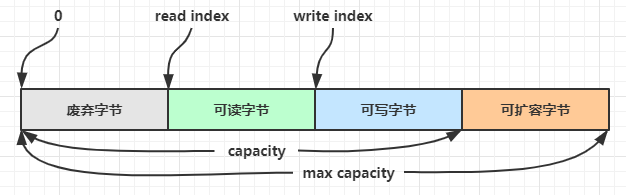

# 概述

> `Netty`是一个异步的，基于事件驱动的网络应用框架，用于快速开发可维护、高性能的网络服务器和客户端。

- `Netty` 底层仍然使用 Java NIO 的同步非阻塞 I/O模型,但 `Netty` 在其之上构建了事件驱动模型、Future/Promise、回调机制，使 I/O 操作对应用层呈现为异步的

**优点**

`Netty`在Java NIO的基础上开发，相比于NIO，`Netty`有以下优势

- `Netty`已经实现了一些应用层常用协议，可以直接使用
- 解决了`TCP`传输问题，如黏包，半包
- `epoll`空轮询导致CPU占用100%问题
- 对Java的API进行了增强，如`FastThreadLocal=>ThreadLocal`,`ByteBuf => ByteBuffer`。

## 相关依赖

**`Netty`**

```xml
        <dependency>
            <groupId>io.netty</groupId>
            <artifactId>netty-all</artifactId>
            <version>4.1.39.Final</version>
        </dependency>
```

## 使用示例

**服务端**

```java
public static void main(String[] args) {
    new ServerBootstrap()
            .group(new NioEventLoopGroup())
            .channel(NioServerSocketChannel.class)
            .childHandler(new ChannelInitializer<NioSocketChannel>() {
                @Override
                protected void initChannel(NioSocketChannel channel) throws Exception {
                    channel.pipeline().addLast(new StringDecoder());
                    channel.pipeline().addLast(new ChannelInboundHandlerAdapter(){

                        @Override
                        public void channelRead(ChannelHandlerContext ctx, Object msg) throws Exception {
                            System.out.println(msg);
                        }
                    });
                }
            })
            .bind(10086);

}
```

**客户端**

```java
    public static void main(String[] args) throws InterruptedException {
        new Bootstrap()
                .group(new NioEventLoopGroup())
                .channel(NioSocketChannel.class)
                .handler(new ChannelInitializer<NioSocketChannel>() {
                    @Override
                    protected void initChannel(NioSocketChannel channel) throws Exception {
                        channel.pipeline().addLast(new StringEncoder());
                    }
                })
                .connect("127.0.0.1",10086)
                .sync()
                .channel()
                .writeAndFlush("hello,world");
    }
```

# `ServerBootstrap`

> `ServerBootstrap`是`Netty`用于创建、配置、启动服务端的启动器。

`ServerBootstrap`可快速进行服务端的相关配置，如:

- **配置线程模型**（BossGroup 接收连接、WorkerGroup 处理读写）。
- **指定服务端 Channel 类型**（如 NioServerSocketChannel）。
- **设置各种 TCP 参数**（如 SO_BACKLOG、SO_KEEPALIVE）。
- **为每个新连接初始化 pipeline**（绑定编解码器和业务 Handler）。
- **负责最终绑定端口并启动 Netty 服务器。**

## 常用方法


# `Bootstrap`

> 与`ServerBootstrap`相似，但`Bootstrap`是`Netty`用于创建、配置、启动客户端的启动器

### 常用方法

**指定处理IO事件的`EventLoopGroup`**

```
Bootstrap group(EventLoopGroup group)
```

**指定客户端使用的`Channel`实现**

```
Bootstrap channel(Class<? extends C> channelClass)
```

**指定IO事件处理器**

```
Bootstrap handler(ChannelHandler handler)
```

- 通常使用`ChannelHandler`的实现类`ChannelInitializer<C extends Channel>`,提供了基本方法的默认实现和抽象`initChannel(C ch)`方法快速为`Channel`添加处理器。

**连接服务器**

```
ChannelFuture connect(String inetHost, int inetPort)
```

- `connect`是一个异步非阻塞方法，调用后会将连接操作交给绑定的`EventLoopGroup`完成
- 因此在调用`connect`后立即获得`Channel`，可能会得到一个未完全建立好连接的`Channel`,需要配合`sync`方法等待连接建立完毕再获得`Channel`。

**关闭连接**

```
ChannelFuture close()
```

- `close`为一个异步方法，由`EventLoopGroup`执行，因此会直接返回一个`ChannelFuture`对象用于监测关闭操作的执行情况

**获得`Channel`的`closeFuture`**

```
ChannelFuture closeFuture()
```

- `closeFuture`是`Channel`中预置的用于监听关闭事件的`ChannelFuture`，可以用它监测`close`事件的执行状况

# `Future`&`Promoise`

> Netty中的`Future`是JDK中`Future`的子接口，对JDK的`Future`进行了增强与扩展。`Promoise`是对Netty`Future`的进一步扩展

- jdk `Future` 只能同步等待任务结束（或成功、或失败）才能得到结果
- netty `Future` 可以同步等待任务结束得到结果，也可以异步方式(即回调函数)得到结果，但是都要等待任务结束
- netty `Promise` 不仅有 netty `Future` 的功能，而且脱离了任务独立存在，只作为两个线程间传递结果的容器

| 功能/名称    | jdk Future                     | netty Future                                                 | Promise      |
| ------------ | ------------------------------ | ------------------------------------------------------------ | ------------ |
| cancel       | 取消任务                       | -                                                            | -            |
| isCanceled   | 任务是否取消                   | -                                                            | -            |
| isDone       | 任务是否完成，不能区分成功失败 | -                                                            | -            |
| get          | 获取任务结果，阻塞等待         | -                                                            | -            |
| getNow       | -                              | 获取任务结果，非阻塞，还未产生结果时返回 null                | -            |
| await        | -                              | 等待任务结束，如果任务失败，不会抛异常，而是通过 isSuccess 判断 | -            |
| sync         | -                              | 等待任务结束，如果任务失败，抛出异常                         | -            |
| isSuccess    | -                              | 判断任务是否成功                                             | -            |
| cause        | -                              | 获取失败信息，非阻塞，如果没有失败，返回null                 | -            |
| addLinstener | -                              | 添加回调，异步接收结果                                       | -            |
| setSuccess   | -                              | -                                                            | 设置成功结果 |
| setFailure   | -                              | -                                                            | 设置失败结果 |
|              |                                |                                                              |              |

## 常用方法

**添加回调函数**

```java
Future<V> addListener(GenericFutureListener<? extends Future<? super V>> listener)
```

**获取结果**

```

```

## `Promise`

> `Promise`是`Netty`中`Future`的增强，除了拥有`Future`的全部功能，还可以主动设置结果

- 相比于 Future 只能被动等待任务执行结束返回结果，Promise 允许开发者在任意时刻主动通过 `setSuccess` / `setFailure` 标记异步操作的完成状态。

**`Promise` 是一个可写的 `Future`，常用来在线程之间传递异步结果。使用`Promise`可以在任意线程、任意时刻主动标记一个异步操作成功或失败，并触发回调。**

### 常用方法

**标记异步操作成功并设置返回结果**

```
Promise<V> setSuccess(V result)
```

**标记异步操作失败并设置异常原因**

```
Promise<V> setFailure(Throwable cause)
```

**`Netty`提供了多个`Promise`的实现应用于不同场景：**

- `DefaultPromise`

  ```java
  public DefaultPromise(EventExecutor executor)//构造方法中的executor为执行回调函数的线程
  ```

  

## `ChannelFuture`

> ChannelFuture 代表一个异步 I/O 操作的结果。

### 常用方法

**获取执行IO操作的`Channel`**

```
Channel channel()
```

**让当前线程阻塞等待异步 I/O 操作完成，并在操作失败时抛出异常。**

```java
ChannelFuture sync()
```

**添加监听器，当异步I/O操作完成时由`EventLoopGroup`调用监听器方法处理结果**

```java
ChannelFuture addListener(GenericFutureListener<? extends Future<? super Void>> listener)
```

- 对于`ChannelFuture`通常使用`GenericFutureListener`的子接口`ChannelFutureListener`。
- 使用`addListener`时无需再使用`sync()`,因为监听器会在I/O操作完成后才被调用

# `EventLoop`

> 由`Netty`定义的一个接口，规定了一个事件循环对象的基本方法。本质是一个单线程执行器,`run`方法会不断处理来自任务队列的任务。

`EventLoop`继承了JUC下的`ScheduledExecutorService`,因此具有线程池的基本方法；同时也继承了`Netty`定义的`OrderedEventExecutor`接口，为其提供了

Netty提供了多种`EventLoop`实现，以执行不同类型的任务：

- `NIOEventLoop`:内部维护了一个`Selector`,`run`方法会不断处理`Channel`的IO事件

## **`EventLoopGroup`**

> `EventLoopGroup`是一组`EventLoop`。

- `EventLoopGroup`实现了`Iterable`接口，具有遍历`EventLoop`的功能

`Channel `一般会调用 `EventLoopGroup` 的 `register` 方法来绑定其中一个 `EventLoop`，后续这个 `Channel` 上的 io 事件都由此` EventLoop` 来处理（保证了 io 事件处理时的线程安全）

## 常用方法

**遍历`EventLoop`**

`EventLoopGroup`实现了`Iterable`接口，具有遍历的能力

```
EventLoop next()
```

- `next`在遍历时是循环的，即当遍历到最后一个`EventLoop`时，下一次又会从第一个`EventLoop`开始遍历。

**关闭`EventLoopGroup`**

```
Future<?> shutdownGracefully()
```

- `EventLoopGroup`实现了`ScheduledExecutorService`,本质是一个线程池，当任务完全结束后，应当关闭这个线程池，否则主线程用于不会停止

**`Nettty`提供了多种`EventLoopGroup`实现：**

- `NioEventLoopGroup`:可以处理IO事件，普通任务，定时任务。
- `DefaultEventLoopGroup`:主要处理普通任务和定时任务

### `NioEventLoopGroup`

### 构造方法

```java
public NioEventLoopGroup(
    int nThreads, 
    Executor executor, 
    EventExecutorChooserFactory chooserFactory, SelectorProvider selectorProvider, SelectStrategyFactory selectStrategyFactory, RejectedExecutionHandler rejectedExecutionHandler, EventLoopTaskQueueFactory taskQueueFactory)
```

- `nThreads`:处理事件的线程数
  - 默认为系统属性`io.netty.eventLoopThreads`的值，如果不存在此属性，则值为`当前CPU核心数的二倍`。
  - 一个线程代表一个`EventLoop`。

# Channel

> `Netty`中的`Channel`相比于`Java NIO`的`Channel`增加了很多功能。

## 常用方法

**关闭`Channel`**

```
close()
```

```
closeFuture()
```

**返回与此`Channel`绑定的管道**

```
ChannelPipeline pipeline()
```

- `pipeline`是`Netty`中专门用于处理通道数据的机制，可以在管道中添加多个处理器对数据进行处理。

**使用通道写数据**

```java
ChannelFuture write(Object msg)
```

- 仅仅将数据写入缓冲区，不会立即刷出数据到实际传输
- 数据的实际传输时机不受控制

**立刻刷出缓冲区的数据**

```
ChannelOutboundInvoker flush()
```

**将数据写入并刷出**

```
ChannelFuture writeAndFlush(Object msg)
```

## `ChannelHandler`

> `ChannelHandler`是用来处理`Channel`上的各种事件的处理器，主要分为`InBoundHandler`(入站处理器，处理沿`socket -> 程序`方向传播的事件)和`OutBoundHandler`(出站处理器，处理沿`程序 ->socket `方向传播的事件)。

### ChannelInboundHandler(入站处理器)

如果要自定义`ChannelInboundHandler`，通常重写其子类`ChannelInboundHandlerAdapter`中的`channelRead`方法。在重写方法的最后要调用父类的`channelRead`方法保证事件继续传递到下一个`Handler`。

`Netty`已经提供了许多不同功能的入站处理器，供开发者快速使用

**`LengthFieldBasedFrameDecoder`**

### ChannelOutboundHandler（出站处理器）

如果需要自定义`ChannelOutboundHandler`,通常重写其子类`ChannelOutboundHandlerAdapter`中的`write`方法。在重写方法的最后要调用父类的`write`方法保证事件继续传递到下一个`Handler`。

**`ChannelHandlerContext`**

> `ChannelHandler`中用于处理事件的方法均会传入一个`ChannelHandlerContext`对象，这个对象封装了当前`Handler`执行的上下文信息，包括对应的`Channel`,此时所处的`handler`等。通过这个对象也可以执行读写操作，但会沿着当前的`Handler`向前或向后执行对应处理器，而不是完整的遍历整个处理器链。

### 常用方法

```
channelActive() //在建立连接后触发
```


## `ChannelPipeline`

> `ChannelPipeline`是用来组织和执行一系列 ChannelHandler 的责任链。

`Pipeline`通过一个双向链表维护内部的处理器。在初始化时，会默认加入两个`Handler`，即`HeadContext`和`TailContext`,其他所有的自定义`Handler`均位于这两个`Handler`之间。

每个`Channel`中都绑定一个`pipeline`,通过`pipeline()`获取。当`Channel`触发IO事件时，会遍历并执行处理器链。

`Pipeline` 会根据 **处理器类型（Inbound / Outbound）** 来决定在事件发生时调用哪些 handler。当处理**socket → 程序**的事件时，`ChannelInboundHandler`类型的处理器会沿着`head -> tail`方法被调用；当处理 **程序 → socket的**事件时，`ChannelOutboundHandler`类型的处理器会沿着`tail -> head`方法被调用

### 常用方法

**添加`Handler`**

```
addLast()
```

## `EmbeddedChannel`

> Netty提供的用于快速测试处理器的`Channel`，通过构造方法可快速构建处理器链，并提供方法模拟入站和出站事件。

- 通过`EmbeddedChannel`,无需再建立客户端和服务端，直接就可以测试处理器效果。

**构造方法**

```java
public EmbeddedChannel(ChannelHandler... handlers)
```

- 传入多个处理器，可快速构建处理器链。

**常用方法**

```
boolean writeInbound(Object... msgs)
```

```
boolean writeOutbound(Object... msgs)
```

**扩容**

扩容规则是

* 如何写入后数据大小未超过 512，则选择下一个 16 的整数倍，例如写入后大小为 12 ，则扩容后 capacity 是 16
* 如果写入后数据大小超过 512，则选择下一个 2^n，例如写入后大小为 513，则扩容后 capacity 是 2^10=1024（2^9=512 已经不够了）
* 扩容不能超过 max capacity 会报错

**池化**

`ByteBuf`的某些实现支持池化功能，类似于连接池的思想，可以重用池中的`ByteBuf`实例，并且采用了与 jemalloc 类似的内存分配算法提升分配效率。高并发时，池化功能更节约内存，减少内存溢出的可能。

池化功能默认开启，可通过JVM环境变量来设置

```
-Dio.netty.allocator.type={unpooled|pooled}
```

- 4.1 以后，非 Android 平台默认启用池化实现，Android 平台启用非池化实现
- 4.1 之前，池化功能还不成熟，默认是非池化实现

**读指针/写指针**

`ByteBuf`中只有两个指针:读指针与写指针。分别用于读操作与写操作。最初，读指针与写指针均位于0，当执行写操作时，写指针后移；当执行读操作时，读指针后移



- 读指针之前区域称为废弃字节
- 读指针与写指针之间的区域称为可读字节
- 写指针与容量之间的区域称为可写字节
- 容量与最大容量之间的区域称为可扩容字节

# ByteBuf

> `ByteBuf`是`Netty`实现的字节缓冲区。

相比于`ByteBuffer`,Netty中的`ByteBuf`进行了一系列增强：

- 动态扩容,在执行写操作时，如果达到容量则自动进行扩容。
- 支持池化功能
- 读写指针分离，使用读指针与写指针进行读写，操作方便
- 支持链式编程
- 多个方法使用零拷贝，如`slice`,`duplicate`等。

## 创建`ByteBuf`

Netty提供了`ByteBufAllocator`接口创建`ByteBuf`,接口中的一个常量提供了其默认实现：

```java
/**ByteBuf的默认容量为默认容量为256，最大容量为int的最大值.*/
//直接内存缓冲区
ByteBufAllocator.DEFAULT.buffer() 
ByteBufAllocator.DEFAULT.buffer(int initialCapacity)
ByteBufAllocator.DEFAULT.buffer(int initialCapacity, int maxCapacity)
ByteBufAllocator.DEFAULT.directBuffer()
//堆内存缓冲区
ByteBufAllocator.DEFAULT.heapBuffer()
```

一般是在`ChannelHandler`中使用`ByteBuf`，更推荐使用`ChannelHandler`方法中自动传入的`ChannelHandlerContext`上下文对象创建`ByteBuf`。

```java
ch.pipeline().addLast(new ChannelInboundHandlerAdapter(){
	@Override
    public void channelRead(ChannelHandlerContext ctx, Object msg) throws Exception {
    	ByteBuf buffer = ctx.alloc().buffer();
        super.channelRead(ctx, msg);
	}
});
```


## 常用方法

`ByteBuf`中的大部分方法均支持链式调用

<h3>写入</h3>

| 方法签名                                                     | 含义                   | 备注                                               |
| ------------------------------------------------------------ | ---------------------- | -------------------------------------------------- |
| writeBoolean(boolean value)                                  | 写入 boolean 值        | 用一字节 01\|00 代表 true\|false                   |
| writeByte(int value)                                         | 写入 byte 值           |                                                    |
| writeShort(int value)                                        | 写入 short 值          |                                                    |
| writeInt(int value)                                          | 写入 int 值            | 大端写入(Big Endian)，即 0x250，写入后 00 00 02 50 |
| writeIntLE(int value)                                        | 写入 int 值            | Little Endian，即 0x250，写入后 50 02 00 00        |
| writeLong(long value)                                        | 写入 long 值           |                                                    |
| writeChar(int value)                                         | 写入 char 值           |                                                    |
| writeFloat(float value)                                      | 写入 float 值          |                                                    |
| writeDouble(double value)                                    | 写入 double 值         |                                                    |
| writeBytes(ByteBuf src)                                      | 写入 netty 的 ByteBuf  |                                                    |
| writeBytes(byte[] src)                                       | 写入 byte[]            |                                                    |
| writeBytes(ByteBuffer src)                                   | 写入 nio 的 ByteBuffer |                                                    |
| int writeCharSequence(CharSequence sequence, Charset charset) | 写入字符串             |                                                    |

- 网络传输，默认习惯是 Big Endian

<h3>读取</h3>

```java
/**readXXX()方法会改变读指针位置*/
readByte() //读取一个字节
readInt() //连续读取四个字节作为一个int返回
/**getXXX()方法读取时不会改变读指针位置

```

```

```

**标记当前读指针**

```
markReaderIndex();
```

**还原读指针**

```
resetReaderIndex();
```

<h3>内存释放</h3>

由于 Netty 中不同`ByteBuf`实现差异很大，因此他们的底层的内存回收方式也各不相同。

* UnpooledHeapByteBuf 使用的是 JVM 堆内存，只需等 GC 回收内存即可
* UnpooledDirectByteBuf 使用的是直接内存，需要特殊的方法来回收内存
* PooledByteBuf 和它的子类使用了池化机制，需要更复杂的规则来回收内存

`Netty`采用引用计数法判断是否回收内存，每个`ByteBuf`均实现了`ReferenceCounted `接口，它提供了引用计数的功能。

- 每个 ByteBuf 对象的初始计数为 1
- 调用 `release` 方法计数减 1，如果计数为 0，ByteBuf 内存被回收
- 调用 `retain` 方法计数加 1，表示调用者没用完之前，其它 handler 即使调用了 release 也不会造成回收
- 当计数为 0 时，底层内存会被回收，这时即使 ByteBuf 对象还在，其各个方法均无法正常使用

`ByteBuf`的基本使用原则是：**谁是最后使用者，谁负责 release**，此时需要在`Handler`中编写：

```java
try {
    ...
} finally {
    buf.release();
}
```

`Pipeline`中默认添加的`HeadContext`（出站事件时）和`TailContext`（入站事件时）处理器会自动对传入的消息进行`release`，但是前提是此时的消息仍然是`ByteBuf`,因此，需要在中间的`Handler`中对不再使用的`ByteBuf`手动`release`。

<h3>其他操作</h3>

**切片**

```java
ByteBuf slice()
```

- 切片后的ByteBuf仍然使用原`ByteBuf`的内存，不会发生内存复制，只是会维护自己独立的读指针与写指针。
- 因此如果对切片的任何一个ByteBuf进行修改，都会影响所有相关的ByteBuf。
- 切片获得的ByteBuf最大容量等于切片长度(同样是担心对切片ByteBuf的修改影响其他ByteBuf)

**复制**

```
ByteBuf duplicate()
```

- 同切片操作，两个`ByteBuf`使用同一块内存，只是维护独立的读写指针。

```
ByteBuf copy()
```

- 会对数据进行深拷贝。

## `CompositeByteBuf`

> 可组合多个ByteBuf的字节缓冲区。

```
ByteBufAllocator.DEFAULT.compositeBuffer()
```

- compositeBuffer可调用`addComponents`方法组合多个`ByteBuf`,底层不会对数据进行复制，仅仅通过修改读写指针实现。

## `Unpooled`

> 一个专用于非池化ByteBuf的工具类，提供了非池化ByteBuf的创建，组合，复制等操作。

### 常用方法

**包装**

将其他数据包装为ByteBuf

```
static ByteBuf wrappedBuffer(ByteBuffer... buffers)
```

- 当包装的ByteBuf超过一个时，底层使用CompositeByteBuf

# 协议

> 协议是客户端与服务端之间进行数据交时必须遵守的的规则集合。

## 自定义协议

自定义协议主要包含以下几个要素

* 魔数，用来在第一时间判定是否是无效数据包
* 版本号，可以支持协议的升级
* 序列化算法，消息正文到底采用哪种序列化反序列化方式，可以由此扩展，例如：json、protobuf、hessian、jdk
* 指令类型，是登录、注册、单聊、群聊... 跟业务相关
* 请求序号，为了双工通信，提供异步能力
* 正文长度
* 消息正文

# 小知识

## Netty解决TCP传输的黏包半包问题

黏包半包问题产生的本质我TCP是一种流式传输协议，消息之间没有边界。因此想要解决就需要人为的为其构建边界。

**短链接**

发送完一个消息后立马断开连接，以连接断开作为消息的边界。

这可以解决黏包问题，但无法解决半包问题

**定长解码器**

`FixedLengthFrameDecoder`由Netty提供的`Handler`，适用于发送消息长度固定的情况，可以截取定长的消息发送给下一个Handler，并将小于定长的消息与后续消息拼接到定长发送给下一个Handler。

**换行符解码器**

`LineBasedFrameDecoder`以换行符作为分隔符分隔消息，` DelimiterBasedFrameDecoder`自定义分隔符来分割消息。

**LTC解码器**

`LengthFieldBasedFrameDecoder`基于四个约定值分隔消息

lengthFieldoffset：长度字段偏移量
lengthFieldLength：长度字段长度
lengthAdjustment：长度字段为基准，还有几个字节是内容
initialBytesToStrip：从头剥离几个字节

