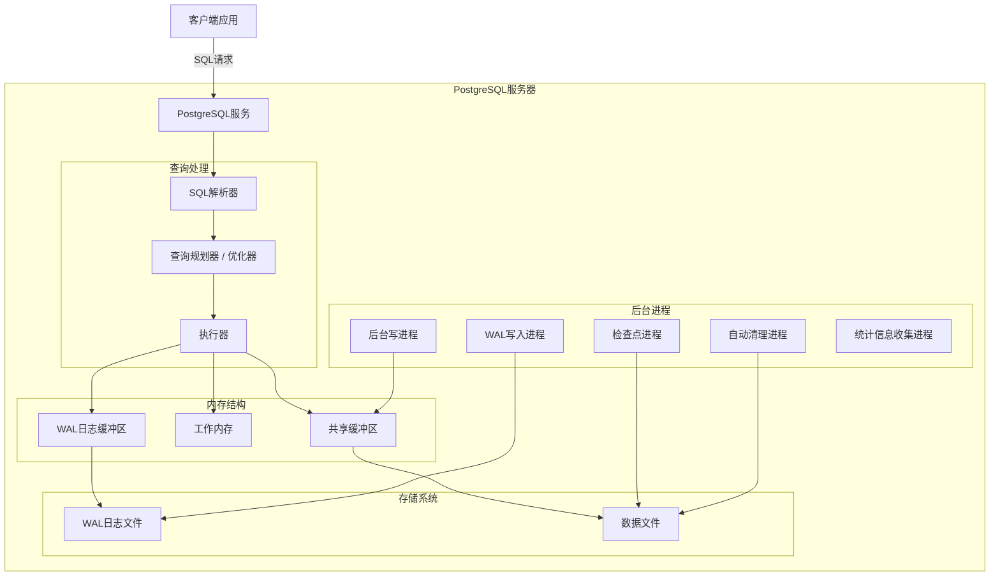

# 概述

`PostgreSQL`是一个开源的关系型数据库管理系统，以其健壮性，灵活性以及对SQL标准的遵从而闻名

## 特点

- **`SQL`能力强：**`postgresql`是最接近 SQL 标准的开源数据库之一，支持大量高级SQL特性，如`CTE`,递归查询，窗口函数等。
- **数据类型丰富：**除了基础数据类型，`postgresql`还扩充了许多高级类型，如`JSONB`,`ARRAY`,`UUID`等，尤其是对`JSON`这种半结构化数据的支持，远强于其他数据库。
- **索引类型丰富：**除了常见的`BTree`,`Hash`等索引，`PostgreSQL`还扩展了`GIN`(倒排索引，用于`JSON`或长文本),`GiST`(常用于空间数据)等索引。
- **扩展能力强：**`PostgreSQL`可以以扩展的形式添加其他功能，如向量数据库，模糊搜索等。
- **事务并发能力强：**`PostgreSQL`使用更成熟的`MVCC`并发模型，设计更加优雅，不需要 undo log，版本直接存储在数据行。
- **企业能力强：**支持主从复制，分区表，行级权限控制等企业级特性。
- **适合复杂系统：**`Postgresql`不仅仅是一个关系型数据库，更是一个可扩展的数据平台，系统引入`PostgreSQL`后，可以通过添加扩展的形式获得向量数据库，时序数据库，GIS数据库，全文搜索 / 模糊搜索等多种强大功能。

## 架构


| 组件       | 作用             |
| ---------- | ---------------- |
| SQL解析器  | 解析SQL语法      |
| 查询规划器 | 生成执行计划     |
| 优化器     | 选择最优查询路径 |
| 执行器     | 执行查询         |

`PostgreSQL`采用多进程模型，而不是线程。在应用启动后，会启动多个后台进程用于不同的后台服务：

- background writer
- wal writer
- autovacuum
- checkpointer

`PostgreSQL`会为每一个客户端连接分配一个`backend process`进程处理客户端请求，这样做的优点是各个客户端连接不会相互影响，崩溃隔离；缺点是成本高，所以通常采用连接池优化。




# 命令

`PostgreSQL`自带命令行工具，命令为

```
psql [OPTIONS]
```

**查看版本**

```
psql --version
```

## 交互式Shell

通过以下命令可以连接`Postgres`服务端，并进入一个交互式界面与服务端进行命令式交互

```
psql -U userName
```

- `-U`表示用户名，默认用户为`postgres`。

<h3>可用命令</h3>

**列出所有表**

```
\dt
```

**查看表的结构**

```
\d table_name
```


# 数据类型

`Postgres`中提供了各种数据类型，分为数值型，字符型，枚举型，日期时间型，布尔型和JSONB等。

- 选择正确的数据类型来存储数据可以确保高效的存储，快速检索和数据完整性。

<h3>数值类型</h3>

用于存储数字。

|                            |            |      |
| :------------------------: | :--------: | ---- |
|         `INTEGER`          |  整数类型  |      |
| `NUMERIC(Precision,Scale)` |  小数类型  |      |
|          `BIGINT`          | 大整数类型 |      |
|         `SMALLINT`         | 小整数类型 |      |

<h3>字符类型</h3>

|                                      |                                              |      |
| :----------------------------------: | :------------------------------------------: | ---- |
| `VARCHAR(n)`/`CHARACTER VARYING(n)`  |              有限长度的字符类型              |      |
|                `TEXT`                |              无限长度的字符类型              |      |
| `CHAR(n)`/`CHARACTER(n)`/`BPCHAR(n)` | 固定长度的字符类型，如果长度不够，会填充空格 |      |

<h3>枚举类型</h3>

## `JSON`类型

`PostgreSQL`对`JSON`的支持是关系型数据库中最强的一类之一。在`Postgresql`中，可以使用`JSONB`或`JSON`两种数据类型存储`JSON`结构化数据，同时还为`JSONB`提供了 **一整套专门的操作符、函数、索引和查询语法**。

**`JSONB`/`JSON`**

|                   |          `JSON`          |              `JSONB`              |
| :---------------: | :----------------------: | :-------------------------------: |
|     存储格式      |      原始文本字符串      |           结构化二进制            |
| 自动去除重复`key` | 存储所有`key`,即使重复了 | 如果`key`重复，只存储它最后一个值 |
|     索引支持      |        不支持索引        |      支持`GIN`和`BTREE`索引       |


<h4>JsonB</h4>

表示二进制JSON,这是在`PostgreSQL`中存储JSON数据的一种更高效且可索引的数据类型。

```
CREATE INDEX inx_name on table USING gin (jsonb_column)
```

- `gin`即为倒排索引，允许快速检索`JSONB`中特定数据

```
CREATE INDEX inx_name ON table USING gin(to_tsvector('engilsh',text_column))
```

# `Schema`(模式)

`Schema` 是`PostgreSQL`中数据库内部的命名空间（namespace），用于在逻辑上对数据库中的表、视图、函数等数据库对象进行分组，并可以对这些对象进行独立的权限管理。

每个新创建的数据库默认都会包含一个名为 `public` 的 `Schema`，该 `Schema` 用于存放默认创建的数据库对象

- `Mysql`中也有`Schema`,但它等同于`Database`的别名。

# SQL

## DQL

<h3>分页查询</h3>

```
SELECT 字段列表 FROM 表名 LIMIT size OFFSET offset;
```


<h3>连接查询</h3>

对多张表做笛卡尔积，即表的每一行与另一张表的每一行进行组合，生成结果集。然后根据表之间的联系用WHERE或JOIN 条件过滤无效结果

**笛卡尔积：**在数学中，笛卡尔积会计算两个集合中元素的所有组合。

SQL 标准定义了多种JOIN操作来描述多表查询的语义

**内连接**

```mysql
#隐式内连接
SELECT 字段列表 FROM 表1,表2[,...] WHERE 条件;
#显示内连接
SELECT 字段列表 FROM 表1 [INNER] JOIN 表2 ON 连接条件;
```

只保留**匹配成功**的行，不符合条件的行直接丢弃

**外连接**

```mysql
#左外连接
SELECT 字段列表 FROM 表1 LEFT [OUTER] JOIN 表2 ON 连接条件;
#右外连接
SELECT 字段列表 FROM 表1 RIGHT [OUTER] JOIN 表2 ON 连接条件;

#全外连接，相比于Mysql不支持全外连接，需使用UNION实现,PostgerSQL直接通过FULL关键字支持全外连接
SELECT 字段列表 FROM 表1 FULL [OUTER] JOIN 表2 ON 连接条件
```

可分为左外连接，右外连接和全外连接：

- 左外连接保留**左表所有行**，与右表匹配不到的行字段值补`NULL`。
- 右外连接保留**右表所有行**，与左表匹配不到的行字段值补`NULL`。
- 全外连接保留两张表中的所有行，匹配不到的行字段补`NULL`，本质就是左外连接和右外连接结果合并后去重。

**自连接**

自连接本质是同一张表和自己做笛卡尔积后根据JOIN或WHERE条件过滤结果，需要为表起两个不同的别名，按需要使用 INNER/OUTER JOIN。

```mysql
SELECT 字段列表 FROM 表 别名1 [INNER] | [LEFT|RIGHT OUTER] JOIN 表 别名2 ON 条件;
```

**交叉连接**

交叉连接没有过滤条件，会直接对多张表做笛卡尔积，生成结果集

```mysql
SELECT 字段列表 FROM 表1 CROSS JOIN 表2
```

# 函数

```
EXTRACT(YEAR FROM AGE(NOW(),hire_date))
```

## 字符串函数

|            |      |      |
| :--------: | ---- | ---- |
| `UPPER()`  |      |      |
| `LOWER()`  |      |      |
| `LENGTH()` |      |      |
| `CONCAT()` |      |      |

# 运算符

## `JSON`操作符

<h3>访问操作符</h3>

**`->`取`JSON`对象**

取`JSON`对象，返回值为`JSON`，适合访问嵌套字段。

- 适用于`JSON`和`JSONB`

```
SELECT JSON_field->'inner_field'
FROM table;
```

**取`JSON`文本**

取`JSON`文本，返回`TEXT`。

```
SELECT JSON_field->'inner_field'
FROM table;
```

**访问`JSON`数组**

```
SELECT JSON_field->->>index
FROM table;
```

- 数组索引从0开始

<h3>查询操作符</h3>

**`key`是否存在**

```
SELECT *
FROM table
WHERE JSON_field ? 'key';
```

**任意`key`存在**

```
SELECT *
FROM table
WHERE JSON_field ?| array['key1','key2'];
```

**全部`key`存在**

```
SELECT *
FROM table
WHERE JSON_field ?& array['key1','key2'];
```

**结构匹配**

```sql
-- JSON_field是否包含右侧结构
SELECT *
FROM table
WHERE JSON_field @> '{"key1":"value1"}';
--作用于JSON数组时，就是表示左侧数组是否包含右侧数组中的所有元素
SELECT *
FROM table
WHERE JSON_field @> '{"key1":["value1","value2"]}';
```


# 关键字

## 查询关键字

<h3><code>DISTINCT</code></h3>

 去除重复记录，只返回唯一的行

```
SELECT DISTINCT column1,[...] FROM table;
```

- 当`DISTINCT`用于多字段时，多个字段同时重复才会去重。

<h3>条件表达式</h3>

## 集合操作关键字

集合关键字用于组合来自不同查询的数据，这要求被合并的`select`语句具有相同数量的列，且对应列具有兼容的数据类型，理想情况下，两个`select`语句列相同且顺序一致。

<h3><code>UNION</code></h3>

`UNION`会合并两个`select`语句的结果集并默认去除重复的记录，即并集

```sql
SELECT xxx from table UNION [ALL] SELECT xxx FROM table;
```

<h3><code>INTERSECT</code></h3>

`INTERSECT`仅返回两个`select`语句中相同的记录，即交集

<h3><code>EXCEPT</code></h3>

返回第一个`select`语句的结果集中存在的而第二个查询中不存在的行，即差集。

## 表相关

### 表约束

表约束与字段约束相似，但表约束声明在创建表时，在所有字段声明之后。

```
create table 表名(	
	字段1 字段类型 [约束] [comment 注释],	
    ....
    字段n 字段类型 [约束]  [comment 注释],
    表约束
) [comment 表注释];
```

|                                                          |          |      |
| :------------------------------------------------------: | :------: | ---- |
|               `PRIMARY KEY(col1,col2...)`                | 联合主键 |      |
| `FOREIGN KEY(col_name) REFERNCES other_table(other_col)` | 外键约束 |      |
|                     `CHECK(表达式)`                      | 检擦约束 |      |


### 其他

<h4>继承</h4>

继承其他表的结构

```
create table xxx() INHERIENTS(table_name);
```


## 字段相关

### 约束

约束是作用于表中字段的规则，用于限制存储在表中的数据，以保证数据库中数据的正确、有效和完整。

约束在建表或修改表中字段时可以通过关键字为字段指定：

```sql
create table 表名(	
	字段1 字段类型 [约束] [comment 注释],	
    ....
    字段n 字段类型 [约束]  [comment 注释] 
) [comment 表注释];
```

常用的约束关键字有：

|                                |          |      |
| :----------------------------: | :------: | ---- |
|         `PRIMARY KEY`          | 主键约束 |      |
|           `NOT NULL`           | 非空约束 |      |
|        `CHECK(表达式)`         | 检查约束 |      |
|            `UNIQUE`            | 唯一约束 |      |
| `REFERENCES table_name(field)` | 外键约束 |      |

### 其他

**`SERIAL`**

本质是 `PostgreSQL` 提供的自增列语法糖，将字段声明为整数类型，并默认从递增序列中获得字段值

```
id SERIAL PRIMARY KEY
```

**`GENERATED ALWAYS AS IDENTITY`**

始终通过自增序列生成字段值，默认情况下不允许手动指定该字段值（除非使用 OVERRIDING SYSTEM VALUE）。

**`GENERATED BY DEFAULT AS IDENTITY`**

默认通过自增序列生成字段值，但在插入数据时可以手动指定该字段的值。

# 序列

序列是数据库中一种用于生成一系列唯一数字的特殊对象，通常用于为`ID`或主键之类的字段进行赋值。

**创建序列**

```
CREATE SEQUENCE sequence_name STRAT WITH start_num INCREMENT BY step MINVALUE min MAXVALUE max [CYCLE] CACHE cache_num;
```

**修改序列**

```
ALTER SEQUENCE sequence_name RESTART WITH start_num
```

**使用序列**

在`SQL`语句中通过`nextval('sequence_name')`使用序列。

```

```

# 视图

```mysql
#基于某个查询创建视图
CREATE VIEW view_name 	AS SELECT子句；
DROP VIEW view_name;
SELECT DEFINITION FROM pg_views WHERE viewname = 'xxx';
```

- 类似于公共表表达式，可以像使用普通表一样使用视图

# 存储过程

存储过程是一个存储在数据库中的预编译的`SQL`逻辑块，可以使用`CALL`语句调用它。

- 存储过程常用于封装复杂操作，如批量插入，审计日志记录或多步骤事务。

```mysql
CREATE PROCEDURE procedure_name(arg1 datetype,...)
LANGUAGE plpgsql
as $$  begin
sql逻辑
end;
$$;

#调用
CALL procedure_name(arguments);
```

# 函数

函数是一个具有命名的`SQL`代码块，可以具有返回结果。它可以在查询中调用，在表达式中使用或被事件触发。

```
CREATE FUNCTION function_name(arg1 datetype,...)
RETURNS return_datatype AS $$
BEGIN
sql逻辑
RETURN value;
END;
$$ LANGUAGE plpgsql;
```

- 函数中不能进行事务操作，而存储过程中可以。
- 函数可以直接在查询中调用

触发器是一种特殊的函数。

# 类型转换

`PostgreSQL`支持显式转换和隐式转换

<h3>显示类型转换</h3>

```
CAST(data AS type)
data::type

```

<h3>隐式类型转换</h3>

对于一些类型而言，它们可以自动的进行转换，而无需显示声明：

- 小整数可以自动转换为大整数
- 整数可以自动转换为浮点数
- 

# 小知识

## DBMS

`DBMS`(Database Management System,数据库管理系统)是一种用于创建、管理和操作数据库的软件，它通过提供统一接口（如SQL）实现对数据的存储、查询、更新和管理。

- 数据库本质就是数据的结构化集合。

`DBMS`根据其数据模型可分为：

<h4><code>RDBMS</code></h4>

关系型数据库,基于关系模型组织数据，使用结构化的二维表存储数据，通过`SQL`进行查询与管理。

<h4><code>NoSQL</code></h4>

非关系型数据库,`NoSQL`意为`Not Only SQL`，使用更灵活的数据结构组织数据，更容易水平扩展。根据`NoSQL`组织数据的形式，可将其细分为：

|   类型    | 数据结构 |
| :-------: | :------: |
| Key-Value |   键值   |
| Document  |   文档   |
|  Column   |   列族   |
|   Graph   |    图    |

