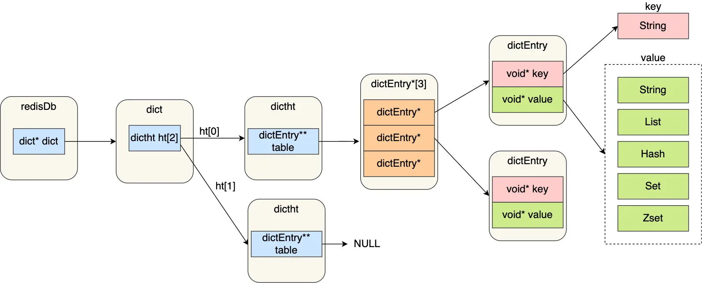
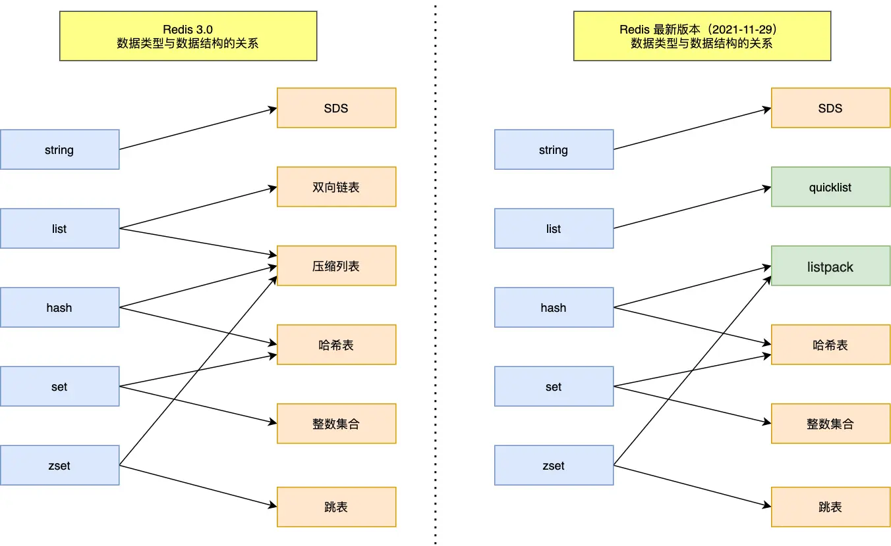
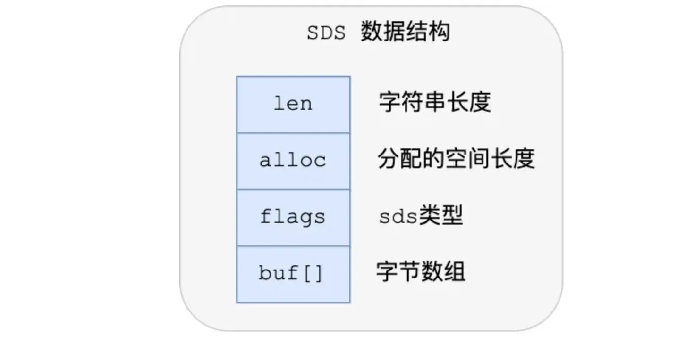
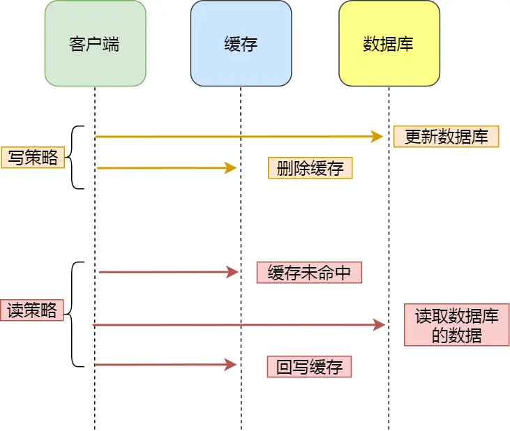

# 概述

全称`Remote Dictionary Server`(远程词典服务器)，是一个基于内存的键值型NoSQL数据库。

## 特点

- 支持多种数据类型，功能丰富
- 命令单线程执行,每个命令具备原子性，保证了数据的一致与安全。
- 低延迟,速度快(因为Redis基于内存,且IO多路复用,具有良好的编码)
- 支持数据持久化
- 支持主从集群,分片集群，哨兵模式等多种集群方案。
- 支持多语言客户端

## 使用场景

- 分布式锁
- 缓存
- 消息中间件
- 数据库

## RESP

`Redis Serialization Protocol`,又称为Redis序列化协议，是Redis底层使用的通信协议。

`Redis`底层使用TCP进行数据传输，`RESP`定义了TCP报文内容的格式，客户端按照`resp`格式发送报文，服务端解析报文后执行命令。

## 安装

### `Centos`系统安装部署

1. Redis基于C语言编写，因此首先需要安装Redis所需的`gcc`依赖

   ```
   yum install -y gcc tcl
   ```

2. 获得Redis的`.tar.gz`安装包并解压

   ```
   tar redis.tar.gz
   ```

3. 进入解压后的目录，编译并安装Redis

   ```
   make && make install
   ```

   - 默认安装在`/usr/local/bin`目录下

安装完成后，可以在任意目录输入`redis-server`命令启动Redis服务端

### Docker安装部署

1. 启动容器

   ```bash
   docker run -d --cap-add sys_resource --name RE \
   	-v /myredis/conf/redis.conf:/usr/local/etc/redis/redis.conf \
   	-p 8443:8443 -p 9443:9443 -p 12000:12000 -p 6379:6379 redis\
     	redis-server /usr/local/etc/redis/redis.conf
   ```

   - 8843为Https接口
   - 9443为REST API 接口
   - 12000端口设置Redis服务端允许客户端连接
   - `redis-server /usr/local/etc/redis/redis.conf`指定redis的配置文件

2. 进入Redis客户端

   ```bash
   docker exec -it <container_name_or_ID> redis-cli -h <host_or_IP> -p <port>
   ```

# 配置

<iframe src=".\resource\redis.conf"/>

- 一行一个配置项,格式为`key value`
- `#`为注释

# 架构

Redis是一个基于内存的键值型数据库，依靠哈希表存储多个键值对。



- `redisDb`：Redis的数据库结构，每一个`redisDb`中有一个`dict`结构，用于存储键值对。Redis默认有16个库，每个库互相独立，使用自己的哈希表存储数据。
- `dict`：字典，内部存放了两个哈希表，通常情况下使用哈希表1存储数据，只有在`rehash`时才会用到哈希表2。

# 数据类型

> Redis是一`个key-value`类型的数据库,其`key`均为`string`类型，`value`为不同应用场景提供了多种数据类型

## KEY

> `key`一般为`String`,但Redis的key允许使用多个单词通过`:`分隔形成层级结构，如

```
项目名:业务名:类型:ID
```

## VALUE

### 基本类型

#### `String`

> 根据字符串的格式不同，可以将字符串分为普通字符串，int(整数类型,可以进行自增自减操作),float(浮点类型,可以进行自增自减操作),字符串的长度不能超过512MB。

**应用场景**

- 缓存对象,可以缓存整个对象的JSON，也可以将key进行分离为`对象:ID:属性`分开缓存,如

  ```
  MSET user:1:name xiaolin user:1:age 18
  ```

- 常规计数，如计算访问次数、点赞、转发、库存数量等。

  - Redis 处理命令是单线程，所以执行命令的过程是原子的，无需担心数据的线程安全问题。

- 分布式锁

- 分布式系统共享Session信息

#### **`Hash`**

> 也称为散列表,即无序字典，是一个`key-value`集合。可以将对象中的每个字段独立存储,针对字段做CRUD

**应用场景**

- 缓存对象，相比于`String`,Hash在缓存对象时，可以针对对象的单个字段作修改，适合缓存数据会频繁变化的对象
- 购物车，以用户id 为` key`，商品id 为`field`，商品数量为`value`，恰好构成了购物车的3个要素
  - 添加商品：`HSET cart:{用户id}{商品id}:1`
  - 添加数量：`HINCRBY cart:{用户id}{商品id} 1`
  - 商品总数：`HLEN cart:{用户id}`
  - 删除商品：：`HDEL cart:{用户id}{商品id}`
  - 获取购物车所有商品：`HGETALL cart:{用户id}`

#### `List`

> 简单的字符串列表，类似双向链表的结构,既支持正向检索，也支持反向检索。最大长度为`2^32-1`。

**特点**

- 有序
- 元素可重复
- 插入和删除快
- 查询速度一般

**应用场景**

- 消息队列

#### `Set`

> 类似Java中的HashSet,一个无序且元素唯一的单列集合。与数学中的集合类似，可以进行交集，并集，差集等运算。一个`Set`中最多可存储`2^32-1`个元素。

**特点**

- 无序
- 元素不可重复
- 查找快
- 支持聚合运算(交集，并集，差集等)

**应用场景**

​	 `Set`天生具有无序且不可重复的特性，因此适合用来数据去重和保障数据的唯一性

- 点赞:可以保证一个用户只能点一个赞
- 共同关注:Set支持交集运算，可以用来计算共同关注的好友，公众号等
- 抽奖活动:`Set`具有去重功能，可以保证一个用户不会中奖两次,通过`SRANDMEMBER`或`SPOP`实现

#### `SortedSet`

> 可排序的set集合，每个元素都由两个值组成，一个是元素值，一个是用于排序的`score`属性值。

- `SortedSet`优先按照`score`由小到大排序，如果`score`相同，则按照字典序排序。
- 字典序即按照字符串的 **字节值（ASCII/UTF-8 字节）**，从左到右逐个比较字符大小，谁小谁排在前面。如果前缀相同，则长的字符串字典序更大。

**特点**

- 可排序
- 元素不重复
- 查询速度快

**应用场景**

- 排行榜
- 延迟任务队列：任务ID作为元素，任务执行时间戳作为`score`，不断查询分数小于当前时间戳的任务。

### 特殊类型

#### `BitMap`

> 位图，是一串连续的二进制数，用二进制数的每一位(0/1)表示一个元素的值或状态。

- 在Redis2.2版本新增的数据类型
- `BitMap`中的Bit位默认是0

**应用场景**

​	位图的一个bit表示一个元素,一个bit的状态有两种，因此位图特别适合数据量大且使用二值统计的场景

- 签到统计
- 判断用户登陆状态:通过一个`BitMap`存储所有用户登录状态，以用户Id作为`offset`
- 统计连续签到用户总数:以每天所有用户签到状态作为一个key，用户Id为`offset`，将多天的`BitMap`作与运算并统计其中1的个数。

#### `HyperLogLog`

> 简称HLL，是一种用于基数统计的集合数据类型，能够在极小的内存占用下，近似统计一个超大集合中不重复元素的数量，误差率在0.81%内。在Redis中基于string实现

- 在Redis2.8版本新增的数据类型
- 单个HLL的内存永远小于16kb。

**应用场景**

- 百万级网页UV计数

#### `GEO`

> Geolocation的简写，用于存储地理坐标信息，根据经纬度检索数据。

- 在Redis3.2版本新增的数据类型

#### `Stream`

> 专门为消息队列设计的数据类型

- 在Redis5.0版本新增的数据类型

# 数据结构



> Redis使用纯c语言编写。不论是`key`还是`value`，在底层都会被统一封装为一个`redisObject`结构体对象。这个对象不直接存储数据,而是存储数据相关的数据类型，底层编码方式以及指向数据真实地址的指针等元信息。

## `redisObject`

**关键字段**

|    字段    |                        含义                         |
| :--------: | :-------------------------------------------------: |
|   `type`   | 指明对象的数据类型（string、list、set、zset、hash） |
| `encoding` |       指明底层编码方式（不同类型有不同编码）        |
| `refcount` |           引用计数（用于对象复用与释放）            |
|   `ptr`    |  指向真正的数据结构（例如 SDS、dict、ziplist 等）   |
|   `lru`    |      最近一次被访问的时间戳，用于实现内存淘汰       |

## `String`

> `String`底层的数据结构实现主要是`long long`和`SDS`(简单动态字符串)。
>
> 字符串对象的编码方式可以为`int`,`raw`,`embstr`

​	如果字符串为一个整数，则直接使用c语言原生的`long long`类型存储,编码方式为`int`。此时`ptr`字段直接保存数据，而不是指向数据的指针


​	如果字符串是一个长度小于等于 32 字节的字符串,将使用一个简单动态字符串（SDS）来保存这个字符串，编码方式为`embstr`。


​	如果字符串是一个长度大于32字节的字符串,将使用一个简单动态字符串（SDS）来保存这个字符串，编码方式为`raw`。


- `embstr`编码是专门用于保存短字符串的一种优化编码,不同Redis版本`embstr`与`raw`的阈值不同
  - redis 2.+是32字节
  - redis 3.0-4.0 是 39字节
  - redis 5.0 是44字节。

------

​        `embstr`和`raw`编码都会使用`SDS`来保存值，但不同之处在于`embstr`会通过一次内存分配函数来分配一块连续的内存空间来保存`redisobject`和`sDs`，而`raw`编码会通过调用两次内存分配函数来分别分配两块空间来保存`redisobject`和`SDS`。这样做的优点是:

- embstr编码将创建字符串对象所需的内存分配次数从raw编码的两次降低为一次;
- 释放embstr编码的字符串对象同样只需要调用一次内存释放函数；
- 因为embstr编码的字符串对象的所有数据都保存在一块连续的内存里面可以更好的利用CPU缓存提
  升性能。

​        但是`embstr`编码也有缺点,如果字符串的长度增加需要重新分配内存时，整个redisObject和sds都需要重新分配空间，所以embstr编码的字符串对象实际上是只读的。当我们对embstr编码的字符串对象执行任何修改命（例如append）时，程序会先将对象的编码从embstr转换成raw，然后再执行修改命令。

### `SDS`

> Simple Dynamic String,简单动态字符串，由Redis实现的用于存储字符串的数据结构。



<h4>SDS相比于C语言原生字符串的优点</h4>

- `SDS`不仅可以保存文本数据，还可以保存二进制数据。因为`SDS`使用`len`属性而不是空字符来判断字符串是否结束
- `SDS`获取字符串长度的时间复杂度为O(1)。`SDS`结构里使用`len`属性记录字符串的长度
- Redis的`SDS`API是安全的，拼接字符串不会造成缓冲区溢出。SDS中会记录字符数据的实际长度，在拼接字符串之前会检查空间是否满足要求，如果空间不够会自动扩容，所以不会导致缓冲区溢出的问题。
- `SDS`具有多种类型，分别为`sdshdr5`,`sdshdr8`,`sdshdr16`,`sdshdr32`和`sdshdr64`。

## `List`

在redis3.2前，List底层使用双向链表或压缩列表实现:

- 如果列表的元素个数小于512个(默认值，可由`list-max-ziplist-entries`配置），列表每个元素
  的值都小于64字节(默认值，可由`list-max-ziplist-value`配置），Redis会使用压缩列表作为
  List类型的底层数据结构；
- 如果列表的元素不满足上面的条件，Redis会使用双向链表作为List类型的底层数据结构；

从Redis3.2版本开始，List底层数据结构就只由`quciklist`实现。

## `Hash`

在Redis7.0前，`Hash`底层使用压缩列表或哈希表实现:

- 如果`Hash`的字段个数小于512个(默认值，可由`hash-max-ziplist-entries`配置），且所有字段值小于
  64字节(默认值，可由`hash-max-ziplist-value`配置）的话，Redis会使用压缩列表作为 Hash类型的底层数据结构；
- 如果`Hash`不满足上面条件，Redis会使用哈希表作为Hash类型的底层数据结构。

从Redis7.0开始，`Hash`由`listpack`和哈希表实现。

## `Set`

> `Set`底层使用哈希表或整数集合实现

​	如果集合中的元素都是整数且元素个数小于512（默认值，`set-maxintset-entries`配置）个，Redis会使用整数集合作为Set类型的底层数据结构；

​	如果集合中的元素不满足上面条件，则Redis使用哈希表作为Set类型的底层数据结构。

## `SortedSet`

在Redis7.0前，`SortedSet`底层由压缩列表或跳表 + 哈希表实现。

- 如果有序集合的元素个数小于128个，并且每个元素的值小于64字节时，Redis会使用压缩列表作为`SortedSet`类型的底层数据结构；
- 如果有序集合的元素不满足上面的条件，Redis会使用跳表加哈希表作为Zset类型的底层数据结构；

从Redis7.0开始，`SortedSet`如果集合较小，则由`listpack`代替压缩列表；当`Zset`中存储大集合时，底层使用跳表加哈希表，这样的好处是既能进行高效的范围查询，也能进行高效的单点查询。使用跳表，可以快速进行范围查询；使用哈希表，可以以常数复杂度获取元素权重

### `skiplist`

> 跳表，在链表的基础上改进而来，实现了一种多层的有序链表。Redis中只有`Zset`底层使用到了跳表

**优点**

- 支持平均`O(logN)`的时间复杂度查找节点

<h4>为什么<code>Redis</code>底层采用跳表而不是平衡树实现<code>ZSET</code></h4>

跳表是一个多层链表，可以以平均`O(log n)`的时间复杂度查询数据，具有以下优点：

- **实现简单：**无需复杂的平衡操作，插入和删除无需调整整体结构，仅需修改局部指针
- **内存结构灵活：**跳表的内存占用可通过每个结点的指针数目灵活控制，且一般小于平衡树。
- **范围查询友好：**跳表在进行范围查询时实现简单，只需要找到小值后沿第一层链表遍历若干步即可。
- **读写性能平衡：**平衡树读性能高，但写时需要复杂的平衡操作。跳表读写性能平衡。

## `BitMap`

## `GEO`

> GEO底层直接使用ZSET，使用 `GeoHash` 编码方法实现了经纬度到 `Sorted Set` 中元素权重分数的转换

# 命令

## 通用命令

> 通用命令适用于所有类型的`value`

**过期时间相关**

```
EXPIRE key seconds [NX|XX|GT|LT]
```

```
PEXPIRE key milliseconds [NX|XX|GT|LT]
```

- 为`key`设置过期时间，单位为`ms`。

```
EXPIREAT key unix-time-seconds [NX|XX|GT|LT]
```

- 设置`key`在某个时间戳后过期，时间戳精确到秒

```
PEXPIREAT key unix-time-milliseconds [NX|XX|GT|LT]
```

- 设置`key`在某个时间戳后过期，时间戳精确到毫秒

```
TTL key
```

- 查询`key`的剩余过期时间，单位为秒
- 返回`-2`表示key已到期或不存在，返回`-1`表示`key`永不过期

```
PERSIST key
```

- 取消`key`的过期时间。

```
KEYS pattern
```

- 查看符合模板的所有key

- `pattern`参数支持通配符,`*`可匹配任何符号

```
DEL key [key...]
```

- 删除一个指定的key

- 判断key是否存在

  ```
  EXISTS key [key...]
  ```

  - 返回存在的`key`的个数

- 给一个key设置有效期，有效期到期时该key会被自动删除

  ```
  EXPIRE key seconds [NX|XX|GT|LT]
  ```

  - 如果key存在,设置成功，返回1;如果key不存在，设置失败,返回0

- 查看一个KEY的剩余有效期

  ```
  TTL key
  ```

  - 返回`-1`表示key永久有效,`-2`表示不存在key,正整数表示key的剩余有效期

## String类型命令

> 只可以用于`value`为`String`类型的键值对

- 添加或者修改已经存在的一个String类型的键值对

  ```
  SET key value [NX|XX] [GET] [EX seconds|PX milliseconds|EXAT unix-time-seconds|PXAT unix-time-milliseconds|KEEPTTL]
  ```

  - `NX|XX`：`NX`选项为key不存在才执行,`XX`选项为key存在才执行
  - GET：返回旧值
  - `EX|PX`：两个选项均是为键值对设置过期时间，`EX`单位时间为秒,`NX`单位时间为毫秒
  
- 根据key获取String类型的value

  ```
  GET key
  ```

- 批量添加多个String类型的键值对

  ```
   MSET key value [key value ...]
  ```

- 根据多个key获取多个String类型的value

  ```
  MGET key [key...]
  ```

- 指定一个整型的key自增1,如果key不存在则创建key并以0为初始值

  ```
  INCR key
  ```

- 让一个整型的key自增并指定步长,如果key不存在则创建key并以0为初始值

  ```
  INCRBY key increment
  ```

- 让一个浮点类型的数字自增并指定步长

  ```
  INCRBYFLOAT key increment
  ```

- 如果key不存在,添加一个String类型的键值对，否则不执行

  ```
   SETNX key value
  ```

- 添加一个String类型的键值对，并且指定有效期

  ```
  SETEX key seconds value
  ```
  
- 返回 key 所储存的字符串值的长度

  ```
  STRLEN key
  ```

- 将 key 中储存的数字值减一

  ```
  DECR key
  ```

- 让一个整型的key自减并指定步长,如果key不存在则创建key并以0为初始值

  ```
  DECRBY key decrement
  ```

  

## Hash类型命令

- 判断一个Hash类型的key中是否存在某一字段

  ```
  HEXISTS key field
  ```

- 添加或者修改hash类型key的field的值,返回设置的字段数

  ```
  HSET key field value [field value ...]
  ```

- 获取一个hash类型key的field的值

  ```
  HGET key field
  ```

- 批量添加多个hash类型key的field的值

  ```
  HMSET key field value [field value ...]
  ```

- 批量获取多个hash类型key的field的值

  ```
  HMGET key field [field ...]
  ```

- 获取一个hash类型的key中的所有的field和value

  ```
  HGETALL key
  ```

- 获取一个hash类型的key中的所有的field

  ```
  HKEYS key
  ```

- 获取一个hash类型的key中的所有的value

  ```
  HVALS key
  ```

- 获取`Hash`key中field的数量

  ```
  HLEN key
  ```

- 让一个hash类型key的字段值自增并指定步长

  ```
  HINCRBY key field increment
  ```

- 添加一个hash类型的key的field值，如果field已存在，则不执行

  ```
  HSETNX key field value
  ```

## List类型

- 向列表左侧插入一个或多个元素

  ```
  LPUSH key element [element ...]
  ```

- 移除并返回列表左侧的第一个元素，没有则返回nil。如果为列表的最后一个元素，则删除列表并返回元素

  ```
  LPOP key [count]
  ```

  - 如果加入count则移除并返回count个元素

- 向列表右侧插入一个或多个元素

  ```
  RPUSH key element [element ...]
  ```

- 移除并返回列表右侧的第一个元素

  ```
  RPOP key [count]
  ```

  - 如果加入count则移除并返回count个元素

- 返回一段角标范围内的所有元素

  ```
  LRANGE key start stop
  ```

  - 列表索引从1开始

- 同`LPOP`与`RPOP`,但可以监听多个key,如果存在元素则取出,如果不存在，则等待`timeout`

  ```
  BLPOP key [key ...] timeout
  BRPOP key [key ...] timeout
  ```
  
  - 如果timeout等于0则一直阻塞
  
- 在取出元素的同时将元素放入另一个List中备份

  ```
  BRPOPLPUSH source destination timeout
  ```

  


## Set类型命令

- 向set中添加一个或多个元素

  ```
  SADD key member [member ...]
  ```

- 移除set中的指定元素

  ```
  SREM key member [member ...]
  ```

- 返回set中元素的个数

  ```
  SCARD key
  ```

- 判断一个元素是否存在于set中,存在返回1,不存在返回0

  ```
  SISMEMBER key member
  ```

- 获取set中的所有元素

  ```
  SMEMBERS key
  ```

- 从集合key中随机选出count个元素，元素不从key中删除

  ```
  SRANDMEMBER key [count]
  ```

- 从集合key中随机选出count个元素，元素从key中删除

  ```
  SPOP key [count]
  ```

- 求多个Set的交集

  ```
  SINTER key [key ...]
  ```

- 将交集结果存入新集合destination中

  ```
  SINTERSTORE destination key [key ...]
  ```

- 求多个Set的差集

  ```
  SDIFF key [key ...]
  ```

  - 即求第一个key中存在，而后边的多个key中不存在的元素

- 将差集结果存入新集合destination中

  ```
  SDIFFSTORE destination key [key ...]
  ```

- 求多个Set的并集

  ```
  SUNION key [key ...]
  ```
  
- 将并集结果存入新集合destination中

  ```
  SUNIONSTORE destination key [key ...]
  ```

## SortedSet相关命令

- 添加一个或多个元素到sortedset ，如果已经存在则更新其score值

  ```
  ZADD key [NX|XX] [GT|LT] [CH] [INCR] score member [score member ...]
  ```

- 删除sorted set中的指定元素

  ```
  ZREM key member [member ...]
  ```

- 获取sorted set中的指定元素的score值

  ```
  ZSCORE key member
  ZMSCORE key member [member...]
  ```

- 获取sorted set 中的指定元素的排名

  ```
  ZRANK key member [WITHSCORE]
  ```

- 获取sorted set 中的指定元素的排名(降序)

  ```
  ZREVRANK key member [WITHSCORE]
  ```

- 获取sorted set中的元素个数

  ```
  ZCARD key
  ```

- 统计score值在给定范围内的所有元素的个数

  ```
   ZCOUNT key min max
  ```

- 让`sortedset`中的指定元素的`score`自增，步长为指定的`increment`值

  ```
  ZINCRBY key increment member
  ```

  - 如果`key`或`member`不存在，则自动创建，并对`score`(默认为0)自增`increment`。

- 按照score排序后，获取指定排名范围内的元素

  ```
  ZRANGE key start stop [BYSCORE|BYLEX] [REV] [LIMIT offset count] [WITHSCORES]
  ```

- 按照score排序后，获取指定score范围内的元素

  ```
  ZRANGEBYSCORE key min max [WITHSCORES] [LIMIT offset count]
  ```

- 返回指定成员区间内的成员，按字典正序排列, 分数必须相同。

  ```
  ZRANGEBYLEX key min max [LIMIT offset count]
  ```

  - 为了能够灵活使用字典序排序，Redis定义了一些特殊字符标定字典序的范围

    | 特殊字符 | 作用说明                    | 示例   | 含义                                              |
    | -------- | --------------------------- | ------ | ------------------------------------------------- |
    | `[`      | **包含边界（inclusive）**   | `[abc` | 从 `"abc"` 开始，包含 `"abc"`                     |
    | `(`      | **不包含边界（exclusive）** | `(abc` | 从大于 `"abc"` 的下一个字符串开始，不包含 `"abc"` |
    | `-`      | **字典序最小值（负无穷）**  | `-`    | 表示所有可能的最小字符串之前，无限小              |
    | `+`      | **字典序最大值（正无穷）**  | `+`    | 表示所有可能的最大字符串之后，无限大              |

- 求差集、交集、并集,相同的元素`score`相加

  ```
  ZINTER numkeys key [key ...] [WEIGHTS weight [weight ...]] [AGGREGATE SUM|MIN|MAX] [WITHSCORES]
  ZUNION numkeys key [key ...] [WEIGHTS weight [weight ...]] [AGGREGATE SUM|MIN|MAX] [WITHSCORES]
  ZDIFF numkeys key [key ...] [WITHSCORES]
  ```

## 其他命令

- 进入Redis命令行客户端

  ```
  redis-cli [OPTIONS] [COMMANDS]
  ```

  - `-h`:指定连接的IP地址，默认本机
  - `-p`:指定连接端口,默认6379
  - `-a`:指定Redis访问密码
  - `[COMMAND]`:如果有`COMMAND`,则不进入`redis-cli`控制台，直接执行命令,否则进入`redis-cli`交互控制台。命令可以是任何可以在`redis-cli`中执行的命令

- 进入`Redis-cli`后指定连接密码

  ```
  AUTH [USERNAME] [PASSWORD]
  ```

- 与Redis服务端心跳测试

  ```
  PING
  ```

  - 服务端正常返回pong

- 查看命令帮助文档

  ```
  HELP [COMMAND]|[@GROUP]
  ```

- 启动Redis服务端

  ```
  redis-server [conf_file]
  ```

  - 通过`[conf_file]`指定加载的配置文件，如果不指定则使用默认值

- 启动Redis哨兵

  ```
  redis-sentinel
  ```
  
- 运行Lua脚本

  ```
  EVAL script numkeys [key [key ...]] [arg [arg ...]]
  ```

  - `script`:要执行的Lua脚本，可以是一段Lua代码，也可以是一个`.lua`文件
  - `numkeys`:key的数量,用以与`arg`区分
  - `key`与`arg`会被分别封装到`KEYS`与`ARGV`数组中,可以通过数组在脚本中获取,Lua中的数组索引从1开始
  
- 主进程执行RDB持久化

  ```
  save
  ```

  - 由主进程来执行RDB，会阻塞所有命令

- 后台进程执行RDB持久化

  ```
  bgsave
  ```

  - 开启一个子进程执行RDB，避免主进程受到影响

  ```
  config 
  ```


**获取Redis服务端的信息和统计数据**

```
INFO [section [section ...]]
```

- `section`：用于按模块过滤信息

**初始化客户端连接与协议协商**

```
HELLO [protover [AUTH username password] [SETNAME clientname]]
```

- `protover`：协议版本，默认为2，可选值为2或3

- `[AUTH username password]`：可选，用于认证

- `[SETNAME clientname]`：可选，用于设置客户端名字


## GEO类型命令

- GEOADD

  > 添加一个地理空间信息，包含经度(longitude)，纬度(latitude)，值(member)

  ```
  GEOADD key [NX|XX] [CH] longitude latitude member [longitude latitude member ...]
  ```

- GEODIST

  > 计算指定的两个点之间的距离并返回

  ```
  GEODIST key member1 member2 [M|KM|FT|MI]
  ```

- GEOHASH

  > 将指定member的坐标转换欸hash字符串并返回

  ```
  GEOHASH key [member [member ...]]
  ```

- GEOPOS

  > 返回指定member的坐标

  ```
  GEOPOS key [member [member ...]]
  ```

- GEORADIUS

  > 指定圆心，半径，找到该园内包含的所有member，并按照与圆心的距离排序后返回。6.2后已废弃

- GEOSEARCH

  > 在指定范围内搜索member，并按照与指定点之间的距离排序后返回。范围可以是圆形或矩形。6.2启用

  ```bash
  GEOSEARCH key FROMMEMBER member|FROMLONLAT longitude latitude BYRADIUS radius M|KM|FT|MI|BYBOX width height M|KM|FT|MI [ASC|DESC] [COUNT count [ANY]] [WITHCOORD] [WITHDIST] [WITHHASH]
  ```

- GEOSEARCHSTORE

  > 与GEOSEARCH功能一致，但是可以把结果存储到一个指定的key
  
  ```
  GEOSEARCHSTORE destination source FROMMEMBER member|FROMLONLAT longitude latitude BYRADIUS radius M|KM|FT|MI|BYBOX width height M|KM|FT|MI [ASC|DESC] [COUNT count [ANY]] [STOREDIST]
  ```

## BitMap命令

- `SETBIT`

  > 向指定位置（offset）存入一个0或1

  ```
  SETBIT key offset value
  ```

  - 如果不连续存储,则中间未指定的值默认填充0
  - 结果返回此Bit位原本的信息

- `GETBIT`

  > 获取指定位置（offset）的bit值

  ```
   GETBIT key offset
  ```

- `BITCOUNT`

  > 统计BitMap中值为1的bit位的数量

  ```
  BITCOUNT key [start end [BYTE|BIT]]
  ```

- `BITFIELD`

  > 操作（查询、修改、自增）BitMap中bit数组中的指定位置（offset）的值

  ```
  BITFIELD key [GET encoding offset|[OVERFLOW WRAP|SAT|FAIL] SET encoding offset value|INCRBY encoding offset increment [GET encoding offset|[OVERFLOW WRAP|SAT|FAIL] SET encoding offset value|INCRBY encoding offset increment ...]]
  ```

  `encoding`:指定返回结果的符号与位数,`u`代表无符号,`i`代表有符号,如`u2`代表返回无符号二位

- `BITFIELD_RO`

  > 获取BitMap中bit数组，并以十进制形式返回

  ```
  BITFIELD_RO key [GET encoding offset [GET encoding offset ...]]
  ```

- `BITOP`

  > 将多个BitMap的结果做位运算（与 、或、异或）

  ```
  BITOP AND|OR|XOR|NOT|DIFF|DIFF1|ANDOR|ONE destkey key [key ...]
  ```

- `BITPOS`

  > 查找bit数组中指定范围内第一个0或1出现的位置
  
  ```
  BITPOS key bit [start [end [BYTE|BIT]]]
  ```
## HyperLogLog

**UV**

> Unique Visitor，独立访客量，指一天访问网站的用户个数，同一用户多次访问只记录一次

**PV**

> Page View,也叫页面访问量或点击量，用户每访问网站的一个页面	，则记录一次，多次访问则记录多次。

- 添加元素

  ```
  PFADD key [element [element ...]]
  ```

- 返回基数估算值

  ```
  PFCOUNT key [key ...]
  ```

- 将多个key合并为一个

  ```
  PFMERGE destkey [sourcekey [sourcekey ...]]
  ```

# 哨兵

> 

# Java客户端

> Redis官方提供了多种适用于Redis的Java客户端

|     客户端      |                             简介                             |
| :-------------: | :----------------------------------------------------------: |
|      Jedis      | 以Redis命令作为方法名称，学习成本低，简单实用。但是Jedis实例是线程不安全的，多线程环境下需要基于连接池来使用 |
|     lettuce     | Lettuce是基于Netty实现的，支持同步、异步和响应式编程方式，并且是线程安全的。支持Redis的哨兵模式、集群模式和管道模式。 |
|    Redisson     | Redisson是一个基于Redis实现的分布式、可伸缩的Java数据结构集合。包含了诸如Map、Queue、Lock、 Semaphore、AtomicLong等强大功能 |
| SpringDataRedis | Spring对Redis不同客户端的整合，提供了统一的类使用不同客户端操作Redis |

## Jedis

### 相关依赖

- Jedis

  ```xml
          <dependency>
              <groupId>redis.clients</groupId>
              <artifactId>jedis</artifactId>
              <version>5.2.0</version>
          </dependency>
  ```

- 单元测试

  ```xml
          <dependency>
              <groupId>org.junit.jupiter</groupId>
              <artifactId>junit-jupiter</artifactId>
              <version>5.10.2</version>
              <scope>test</scope>
          </dependency>
  ```

### 快速使用

```java
@BeforeEach
    public void setUp() {
    	//指定连接地址
        jedis = new Jedis("172.31.85.64",6379);
        //指定连接密码,如果没有密码则省略
        jedis.auth("123321");
        //指定连接的库
        jedis.select(0);
    }
    @Test
    public void start() {
        jedis.set("heima:user:1","小李");
    }
    @AfterEach
    public void close() {
        jedis.close();
    }
```

### 连接池

> Jedis本身线程不安全，并且频繁创建和销毁连接会有性能损耗，更推荐使用Jedis连接池替换默认连接方式。

```java
public class JedisConnectionFactory {
    private static final JedisPool jedisPool;
    static {
        JedisPoolConfig jedisPoolConfig = new JedisPoolConfig();
        // 最大连接
        jedisPoolConfig.setMaxTotal(8);
        // 最大空闲连接
        jedisPoolConfig.setMaxIdle(8); 
        // 最小空闲连接
        jedisPoolConfig.setMinIdle(0);
        // 设置最长等待时间， ms
        jedisPoolConfig.setMaxWaitMillis(200);
        jedisPool = new JedisPool(jedisPoolConfig, "192.168.150.101", 6379,
                                  1000, "123321");
    }
    // 获取Jedis对象
    public static Jedis getJedis(){
        return jedisPool.getResource();
    }
}

```

## SpringDataRedis

> SpringData是Spring中用于数据操作的模块，包含了对各种数据库的集成,其中对Redis的集成模块为SpringDataRedis。

**特点**

- 提供了对不同Redis客户端的整合（Lettuce和Jedis）
- 提供了RedisTemplate统一API来操作Redis
- 支持Redis的发布订阅模型
- 支持Redis哨兵和Redis集群
- 支持基于Lettuce的响应式编程
- 支持基于JDK、JSON、字符串、Spring对象的数据序列化及反序列化
- 支持基于Redis的JDKCollection实现

### 相关依赖

- SpringDataRedis的SpringBoot自动装配依赖

  ```xml
  <!--Redis依赖-->
  <dependency>
      <groupId>org.springframework.boot</groupId>
      <artifactId>spring-boot-starter-data-redis</artifactId>
  </dependency>
  ```

- 连接池依赖

  ```xml
  <!--连接池依赖-->
  <dependency>
      <groupId>org.apache.commons</groupId>
      <artifactId>commons-pool2</artifactId>
  </dependency>
  ```

- Jackson

  ```xml
  <dependency>
  	<groupId>com.fasterxml.jackson.core</groupId>
  	<artifactId>jackson-databind</artifactId>
  </dependency>
  ```

  - 当使用jackson系列的序列化器时需要引入

### 配置

```yml
spring:
  application:
    name: redis-demo
  data:
    redis:
      host: 172.31.85.64
      port: 6379
      database: 0
      password: 123321
      lettuce:
        pool:
          max-active: 8 # 最大连接
          max-idle: 8 # 最大空闲连接
          min-idle: 0 # 最小空闲连接
          max-wait: 100ms # 连接等待时间
```

- 配置连接池后自动生效
- 配置后会将`RedisTemplate`注入容器，可以通过自动注入获得

### RedisTemplate

> SpringDataRedis中专门用于操作Redis数据库的工具类，提供了不同方法,可以根据所操作数据类型获得不同的操作对象。

|             **API**             | **返回值类型**  |        **说明**        |
| :-----------------------------: | :-------------: | :--------------------: |
| **redisTemplate**.opsForValue() | ValueOperations | 操作String与BitMap数据 |
| **redisTemplate**.opsForHash()  | HashOperations  |    操作Hash类型数据    |
| **redisTemplate**.opsForList()  | ListOperations  |    操作List类型数据    |
|  **redisTemplate**.opsForSet()  |  SetOperations  |    操作Set类型数据     |
| **redisTemplate**.opsForZSet()  | ZSetOperations  | 操作SortedSet类型数据  |
|        **redisTemplate**        |                 |       通用的命令       |

- 由于`BitMap`底层使用`string`进行存储，因此其API也被封装在`ValueOperations`中

**通用命令**

- 执行lua脚本

  ```java
  // <T> T execute(RedisScript<T> var1, List<K> var2, Object... var3)
   private static final DefaultRedisScript<Long> SCRIPT;
      static {
          SCRIPT = new DefaultRedisScript<>();
          SCRIPT.setLocation(new ClassPathResource("seckill.lua"));
      }
   Long result = redisTemplate.execute(SCRIPT, Collections.emptyList(), voucherId, UserHolder.getUser().getId());
  ```


#### 序列化

> RedisTemplate默认使用JDK的序列化器(即ObjectOutputStream)对`key`与`value`进行序列化。建议`key`使用`StringRedisSerializer`,`value`使用`GenericJackson2JsonRedisSerializer`

```java
@Bean
public RedisTemplate<String, Object> redisTemplate(RedisConnectionFactory redisConnectionFactory)
    throws UnknownHostException {
    // 创建Template
    RedisTemplate<String, Object> redisTemplate = new RedisTemplate<>();
    // 设置连接工厂
    redisTemplate.setConnectionFactory(redisConnectionFactory);
    // 设置序列化工具
    GenericJackson2JsonRedisSerializer jsonRedisSerializer = 
					new GenericJackson2JsonRedisSerializer();
    // key和 hashKey采用 string序列化
    redisTemplate.setKeySerializer(RedisSerializer.string()); 
    redisTemplate.setHashKeySerializer(RedisSerializer.string());
    // value和 hashValue采用 JSON序列化
    redisTemplate.setValueSerializer(jsonRedisSerializer);
    redisTemplate.setHashValueSerializer(jsonRedisSerializer);
    return redisTemplate;
}
```

- 此时不能使用容器自动注入的RedisTemplate,可以手动注入一个RedisTemplate。
- RedisConnectionFactory为框架自动注入的Bean

------

**Json序列化器为了在反序列化时可以知道对象的类型，会将类的全类名同样存入Redis，会带来额外的内存开销**

- 为了节省内存，通常对`key`与`value`统一使用String序列化器。当存储对象时，手动对对象进行序列化与反序列化。

- SpringDataRedis提供了一个StringRedisTemplate类，它的key和value的序列化方式默认就是String序列化器，框架启动时已被自动注入进容器

  ```java
  @Autowired
  private StringRedisTemplate stringRedisTemplate;
  // JSON工具
  private static final ObjectMapper mapper = new ObjectMapper();
  @Test
  void testStringTemplate() throws JsonProcessingException {
      // 准备对象
      User user = new User("虎哥", 18);
      // 手动序列化
      String json = mapper.writeValueAsString(user);
      // 写入一条数据到redis
      stringRedisTemplate.opsForValue().set("user:200", json); 
      // 读取数据
      String val = stringRedisTemplate.opsForValue().get("user:200");
      // 反序列化
      User user1 = mapper.readValue(val, User.class);
      System.out.println("user1 = " + user1);
  }
  ```

  - `ObjectMapper`类由`jackson-databind`依赖提供

# 缓存

缓存(Cache)就是数据交换的缓冲区,是临时存储数据的地方，一般读写性能较高。Redis读写性能高，因此可以用作数据库的缓存。

**缓存的作用**

- 降低后端负载
- 提高读写效率，降低响应时间

**缓存的弊端**

- 缓存与数据库的数据会出现数据一致性的问题
- 为解决缓存的数据一致性问题，会导致代码维护成本变高
- 会增加运维成本

## 缓存更新策略

数据库中数据更新时，会出现缓存与数据库数据不一致的情况。缓存更新策略决定如何更新缓存数据，以保证缓存与数据库的数据一致性。

|          |                           内存淘汰                           |                           超时剔除                           |                主动更新                |
| :------: | :----------------------------------------------------------: | :----------------------------------------------------------: | :------------------------------------: |
|   说明   | 无需自己维护，利用Redis的内存淘汰机制，当内存不足时自动淘汰部分数据。下次查询时更新缓存 | 给缓存数据添加TTL时间，到期后自动删除缓存。下次查询时更新缓存。 | 编写业务逻辑，由程序决定如何更新缓存。 |
|  一致性  |                              差                              |             一般(可以通过控制TTL时间增强一致性)              |                   好                   |
| 维护成本 |                              无                              |                              低                              |                   高                   |

- 如果业务对于一致性需求低，使用内存淘汰机制；如果业务对一致性需求高，采取主动更新，并加入超时剔除作为兜底

<h3>主动更新策略</h3>

主动更新常见有三种实现策略:

<h4><code>Cache Aside Pattern</code>(旁路缓存策略)</h4>

最为常用的缓存更新策略，应用程序直接与缓存和数据库交互，并负责对缓存的维护。分为读策略和写策略。



**读策略**

- 如果读取的数据命中缓存，则直接返回数据；
- 如果读取的数据没有命中缓存，则从数据库中读取数据，然后将数据写入到缓存，并且返回给用户。

**写策略**

- 先更新数据库中的数据，再删除缓存中的数据。

`Cache Aside`策略只适合读多写少的场景，因为写入频繁时，缓存中的数据会被频繁清理，导致缓存命中率较低。

**常见问题**

- **删除缓存还是更新缓存**:更新缓存的话，每次更新数据库都需要更新缓存，会导致无效写操作较多，因此更新数据库的同时让缓存失效，下次查询时更新缓存。

- **先删除缓存还是先更新数据库**:两种操作都有概率导致数据不一致问题，但是先更新数据库，再删除缓存的话导致数据不一致的可能性较低。
- **如何保证删除缓存的操作成功：**将删除缓存的操作放到MQ中，引入重试机制，保证删除成功。或监听数据库的`bin log`,监听到更新数据的`bin log`后删除缓存，并引入重试机制。

**延迟双删优化**

对于`Cache Aside`策略，无论如何都有可能出现缓存与数据库不一致性的问题。在此基础上，提出了延迟双删的策略。当执行写操作时，先更新数据库，再删除缓存，线程等待一会后，再删除一次缓存。

但是，第二次删除的延迟在生产环境难以确认，因为延迟的目的是等待其他线程完成更新数据库和缓存的操作后将其的脏缓存删除，这取决于网络情况，服务器负载，数据库负载等多种因素。

**分布式锁优化**

可以通过分布式锁进一步保证数据的最终一致性。常见方案有：

- 读缓存未命中时加锁

  ```
  1. 读缓存 miss
  2. 获取分布式锁
  3. 再查一次缓存（双重检查）
  4. 查数据库
  5. 写缓存
  6. 释放锁
  ```

- 写操作时加锁

  ```
  1. 获取锁
  2. 更新数据库
  3. 删除缓存
  4. 释放锁
  ```

<h4><code>Read/Write Through Pattern</code>(读穿/写穿策略)</h4>

将缓存与数据库封装为一个组件，应用程序只和缓存交互，不再和数据库交互，而是由缓存与数据库交互。

**读穿策略**

先查询缓存中数据是否存在，如果存在则直接返回，如果不存在，则由缓存组件负责从数据库查询数据，并将结果写入到缓存组件，最后缓存组件将数据返回给应用。

**写穿策略**

当有数据更新的时候，先查询要写入的数据在缓存中是否已经存在：

- 如果缓存中数据已经存在，则更新缓存中的数据，并且由缓存组件同步更新到数据库中
- 如果缓存中数据不存在，直接更新数据库

`Read/Write Thrgouth `策略应用较少，原因是我们经常使用的分布式缓存组件(Memcached或Redis)都不提供写入数据库和自动加载数据库中的数据的功能，在使用本地缓存的时候可以考虑使用这种策略。

<h4><code>Write Behind Caching Pattern</code>(写回策略)</h4>

将缓存与数据库封装为一个组件，在更新数据的时候，只更新缓存，同时将缓存数据设置为脏，然后立马返回，并不会更新数据库。对于数据库的更新，会由组件批量异步更新到数据库。

**优点**

- 适合写多的场景，比如CPU缓存，操作系统中文件系统的缓存都是采用了此策略

**缺点**

- 数据不是强一致性，而且有数据丢失的风险
- 难以应用到数据库和缓存的场景中，因为Redis并没有异步更新数据库的功能

## 缓存常见问题

<h3>缓存穿透</h3>

查询的 **数据在缓存中不存在，同时在数据库中也不存在**，导致每次请求都会访问数据库。

<h4>解决方案</h4>

- **缓存空值或默认值：**针对数据库中不存在的数据，在缓存中设置一个空值或默认值，后续请求就可以从缓存中读取空值或默认值，而不会查询数据库。

  **优点**

  - 实现简单，维护方便

  **缺点**

  - 会带来额外的内存消耗
  - 可能造成短期的不一致

- **布隆过滤器：**在缓存之前加入一个布隆过滤器，布隆过滤器会根据一种算法计算出该数据是否存在在数据库中，如果计算结果未不存在，则直接返回请求，不会进入缓存与数据库。

  **优点**

  - 内存占用较少

  **缺点**

  - 布隆过滤器存在误判可能，当它计算数据存在时，数据可能并不存在；不过它计算数据不存在时，数据一定不存在。
  - 实现复杂

<h3>缓存雪崩</h3>

缓存雪崩指大量缓存数据在**同一时间**或**短时间内集中失效**，导致大量请求到达数据库，给数据库带来巨大压力

<h4>解决方案</h4>

- **将缓存失效时间打散：**在原有的缓存失效时间基础上添加一个随机值。
- **给业务添加多级缓存**

<h3>缓存击穿</h3>

又称为热点Key问题，某个 **热点 key** 在缓存中被淘汰时，大量并发请求同时访问该 key，导致请求全部打到数据库。

<h4>解决方案</h4>

**互斥锁**

将缓存重建业务加互斥锁，保证同一时间只有一个线程可以访问数据库重建缓存，其他线程要么阻塞等待锁释放后重新读取缓存，要么就返回空值或默认值

1. 获得锁，这里的锁可以使用Redis的`SETNX`命令实现

   ```java
   Boolean isLock = redisTemplate.opsForValue().setIfAbsent(key, "1", 10, TimeUnit.MINUTES);
   ```

2. 如果未获得锁，则等待一段时间，然后重新尝试查询缓存

   ```java
    if (!isLock) {
               Thread.sleep(50);
               return queryWithSetNx(id);
           }
   ```

3. 如果获得锁，则查询数据库，进行缓存重建

**逻辑过期**

不为热点数据设置过期时间，而是在`value`中进入`expire`过期时间字段。根据逻辑过期时间判断是否更新缓存

1. 定义一个新的类，为数据封装逻辑过期时间

   ```java
   public class RedisData {
       private LocalDateTime expireTime;
       private Object data;
   }
   ```
   
2. 请求到来时，查询缓存，检查逻辑过期字段，如果过期，则获取互斥锁，然后开启一个新线程，进行缓存重建任务。然后主线程直接返回旧数据

3. 如果未过期，则直接返回数据。

   ```
   private Shop queryWithLogicalExpire(Long id) {
           String shopString = redisTemplate.opsForValue().get("cache:shop:" + id);
           if (StrUtil.isBlank(shopString)) {
               return null;
           }
           RedisData redisData = JSONUtil.toBean(shopString, RedisData.class);
           LocalDateTime expireTime = redisData.getExpireTime();
           Shop shop = JSONUtil.toBean((JSONObject) redisData.getData(),Shop.class);
           if (expireTime.isAfter(LocalDateTime.now())) {
               return shop;
           }
           boolean isLock = tryLock("lock:shop:" + id);
           if (isLock) {
               CACHE_REBUILD_EXECUTOR.submit(() -> {
                   saveShop2Redis(id,30L);
               });
               unlock("lock:shop:" + id);
           }
   
           return shop;
       }
   ```

- 如果锁已被获取，新的线程获取不到互斥锁，则会直接返回旧数据

# 全局ID生成器

> 一种在分布式系统中用来生成全局唯一ID的工具

**特点**

- ID全局唯一
- 高可用
- 高性能
- ID递增性，有利于数据库创建索引，提高插入查询速度
- 安全性，ID需要保证无规律

**ID格式**

> 可以使用Java的long类型作为ID类型，long类型共8字节(64位)


- 时间戳为一个固定时间点到ID生成时间点所经历的秒数
- 序列号为一段时间内的计数器，在这个时间段内如果生成多个ID，则ID自增

## 实现方案

**Redis自增实现ID生成器**

```java
public long nextId(String keyPrefix) {
       long seconds = LocalDateTime.now().toEpochSecond(ZoneOffset.UTC) - BEGIN_TIMESTAMP;
        String date = LocalDate.now().format(DateTimeFormatter.ofPattern("yyyy:MM:dd"));
        long count = redisTemplate.opsForValue().increment("icr:" + keyPrefix + ":" + date);
        return seconds << 32 | count;
    }
```

**UUID**

> Java自带UUID生成器，但是UUID完全随机,不满足ID自增性。

**snowflake算法**

> 雪花算法

**数据库自增**

> 设置一个数据库自增表，所有ID均从数据库的这张自增表中获得

# Redis实现分布式锁

> Redis是独立于Java程序的服务，对所有JVM实例均可见，因此Redis可以用来实现分布式锁，以应对多实例、多服务器环境下的多线程并发安全问题。

## 实现

> 锁具有两个基本方法:①获取锁②释放锁。通过Redis实现锁就是使用Redis命令模拟这两种行为

**获取锁**

利用`SETNX`的互斥特性，向Redis插入一个与共享资源相关的`key`表示获取锁，同一时刻只有一个Java线程可以成功添加`key`。

```
SETNX lock thread1 EX 10
```

- 为防止服务出现异常导致无法手动释放锁，可以为`key`添加合理的超时时间，超时自动删除`key`，从而其他线程可以继续来获取锁

**释放锁**

释放锁时有两种行为

- 手动释放,通过`DEL key`删除`key`

  ```
  DEL lock
  ```

- 服务出现异常，无法手动释放锁，锁到达超时时间自动删除。

### 非阻塞锁

> 在获取锁失败时不会让线程进入阻塞状态，而是会自旋重试或立即返回。

### 实现

#### **版本号法**

> 为数据添加版本号字段，在修改数据前，查询版本号；正式修改数据时，判断版本号是否改变，如果改变则拒绝修改


#### CAS法

> 版本号法的简化方案，在修改数据时，直接判断数据是否与之前查到的数据一致。如果一致，则修改，否则拒绝


## 分布式锁

> 在分布式系统或集群模式下多进程可见且互斥的锁

**特性**

- 不同集群可见且多进程可见
- 互斥,同一时间只有一个系统的一个进程可以获得锁
- 高可用
- 高性能

### 实现

> 分布式锁相比于普通锁，核心是在不同系统上可见且互斥,因此可以使用Java之外的服务来实现

**不同实现对比**

|        |           MySQL           |          Redis           |            Zookeeper             |
| ------ | :-----------------------: | :----------------------: | :------------------------------: |
| 互斥   | 利用mysql本身的互斥锁机制 | 利用setnx这样的互斥命令  | 利用节点的唯一性和有序性实现互斥 |
| 高可用 |            好             |            好            |                好                |
| 高性能 |           一般            |            好            |               一般               |
| 安全性 |   断开连接，自动释放锁    | 利用锁超时时间，到期释放 |    临时节点，断开连接自动释放    |

**不同方案实现分布式锁主要需要实现两个基本操作:①获取锁②释放锁**


1. **定义锁的接口,接口中规定了锁的两个基本方法**

   ```java
   public interface ILock {
       /**
       * 尝试获取锁 
       * @param timeoutSec 锁持有的超时时间，过期后自动释放
       * @return true代表获取锁成功; false代表获取锁失败
       */
       boolean tryLock(long timeoutSec);
       /**
       * 释放锁
       */
       void unlock();
   }
   ```

2. 实现接口

   ```java
   public class SimpleRedisLock implements ILock{
       private final String name; //锁名称
       private final StringRedisTemplate redisTemplate;
       private static final String UUID = cn.hutool.core.lang.UUID.randomUUID().toString(true) + "-";
       private static final String KEY_PREFIX = "lock:";
       private static final DefaultRedisScript<Long> script;
       static {
           script = new DefaultRedisScript<>();
           script.setLocation(new ClassPathResource("unlock.lua"));
       }
       public SimpleRedisLock(String name, StringRedisTemplate redisTemplate) {
           this.name = name;
           this.redisTemplate = redisTemplate;
       }
   
       @Override
       public boolean tryLock(long timeoutSec) {
           String threadId = UUID + Thread.currentThread().getId();
           Boolean success = redisTemplate.opsForValue().setIfAbsent(KEY_PREFIX + name, threadId, timeoutSec, TimeUnit.SECONDS);
           return Boolean.TRUE.equals(success);
       }
   
       @Override
       public void unlock() {
           redisTemplate.execute(script, Collections.singletonList(KEY_PREFIX + name),UUID + Thread.currentThread().getId());
       }
   }
   
   ```

   - 删除锁前根据锁中标识判断是否是自己的锁，如果是则删除锁，防止误删
   - 通过Lua脚本保证查询与删除的原子性

- **原子性**问题：可以利用Redis的LUA脚本来编写锁操作，确保原子性
- **超时**问题：利用WatchDog（看门狗）机制，获取锁成功时开启一个定时任务，在锁到期前自动续期，避免超时释放。而当服务宕机后，WatchDog跟着停止运行，不会导致死锁。
- **锁重入**问题：可以模拟Synchronized原理，放弃setnx，而是利用Redis的Hash结构来记录锁的**持有者**以及**重入次数**，获取锁时重入次数+1，释放锁是重入次数-1，次数为0则锁删除
- 主从**一致性**问题：可以利用Redis官网推荐的`RedLock`机制来解决

<h4>Redis分布式锁在主从集群模式下的问题以及解决方案</h4>

在主从集群模式下，主从同步是存在延迟的，当客户端在主节点获取锁后，还未同步到从节点而主节点宕机，重新选主后新主节点内无锁数据，其他线程可能重复加锁。

**解决方案：**部署多主集群，每次加锁都必须给所有的主节点全部加锁才算加锁成功或采用`RedLock`算法。

- Redis官方推荐至少部署5个Redis节点，且均是主节点，它们之间没有任何关系，都是一个个孤立的节点

**`RedLock` 算法**

要求`Redis`为多主集群，超过半数以上主节点成功获取锁才算成功如果未成功，释放已经获取的锁，稍后重试。

1. 客户端获取当前时间（t1)。
2. 客户端按顺序依次向N个Redis节点执行加锁操作：
   - 加锁操作使用SET命令，带上NX，EX/PX选项，以及带上客户端的唯一标识。
   - 如果某个Redis节点发生故障了，为了保证在这种情况下，`Redlock`算法能够继续运行，我们需要给「加锁操作」设置一个超时时间，加锁操作的超时时间需要远远地小于锁的过期时间，一般也就是设置为几十毫秒。
3. 一旦客户端从超过半数（大于等于N/2+1）的Redis节点上成功获取到了锁，就再次获取当前时间（t2)，然后计算计算整个加锁过程的总耗时（t2-t1)。如果t2-t1＜锁的过期时间，此时，认为客户端加锁成功，否则认为加锁失败。
4. 加锁成功后，客户端需要重新计算这把锁的有效时间，计算的结果是锁最初设置的过期时间减去客
   户端从大多数节点获取锁的总耗时。如果计算的结果已经来不及完成共享数据的操作了，可以释放锁，以免出现还没完成数据操作，锁就自动释放的情况。
5. 加锁失败后，客户端向所有Redis节点发起释放锁的操作，释放锁的操作和在单节点上释放锁的操作一样，只要执行释放锁的Lua脚本就可以了。

- 当某个线程对半数以上的节点加锁成功了,那么其他线程就不可能再做到对半数以上节点加锁成功了,这就满足了锁的互斥性。
- 相比于每次加锁都必须给所有的主节点全不加锁才算加锁成功，`RedLock`容忍单点故障，可用性高。
- 但是需严格时钟同步（否则可能误判锁有效性）且Java 的 `Stop-The-World`暂停所有线程可能导致看门狗失效。实现复杂，运维成本高，实际应用较少。

# Lua脚本

> Redis提供Lua语言接口操作数据库，在一个Lua脚本中可以编写多条Redis命令，确保多条命令执行时的原子性。

**Lua**

> Lua 是一种轻量小巧的脚本语言，用标准C语言编写并以源代码形式开放， 其设计目的是为了嵌入应用程序中，从而为应用程序提供灵活的扩展和定制功能。

- **轻量级**: 它用标准C语言编写并以源代码形式开放，编译后仅仅一百余K，可以很方便的嵌入别的程序里。
- **可扩展**: Lua提供了非常易于使用的扩展接口和机制：由宿主语言(通常是C或C++)提供这些功能，Lua可以使用它们，就像是本来就内置的功能一样。
- 支持面向过程(procedure-oriented)编程和函数式编程(functional programming)；
- 自动内存管理；只提供了一种通用类型的表（table），用它可以实现数组，哈希表，集合，对象

**将一段lua代码保存到`.lua`文件中，称为Lua脚本**

**Lua语言操作Redis**

Redis提供了`redis.call("命令名称","key","其他参数...")`函数操作Redis

# Redisson

> 是一个在Redis基础上实现的Java驻内存数据网格。提供了一系列分布式系统中的常用Java对象和分布式系统服务。包含了各种分布式锁的实现

## 相关依赖

**Redisson**

```xml
        <dependency>
            <groupId>org.redisson</groupId>
            <artifactId>redisson</artifactId>
            <version>3.13.6</version>
        </dependency>
```

## 配置

**使用配置类配置**

```java
@Configuration
public class RedisConfig {

    @Bean
    public RedissonClient redissonClient() {
        Config config = new Config();
        //useSingleServer()使用单点Redis,也可以使用useClusterServers()添加Redis集群地址
  config.useSingleServer().setAddress("redis://192.168.150.101:6379").setPassword("123321");
        return Redisson.create(config);
    }
}
```

- Redisson依赖Redis实现，配置时主要配置Redis单点或集群的地址
- 通过`RedissonClient`是使用Redisson的客户端，可以获得Redisson提供的各种服务。

**配置文件**

## 分布式锁

> Redisson提供了多种不同功能的分布式锁

**可重入锁**

```java
    // 获取锁（可重入），指定锁的名称
RLock lock = redissonClient.getLock("anyLock"); 
// 尝试获取锁，参数分别是：获取锁的最大等待时间（期间会重试），锁自动释放时间，时间单位
boolean isLock = lock.tryLock(1, 10, TimeUnit.SECONDS);
// 判断释放获取成功
if(isLock){
    try {
    System.out.println("执行业务");
    }finally {
        // 释放锁
        lock.unlock();
    }
}
```

# Feed流

> 是一种信息流式的数据分发方式，用于将大量动态更新的内容按照一定规则推送或拉取给用户，代替传统的搜索方法获得用户需要的信息，通过下拉刷新新内容,为用户展示持续更新的内容。

## **两种模式**

> Feed流有两种模式

**Timeline**

- 不做内容筛选，简单的按照内容发布时间排序,如朋友圈
  - 信息全面，不会有缺失，且实现简单
  - 但信息噪声较多，用户不一定感兴趣，内容获取效率低

**智能排序**

- 利用智能算法屏蔽掉违规的，用户不感兴趣的内容，推送用户感兴趣的信息
  - 投喂用户感兴趣信息，用户粘度高，容易沉迷
  - 如果算法不精准，可能起到反作用

## Timeline实现方案

**拉模式**

> 也叫做读扩散

**推模式**

> 也叫做写扩散

**推拉结合模式**

> 也叫做读写混合，兼具推和拉两种模式的优点

# 持久化

> Redis将所有数据存储在内存中，如果服务出现故障或者服务重启，则数据全部消失。因此，可以将内存中的数据定期持久化到磁盘中，在启动Redis，从磁盘读取数据加载到内存中。Redis提供了三种持久化方式。

## RDB

全称Redis Database Backup file（Redis数据备份文件），也被叫做Redis数据快照。就是把内存中的所有数据都记录到磁盘中。当Redis实例重启后，从磁盘读取快照文件，恢复数据。

- 快照文件称为RDB文件，默认是保存在当前运行目录。

Redis提供了两个命令手动触发RDB持久化。

- `save`:由主线程执行RDB持久化，会阻塞主线程。
- `bgsave`：创建一个子进程执行RDB持久化，避免主线程阻塞。

通过配置文件，可以配置每隔一段时间自动执行一次`basave`命令。

### 配置

<iframe src="./resource/redis-rdb.conf"></iframe>

- RDB默认开启，会在服务Redis关闭前进行一次持久化

RDB每次执行时生成的都是全量快照文件，也就是说每次执行，都是把内存中的所有数据记录到磁盘中。所以执行RDB是一个比较重的操作。如果频率太频繁，可能会对Redis性能产生影响。如果频率太低，服务器故障时，丢失的数据会更多。

### 原理

**`bgsave`**

执行`bgsave`时，主进程会`fork`创建子进程，子进程与主进程共享同一块内存数据。子进程会读取内存数据，将其写入RDB文件中。

此时，如果主进程执行写操作，则会触发写时复制(copy-on-write,COW)，主进程会复制被修改的数据，在复制后的数据上进行修改操作，并将页表指向修改到复制后的内存数据，从而不影响子进程读取数据。

## AOF

AOF全称为Append Only File（追加文件）。Redis处理的每一个写命令都会记录在AOF文件，可以看做是命令日志文件。

- 默认关闭，需要在配置文件中手动开启
- AOF是记录执行的所有命令，在重启时重新执行一遍AOF文件中记录的命令来恢复数据

### 配置

<iframe src="./resource/redis-aof.conf"/>

| **配置项** | **刷盘时机** |        **优点**        |           **缺点**           |
| :--------: | :----------: | :--------------------: | :--------------------------: |
|   Always   |   同步刷盘   | 可靠性高，几乎不丢数据 |          性能影响大          |
|  everysec  |   每秒刷盘   |        性能适中        |       最多丢失1秒数据        |
|     no     | 操作系统控制 |        性能最好        | 可靠性较差，可能丢失大量数据 |

### 重写机制

AOF生成的持久化文件是一个命令日志文件，随着执行的写操作命令越来越多，文件会越来越大。如果AOF日志文件过大会带来性能问题，如数据恢复速度慢。因此，提供了**AOF重写机制**，当AOF文件的大小超过所设定的阈值后，Redis就会启用AOF重写机制，压缩AOF文件。

- 除了AOF文件大小超过阈值，Redis会自动进行重写外，还可以通过`bgrewriteaof`命令手动对AOF文件执行重写。

<h4>原理</h4>

AOF重写时，会读取当前数据库中的所有键值对，将每一个键值对用一条命令记录到新的AOF文件中，全部记录完成后，就将新的AOF文件替换掉现有的AOF文件。

AOF重写是由**后台子进程**完成的，这有两个优点：

- AOF重写期间，主进程可以继续处理命令，避免阻塞主进程。
- 父子进程共享内存数据，当父子进程任意一方修改了共享内存，会触发COW(写时复制)，无需通过加锁保证数据的安全。

子进程重写期间，主进程可以正常执行命令，但会触发写时复制，导致子进程记录的数据与主进程的数据不一致。为此，REDIS设置了**AOF重写缓冲区**，这个缓冲区在创建`bgrewriteaof`子进程后使用。

在AOF重写期间，Redis执行完一个命令之后，会将这个写命令同时写入AOF缓冲区和AOF重写缓冲区。

子进程扫描完数据库中所有数据，并将其转换为命令记录到新的AOF文件后，会将AOF重写缓冲区中的内容追加到新的AOF文件中，然后覆盖现有的AOF文件。

|                | **RDB**                                      | **AOF**                                                  |
| -------------- | -------------------------------------------- | -------------------------------------------------------- |
| 持久化方式     | 定时对整个内存做快照                         | 记录每一次执行的命令                                     |
| 数据完整性     | 不完整，两次备份之间会丢失                   | 相对完整，取决于刷盘策略                                 |
| 文件大小       | 会有压缩，文件体积小                         | 记录命令，文件体积很大                                   |
| 宕机恢复速度   | 很快                                         | 慢                                                       |
| 数据恢复优先级 | 低，因为数据完整性不如AOF                    | 高，因为数据完整性更高                                   |
| 系统资源占用   | 高，大量CPU和内存消耗                        | 低，主要是磁盘IO资源  但AOF重写时会占用大量CPU和内存资源 |
| 使用场景       | 可以容忍数分钟的数据丢失，追求更快的启动速度 | 对数据安全性要求较高常见                                 |

<h4>为什么先执行命令，再把命令写入日志</h4>

Redis先执行写操作命令后，才将该命令记录到AOF日志里的，这么做其实有两个好处。

- **避免额外的检查开销**：只有执行成功的命令才会被记录，无需对命令的语法进行额外的检查。
- **不会阻塞当前写操作命令的执行**：因为当写操作命令执行成功后，才会将命令记录到AOF日志。

这种做法也带来了一些问题。

- **数据丢失风险：**如果Redis执行命令后还没来得及将命令写入磁盘，服务器宕机，这一部分数据就丢失了。
- **可能阻塞其他操作：**由于写操作命令执行成功后才记录到AOF日志，所以不会阻塞当前命令的执行，但因为AOF日志也是在主线程中执行，所以当Redis把日志文件写入磁盘的时候，还是会阻塞后续的操作无法执行。

## 混合持久化

RDB优点是数据恢复速度快，但是执行频率不好把握。频率太低，丢失的数据就会比较多；频率太高，
就会影响性能。AOF优点是丢失数据少，但是数据恢复速度慢。

为了集成了两者的优点，Redis4.0提出了混合使用RDB与AOF，也叫混合持久化，既保证了数据恢复速度，又降低数据丢失风险。

**优点**

- 结合了RDB和AOF的优点，在数据恢复更快的同时，减少了大量数据丢失的风险。

**缺点**

- AOF文件中添加了RDB格式的内容，降低了AOF文件的可读性
- 兼容性差，混合持久化生成的AOF文件，不能用于Redis4.0之前的版本。

<h3>原理</h3>

混合持久化工作在AOF重写过程中。当开启了混合持久化时，在AOF重写日志时，fork出的子进程会先将与主进程共享的内存数据以RDB方式写入到AOF文件。在此期间，主线程处理的写命令会被记录在AOF重写缓冲区里，重写缓冲区里的增量命令会以AOF方式追加到AOF文件中，写入完成后通知主进程将新的含有RDB格式和AOF格式的AOF文件替换旧的的AOF文件。

也就是说，使用了混合持久化，AOF文件的前半部分是RDB格式的全量数据，后半部分是AOF格式的增
量数据。

# 消息队列

# Redis Pipelining

管道技术(Pipelining)是客户端提供的一种批处理技术，可以一次性向Redis服务端发出多个命令，这些命令全部处理完毕后，统一返回给客户端。

- 管道技术本质上是客户端提供的功能，而非Redis服务器端的功能。

**优点**

- 减少多次命令的网络往返时延

## 快速使用

1. 通过`RedisTemplate`的`executePipelined`方法，方法接收一个参数，用于封装Redis命令

   ```java
   List<Object> objects = redisTemplate.executePipelined(new RedisCallback<Object>() {
               @Override
               public Object doInRedis(RedisConnection connection) throws DataAccessException {
                   StringRedisConnection src = (StringRedisConnection) connection;
                   for (Long bizId : bizIds) {
                       src.sIsMember(RedisConstants.LIKES_BIZ_KEY_PREFIX + bizId, userId.toString());
                   }
                   return null;
               }
           });
   ```

   - 通过`RedisConnection`执行的命令的结果会被依次封装到方法返回值的集合中。

# 事务

- Redis事务不支持异常回滚

# 延迟队列

使用**Redis**中的`ZSET`数据结构可以实现分布式系统中可用的延迟队列。

通过`ZADD`命令向`ZSET`中添加任务，任务的`score`设置为执行的时间，再使用`zrangebyscore`根据当前时间获取符合条件的任务

# 定时任务

> 编写一个任务，定期处理Redis中数据的功能。

## 快速使用

1. 在启动类上加入`@EnableScheduling`注解，开启定时任务功能

   ```java
   @SpringBootApplication
   @EnableScheduling
   public class RemarkApplication {
       public static void main(String[] args) throws UnknownHostException {
             
       }
   }
   ```

2. 编写任务类,在任务类的方法上加入`@Scheduled`注解，这个注解可以设置方法调用的时机

   ```java
   @Component
   public class LikedTimesCheckTask {
   
       @Scheduled(fixedDelay = 20000)
       public void checkLikedTimes() {
   
       }
   }
   ```

# 主从集群

单节点Redis的并发能力有限，且当服务宕机时，数据会全部丢失。为了增强并发能力和数据安全性，Redis支持搭建**一主多从**的主从集群，实现读写分离的同时增强数据安全性。

主从节点之间采用读写分离架构，主节点对外提供读写服务，并将写操作异步同步到从节点；从节点通常只提供读服务，其数据变更仅来源于主节点的数据同步，不接受客户端写请求。

**为什么Redis要采用主从集群而不是负载均衡集群**

Redis的应用场景中通常读多写少。

<h3>配置主从集群</h3>

如果想要配置永久生效，则在从节点的`redis-conf`中添加内容:

```
slaveof	masterIp masterPort
```

如果只想要配置临时生效(重启后失效)，则可以在从节点执行命令:

```bash
#Redis5.0前
SLAVEOF host port
#Redis5.0后,SLAVEOF命令被废弃
REPLICAOF host port
```

<h3>查看主从集群状态</h3>

```
INFO replication
```

## 主从复制

**主从复制**是一种**一主多从**的数据复制机制，Redis通过主从复制机制保证主从集群中节点间的数据一致性。

- 主从节点之间的命令复制是异步进行的，即主节点在本地执行完命令后直接返回客户端结果，而不是等待命令传播完成。所以主从复制只保证主从节点间数据的最终一致性，不保证强一致性。

<h3>主从复制流程</h3>

**`replication id`**

> 是主节点生成的随机字符串，用于标记主节点某个特定的数据集历史；它与offset（复制偏移量）配合，可以唯一表示主节点在某一时间点的数据状态。

**`offset`**

> 复制偏移量，主从节点均会记录自己的offset，主节点的offset表示基于`replicationid`所标识数据集历史的演变进度，也就是主节点记录到`repl_backlog`中的写命令的总字节数。从节点的offset表示基于`replicationid`所标识数据集历史的同步进度。也就是从节点已经接收并执行的写命令的字节数

**`repl_backlog`**

> 一个环形缓冲区，用于记录主从复制时，主从节点执行的写命令。

 **Redis 通过 replication id 与 offset 共同判断主从是否还能进行增量同步**

<h4>主从第一次同步：全量同步</h4>


主从的第一次同步可分为三个阶段:

**第一阶段：建立连接，协商同步**

1. `slave` 向 `master` 发送 `REPLICAOF <host> <port>` 命令，建立连接
2. 连接建立后，`slave` 向 `master` 发送 `PSYNC` 命令，请求进行数据同步
   - `PSYNC` 包含两个参数：复制 ID（`replication id`）和复制偏移量（`offset`）。
   - 第一次同步时，由于不知道同步目标的`replication id`且未开始同步，因此发送`PSYNC ? -1`
3. `master` 根据`slave`发送的 `replication id` 和 `offset` 判断无法进行增量同步，返回`FULLRESYNC <replication id> <offset>`,告知`slave`进行全量同步
4. `slave` 保存 `master`返回的` replication id` 和起始 `offset`

**第二阶段：生成并发送RDB文件**

1. `master` 执行 `BGSAVE`，生成当前数据集的 RDB 快照文件
   - 在`bgsave`期间,`master`仍可以继续处理写请求，所有新的写命令会被记录到 `repl_backlog`中并推进`offset`。
2. `BGSAVE` 完成后，`master` 将生成的 RDB 文件发送给 `slave`
3. `slave` 接收到 RDB 文件后,清空本地数据，加载 RDB 文件。

**第三阶段：发送新写命令追平同步进度**

1. `master` 通过`TCP`长连接将 `repl_backlog` 中的命令按字节流形式持续发送给 `slave`
   - 发送的范围根据主从节点的`offset`确定，为(`slave_repl_offset`,`master_repl_offset`]
2. `slave` 顺序执行写命令，推进自身的 `offset`
3. 当主从 `offset` 对齐后，全量同步完成，进入正常的增量同步阶段

这一阶段，`master` 仍可执行写命令并将其记录到 `repl_backlog` 中；`slave` 在持续接收并执行命令的过程中追平复制进度，当主从 `offset` 对齐时，全量同步完成并进入实时命令传播状态。

<h4>主从后续同步：基于长连接的命令传播</h4>

第一次同步接收后，主从节点间会一直维护一个TCP长连接，主节点接收到写命令后，会将写命令写入到`repl_backlog`中并通过长连接同步到从节点。

- 此阶段，主从节点会继续维护自己的`offset`记录同步进度。

<h4>主从节点长连接断开</h4>

当从服务器出现故障或网络连接断开后，无法再进行命令传播，主从节点出现数据不一致。当网络恢复后，为重新建立一致的数据状态，会重新协商同步：

1. `slave`向`master`发送`psync`命令，并携带在网络断开前自己所维护的`replication Id`和`offset`，向`master`表明自己当前的数据同步进度。
2. `master` 接收到 `PSYNC` 请求后，会根据 `replication id` 与 `offset` 的匹配情况，决定采用增量同步还是全量同步：
   - 若 `replication id` 不一致，或 `slave` 提供的 `offset` 已不在 `master` 当前 `replication backlog` 所覆盖的范围内（即缺失的写命令历史已被覆盖），则无法进行增量同步。此时，`master` 会向 `slave` 返回 `FULLRESYNC <replication id> <offset>`，触发完整的全量同步流程。
   - 若 `replication id` 一致，且 `slave` 的 `offset` 仍位于 `master` 的 `replication backlog` 覆盖范围内，说明缺失的写命令仍然可追溯。此时，`master` 返回 `CONTINUE`，触发增量同步流程，通过长连接向 `slave` 发送缺失的写命令。

## 优化主从集群性能

- 在`master`中配置`repl-diskless-sync yes`,此时在全量同步生成RDB文件时，会直接生成在内存中，避免磁盘IO。
- 提高`repl_backlog`的大小，减少全量同步的可能
- 限制每个`master`的`salve`数量，如果`slave`实在太多，可以为从节点建立从节点，形成**主-从-从**的链式结构，减少`master`的同步压力。

<h3>脑裂现象</h3>

指在 **主从集群** 中，由于**网络分区**或通信异常，原主节点并未真正宕机，但与`Sentinel`集群失联，`Sentinel`集群会选出一个新的主节点，此时集群中同时出现两个“主节点”，并且都对外提供写服务。

<h4>危害</h4>

- 两个主节点均可接收写请求，且相互之间无法同步数据，造成不同节点间数据不一致。
- 当网络问题解决之后，Sentinel集群将原主节点降为slave节点，原主节点会清空自身数据后进行全量同步，原主节点未同步的数据完全丢失。

<h4>解决</h4>

Redis提供了两个配置项

```
min-slaves-to-write n #连接到master的最少slave数量
min-slaves-max-lag t #slave和master进行主从复制和同步的最大延迟时间
```

配置参数后，要求与主节点连接的slave至少有n个，并且与主节点进行数据同步的延迟不能超过t秒，否则主节点会拒绝写操作，直接把错误返回客户端。

这样所有写操作都会发生在新主节点中，数据就可以保持一致，也减少了数据同步后的数据丢失。

# 哨兵机制

Redis主从集群采用读写分离，如果主节点出现故障，则整个集群无法执行客户端的写操作，也无法进行主节点与从节点的数据同步。因此Redis在2.8版本提供了哨兵(Sentinel)机制，应对主从集群下主节点出现故障导致的服务完全崩溃的问题。

**主要功能**

主从集群的自动故障恢复，包括：

- **监控：**`Sentinel`会持续地、周期性地监控`master`与`slave`是否正常运行。
- **自动故障转移(选主)**：如果`master`故障，`Sentinel`会将一个`slave`提升为`master`。当故障实例恢复后也以新的master为主
- **通知：**`Sentinel`会充当Redis客户端的服务发现中心，当集群发生故障转移时，会将新主节点的信息推送给Redis客户端和其他从节点。

## 搭建哨兵集群

**为了保证哨兵的可用性，通常需要部署多个哨兵节点形成哨兵集群哨兵机制才会生效，推荐最少布置3个哨兵节点实例**

1. 哨兵本身也是一个网络服务，需要自己的配置文件

   ```bash
   #sentinel使用端口
   port 27001
   #向外部声明的IP
   sentinel announce-ip 192.168.150.101
   #参数为被监控集群的别名(自由设置) master的地址 quorum
   sentinel monitor mymaster 192.168.150.101 7001 2
   #超时时间
   sentinel down-after-milliseconds mymaster 5000
   #故障恢复的超时时间
   sentinel failover-timeout mymaster 60000
   #工作目录
   dir "/tmp/s1"
   ```

2. 启动每一个`Sentinel`节点

   ```bash
   redis-sentinel sentinel.conf
   ```

**`RedisTemplate`配合哨兵模式**

`RedisTemplate`底层默认使用`lettuce`客户端,实现了节点的感知和自动切换

1. 引入`redis`起步依赖

   ```xml
   <dependency>
      <groupId>org.springframework.boot</groupId>
       <artifactId>spring-boot-starter-data-redis</artifactId> 
   </dependency>
   ```

2. 配置

   ```yaml
   spring:
   	redis:
       	sentinel:
           	master: mymaster # 指定master名称
               nodes: # 指定redis-sentinel集群信息 
               - 192.168.150.101:27001
               - 192.168.150.101:27002
               - 192.168.150.101:27003
   ```

3. 配置读写分离策略

   ```java
   @Bean
    public LettuceClientConfigurationBuilderCustomizer configurationBuilderCustomizer(){
      return configBuilder -> configBuilder.readFrom(ReadFrom.REPLICA_PREFERRED);
    }
   ```

   - `ReadForm`是一个枚举值
     - `MASTER`：从主节点读取
     - `MASTER_PREFERRED`：优先从master节点读取，master不可用才读取replica
     - `REPLICA`：从slave节点读取
     - `REPLICA_PREFERRED`：优先从slave节点读取，所有的slave都不可用才读取master

## 哨兵机制原理

<h4>监控</h4>

`Sentinel`通过心跳机制监测实例的服务状态，每隔1秒向集群中的每个实例发送`PING`命令。

- 如果某个`sentinel`节点发送某实例未在规定时间响应，则标记该实例为**主观下线**。
- 如果超过指定数量`quorum`的`sentinel`均认为该实例主观下线，则标记该实例**客观下线**。
  - `quorum`在配置文件中设置，推荐其值超过`Sentinel`实例数量的一半。
  - 规定时间通过`down-after-milliseconds`配置项设置，单位为毫秒

只有`master`存在**客观下线**状态，因为**客观下线**是为了**触发选主**而存在的状态。之所以要设置**主观下线**和**客观下线**两种状态，是为了防止`Sentinel`因网络波动等原因将节点误判为下线。

<h3>自动故障转移(选主)</h3>

一旦`Sentinel`判断`master`为客观下线，则说明`master`故障，`Sentinel`需要在`slave`中选择一个作为新的`master`,选择依据为：

- 首先判断`slave`与`master`最近断连时间，如果超过指定值(`down-after-milliseconds` * 10)，则说明slave 极可能已经 **与 master 严重脱节**，直接排除该`slave`。
- 然后判断`slave`的`slave-priority`值，越小优先级越高，如果是0则直接排除。
- 如果`salve-priority`一样，则判断`slave`节点的复制偏移量`offset`，越大说明数据更新，优先级更高
- 最后判断`slave`的`runId`，越小优先级越高
  - `runId`在实例启动时由`Redis`自动生成。

选出新的主节点后，故障转移的步骤如下：

- `Sentinel`会向新的主节点发送`slaveof no one`命令，使该节点成为`master`。
- `Sentinel`向其他`slave`发送`slaveof <新主节点IP> <新主节点端口>`命令，让这些`slave`成为新`master`的`slave`，从新`master`同步数据。
- 最后`Sentinel`将故障节点标记为`slave`，当故障节点恢复后会自动成为新`master`的`slave`。

# 切片集群

当Redis中的数据量很大，一台服务器的内存难以满足时，就可以使用Redis切片集群(分片集群，Redis Cluster)，**把数据水平拆分到多个 Redis 节点上，解决单机 Redis 的容量和性能瓶颈**。

<h2>原理</h2>

**Redis Cluster**采用哈希槽处理数据和节点之间的映射关系。一个切片集群共有16384个哈希槽，每个键值对都会根据它的key，被映射到一个哈希槽中，具体执行过程分为两大步：

- 根据键值对的key，按照**CRC16** 算法计算一个16 bit 的值。
- 再用这个值对16384取模，得到0~16383范围内的模数，每个模数对应一个相应编号的哈希槽。

接下来的问题就是，这些哈希槽怎么被映射到具体的Redis节点上的呢？有两种方案：

- 平均分配：在使用`cluster create`命令创建Redis集群时，Redis会自动把所有哈希槽平均分布到集群节点上。比如集群中有9个节点，则每个节点上槽的个数为16384/9个。
- 手动分配：可以使用`cluster meet`命令手动建立节点间的连接，组成集群，再使用`cluster addslots`命令，指定每个节点上的哈希槽个数。

# 过期删除

Redis可以为`key`设置过期时间，以防止`key`过多导致内存占用过大。

<h4>原理</h4>

在`redisDb`中，具有一个过期字典,过期字典本质是一个哈希表。Redis会将带有过期时间的key存储到过期字典中。

```c
typedef struct redisDb {
	dict *dict;	/*数据库键空间，存放着所有的键值对*/
	dict *expires；/* 键的过期时间 */
} redisDb;
```

过期字典的`key`是指向某个键对象的指针，`value`是一个`long long`类型的整数，这个整数代表`key`过期的时间戳。

当使用命令查询一个`key`时，Redis首先会检查该`key`是否存在于过期字典中

- 如果不在，则正常读取该`key`的值
- 如果存在，则获取该`key`的过期时间，与当前系统时间比较，判断该`key`是否过期

<h3>过期删除策略</h3>

既然可以设置过期时间，就需要有相应的机制将过期的`key`删除。常见的过期删除策略有三种：

**定时删除**

在设置key的过期时间时，创建一个定时时间，当时间到达时，由时间处理器自动删除key。

- 可以保证过期key会被尽快删除，对内存友好。
- 在过期key比较多的情况下，删除过期key可能会占用相当一部分CPU时间，对服务器的响应时间和吞吐量造成影响

**惰性删除**

不主动删除过期`key`,每次访问或修改`key`时，检测`key`是否过期，如果过期则删除`key`

- 每次访问时，才会检查key是否过期，因此只占用很少的系统资源，对CPU友好。
- 如果`key`已过期，却一直没有被访问，它所占用的内存就一直不会释放，对内存不友好。

**定期删除**

每隔一段时间随机取出一定数量的key进行检查，并删除其中的过期`key`。

- 通过限制删除操作执行的时长和频率，可以减少删除操作对CPU的影响，同时也能删除一部分过期数据减少了过期键对空间的无效占用。
- 内存清理方面没有定时删除效果好，同时没有情性删除使用的系统资源少。难以确定删除操作执行的时长和频率。如果执行的太频繁，定期删除策略变得和定时删除策略一样，对CPU不友好；如果执行的太少，那又和情性删除一样了，过期key占用的内存不会及时得到释放。

**Redis选择惰性删除与定期删除配合使用，以求在CPU资源占用和内存占用之间取得平衡**

**Redis惰性删除实现**

惰性删除功能由`db.c`文件中的`expireIfNeeded`定义

```c
int expireIfNeeded(redisDb *db,robj *key) {
	//判断key是否过期
	if(!keyIsExpired(db,key))return 0;
	/*删除过期键 */
    ......
	//如果server.lazyfree_lazy_expire为1表示异步删除，反之同步删除，
	returnserver.lazyfree_lazy_expire ? dbAsyncDelete(db,key) : dbSyncDelete(db,key);
    }
```

- 每次访问或修改`key`之前，都会调用`expireIfNeeded`函数对其进行检查。如果过期，则删除该key，并返回`null`给客户端；否则不做任何处理，返回值给客户端。
- `lazyfree_lazy_expire`定义同步删除或异步删除，可以在配置文件中进行配置。

**Redis定期删除实现**

- 默认情况下，每秒进行10次过期检查，可以通过`redis.conf`配置文件中的`hz`配置项配置频率。
- 每次检查会抽取20个`key`判断是否过期，并删除已过期的`key`,这个个数是固定的。
- 如果这20个key中超过5个(也就是5 / 20 = 25%)已经过期,则继续随机抽取20个`key`，重复上述过程；否则停止循环，等待下一轮检查。
- 为防止定期删除出现循环过度，导致线程卡死，Redis增加了定期删除循环执行的时间上限，默认不会超过25ms。

<h4>主从模式中的过期键处理</h4>

主从模式下，从节点不会进行定期扫描也不会在进行读操作时进行过期检查。从节点的过期键处理完全由主节点控制，主节点在删除过期键时，会通过命令传播同步一条`DEL`命令到从节点，从节点执行`DEL`删除过期键。

# 内存淘汰

当 Redis 执行写请求时，当前写入会导致内存达到或超过 `maxmemory`，Redis 会根据配置的内存淘汰策略淘汰部分 key 以释放内存，防止内存不足而崩溃。

- 只有计算出下一次写操作会导致内存超出最大内存时，才会执行内存淘汰(`DEL`等删除操作以及`GET`等读操作不会触发)

- 可以通过`redis.conf`中的`maxmemory <bytes>`配置项配置最大运行内存，只有Redis的运行内存到达设置的最大运行内存后，才会触发内存淘汰策略。不同位数的操作系统，`maxmemroy`默认值不同
  - 在64位操作系统中，`maxmemory`的默认值是0，表示没有内存大小限制。因此Redis不会对可用内存进行检查，即使Redis可能因为内存不足而崩溃
  - 在32位操作系统中，`maxmemory`的默认值是3G，因为32位的机器最大只支持4GB的内存，而系统本身就需要一定的内存资源来支持运行，可以避免因为内存不足而导致Redis实例崩溃。

**查询当前内存淘汰策略**

```
config get maxmemory-policy
```

**修改内存淘汰策略**

- 方式一:通过`redis`命令

  ```
  config set maxmemory-policy [策略]
  ```

  - `Redis`重启后会失效

- 方式二:通过`redis.conf`配置文件

  ```
  maxmemory-policy [策略]
  ```

## 内存淘汰策略

Redis中的内存淘汰策略共有八种，大致可分为⌈不进行数据淘汰⌋和「进行数据淘汰」两类策略

<h4>不进行数据淘汰的策略</h4>

**`noeviction`**

Redis3.0之后默认的内存淘汰策略。写请求到来时，不淘汰任何数据，而是不再提供服务，直接返回错误。

- 单纯的查询或者删除操作的话，还是可以正常工作。

<h4>进行数据淘汰的策略</h4>

进行数据淘汰的策略又可分为在设置过期时间的数据中淘汰和在所有数据范围内淘汰两类策略。

**`volatile-random`**

随机淘汰设置了过期时间的任意键值对；
**`volatile-ttl`**

优先淘汰更早过期的键值对。
**`volatile-lru`**

Redis3.0之前，默认的内存淘汰策略.淘汰所有设置了过期时间的键值中，最久未使用的键值对；
**`volatile-lfu`**

Redis4.0后新增的内存淘汰策略。淘汰所有设置了过期时间的键值中，最少使用的键值对；
**`allkeys-random`**

随机淘汰任意键值对；
**`allkeys-lru`**

淘汰所有键值对中最久未使用的键值对；
**`allkeys-lfu`**

Redis4.0后新增的内存淘汰策略。淘汰所有键值对中最少使用的键值对。

<h4>LRU</h4>

全称最近最少使用算法。传统 LRU 使用 **双向链表**维护数据的最近使用情况，但会带来：

- 需要链表管理所有数据，**占用额外内存**；
- 每次访问需要将节点移动到链表头，**大量链表操作会降低性能**。

因此 Redis 实现了一种 **近似 LRU**：
 在 `redisObject` 中加入一个字段（`lru`），记录 key 的**最后访问时间戳**。

当执行LRU淘汰时，Redis **随机抽取 N 个 key（默认 5 个）**，淘汰其中 **最久未使用** 的。

<h4>LFU</h4>

全称最近最不经常使用算法。根据数据的**访问次数**进行淘汰。

Redis 在实现 LFU 时复用了 `redisObject` 的 `lru` 字段（共 24 bit）：

- **高 16 bit：`ldt`**（Last Decrement Time），记录上次访问时间；
- **低 8 bit：`logc`**（Logistic Counter），记录访问频率，初始值为 5。

`logc` 表示**访问频率**，而非简单次数，变化逻辑如下：

1. **衰减**：访问 key 时，先根据“距上次访问的时间间隔”对 `logc` 进行衰减，时间差越大，衰减越多。
   ——体现“时间越久，频率越低”。
2. **增长**：随后按一定概率增加 `logc`。`logc` 越大，越难继续增长。
   ——避免热点 key 的计数无限增长。

Redis 提供两个配置项影响 LFU 行为：

- **`lfu-decay-time`**：控制衰减速度（单位：分钟），值越大衰减越慢；
- **`lfu-log-factor`**：控制 `logc` 增长速度，值越大增长越慢。

# 小知识

## 数据库分类

> 又称为非关系型数据库，与关系型数据库相对

- 关系型数据库
  1. 结构化
- 非关系型数据库
  1. 非结构化

## BASE

分布式系统中常见的一种一致性思想模型，核心是：

- **Basically Available（基本可用）：**允许部分功能不可用或服务降级
- **Soft State（软状态）：**允许临时不一致和中间状态存在
-  **Eventually Consistent（最终一致性）：**在没有新的更新操作下，最终数据会达到一致状态

它是对强一致性事务模型`ACID`的让步，保证系统高可用和分区容错，允许短暂不一致，但最终会达到一致状态。

## 全局ID生成器

> 是一种在分布式系统下用来生成全局唯一ID的工具

- 特性
  1. ID唯一性
  2. 高可用，健壮性高
  3. 高性能，生成ID快
  4. 递增性，ID是增长的，方便数据库建立索引
  5. 安全性，ID比较复杂，不会暴露信息
- ID生成策略
  1. UUID
  2. Redis自增
  3. snowflake算法
  4. 数据库自增

## `rehash`

最开始，Redis只会为哈希表1分配内存，所有数据均写入哈希表1，当数据越来越多时，就会触发`rehash`为哈希表扩容:

1. 给「哈希表2」分配空间，一般会比「哈希表1」大一倍；
2. 将「哈希表1」的数据迁移到「哈希表2」中；
3. 迁移完成后，「哈希表1」的空间会被释放，并把「哈希表2」设置为「哈希表1」，「哈希表2」位置置空，为下次`rehash`做准备。

由于哈希表中的数据可能会非常多，在迁移哈希表时，可能导致线程阻塞，无法继续处理命令。因此Redis采用渐进式`rehash`,即将数据迁移的工作分多次完成:

1. 给「哈希表2」分配空间;
2. 在rehash进行期间，每次对哈希表进行新增、删除、查找或者更新操作时，Redis除了会执行对应的操作之外，还会顺序将「哈希表1」中一个哈希槽上的所有key-value迁移到「哈希表2」上；随着客户端发起的请求越来越多，最终在某个时间点会把「哈希表1」的所有key-value迁移到「哈希表2」，从而完成rehash操作。

这样就巧妙地把一次性大量数据迁移工作的开销，分摊到了多次处理请求的过程中，避免了一次性rehash的耗时操作。
在进行渐进式rehash的过程中，会有两个哈希表，所以在渐进式rehash进行期间，哈希表元素的删除、查找、更新等操作都会在这两个哈希表进行。比如，查找一个key的值的话，先会在「哈希表1」里面进行查找，如果没找到，就会继续到哈希表2里面进行找到。
另外，在渐进式rehash进行期间，新增一个key-value时，会被保存到「哈希表2」里面，而「哈希表1」则不再进行任何添加操作，这样保证了「哈希表1」的key-value数量只会减少，随着rehash操作的完成，最终「哈希表1」就会变成空表。

`rehash`的触发条件与负载因子(load factor)有关:

- 当负载因子大于等于1，并且Redis没有在执行`bgsave`命令或者`bgrewiteaof`命令，也就是没有执行RDB快照或没有进行AOF重写的时候，就会进行rehash操作。
- 当负载因子大于等于5时，此时说明哈希冲突非常严重了，不管有没有在执行RDB快照或AOF重写，都会强制进行rehash操作。

## Redis单线程理解

- Redis单线程指的是`「接收客户端请求->解析请求->进行数据读写等操作->发送数据给客户端」`这个过程是由一个线程（主线程）来完成的，这也是我们常说Redis是单线程的原因。
- 但是，Redis程序并不是单线程的，Redis在启动的时候，是会启动后台线程（BIO）的：
  - Redis在2.6版本，会启动2个后台线程，分别处理关闭文件、AOF刷盘这两个任务；
  - Redis在4.0版本之后，新增了一个新的后台线程，用来异步释放Redis内存，也就是`lazyfree`线程。例如执行`unlink key`/`flushdb async`/`flushall async`等命令，会把这些删除操作交给后台线程来执行,好处是不会导致Redis主线程阻塞。因此，当我们要删除一个大key的时候，不要使用del命令删除，因为del是在主线程处理的，这样会导致Redis主线程卡顿，因此我们应该使用unlink命令来异步删除大key。

​        之所以Redis为「关闭文件、AOF刷盘、释放内存」这些任务创建单独的线程来处理，是因为这些任务的
操作都是很耗时的，如果把这些任务都放在主线程来处理，那么Redis主线程就很容易发生阻塞，这样就无法处理后续的请求了。后台线程相当于一个消费者，生产者把耗时任务丢到任务队列中，消费者（BIO）不停轮询这个队列，拿出任务就去执行对应的方法即可。

关闭文件、AOF刷盘、释放内存这三个任务都有各自的任务队列：

- BIO_CLOSE_FILE，关闭文件任务队列：当队列有任务后，后台线程会调用close(fd)，将文件关闭；
- BIO_AOF_FSYNC，AOF刷盘任务队列：当AOF日志配置成everysec选项后，主线程会把AOF写日志操作封装成一个任务，也放到队列中。当发现队列有任务后，后台线程会调用fsync(fd)，将AOF文件刷盘，
- BIO_LAZY_FREE，lazy free任务队列：当队列有任务后，后台线程会 free(obj)释放对象/free(dict)删除数据库所有对象/free(skiplist)释放跳表对象；

## Redis的大`key`怎么处理

大`key`指`key`对应的`value`所占内存空间比较大的键值对。一般而言，下面两种情况的`key`称为大`key`：

- `String`类型的值大于10KB
- `Hash`,`List`,`Set`,`Zset`类型中的元素个数超过5000个

大`key`会带来以下负面影响：

- **客户端超时阻塞：**由于 Redis 采用单线程模型处理命令，当操作大 Key 时会耗费较长时间，在此期间无法处理其他请求。从客户端角度看，请求长时间得不到响应，容易出现超时或阻塞现象。
- **网络带宽占用过高：**大 Key 在读写时会产生大量网络流量。例如一个 1MB 的 Key，如果 QPS 为 1000，每秒就会产生约 1000MB 的流量，这对于普通千兆网卡服务器来说压力极大，可能导致网络带宽被打满，从而引发网络阻塞。
- **阻塞工作线程：**使用 `DEL` 删除大 Key 时，需要同步释放大量内存，会阻塞 Redis 主线程，导致后续命令无法及时处理，影响整体吞吐能力。
- **内存分布不均：**在集群模式下，即使 Slot 分配均匀，如果某些节点上存在大 Key，也会导致部分节点内存占用过高、QPS 偏大，出现数据倾斜和访问倾斜问题，影响集群负载均衡。
- **主从同步延迟：**大 Key 在主从复制过程中需要传输大量数据，会增加网络和 IO 压力，从而导致从节点同步延迟加大。
- **性能下降：**由于大 Key 操作耗时长、占用资源多，会整体拉低 Redis 的响应速度和吞吐能力，导致系统性能下降。
- **内存占用过高，可能导致内存不足：** 大 Key 本身会占用大量内存，如果数量较多，可能导致 Redis 内存使用率过高，严重时引发 OOM，影响服务稳定性。

### 查找大`key`

**`--bigkeys`工具**

Redis中提供了 **`redis-cli --bigkeys`** 工具，可以扫描出Redis中每一个类型最大的 key。

```
redis-cli --bigkeys
```

在使用命令时要注意：

- 最好选择在从节点上执行该命令。因为主节点上执行时，会阻塞主节点；如果没有从节点，可在业务低峰扫描，或用 `-i` 控制间隔，避免影响正常业务处理。

该命令有以下不足之处：

- 这个方法只能返回每种类型中最大的那个`bigkey`，无法得到大小排在前N位的`bigkey`；
- 对于集合类型，该工具仅统计集合元素个数，而非具体占用内存。而集合元素多不一定占用内存多，因为每个元素可能很小，总内存开销未必大。

**`scan`命令**

```redis
SCAN cursor [MATCH pattern] [COUNT count] [TYPE type]
```

使用`SCAN`命令对数据库扫描，然后用`TYPE`命令获取返回的每一个key的类型。

对于String类型，可以直接使用`STRLEN`命令获取字符串的长度，也就是占用的内存空间字节数。

对于集合类型来说，有两种方法可以获得它占用的内存大小：

- 如果能够预先从业务层知道集合元素的平均大小，可以使用命令获得集合中元素个数，然后乘以集合元素的平均大小
- 如果不能提前知道写入集合的元素大小，可以使用`MEMORYUSAGE`命令（需要Redis4.0及以上版
  本），查询一个键值对占用的内存空间。

**`RdbTools`工具**

`RdbTools`是一个第三方开源工具，可以解析`RDB`文件，找到其中的大`key`。

```
#将大于10kb的key输出到一个表格文件。
rdb dump.rdb -Cmemory --bytes 1024e -f redis.csv
```

### 删除大`key`

大`key`占用内存空间大，如果正常使用`DEL`删除，可能会导致`Redis`主线程阻塞。

<h4>分批次删除</h4>

- 对于删除大Hash，使用`hscan`命令，每次获取100个字段，再用`hdel`命令，每次删除1个字段。
- 对于删除大List，通过`ltrim`命令，每次删除少量元素。
- 对于删除大Set，使用`sscan`命令，每次扫描集合中100个元素，再用`srem`命令每次删除一个键。
- 对于删除大 `ZSet`，使用`zremrangebyrank`命令，每次删除 top 100个元素。

<h4>异步删除</h4>

Redis4.0版本提供了`unlink`命令，它可以异步删除`key`，从而不阻塞主线程。

除了主动调用`unlink`命令异步删除，还可以通过配置参数，达到某些条件时自动进行一部删除：

```
#默认均关闭
lazyfree-lazy-eviction no
lazyfree-lazy-expire no
lazyfree-lazy-server-del no
slave-lazy-flush no
```

- **`lazyfree-lazy-eviction`**：表示当Redis运行内存超过`maxmeory`时，是否开启lazy free机制删除；
- **`lazyfree-lazy-expire`**：表示设置了过期时间的键值，当过期之后是否开启lazy free机制删除；
- **`lazyfree-lazy-server-del`**：有些指令在处理已存在的键时，会带有一个隐式的del键的操作，比如rename命令，当目标键已存在，Redis会先删除目标键，如果这些目标键是一个`bigkey`，就会造成阻塞删除的问题，此配置表示在这种场景中是否开启lazy free机制删除；
- **`slave-lazy-flush`**：针对slave(从节点)进行全量数据同步，slave在加载master的 RDB文件前，会运行`flushall`来清理自己的数据，它表示此时是否开启lazy free机制删除。

<h3>如何处理大<code>KEY</code></h3>

●对大Key进行拆分。例如将含有数万成员的一个HASHKey拆分为多个HASHKey，并确保每个Key的成员
数量在合理范围。在Redis集群架构中，拆分大Key能对数据分片间的内存平衡起到显著作用。
●对大Key进行清理。将不适用Redis能力的数据存至其它存储，并在Redis中删除此类数据。注意，要使
用异步删除。
●监控Redis的内存水位。可以通过监控系统设置合理的Redis内存报警阈值进行提醒，例如Redis内存使用
率超过70%、Redis的内存在1小时内增长率超过20%等。
●对过期数据进行定期清。堆积大量过期数据会造成大Key的产生，例如在HASH数据类型中以增量的形
式不断写入大量数据而忽略了数据的时效性。可以通过定时任务的方式对失效数据进行清理。

## 消息队列

> Message Queue，字面意思为存放消息的队列。

- 消息队列模型

  > 最简单的消息队列模型包含三个角色:

  - 消息队列

    > 存储和管理消息，也被称为消息代理(Message Broker)

  - 生产者

    > 发送消息到消息队列

  - 消费者

    > 从消息队列获取消息并处理消息


### Redis实现消息队列

> Redis提供了三种方式可以模拟消息队列

- list结构

  > Redis都list数据结构是一个双向链表，易于模拟出队列效果，可以使用`Lpush`集合`RPOP`或`RPUSH`结合`LPOP`实现，这两个pop命令均是非阻塞式的，如果队列中没有消息，会直接返回null，可以使用`BRPOP`与`BLPOP`来实现阻塞效果

  - 优点
    1. 利用Redis存储，不受限于jvm内存上限
    2. 基于Redis的持久化机制，数据安全性有保障
    3. 可以满足消息有序性
  - 缺点
    1. 无法避免消息丢失
    2. 只支持单消费者

- PubSub

  > Publish与Subscribe的缩写，即发布订阅,是Redis2.0版本引入的消息传递模型，允许消费者订阅多个channel，生产者向对应channel发送消息后，所有订阅者都能收到相关信息。

  - 相关命令

    - SUBSCRIBE channel [channel] 

      > 订阅一个或多个频道

    - PUBLISH channel msg

      > 向一个频道发送消息

    - PSUBSCRIBE pattern[pattern]

      > 订阅与pattern格式匹配的所有频道，支持`?`,`*`,`[]`通配符

  - 优点

    1. 采用发布订阅模型，支持多生产，多消费

  - 缺点

    1. 不支持数据持久化
    2. 无法避免消息丢失
    3. 消息堆积有上限，超时数据丢失

- Stream

  > Stream是Redis5.0引入的一种新数据类型，可以实现一个功能完善的消息队列

  - 使用

    - XADD

      

    - XREAD

      

      > XREAD如果使用$,会读取命令执行后的最新的消息，如果命令执行前存在消息，不会读取

  - 消费者组

    > Consumer Group，将多个消费者划分到一个组中，监听同一个队列

    - 特点

      1. 消息分流

         > 队列中的消息会分流给组内的不同消费者，而不是重复消费，从而加快消息处理的速度

      2. 消息标示

         > 消费者组会维护一个标示，记录最后一个被处理的消息，哪怕消费者宕机重启，还会从标示之后读取消息。确保每一个消息都会被消费

      3. 消息确认

         > 消费者获取消息后，消息处于pending状态，并存入一个pending-list。当处理完成后需要通过XACK来确认消息，标记消息为已处理，才会从pending-list移除。

    - 命令

      - XGROUP CREATE key groupName ID [MKSTREAM]
      - XGROUP DESTORY key groupName
      - XGROUP CREATECONSUMER key groupname consumername
      - XGROUP DELCONSUMER key groupname consumername

# 面试题

<h2>为什么<code>Redis</code>使用跳表而不是B+树等树形结构</h2>

- `B+Tree`专门针对磁盘I/O优化，核心是减少树的高度，从而减少磁盘I/O次数，而`Redis`是纯内存操作，没有磁盘I/O瓶颈。因此`B+Tree`为了减少高度而设计的复杂页管理机制，在内存场景下多余且笨重。
- 跳表与`B+Tree`等树形结构查询时间复杂度均为`O(log n)`，但跳表本质是多层链表，实现简单，而`B+Tree`等树形结构涉及树的平衡等操作，代码复杂。
- `B+Tree`写入数据可能导致页分裂，还可能需要平衡操作，会产生性能抖动；跳表的插入和删除是局部的，仅需修改前后节点指针即可。

<h3>使用<code>Cluster</code>集群时客户端如何知道访问哪个分片节点</h3>
首先RedisCluster把所有数据映射到16384个哈希槽里，每个集群节点会负责一部分槽位，客户端启动
后会先和集群中任意一个节点建立连接，发送CLUSTERSLOTS命令获取全量的“槽位-节点”映射关系
（比如哪些槽位归哪个IP+端口的节点管），然后把这份映射关系缓存到本地。
当客户端要访问某个key时，会先对key做CRC16哈希计算，再对16384取模，算出这个key对应的哈
希槽位，接着查本地缓存的映射表，找到该槽位对应的节点地址，直接访问这个节点即可。
如果期间集群节点有变动（比如槽位迁移、节点下线），客户端访问时会收到节点返回的MOVED或ASK重
定向指令，客户端会根据指令更新本地的槽位映射缓存，下次再访问这个key就会直接找新的节点，不用
再重定向。
简单说，客户端先拿全量槽位映射表缓存起来，访问key时算槽位、查缓存找节点，遇到变动就更新缓
存，全程自动完成，不用开发者手动指定分片，这也是RedisCluster能做到透明分片访问的核心
<h3>如何使用<code>Caffeine</code>与<code>Redis</code>构建二级缓存</h3>
使用`Redis`与`Caffeine`建立二级缓存时，通常使用`Caffeine`建立本地缓存，支持快速访问且可以降低对Redis的访问压力;使用`Redis`建立分布式缓存，用于多实例共享，通常容量较大。
当服务访问二级缓存时，优先查询本地缓存(`Caffeine`),当本地缓存未命中时，则查询Redis。如果Redis中仍未命中数据，则会查询数据库，查询到后，同时写入Redis和本地缓存
当写数据时，可以先更新数据库，再刷新redis，并同步或异步更新本地缓存
本地缓存可配置较小容量，使用LRU等淘汰数据；Redis可配置较大容量，通过过期时间控制缓存占用的内存，同时可以配置持久化策略以防止缓存重启后重新预热。

<h4>如何设计一个缓存策略，可以动态缓存热点数据</h4>

不为数据设置 TTL，而是使用 ZSET 记录每个 key 的访问频率，定期对访问频率进行衰减，同时剔除频率低于阈值的 key。新读入的数据加入继续加入ZSET统计，从而确保缓存长期保存真正的热点数据，并且动态调整。