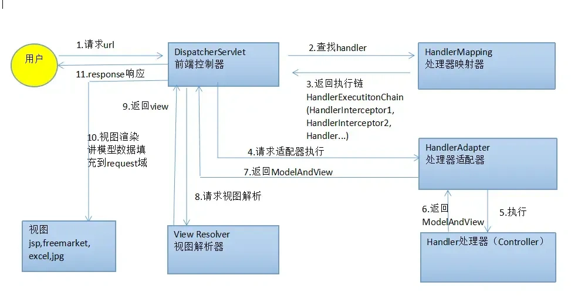

# 概述

> 基于MVC架构模式的Web框架，底层使用Servlet实现，是Spring Web中的一个模块。

Spring框架中有一个子项目为Spring Web，包含了Web相关的模块。如：

- Spring MVC
- Spring WebFlux
- Spring Web Services
- Spring Web Flow
- Spring WebSocket
- Spring Web Services Client

## 功能

- 入口控制：`SpringMVC`通过`DispatcherServlet`作为入口控制器，负责接收请求和分发请求。
- 自动地将表单数据转换为相应的`Java`对象，只需在控制器方法的参数中声明该`Java`对象
- IOC容器：通过IOC容器管理对象
- 统一处理请求：提供了拦截器，异常处理器等统一处理请求的机制
- 视图解析：提供了多种视图引擎支持，如JSP，Freemarker，Velocity等，并且支持国际性、主题等特性。

## MVC

全称 Model-View-Controller(模型-视图-控制器),是一种软件架构模式，也就是软件架构设计思想。常用于Web开发和GUI应用。

MVC将应用分为三层：

- M:`Model`,模型，表示业务数据及其业务规则
- V:`View`,视图，将 Model 的数据展示给用户
- C:`Controller`,控制器，负责请求处理与流程控制，接收请求后，处理业务获得Model，并选择合适的 View 进行响应。

三层分工协作，相互配合。

**优点**

- 低耦合，高内聚，扩展能力强
- 代码复用性强，代码可维护性强

<h3>三层模型</h3>

也是一种软件架构模式，将应用分为三层：

|    层次    |           英文           |                  职责                  |
| :--------: | :----------------------: | :------------------------------------: |
|   表现层   |    Presentation Layer    | 负责与用户交互，接收用户请求、展示数据 |
|   业务层   | Business / Service Layer |           业务规则、流程控制           |
| 数据访问层 | Data Access Layer (DAO)  |              与数据库交互              |

- 设计目标：三层架构更注重系统整体的分层设计，而MVC则专注于视图的控制和数据的处理，核心是**分离数据、逻辑和视图**，让 UI 与数据解耦。
- MVC 是表现层的一种实现方式，它把数据（Model）和 UI 展示（View）解耦，Controller 负责调度。
- 适用场景：三层架构适用于后端服务和企业级应用，而MVC主要用于Web应用开发。 

## 相关依赖

**springmvc**

```xml
        <dependency>
            <groupId>org.springframework</groupId>
            <artifactId>spring-webmvc</artifactId>
            <version>6.2.12</version>
        </dependency>
```

**Servlet**

```xml
       <!--新版本Servlet-->
		<dependency>
            <groupId>jakarta.servlet</groupId>
            <artifactId>jakarta.servlet-api</artifactId>
            <version>6.1.0</version>
            <scope>provided</scope>
        </dependency>
```

- `SpringMVC`中不包含`Servlet`依赖，因为`Web`容器(如Tomcat)中会包含`Servlet`依赖
- 如果需要项目中需要使用到`Servlet`的相关API，需要添加`Servlet`依赖。但需要设置`Servlet`依赖的作用域为`provided`，当打包时,`provided`的依赖不会被打包。

**thymeleaft**

```xml
        <dependency>
            <groupId>org.thymeleaf</groupId>
            <artifactId>thymeleaf-spring6</artifactId>
            <version>3.1.2.RELEASE</version>
        </dependency>
```

**jackson-databind**

```xml
        <dependency>
            <groupId>com.fasterxml.jackson.core</groupId>
            <artifactId>jackson-databind</artifactId>
            <version>2.17.2</version>
        </dependency>
```

- 用于`Json`格式的Http消息体与Java对象的相互转换
- Spring MVC 提供了多种 JSON 相关的 `HttpMessageConverter`，开发者可以自由选择不同的 JSON 实现。当项目中引入某个消息转换器所依赖的 JSON 实现库时，Spring MVC 会基于类路径检测（classpath detection）自动注册并使用对应的 `HttpMessageConverter`。
  - `MappingJackson2HttpMessageConverter` 底层依赖 `jackson-databind`

**`commons-fileupload`**

```xml
        <dependency>
            <groupId>commons-fileupload</groupId>
            <artifactId>commons-fileupload</artifactId>
            <version>1.4</version>
        </dependency>
```

- 用于文件上传下载的依赖，SpringMVC5及之前的版本需手动引入

## 配置文件

**`web.xml`**

这是所有web应用默认的配置文件，由`Servlet`规范规定。位于`webapp/WEB-INF/web.xml`。

```xml
<?xml version="1.0" encoding="UTF-8"?>
<web-app xmlns="https://jakarta.ee/xml/ns/jakartaee"
         xmlns:xsi="http://www.w3.org/2001/XMLSchema-instance"
         xsi:schemaLocation="https://jakarta.ee/xml/ns/jakartaee https://jakarta.ee/xml/ns/jakartaee/web-app_6_0.xsd"
         version="6.0">

    <servlet>
        <servlet-name>springmvc</servlet-name>
        <servlet-class>org.springframework.web.servlet.DispatcherServlet</servlet-class>
        <init-param>
                <param-name>contextConfigLocation</param-name>
                <param-value>classpath:springmvc.xml</param-value>
        </init-param>
    </servlet>
    <servlet-mapping>
<!--        /代表所有请求(除了.jsp结尾的)均会被分发到这个控制器-->
        <servlet-name>springmvc</servlet-name>
        <url-pattern>/</url-pattern>
    </servlet-mapping>
</web-app>
```

- springmvc提供了一个统一的请求入口`DispatcherServlet`,所有请求在进入后都会先通过它，由它分发给具体的Controller(控制器)。

**`springmvc-servlet.xml`**

springmvc自己的配置文件，用于配置`Bean`和Spring的一些功能。默认位于`webapp/WEB-INF/springmvc-servlet.xml`。

```xml
<?xml version="1.0" encoding="UTF-8"?>
<beans xmlns="http://www.springframework.org/schema/beans"
       xmlns:xsi="http://www.w3.org/2001/XMLSchema-instance"
       xmlns:context="http://www.springframework.org/schema/context"
       xsi:schemaLocation="http://www.springframework.org/schema/beans http://www.springframework.org/schema/beans/spring-beans.xsd http://www.springframework.org/schema/context https://www.springframework.org/schema/context/spring-context.xsd">
<!--    组件扫描-->
    <context:component-scan base-package="com.example"/>

    <!--配置视图解析器-->
<!--    视图解析器(ViewResolver）的作用主要是将Controller方法返回的逻辑视图名称解析成实际的视图对象。
        视图解析器将解析出的视图对象返回给DispatcherServlet，并最终-->
<!--    由DispatcherServlet将该视图对象转化为响应结果，呈现给用户。-->
    <bean id="thymeleafviewResolver" class="org.thymeleaf.spring6.view.ThymeleafViewResolver">
    <!--作用于视图渲染的过程中，可以设置视图渲染后输出时采用的编码字符集-->
    <property name="characterEncoding" value="UTF-8"/>
    <!--如果配置多个视图解析器，它来决定优先使用哪个视图解析器，它的值越小优先级越高-->
    <property name="order" value="1"/>
    <!--当ThymeleafViewResolver渲染模板时，会使用该模板引擎来解析、编译和渲染模板-->
    <property name="templateEngine">
    <bean class="org.thymeleaf.spring6.SpringTemplateEngine">
        <!--用于指定Thymeleaf模板引擎使用的模板解析器。模板解析器负责根据模板位置、模板资源名称、文件编码等信息，加载模板并对其进行解析-->
        <property name="templateResolver">
            <bean class="org.thymeleaf.spring6.templateresolver.SpringResourceTemplateResolver">
                <!--设置模板文件的位置（前缀）-->
                <property name="prefix" value="/WEB-INF/templates/"/>
                <!--设置模板文件后缀（后缀），Thymeleaf文件扩展名不一定是html，也可以是其他，例如txt，大部分都是html-->
                <property name="suffix" value=".html"/>
                <!--设置模板类型，例如：HTML，TEXT，JAVASCRIPT,CSS等-->
                <property name="templateMode" value="HTML"/>
                <!--用于模板文件在读取和解析过程中采用的编码字符集-->
                <property name="characterEncoding" value="UTF-8"/>
            </bean>
        </property>
    </bean>
    </property>
    </bean>
</beans>
```

- 在`web.xml`中配置`DispatcherServlet`，可以手动指定SpringMVC配置文件的位置和名称

  ```xml
      <servlet>
          <servlet-name>springmvc</servlet-name>
          <servlet-class>org.springframework.web.servlet.DispatcherServlet</servlet-class>
          <init-param>
                  <param-name>contextConfigLocation</param-name>
                  <param-value>classpath:springmvc.xml</param-value>
          </init-param>
      </servlet>
  ```


# 使用示例

1. 提供`webapp`目录，内部的`WEB-INF`目录下提供两个配置文件：

   - `web.xml`:Servlet规范要求的Web程序配置文件，内部配置springmvc提供的前端控制器，它负责处理所有的请求(`.jsp`结尾除外)，将请求分发给对应的控制器
   - `springmvc-servlet.xml`：springmvc要求的配置文件，用于配置Bean和Spring的相关功能。如果需要使用模板引擎，则需要配置视图解析器Bean。

2. 编写`Controller`控制器类，它负责处理请求，按照MVC模式，Controller会调用Model处理业务，并返回对应的逻辑视图名称。

   ```java
   @Controller 
   public class FirstController {
   	@RequestMapping("/")
       public String homePage() {
           return "home";
       }
       @RequestMapping(value = "/test")
       public String hello() {
           return "first";
       }
   }
   ```

   - 一个控制器中可以编写多个请求处理方法，处理不同路径的请求。


# 工作流程



1. 客户端请求首先进入前端控制器 **`DispatcherServlet`**
2. `DispatcherServlet` 根据请求信息委托 **`HandlerMapping`** 查找对应的处理器。
3. `HandlerMapping` 返回匹配的 **`HandlerExecutionChain`**（包含 `Handler` 与相关拦截器）。
4. `DispatcherServlet` 根据 `Handler` 类型选择合适的 **`HandlerAdapter`**。
5. `HandlerAdapter` 负责参数解析、类型转换、数据绑定与校验，并调用 `Handler`。
6. `Handler`（Controller）执行业务逻辑并返回 `ModelAndView` 或响应数据。
7. `HandlerAdapter` 将处理结果返回给 `DispatcherServlet`。
8. `DispatcherServlet` 将 `ModelAndView` 交给 **`ViewResolver`** 解析视图。
9. `ViewResolver` 返回具体的 `View` 实例。
10. `DispatcherServlet` 渲染视图，将 `Model` 数据填充到 `View` 中。
11. 最终由 `DispatcherServlet` 将响应结果返回给客户端。

## `DispatcherServlet`

DispatcherServlet是SpringMVC框架中最核心的类，它是一个特殊的`Servlet`，是整个SpringMVC框架的前端控制器，负责接收HTTP请求、将请求路由到处理程序、处理响应信息，最终将响应返回给客户端。

它的职责包括：

- 接收客户端的HTTP请求：DispatcherServlet监听来自Web浏览器的HTTP请求，然后根据请求的URL将请求数据解析为Request对象。
- 处理请求:DispatcherServlet将请求的URL与控制器进行匹配，确定要调用哪个控制器(Controller）来处理此请求。
- 调用相应的控制器：DispatcherServlet将请求发送给找到的控制器处理，控制器将执行业务逻辑，然后返回一个模型对象（Model）。
- 渲染视图：DispatcherServlet将调用视图引擎，将模型对象呈现为用户可以查看的HTML页面。
- 返回响应给客户端：DispatcherServlet将为用户生成的响应返回浏览器，响应可以包括表单、JSON、XML、HTML以及其它类型的数据

在`web.xml`中配置`DispatcherServlet`时，可以通过`xml`标签指定一些自定义参数

```xml
        <servlet>
            <servlet-name>springmvc</servlet-name>
            <servlet-class>org.springframework.web.servlet.DispatcherServlet</servlet-class>
<!--            SpringMVC配置文件位置和名称-->
            <init-param>
                <param-name>contextConfigLocation</param-name>
                <param-value>classpath:springmvc.xml</param-value>
            </init-param>
<!--            在web服务器启动时创建DispatcherServlet,默认是第一次请求到来时创建-->
            <load-on-startup>0</load-on-startup>
        </servlet>
```

`DiapthcerServlet`在`doDispatch`方法中分发请求到对应的控制器方法。

# 注解

**声明控制器**

```
@Controller
```

- 声明该类为SpringIOC容器中所管理的控制器`Bean`，本质是`@Component`的一个别名，但是用于特别声明一个控制器类

- `@Controller`类中方法可以使用四种类型的返回值：`String`:逻辑视图名称，`ModelAndView`:封装了Model处理后需要在视图中使用的数据和逻辑视图名称；`void`:用于`AJAX`请求，不返回视图，以达到页面局部刷新的效果。`ResponseEntity<T>:`封装了响应协议的所有内容，可以自由更改，返回后不走视图解析，直接返回。

- Spring MVC 判断是否走视图解析，核心依据是：HTTP 响应是否已经被提交（committed）或者 `@ResponseBody` 是否存在。

  ```java
  //响应已提交
  response.getWriter().write("");
  response.getWriter().flush();
  ```

  | 返回值类型          | 作用                                 | 是否经过视图解析                   | 使用场景                   |
  | ------------------- | ------------------------------------ | ---------------------------------- | -------------------------- |
  | `String`            | 逻辑视图名                           | ✅ 经过 `ViewResolver` 转为实际视图 | 页面跳转、模板渲染         |
  | `ModelAndView`      | 封装逻辑视图 + 模型数据              | ✅ 经过视图解析                     | 页面跳转，同时携带模型数据 |
  | `ResponseEntity<T>` | 封装整个 HTTP 响应（状态码、头、体） | ❌ 不走视图解析                     | REST API、自由控制响应     |

- 无论使用`String`还是`ModelAndView`类型的返回值，最终SpringMVC都会将其转换为`ModelAndView`对象交给`DispatchServlet`再经过视图解析器才能变成物理视图

SpringMVC对控制器方法的返回值有两类处理方式：

1️⃣ 走视图解析（View Rendering）

- **概念**：方法返回值最终会经过 `ViewResolver` 渲染成页面
- **典型返回值类型**：
  - `String` → 逻辑视图名
  - `ModelAndView` → 封装视图名 + 模型数据
  - `void` → 响应未提交时，会尝试根据请求路径推断视图名

2️⃣ 不走视图解析

- **概念**：方法返回值不经过视图解析，直接写入 HTTP 响应体
- **典型方式**：
  - `@ResponseBody` 或 `ResponseEntity<T>` → Spring 使用 `HttpMessageConverter` 写入响应
  - `void` + 手动写 `HttpServletResponse` → 响应已提交，SpringMVC 不再渲染视图，直接返回响应

只要响应已提交，不管什么类型的返回值，都不会走视图解析。

<h3>声明控制器方法的映射路径</h3>

```
@RequestMapping(String[] value,RequestMethod[] method,String[] params)
```

- 使用在控制器类上或者控制器方法上，使用在类上时，会为类中的所有方法生效，并且会将路径拼接在类中方法所声明路径的前面
- `@RequestMapping`声明映射的请求路径时，不是必须在开头加`/`。如果不加，会自动补全。因为Controller 映射的是“逻辑路径”，不是浏览器 URL 字符串，Spring MVC 在注册映射时，会进行路径规范化。推荐手动加上`/`,符合规范

|                          |                                                              |                                                              |
| :----------------------: | :----------------------------------------------------------: | :----------------------------------------------------------: |
|     `String[] value`     |                    声明方法对应的映射路径                    |                与`path`参数互为别名，功能一样                |
| `RequestMethod[] method` | 声明可处理请求的请求方法，如果不指定则可以处理同一路径的任何方式的请求 |                   `RequestMethod`为枚举类                    |
|    `String[] params`     | 声明被处理请求必须携带的参数格式，如果不按要求携带参数，直接返回HTTP状态码400 | 有四种模式:<br/>params={"username"}:表示请求必须携带`username`参数<br/>params={!username}表示请求必须不携带username参数<br/>params={username="admin"}表示请求必须携带username参数，且值必须是admin<br/>params={"username!=admin"}表示请求必须携带username参数，但参数值不能为admin |
|    `String[] headers`    | 声明被处理请求必须携带的请求头格式，如果不按要求携带参数，直接返回HTTP状态码404 |          用法同`params`参数，不过`value`支持通配符           |
|   `String[] produces`    | 声明`Controller`方法返回给客户端的数据类型，即匹配请求头`Accept`字段的内容，如果不匹配，则拒绝处理并将返回响应码406 | 默认为空，即不限制`Aceepet`内容；还会直接决定响应的 `Content-Type`。Accept 可以声明“我能接收多种类型”， 最终返回的 `Content-Type` 是从 `produces` 中选出来、并与 Accept 匹配的那个类型。 |


**Ant风格请求路径**

`@RequestMapping`的路径支持模糊匹配，这种风格的请求路径称为`Ant`风格。支持以下通配符：

- `?`:代表任意一个字符
- `*`代表任意多个字符
- `**`：只能用于`/**/`,代表任意多级路径。在Spring6开始，`**`通配符只能出现在路径末尾，匹配路径末尾的任意多级路径。

**路径占位符**

`@RequestMapping`的路径支持占位符，可以通过占位符声明路径参数，并在方法参数中通过`@PathVariable`注解声明的变量接收路径参数，SpringMVC会自动将路径参数映射成对应Java数据类型。

```java
    @RequestMapping("/login/{username}/{password}")
    public String login(@PathVariable("username") String username, @PathVariable("password")String password) {
        return null;
    }
```

**衍生注解**

SpringMVC中还提供了需要`@RequestMapping`的衍生注解，它们只能用在控制器方法上，但是已经指定了`Method`属性。

- `@GetMapping`：标明方法只能处理`Get`请求
- `@PostMapping`：标明方法只能处理`Post`请求
- `@DeleteMapping`：标明方法只能处理`Delete`请求
- `@PutMapping`：标明方法只能处理`Put`请求

# 请求参数

请求参数是在HTTP请求中传递给服务器的数据。通常可分为三类：

<h3>查询参数(Query Parameters)</h3>

又称为查询字符串，出现在URL中，以`?`开头，后面跟着`参数名=参数值`，多个参数使用`&`连接

```
?key1=value1&key2=value2
```

<h3>路径参数(Path Parameters)</h3>

嵌入在URL路径中，是URL路径的一部分。

```
/users/{userId}
```

<h3>请求体参数(Request Body Parameters)</h3>

在请求体中以 JSON、XML 或其他格式传递数据。

<h3>请求头(Request Header)</h3>

Http请求头为多个键值对格式，也可以用来向服务器传递数据,如`cookie`等用户信息通常放在请求头中传递。

## 获取请求参数

<h3>Servlet API</h3>

在原生`Servlet`编程时，在业务处理时会用到`HttpServletRequest`,`HttpServletResponse`和`HttpSession`等对象，这些对象在请求到来时由Web容器(如Tomcat)创建并传入`Servlet`处理请求的方法中。在使用`SpringMVC`时，可以通过在控制器方法中直接声明相同类型的参数，框架会根据方法中声明参数的类型自动注入参数。

```java
    public String hello(HttpServletRequest request, HttpServletResponse response, HttpSession session) {
     
    }
```

获得请求对象(`HttpServletRequest`)后，就可以使用`request.getParameter(String s)`方法获得请求参数。

**缺点**

- 由于`HttpServletRequest`对象由Web容器创建，因此运行环境离不开Web容器，不方便进行单元测试。
- 通过`request.getParameter(String s)`能直接获取请求体参数和查询参数，对于路径参数，只能手动解析URL路径。

<h3>SpringMVC注解</h3>

`SPringMVC`提供了多个注解，用于接收不同类型的请求参数。使用时，只需要在方法参数上声明参数并添加注解，框架会自动解析并将参数注入到方法中。

<h4>@RequestParam</h4>

可添加在方法形参上，将方法参数与Web请求参数(包括查询参数和请求体参数)绑定。

```java
@RequestParam(String value,String name, boolean required,String defaultValue)
    @GetMapping
    public String hello(@RequestParam("value") String value) {
        return "register";
    }
```

- `@RequestParam`会自动进行类型转换，所有原始Web请求参数均是`String`,SpringMVC会根据声明的参数类型进行转换
- `@RequestParam` 底层基于 `Servlet API` 的 `HttpServletRequest#getParameter` / `getParameterMap` 获取参数，因此它只能获取 `Servlet parameter`，包括 URL 查询参数以及 `application/x-www-form-urlencoded` 或 `multipart/form-data` 类型请求体中的字段。对于 `application/json`、`application/xml` 等请求体格式，Servlet 容器不会进行参数解析，也不会填充进 `parameter map`，因此 `@RequestParam` 无法获取其中的字段。

**`String value`**

声明被绑定请求参数的参数名,与`name`互为别名参数。

**`boolean required`**

参数是否必须。默认为`true`,如果请求缺少该参数，会抛出异常，返回Http状态码400。

**`String defaultValue`**

当请求参数未被提供或值为空时的默认值。如果手动设置了该参数，则`required`隐式置为`false`。

<h4><code>@PathVariable</code></h4>

`@PathVariable` **应用在控制器方法的参数上**，用于将方法参数与 `@RequestMapping`（或其派生注解）中声明的**路径参数**进行绑定。在 `@RequestMapping` 的路径中，可以通过 **占位符 `{}`** 的方式声明路径参数,如`/user/{userId}`

```java
@PathVariable(String value,String name,boolean required)

@GetMapping("/user/{userId}")
public String getUser(@PathVariable Integer userId) {
    return "user";
}
```

|   属性名   |                           说明                            |
| :--------: | :-------------------------------------------------------: |
|  `value`   | 路径变量名,如果参数名与占位符中的路径参数名一致，可以省略 |
|   `name`   |              与 `value` 作用相同（互为别名）              |
| `required` |                 是否必须存在，默认 `true`                 |

<h4>@RequestHeader</h4>

可添加在方法形参上，将方法参数与请求头绑定，与`@RequestParam`注解用法完全一致。

```
@RequestHeader(String value,String name, boolean required,String defaultValue)
```

<h4>@CookieValue</h4>

用在方法形参上，将方法参数与Http Cookie绑定。用法基本与`@RequestParam`相同。

```
@CookieValue(String value,String name, boolean required,String defaultValue)
```

- 方法参数可声明为`jakarta.servlet.http.Cookie`或其他cookie值类型(String,int等)

<h3>方法形参接收请求参数</h3>

如果方法形参名与请求参数名一致，可以省略`@RequestParam`注解直接通过形参接收请求参数。

如果使用的是Spring6+版本，需要在`pom.xml`中指定编译参数`-parameters`才生效。

```xml
    <build>
        <plugins>
            <plugin>
                <groupId>org.apache.maven.plugins</groupId>
                <artifactId>maven-compiler-plugin</artifactId>
                <version>3.14.1</version>
                <configuration>
                    <source>21</source>
                    <target>21</target>
                    <compilerArgs>
                        <arg>-parameters</arg>
                    </compilerArgs>
                </configuration>
            </plugin>
        </plugins>
    </build>
```

- 此时并不强制要求参数必须传递，如果未传递，则接收到的值为`null`。

<h3>POJO类接收请求参数</h3>

如果POJO类的属性名与请求参数名一致，可以直接在方法参数中声明一个`POJO`类的形参接收多个参数。当请求到来时，SpringMVC会通过反射创建一个`POJO`对象并调用`Setter`方法将请求参数赋值到属性中。

- `POJO`类必须提供`Setter`方法。SpringMVC要通过请求请求参数名推断出对应的`Setter`方法为`POJO`对象赋值，所以`Setter`方法命名要符合规范。
- `POJO`类的属性名并不强制要求与请求参数名一致，但如果一致的话可以使用`Lombok`或`IDE`工具快速生成符合要求的`Setter`方法

<h3><code>@RequestBody</code></h3>

添加在方法形参上，用于将 HTTP 请求体中的内容，解析为 Java 对象，并注入到 Controller 方法参数中。

```java
@PostMapping("/user")
public String saveUser(@RequestBody User user) {
    System.out.println(user.getName()); // Tom
    return "ok";
}
```

- SpringMVC会根据请求体的类型和反序列化类型选择合适的消息转换器

# 拦截器

> 拦截器介于**DispatcherServlet** 和 **Controller** 之间。请求进入 SpringMVC 时，DispatcherServlet 会先调用 **拦截器链（HandlerInterceptorChain）**，再进入 Controller，响应返回时又会经过拦截器链再进入`DisaptcherServlet`。 

## 应用场景

- 登录验证：对于需要登录才能访问的网址，使用拦截器可以判断用户是否已登录，如果未登录则跳转到登录页面。
- 权限校验：根据用户权限对部分网址进行访问控制，拒绝未经授权的用户访问。
- 请求日志：记录请求信息，例如请求地址、请求参数、请求时间等，用于排查问题和性能优化。
- 更改响应：可以对响应的内容进行修改，例如添加头信息、调整响应内容格式等。

## 使用示例

<h4><code>HandlerInterceptor</code></h4>

`HandlerInterceptor`接口是拦截器的顶层接口，所有拦截器都要实现它，内部定义了三个方法：

```java
//在请求进入处理器之前执行，如果返回true则放行，返回false则直接拒绝请求
boolean preHandle(HttpServletRequest request, HttpServletResponse response, Object handler)

//在处理器方法执行完毕之后执行
void postHandle(HttpServletRequest request, HttpServletResponse response, Object handler,@Nullable ModelAndView modelAndView)

//在视图渲染完毕之后执行
void afterCompletion(HttpServletRequest request, HttpServletResponse response, Object handler,@Nullable Exception ex)    
```

三个方法均提供了默认空实现，可根据需求实现对应的方法。

1. 自定义类实现`HandlerInterceptor`接口

   ```java
   public class LoginInterceptor implements HandlerInterceptor {
       @Override
       public boolean preHandle(HttpServletRequest request, HttpServletResponse response, Object handler) throws Exception {
           //返回True则放行请求，否则拒绝请求
          	return true;
       }
   
       @Override
       public void postHandle(HttpServletRequest request, HttpServletResponse response, Object handler, ModelAndView modelAndView) throws Exception {
         
       }
   
       @Override
       public void afterCompletion(HttpServletRequest request, HttpServletResponse response, Object handler, Exception ex) throws Exception {
       }
   }
   ```

2. 定义`SpringMVCConfiguration`类,配置拦截器以及拦截规则

   ```java
   @Configuration
   public class MVCConfig implements WebMvcConfigurer {
       @Override
       public void addInterceptors(InterceptorRegistry registry) {
           registry.addInterceptor(new LoginInterceptor())
                   .excludePathPatterns(
                           "/user/code",
                           "/user/login",
                           "/blog/hot",
                           "/shop/**",
                           "/shopp-type/**",
                           "/upload/**",
                           "/voucher/**"
                   );
       }
   }
   ```

## 配置

如果配置了多个拦截器，则拦截器的`preHandler`会按照配置顺序依次执行，`postHandler`,`afterCompletion`方法会按照配置顺序倒序执行。

如果某个拦截器的`preHandler`返回`false`,则会拦截请求，并且这个拦截器(不包括返回`false`的拦截器)之前的拦截器的`afterCompletetion`会被倒序执行。

<h3>XML方式</h3>

```xml
   简单配置，不能配置拦截器的属性，默认按照配置顺序执行
	<mvc:interceptors>
        <bean class="com.example.interceptors.MyInterceptor"/>
    </mvc:interceptors>
	复杂配置，可以配置拦截器的拦截路径，执行顺序等
    <mvc:interceptors>
        <mvc:interceptor>
            <!--配置拦截路径,/**表示拦截所有路径 -->
            <mvc:mapping path="/**"/>
            <bean class="com.example.interceptors.MyInterceptor"/>
        </mvc:interceptor>
    </mvc:interceptors>
```

<h4>配置类配置</h4>

`WebMvcConfigurer` 是一个接口，提供了大量可覆盖的方法，用来定制 Spring MVC 的行为,包括添加拦截器。

```java
@Configuration
@EnableWebMvc  // 激活注解驱动的 Spring MVC,相当于<mvc:annotation-driven />
public class MVCConfig implements WebMvcConfigurer {
    @Override
    public void addInterceptors(InterceptorRegistry registry) {
        registry.addInterceptor(new LoginInterceptor())
                .excludePathPatterns(
                        "/user/code",
                        "/user/login",
                        "/blog/hot",
                        "/shop/**",
                        "/shopp-type/**",
                        "/upload/**",
                        "/voucher/**"
                );
    }
}
```

- 设置拦截器的忽略拦截路径

  ```java
   registry.addInterceptor(new LoginInterceptor())
                  .excludePathPatterns(
                          "/user/code",
                          "/user/login",
                          "/blog/hot",
                          "/shop/**",
                          "/shopp-type/**",
                          "/upload/**",
                          "/voucher/**"
                  );
  ```

  - 路径支持通配符,`**`代表任意字符串

- 设置拦截器的执行顺序

  ```java
  registry.addInterceptor(new RefreshTokenInterceptor(redisTemplate)).order(1);
  ```

  - 默认所有拦截器的order都为0，`order`越小，优先级越高
  - 如果`order`一致，则按照拦截器的添加顺序执行拦截器

# 域对象

`Servlet API`中提供了三类域对象，分用于在不同作用范围内共享数据。

- 请求域:request，也就是`HttpServletRequest`对象，可作用于同一个请求。
  - 通常用于请求转发时传递数据或者从`Controller`传递数据到`View`。
- 会话域:session，也就是`HttpSession`对象，可作用于Session超时前的来自此浏览器的所有请求。浏览器第一次访问时，Web容器会为其创建一个`Session`，并将此`Session`对应的`JSessionID`以cookie的方式存储在浏览器客户端。Web容器在请求到来时，可以根据cookie找到对应的`Session`并交给对应的`Servlet`。
  - 可用于请求重定向时传递数据
- 应用域:application，也就是`ServletContext`对象，可作用于整个Web应用，通过`HttpServlet`的`getServletContext`方法获取到。

三个域对象的可作用范围从上到下逐渐增大，一般在可完成需求的前提下选择范围最小的。

`HttpSession`和 `ServletContext`本身是线程安全的，但是其内部存储的数据可能存在线程安全问题,使用时需要注意线程安全。

三类域对象均提供了以下三个方法

```java
//向域中存储数据
void setAttribute(String name,Object obj);
//从域中读取数据
Object getAttribute(String name);
//刪除域中的数据
void removeAttribute(String name);
```

通过`setAttribute`与`getAttribute`完成域中数据的共享，数据使用完毕后通过`removeAttribute`防止内存浪费。

**SpringMVC提供了多种方式使用域对象**

<h3>Servlet API</h3>

在方法参数中声明需要使用的域对象同类型的参数，SpringMVC会自动将对应域对象注入方法，直接使用即可。

可注入的域对象类型有：

| 注入对象             | 类型                                    | 作用                                               |
| -------------------- | --------------------------------------- | -------------------------------------------------- |
| `HttpServletRequest` | `javax.servlet.http.HttpServletRequest` | 获取请求信息，如请求参数、请求头、请求路径等。     |
| `HttpSession`        | `javax.servlet.http.HttpSession`        | 获取当前请求对应的会话对象，用于在会话中存储数据。 |
| `ServletContext`     | `javax.servlet.ServletContext`          | 应用上下文对象，获取全局共享资源。                 |

- 缺点是依赖于Web容器，不方便进行单元测试

<h3>SpringMVC接口</h3>

为了方便使用，SpringMVC针对原生`Servlet API`提供了一些方便的封装对象。

<h4>Request域</h4>

**`java.util.Map`**

方法参数中的`Map<String,Object>`类型(或其子类型)的参数也可以充当请求域对象

```java
    @RequestMapping()
    public String hello(Map<String,Object> map) {
        return "register";
    }
```

- `Map`的泛型必须为`<String,Obejct>`且不能添加`@RequestParam`或`@RequestHeader`注解，如果添加`@RequestParam`或`@RequestHeader`注解，会被视为请求参数`Map`；如果泛型不一致但没有添加注解，会被视为普通`Map`。

**`org.springframework.ui.Model`**

SpringMVC提供了`org.springframework.ui.Model`接口，类似于`HttpServletRequest`，可以借助它实现request域数据共享。为方法添加`Model`类型的参数，会自动传入对应的`Model`实现类。

```java
    @RequestMapping()
    public String hello(Model model) {
        model.addAttribute("123");
        return "register";
    }
```

**`org.springframework.ui.ModelMap`**

SpringMVC提供的`org.springframework.ui.ModelMap`接口，为方法添加`ModelMap`类型的参数，会自动传入对应的`ModelMap`对象。

无论是使用`Map`，`Model`或者`ModelMap`,底层都是注入了一个`org.springframework.validation.support.BindingawareModelMap`类型的对象。这个类是上面三个类或接口的实现，使用不同的方法参数只是 通过**类型向上转型**，暴露了不同的方法接口。

**`org.springframework.web.servlet.ModelAndView`**

为了更好的体现MVC架构模式，SpringMVC提供了`ModelAndView`类。这个类的实例封装了Model处理后传递给`View`的数据和View。也就是说这个类既封装业务处理之后的数据，也指明了需要使用哪个视图。使用它也可以完成request域数据共享。

```java
    @RequestMapping()
    public ModelAndView hello(ModelMap map) {
        ModelAndView modelAndView = new ModelAndView();
        //添加共享数据
        modelAndView.addObject("param","value");
        //设置逻辑视图名称
        modelAndView.setViewName("ok");
        return modelAndView;
    }
```

- 实际上所有控制器方法最终交给`DispatcherServlet`的都是一个`ModelAndView`对象，这个对象中会封装逻辑视图名称和放入`request`域的数据。

<h4>Session域</h4>

除了直接注入`HttpSession`域对象，SpringMVC还提供了一个注解`@SessionAttributes`。

```
@SessionAttributes(String[] value,Class<?>[] types)
```

注解添加在控制器类上，添加后可以直接使用`request`域的API添加属性，SpringMVC会对注解中声明的属性进行特殊处理，将其从`request`域添加到当前Controller私有的`Session`域中。

- 这里的`Session`不是常规意义的全局的`Session`，是当前Controller 私有的会话状态，不是Session 域共享机制。
- 通常用于多步骤表单。

**`String[] value`**

声明需要添加到`Session`域中的属性名

**`Class<?>[] types`**

声明需要添加到`Session`域中的属性类型

# 视图

视图负责渲染数据，展示模型`Model`中的数据。SpringMVC支持多种视图，常见有：

- `InternalResourceView`：内部资源视图（SpringMVC框架内置的，专门为JSP模板语法准备)
- `RedirectView`：重定向视图（SpringMVC框架内置的，用来完成重定向效果）
- `ThymeleafView`：Thymeleaf视图(第三方的，为Thymeleaf模板语法准备的）
- `FreeMarkerView`：FreeMarker视图（第三方的，为FreeMarker模板语法准备的）
- `VelocityView`：Velocity视图(第三方的，为Velocity模板语法准备的）
- `PDFView`：PDF视图（第三方的，专门用来生成pdf文件视图）
- `ExcelView`：Excel视图(第三方的，专门用来生成excel文件视图）

**视图的工作流程**

视图的工作依赖于两个由SpringMVC提供的接口：

- `ViewResolver`接口：负责将逻辑视图名称解析为 `View` 视图对象
- `View`接口：负责将模型数据渲染到模板中，生成 HTML 代码并写入响应。

1. `DispatcherServlet`接收请求后，调用对应的 `Controller`方法，`Controller`方法最终会返回一个`ModelAndView`对象，这个对象封装了逻辑视图名称和`Model`数据。
2. `DispatcherServlet`调用`ViewResolver.resolveViewName(String viewName, Locale locale)`将逻辑视图名称转换为物理视图对象(返回一个`View`对象)。
3. 最后调用`View.render(@Nullable Map<String, ?> model, HttpServletRequest request, HttpServletResponse response)`填充数据，将模板语法转换成HTML代码写入响应，返回给客户端。

## 视图控制器

对于内部没有任何业务逻辑而仅仅是为了展示视图的Controller，这种控制器称为视图控制器。可以在SpringMVC的配置文件中快速配置而不用编写Java代码。

```xml
<mvc:view-controller path="/test" view-name="test"/>
```

- 使用此功能后，通过注解配置的所有`Controller`全部失效，需要在配置文件中手动开启注解驱动才可以重新生效：`<mvc:annotation-driven/>`

# 转发(`forward`)/重定向(`redirect`)

转发与重定向 都是Web 应用中实现资源跳转的方式，将原本对资源A的请求跳转到资源B。

<h3>对比</h3>

- 转发是一次请求。因此浏览器地址栏上的地址不会发生变化。重定向是两次请求。因此浏览器地址栏上的地址会发生变化。
- 转发的代码实现：`request.getRequestDispatcher("/index").forward(request, response)`,重定向的代码实现：`response.sendRedirect("/webapproot/index")`
- 转发是服务器内部资源跳转，由服务器控制。不可实现跨域访问。重定向可以完成内部资源的跳转，也可以完成跨域跳转。
- 转发的方式可以访问WEB-INF目录下受保护的资源。重定向相当于浏览器重新发送了一次请求，在浏览器直接发送的请求是无法访问WEB-INF目录下受保护的资源的。

**转发原理**
a.假设发送了/a请求，执行了AServlet

b.在AServlet 中通过`request.getRequestDispatcher("/b").forward(request,response)`转发到BServlet

c.从AServlet跳转到BServlet是服务器内部来控制的。对于浏览器而言，浏览器只发送了一个/a请求。
**重定向原理**

a.假设发送了/a请求，执行了AServlet

b.在AServlet 中通过response.sendRedirect("/webapproot/b")重定向到BServlet

c．此时服务器会将请求路径/webapproot/b响应给浏览器

d.浏览器会自发的再次发送/webapproot/b请求来访问BServlet

e.因此对于重定向来说，发送了两次请求，一次是webapproot/a，另一次是/webapproot/b。

在SpringMVC中，可以通过特殊的逻辑视图名称前缀实现转发与重定向。

- **转发：**逻辑视图名称为`forward:资源路径`,此时会使用`InternalResourceView`视图
- **重定向：**逻辑视图名称为`redirect:资源名称`，此时会使用`RedirectView`视图

```java
    @RequestMapping()
    public String hello() {

        return "forward:/b";
    }
    @RequestMapping()
    public String hello() {
		//跨域重定向需要写完整的请求:redirect:http://baidu.com 
        return "redirect:/b";
    }
```

# 静态资源

通常，将服务器所需的静态资源(如`css`,`img`等)，存放在`webapp/static`目录下。这个目录下的静态资源可由`Tomcat`的`DefaultServlet`代理而无需手动编写`Controller`，默认这个`Servlet`并不使用，可以在SpringMVC的配置文件中开启它。

```xml
两种方式选一种

开启默认Servlet代理静态资源
<mvc:default-servlet-handler/>
配置静态资源代理
<mvc:resources mapping="/static/**" location="/static/"/>
```

- 开启此功能后需要手动开启注解驱动:`<mvc:annotation-driven/>`

# Http消息转换器

Http消息转换器(`HttpMessageConverter` )是 Spring MVC 中负责 HTTP 消息体(包括请求体与响应体)与 Java 对象之间转换的组件，在请求阶段将请求体反序列化为方法参数，在响应阶段将Java对象序列化为响应体，是 `@RequestBody` 和 `@ResponseBody` 的底层支撑机制。
SpringMVC会根据条件自动选择合适的转换器，进行消息体与Java对象的转换。

所有消息转换器均是`HttpMessageConverter`接口的实现类，常用的消息转换器实现有:

- `MappingJackson2HttpMessageConverter`：负责Java对象`Json`字符串之间的转换，需要手动引入`jackson-databind`依赖才可以使用。

# AJAX请求处理

**AJAX（Asynchronous JavaScript and XML）** 是一种**前端异步通信技术**，核心特点是：

- **不发生整页刷新**
- 通过 **JavaScript** 向服务器发送 HTTP 请求
- 服务器返回 **数据**（而不是完整页面）
- 前端根据返回数据 **局部更新 DOM**

使用`Spring MVC`处理AJAX请求时，服务器不能返回页面，而是只返回需要的数据。所以处理时不能走`ViewResolver`,而是直接将返回对象写入 HTTP 响应体。

通常有以下几种处理方式

## `Servlet API`

将控制器方法的返回值声明为`void`,直接使用`response`对象将数据写入响应体中。

```java
@GetMapping ("/ajax")
public void ajax(HttpServletResponse response) throws IOException {
Printwriter out=response.getwriter();
out.print("hello ajax, my name is Spring Mvc2!");
}
```

## `Spring MVC`注解

<h3>@ResponseBody</h3>

添加在控制器方法上。`@ResponseBody` 将 Controller 方法的返回值直接写入 HTTP 响应体中，而不是解析为视图。

```java
@GetMapping ("/ajax")
public String ajax() {
	return "hello ajax, my name is Spring Mvc2!";
}
```

- 方法的返回值可以是任何数据类型,SpringMVC会使用不同的消息转换器将其序列化后写入`Http`响应体
- 如果想要将对象序列化为json格式返回，需要手动引入`Json`处理依赖，之后会自动注册并使用对应的消息转换器。

<h3><code>@RestController</code></h3>

添加在类上，用于标识一个`REST`风格的控制器类。使用`RestController`标识的控制器类，其方法的返回值不会作为视图解析，而是直接写入响应体(默认对象使用JSON序列化)。

- `@RestController`是`@Controller`与`@ResponseBody`的复合注解，相当于在类上加了`@Controller`注解的同时为所有方法添加了`@ResponseBody`方法。

```java
@RestController
public class HelloController {

@GetMapping ("/ajax")
public String ajax() {
	return "hello ajax, my name is Spring Mvc2!";
}
}
```

# 文件上传下载

在Spring5及之前的版本，想要引入文件上传下载功能，必须手动引入依赖

```xml
        <dependency>
            <groupId>org.springframework</groupId>
            <artifactId>spring-webmvc</artifactId>
            <version>6.2.12</version>
        </dependency>
```

Spring6中需要在`web.xml`文件进行如下配置

```xml
    <servlet>
        <servlet-name>dispather</servlet-name>
        <servlet-class>org.springframework.web.servlet.DispatcherServlet</servlet-class>
        <init-param>
            <param-name>contextConfigLocation</param-name>
            <param-value>classpath:springmvc.xml</param-value>
        </init-param>
        <load-on-startup>1</load-on-startup>
        <multipart-config>
<!--            设置支持的单个文件的最大值-->
            <max-file-size>102400</max-file-size>
<!--            设置一次请求所上传所有文件的最大值-->
            <max-request-size>102400</max-request-size>
<!--            设置最小上传文件大小-->
            <file-size-threshold>0</file-size-threshold>
        </multipart-config>
    </servlet>
```

**Spring5及之前的版本需要在`springmvc.xml`文件进行如下配置**

```

```

## 文件上传

文件上传要是请求必须是`Post`类型，请求体内容类型必须为`multipart/form-data`

SpringMVC提供了`MultipartFile`类，上传的文件会自动被转换为一个`MultipartFile`对象

```java
    @PostMapping("/fileup")
    public String fileUp(@RequestParam("file")MultipartFile multipartFile) throws IOException {
        String name = multipartFile.getOriginalFilename(); //文件名
        InputStream is = multipartFile.getInputStream();
        BufferedInputStream bis = new BufferedInputStream(is);
        BufferedOutputStream bos = new BufferedOutputStream(new FileOutputStream(Paths.get(FILE_PATH, name).toFile()));
        byte[] bytes = new byte[1024 * 10];
        int read = 0;
        while ((read = bis.read(bytes)) != -1) {
            bos.write(bytes,0,read);
        }
        bos.flush();
        bos.close();
        bis.close();
        return "ok";
    }
```

## 文件下载

实现文件下载通常会使用`ResponseEntity<byte[]>`类

```java
    @PostMapping("/download")
    public ResponseEntity<byte[]> downloadFile() throws IOException {
        File file =new File( "文件地址");
        //创建响应头对象
        HttpHeaders headers = new HttpHeaders();
        //设置响应内容类型
        headers.setContentType(MediaType.APPLICATION_OCTET_STREAM);
        //设置下载文件的名称
        headers.setContentDispositionFormData("attachment",file.getName());
        //下载文件
        ResponseEntity<byte[]> entity = new ResponseEntity<byte[]>(Files.readAllBytes(file.toPath()),headers, HttpStatus.OK);
        return entity;
    }
```

# 异常处理器

**异常处理器**用于**统一处理控制器方法中出现的异常**，从而避免在每个控制器方法中编写大量重复的 `try-catch` 代码，提高系统的可维护性与一致性。

当控制器方法在执行过程中发生异常时：

- 如果 **方法内部没有手动捕获并处理异常**
- 异常会一路向上抛出
- 最终由 **异常处理器**进行集中处理，并返回统一格式的响应结果或错误页面

<h3><code>HandlerExceptionResolver</code></h3>

异常处理器的底层接口，接口的`resolveException`方法用于处理异常，最终返回一个`ModelAndView`，这是出现异常时返回给客户端的视图。

```java
ModelAndView resolveException(HttpServletRequest request, HttpServletResponse response, @Nullable Object handler, Exception ex);
```

SpringMVC提供了两个`HandlerExceptionResolver`实现：

- `DefaultHandlerExceptionResolver`：SpringMVC默认使用的异常处理器,像请求参数不匹配，请求方式不匹配等异常均是由它处理。
- `SimpleMappingExceptionResolver`：SpringMVC提供给用户的用于自定义异常处理器的简单实现。

## 自定义异常处理器

<h4>XML配置文件方式</h4>

```xml
    <bean class="org.springframework.web.servlet.handler.SimpleMappingExceptionResolver">
        <!--配置异常与视图的对应关系-->
        <property name="exceptionMappings">
            <props>
        <!-- key为异常的全类名，值为发生该异常时需要跳转的视图的逻辑名称-->
                <prop key="java.lang.Exception">tip</prop>
            </props>
        </property>
        <!--将异常对象存入request域，属性名为value,可以在视图中通过属性名获得异常信息-->
        <property name="exceptionAttribute" value="exception"/>
    </bean>
```

<h4>注解方式</h4>

通过`@ControllerAdvice`注解声明一个异常处理器组件，并通过`@ExceptionHandler`注解声明异常处理方法

```java
@ControllerAdvice
public class MyExceptionHandler {

    @ExceptionHandler(Exception.class)
    public String tip(Exception e) {
        return "error";
    }
}
```

**`@ExceptionHandler` 方法的编写方式与普通 `Controller` 方法基本一致。**

它可以使用 `@ResponseBody` 注解将方法返回值直接写入 **HTTP 响应体**；可以在方法参数中注入**当前被处理的异常对象**；也可以注入 **Servlet 原生对象**（如 `HttpServletRequest`、`HttpServletResponse`）以及**向视图传递数据的对象**（如 `Model`、`Map` 等）。

- **`@ExceptionHandler` 方法中不能使用 `@RequestBody`、`@RequestParam`、`@PathVariable` 等依赖请求参数绑定的注解。**因为异常处理阶段不会重新执行请求参数解析与数据绑定流程，如果需要获取请求参数，可以通过 **`Servlet API`**（如 `HttpServletRequest`）直接获取。

`@RestControllerAdvice`

```java
@RestControllerAdvice
@Slf4j
public class CommonExceptionAdvice {

    @ExceptionHandler(DbException.class)
    public Object handleDbException(DbException e) {
        log.error("mysql数据库操作异常 -> ", e);
        return processResponse(e.getStatus(), e.getCode(), e.getMessage());
    }
}
```

- 专用于给`RestController`的异常处理器，返回值会被直接序列化到响应体中而不会经过视图解析。

# 小知识

## Web应用项目模板

可分为两种，传统Web应用与SpringBootWeb应用：

Spring Boot 默认是「可执行 Jar + 内嵌 Web 容器」模式，不依赖传统 Servlet 容器的目录规范。只需遵守SpringBoot项目模板即可

传统Web应用(如SpringMVC开发或Servlet开发)需要打包后部署到外部 Servlet 容器，Web容器会遵循 `Servlet`规范处理打包后的程序。

```css
项目
├── src
│   └── main
│       ├── java
│       ├── resources
│       └── webapp
│           ├── WEB-INF
│           │   ├── web.xml
│           │   └── jsp/
│           └── static/

```

项目最终 **打包成 WAR**,**部署到外部 Servlet 容器**（Tomcat / Jetty）,**容器启动时**，按 Servlet 规范扫描 `webapp`

`webapp` 是 **Servlet 规范规定的 Web 根目录**，用来：

- 存放 **JSP**
- 存放 **静态资源**（html / css / js）
- 存放 **WEB-INF / web.xml**，配置URL与`Servlet`的映射关系
- 作为 **WebContext 根路径**

## HTTP请求类型

HTTP定义了9种请求类型，分别用于不同目的的请求。

**GET**

获取资源，只允许读取数据，不影响数据的状态和功能。只允许使用请求参数和请求头传递参数，服务器返回请求的资源。

- 浏览器支持`GET`请求缓存，连续两次相同路径的`GET`请求，浏览器第二次会返回缓存结果，不会请求服务器。

**POST**

向服务器提交资源，可能还会改变数据的状态和功能。通过表单等方式提交请求体，服务器接收请求体后，进行数据处理。
**PUT**

更新资源，用于更新指定的资源上所有可编辑内容。通过请求体发送需要被更新的全部内容，服务器接收数据后，将被更新的资源进行替换或修改。
**DELETE**

删除资源，用于删除指定的资源。将要被删除的资源标识符放在URL中或请求体中。
**HEAD**

请求服务器返回资源的头部，与GET命令类似，但是所有返回的信息都是头部信息，不能包含数据体。主要用于资源检测和缓存控制。
**PATCH**

部分更改请求，当被请求的资源是可被更改的资源时，请求服务器对该资源进行部分更新，即每次更新一部分。
**OPTIONS**

请求获得服务器支持的请求方法类型，以及支持的请求头标志。“OPTIONS*”则返回支持全部方法类型的服务器标志。
**TRACE**

服务器响应输出客户端的HTTP请求，主要用于调试和测试。
**CONNECT**

建立网络连接，通常用于加密SSL/TLS连接。

## 请求中中文信息乱码问题

### GET请求乱码

GET请求通过查询字符串提交请求参数，如果查询字符串中出现中文，服务端解析后会出现乱码。

这是由于`Tomcat`默认对URI的解码方式(`ISO-8859-1`)不支持中文(查询字符串位于URI末尾)，可对Tomcat进行配置修改编码方式解决。配置文件位于`conf/server.xml`。

```xml
    <Connector port="8080" protocol="HTTP/1.1"
               connectionTimeout="20000"
               redirectPort="8443"
               maxParameterCount="1000"
               URIEncoding="UTF-8"
               />
```

- Tomcat9开始，默认编码方式已改为`UTF-8`

### POST请求

POST请求通过请求体向服务器提交数据，如果请求体中出现中文，服务端解析后会出现乱码。

这是因为`Tomcat`默认对请求体的解码方式(`ISO-8859-1`)不支持中文。

**Servlet API修改请求字符集**

通过`HttpServletRequest.setCharacterEncoding("UTF-8")`修改请求的字符集

**配置文件修改默认请求字符集**

在`conf/web.xml`中进行配置(只有Tomcat10即之后的版本有这个配置)。

```xml
  <!-- Set the default request and response character encodings to UTF-8.   -->
  <request-character-encoding>UTF-8</request-character-encoding>
  <response-character-encoding>UTF-8</response-character-encoding>
```

- 在Tomcat10开始，默认的字符集就是`UTF-8`。

**过滤器统一修改请求字符集**

当`DispatchServlet`接收到请求后，会分发请求并解析请求参数将其注入到方法中，因此需要在`DisaptchServlet`执行之前统一修改请求的字符集。过滤器是由`Servlet`提供的机制，会在`Servlet`之前对接收的请求进行处理。

```java
public class CharacterEncodingFilter implements Filter {

    @Override
    public void doFilter(ServletRequest request, ServletResponse response, FilterChain chain) throws IOException, ServletException {
        request.setCharacterEncoding("UTF-8");
        chain.doFilter(request,response);
    }
}

    <filter>
        <filter-name>characterEncodingFilter</filter-name>
        <filter-class>com.example.CharacterEncodingFilter</filter-class>
    </filter>
    <filter-mapping>
        <filter-name>characterEncodingFilter</filter-name>
        <!-- /*表示过滤器对所有请求有效-->
        <url-pattern>/*</url-pattern>
    </filter-mapping>
```

SpringMVC已经提供了一个可配置的`CharacterEncodingFilter`可以直接在`web.xml`配置使用。

```xml
    <filter>
        <filter-name>characterEncodingFilter</filter-name>
        <filter-class>org.springframework.web.filter.CharacterEncodingFilter</filter-class>
        <init-param>
            <param-name>encoding</param-name>
            <param-value>UTF-8</param-value>
        </init-param>
        <init-param>
            <param-name>forceRequestEncoding</param-name>
            <param-value>true</param-value>
        </init-param>
        <init-param>
            <param-name>forceResponseEncoding</param-name>
            <param-value>true</param-value>
        </init-param>
    </filter>
    <filter-mapping>
        <filter-name>characterEncodingFilter</filter-name>
        <url-pattern>/*</url-pattern>
    </filter-mapping>
```

- 默认情况下，只有请求或响应的字符集为`null`时才会修改其字符集，通过配置`forceResponseEncoding`与`forceRequestEncoding`为`true`可强制修改其字符集。
- `CharacterEncodingFilter`必须在 **请求参数被第一次解析之前** 执行，一旦参数被解析（如调用 `getParameter()`），编码就固定了，**之后无法再改**

## 过滤器

过滤器是由`Servlet`提供的机制，它可以在`Servlet`执行之前对请求进行处理。因此如果需要在`DispatchServlet`之前对请求进行处理，需要使用过滤器。

<h3>使用示例</h3>

1. 所有过滤器均需要实现`Filter`接口，内部提供了`doFilter`方法对请求进行处理

   ```java
   public class CharacterEncodingFilter implements Filter {
   
       @Override
       public void doFilter(ServletRequest request, ServletResponse response, FilterChain chain) throws IOException, ServletException {
           request.setCharacterEncoding("UTF-8");
           chain.doFilter(request,response);
       }
   }
   ```

   - 可添加多个过滤器形成过滤器链，如果希望将请求继续向下传递，则需要在方法最后调用`chain.doFilter(request,response)`将请求交给下一个过滤器。

2. 在`webapp/WEB-INF/web.xml`中配置过滤器

   ```xml
       <filter>
           <filter-name>characterEncodingFilter</filter-name>
           <filter-class>com.example.CharacterEncodingFilter</filter-class>
       </filter>
       <filter-mapping>
           <filter-name>characterEncodingFilter</filter-name>
           <!-- /*表示过滤器对所有请求有效-->
           <url-pattern>/*</url-pattern>
       </filter-mapping>
   ```

## 控制器方法参数注入对象

| 注入对象                       | 类型                                                         | 作用                                 |
| ------------------------------ | ------------------------------------------------------------ | ------------------------------------ |
| `Model`                        | `org.springframework.ui.Model`                               | 用于向视图传递数据。                 |
| `ModelMap`                     | `org.springframework.ui.ModelMap`                            | 类似 `Model`，本质是 `Map`。         |
| `RedirectAttributes`           | `org.springframework.web.servlet.mvc.support.RedirectAttributes` | 用于重定向时传递参数（Flash 属性）。 |
| `Principal`                    | `java.security.Principal`                                    | 当前用户信息（认证系统提供）。       |
| `Locale`                       | `java.util.Locale`                                           | 当前请求的地区信息（国际化用）。     |
| `InputStream` / `OutputStream` | `java.io.InputStream` / `java.io.OutputStream`               | 直接获取请求体或写入响应体。         |
| `RequestEntity<T>`             | 封装了请求的详细信息，泛型为反序列化后的请求体类型           | 封装了请求协议的完整信息             |

| 注入对象                          | 类型                                                 | 作用                                                    |
| --------------------------------- | ---------------------------------------------------- | ------------------------------------------------------- |
| `HttpServletRequest`              | `javax.servlet.http.HttpServletRequest`              | 获取请求信息，如请求参数、请求头、请求路径等。          |
| `HttpServletResponse`             | `javax.servlet.http.HttpServletResponse`             | 用于设置响应信息，如响应头、状态码、输出流等。          |
| `HttpSession`                     | `javax.servlet.http.HttpSession`                     | 获取当前请求对应的会话对象，用于在会话中存储数据。      |
| `ServletContext`                  | `javax.servlet.ServletContext`                       | 应用上下文对象，获取全局共享资源。                      |
| `WebRequest` / `NativeWebRequest` | `org.springframework.web.context.request.WebRequest` | Spring 封装的请求对象，可获取参数、Header、Session 等。 |

## RESTFul

`RESTful` 是一种 **Web服务接口设计风格** ，它基于 **REST（Representational State Transfer，表述性状态转移）** 原则来设计接口。

**REST**

表述性状态转移，最初指的是一种 **分布式系统架构原则**。客户端通过 **传输资源的表示（Representation）** 与服务器交互，从而驱动 **服务器端资源状态（State）** 的变化。

- **表述性（Representational）**：指客户端与服务器交互的不是资源本体，而是资源的**表示**
  - 资源的表示可以是多种格式，如JSON、XML、HTML 等。
- **状态（State）**：指 **服务器端资源的状态**
- **转移（Transfer）**：指客户端操作引发的 **服务器端资源状态的变化**

后来，这一思想被应用到 **Web 服务接口设计** 中，通过 **URI + HTTP 请求方式** 来获取或修改资源的表示，从而驱动服务器端的数据状态变化。

**RESTFul**定义了一组约束条件和规范，包括：

- 将所有可命名的事物或信息抽象为一个资源，每个资源对应一个 **唯一 URL**

  - 通常将URL设计为`/<资源类型>/<资源ID>`,如`/user/1`表示ID=1的用户,`/user`表示查询所有用户

- 通过不同的HTTP请求方法来定义对资源的不同操作(CRUD)

  | HTTP 方法 |          语义          |
  | :-------: | :--------------------: |
  |    GET    | 查询资源（安全且幂等） |
  |   POST    |   新建资源（非幂等）   |
  |    PUT    |    更新资源（幂等）    |
  |  DELETE   |    删除资源（幂等）    |
  |   PATCH   |      局部更新资源      |

## Cookie/Session/Token

Cookie 是浏览器提供的一种客户端数据存储机制，可以在浏览器中保存少量键值对信息，并在符合作用域规则时自动随 HTTP 请求发送到服务端。浏览器向服务端发送Http请求后，服务器可以进行`Cookie`设置，也就是添加Http请求头中的`Set-Cookie`字段。Cookie以键值对的形式保存数据。服务端响应浏览器后，浏览器就会将`Cookie`的内容保存起来，此后浏览器向这个服务端发送的每一个请求都会自动携带这个`Cookie`信息。

`Seesion`是服务器为了解决 HTTP 无状态问题而引入的“用户状态保存机制”。浏览器第一次访问服务端时，服务端会为此客户端创建一个`Session`并设置`Seesion`的有效时间以及`Session`的唯一ID，然后将`SessionID`返回给客户端（通常放在 Cookie 中）。此后，浏览器每次请求服务端，都会携带`SessionID`，服务端可以根据`SessionId`查找到用户对应的`Session`。

- `Session`将状态数据存储在服务端，浏览器端(如`cookie`)只存储身份标识，安全性更高，且可以控制数据规模，降低网络传输

`Json Web Token`(JWT)，**是一种**无状态的身份认证与授权机制，用来**替代传统 Session**。当浏览器第一次登录网站时，服务端会生成一个JWT，本质是一个保存了用户信息的加密字符串，服务器无需保存这个JWT，只需要保存对JWT签名的密文，将JWT发送给浏览器(通常是Cookie)。JWT由三部分组成：

- 无状态是指服务端不保存任何请求历史或客户端状态,`Session`需要服务器在内存或数据库中保存了 **每个用户的状态信息**，因此是有状态的，而`JWT`只需要保存签名的密文，服务端无需保存任何用户状态信息，因此是无状态

```json
Header.Payload.Signature
#Header中声明了签名算法和Token类型
{
  "alg": "HS256",
  "typ": "JWT"
}
#Payload包含了一些服务端需要的数据，如有效期，用户信息等
{
  "sub": "userId=1001",
  "username": "zhangsan",
  "role": "admin",
  "exp": 1700000000
}
#Header和Payload两部分会分别进行Base64编码
#结合Header和Payload和服务端保存的密文，使用Header中声明的签名算法生成Signature
HMACSHA256(
  base64UrlEncode(header) + "." +
  base64UrlEncode(payload),
  secretKey
)
```

Token（令牌）是认证系统发给客户端的一段凭证，用来证明身份和权限。客户端每次请求携带它，服务器通过校验完成认证和授权，无需依赖连接状态。JWT，Session等都是`Token`的一种具体实现。

## 跨域(`CORS`)

跨域问题是由浏览器的同源策略引起的安全限制。同源策略规定，只允许网页脚本访问与其**协议、域名、端口号完全一致**的资源；当三者中任意一项不一致时，即构成**跨域访问**。

当发生跨域访问时，浏览器会**正常发送 HTTP 请求**，服务器也会**正常返回响应**，但浏览器会在**响应阶段进行拦截**，前端脚本无法获取响应数据。

这是浏览器的自我保护机制,为了防止：

- 恶意网站偷偷读取你登录状态下的数据
- Cookie / Token 被别的网站滥用
- XSS、CSRF 等安全问题扩大化

### 解决方案

<h4>CORS（跨域资源共享）</h4>

为了解决跨域访问问题，W3C制定了 **CORS（Cross-Origin Resource Sharing，跨域资源共享）规范**。`CORS` 通过在 **HTTP 响应头** 中添加跨域相关字段，由服务器明确声明是否允许某个来源访问其资源，浏览器根据这些响应头决定是否将响应结果交给前端脚本。

常见响应头包括：

- `Access-Control-Allow-Origin`：允许访问的来源
- `Access-Control-Allow-Methods`：允许的 HTTP 方法
- `Access-Control-Allow-Headers`：允许携带的请求头
- `Access-Control-Allow-Credentials`：是否允许携带凭证信息（如 Cookie）

<h4>反向代理</h4>

通过 **Nginx** 等反向代理服务器，将前端资源与后端接口统一到同一域名下，由反向代理服务器将请求转发至对应的后端服务。对浏览器呈现为同源访问，从而规避同源策略限制。
<h3>分片上传与断点续传如何实现</h3>
分片上传将大文件拆成多个小块并行上传，最后在服务端合并，常用于上传大文件，提高吞吐量和可靠性。
断点续传即当上传过程中断后，可以从中断的地方继续上传，避免网络不稳定或文件较大时重复上传。
分片上传通常与断点续传结合使用。

1. 客户端将文件切分成固定大小的片段，并为每一段生成唯一标识(索引或hash)
2. 可以采取顺序上传或并行上传，每片上传后，服务端返回分片上传结果，客户端与服务端记录分片状态
3. 服务端接受到所有片段后，根据索引顺序合并为完整文件
4. 合并后，使用MD5/SHA校验文件完整性
5. 由于记录了上传状态，如果出现片段上传失败或上传中断，可根据上传状态进行重试或续传。

## 后端开发常见对象类型

### PO(`Persistent Object`)

用于数据库持久化，是数据库表的映射对象。

**特点**：

- 通常和数据库表一一对应。
- 包含数据库字段，不含业务逻辑。
- 可以直接用于 ORM（如 MyBatis / JPA）操作数据库。

### VO(`View Object`)

用于前端展示，封装返回给前端的数据。

**特点**：

- 主要用于表现层。
- 不包含复杂业务逻辑。

### DTO(`Data Transfer Object`)

用于服务间或层间传输数据，通常在请求和响应中使用。

**特点**：

- 常用于 Controller 接收请求参数或者服务间调用。
- 可以带有验证注解（如 `@NotNull`）。
- 只是数据载体，不包含业务逻辑。

### BO(`Business Object`)

业务对象，封装业务逻辑处理后的对象。

**特点**：

- 用于 Service 层。
- 可以包含业务逻辑或计算结果。
- 是从 PO、DTO 转换或加工得到的。

**特殊应用场景**

在依赖倒置架构中，定义统一的`Data`接口规范数据能力，service和repository均依赖它，此时repository可以承载一部分创建基础BO的能力。

- 对于不同类型之间对象的转换，不应由实体对象承担转换职责，这破坏单一职责原则，实体对象同时承担数据 + 转换逻辑，层间耦合高；也不应各层重复手动转换，应定义独立 Mapper/转换工具，保证**职责清晰 + 可复用 + 易维护**。

