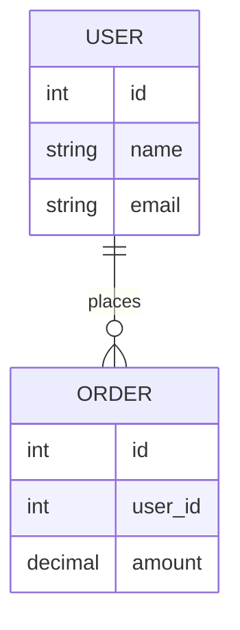

# `Mermaid`

是一种 **用文本描述图表，然后自动生成图形的工具**，特别适合写在 **Markdown** 以及其他轻量级简单图表场景中，支持多种图表：

- 流程图（Flowchart）
- 时序图（Sequence Diagram）
- 类图（Class Diagram）
- 状态图（State Diagram）
- 甘特图（Gantt）
- Git 提交图
- ER 图（数据库关系图）
- 用户旅程图等

# ER图

`Entity–Relationship Diagram`是一种 **数据库设计图**，用来描述：

- 数据中有哪些对象（实体）
- 这些对象之间有什么关系
- 每个对象有哪些属性




# `JSON`

`JSON`（`JavaScript Object Notation`）意为 JavaScript 对象表示法，是一种轻量级的数据表示格式。它使用类似 JavaScript 对象的结构来表示数据，常用于前后端通信中的数据交换，以及配置文件的存储。 

# 对象存储

对象存储（Object Storage）是一种数据存储方式，相比文件存储以层级目录管理数据、块存储以固定大小的数据块管理数据，对象存储将数据封装为对象进行存储和管理。

每个对象由三部分组成：

- Data：数据本身，可以是任意二进制内容，如图片、视频、JSON等。
- Metadata：元数据，即数据的属性信息，如大小、类型、创建时间等
- Key：对象的唯一标识，是一个字符串。通过 Key 可以在存储系统中定位并访问该对象

<h3>特点</h3>

- 扁平结构：不存在真实的层级目录结构，基于 Key 直接定位并访问对象。
- 不支持随机修改：对象一旦写入后不可部分修改，更新数据需要整体覆盖。
- 基于 HTTP API 访问：HTTP 协议本身无状态，请求之间相互独立，服务端无需维护客户端会话状态，易于横向扩展，天然适合构建分布式系统。
- 高扩展性与高可用性：底层采用分布式架构，支持海量数据存储和多副本/纠删码保障数据可靠性。
- 面向非结构化数据进行存储：适合存储图片、视频、文档、JSON 等任意二进制数据

# `S3`

`S3`是由Amazon Web Services（简称 **AWS**）定义的一套基于 HTTP/HTTPS 的对象存储服务访问规范。

<h3>规范内容</h3>

**资源模型**

`S3` 在对象（Object）之上引入了桶（Bucket）的概念,桶类似于命名空间。多个对象可以存储在同一个桶中，并通过「Bucket + Key」的组合唯一标识并访问对象。

**操作方式**

|     操作     | HTTP方法 |           示例            |
| :----------: | :------: | :-----------------------: |
|   上传对象   |   PUT    |    PUT /{bucket}/{key}    |
|   获取对象   |   GET    |    GET /{bucket}/{key}    |
|   删除对象   |  DELETE  |  DELETE /{bucket}/{key}   |
| 列出对象列表 |   GET    | GET /{bucket}?list-type=2 |

**鉴权机制**

S3 定义了一套签名认证机制：

- Access Key / Secret Key
- 签名算法（如 AWS Signature V4）

# 句柄(`Handle`)

句柄是资源管理者为系统中的资源提供的一种**间接访问机制**，本质是一个**资源标识符**。系统内部通常通过一张映射表，将句柄映射到真实资源对象。程序通过句柄访问资源，而不是直接操作资源本身，从而提高安全性、实现资源解耦以及统一的生命周期管理。

- 句柄本质上是一种用于实现资源间接访问的设计模式，最典型的应用场景是在操作系统的资源管理中，但在运行时系统和应用程序中也广泛存在。

# 背压

`Backpressure`是一种流量控制机制，当下游处理能力不足时，通过阻塞、排队或拒绝等方式限制上游的生产速度，使系统整体达到供需平衡，防止系统被压垮。

- 背压的本质就是让系统自我感知下游压力并反向调节。

# 反阿克曼函数

一种增长极度缓慢的函数，在人类计算机可处理的数值范围内，其值小于4，可以近似为常数。

# 文件描述符

File Descriptor（FD）是 Unix/Linux 操作系统为进程维护的，用于唯一标识该进程已打开文件或 I/O 资源的非负整数标识符，进程通过该标识访问内核中的文件或 socket 等资源。类似于其他操作系统中给进程提供的用于文件和IO操作的句柄。

# IO多路复用

IO多路复用是操作系统中IO处理的一种重要机制，它允许一个线程同时监听多个I/O资源如`socket`,文件等)的事件，从而提高IO并发处理能力。

- 对于`LInux/Unix`系统，I/O资源使用`FD`(文件描述符)标识，也就是监听多个文件描述符。

<h3>核心思想</h3>

IO多路复用的核心思想是由内核监控多个 IO 资源的就绪状态，并在资源就绪时通知应用。

- 传统非阻塞IO通常是应用主动查询 IO 状态，而非被动等待内核通知。

操作系统提供系统调用，让内核监听多个 IO 资源事件状态，没有就绪 IO 事件则阻塞在系统调用上，当某个 IO 事件就绪时返回给进程，从而避免了应用层阻塞等待或轮询空转。

## 经典实现

<h3><code>select</code></h3>

使用一个固定大小的位图(`fd_set`)记录所有被监控的`fd`(每一位表示一个`fd`是否被监听)，每次系统调用都让内核扫描一遍`fd_set`，查看是否存在就绪的`fd`。如果没有就阻塞等待。被 IO 事件唤醒后，会再次进入系统调用，并重新全量扫描 fd 。

**缺点**

- `fd`存在数量限制，位图的默认大小为1024，也就是最多能监听1024个`fd`。
- 每次系统调用都涉及`fd_set`从用户态到内核态的全量拷贝以及`fd_set`的全量扫描
- `fd_set`会被内核修改(内核会将不存在就绪事件的`fd`在位图中置为0)，每次调用都需要重新构造`fd_set`。

<h3><code>poll</code></h3>

`poll`是`select`的改进版，使用结构体数组(`pollfd`)代替位图记录被监控的`fd`，但没有改变`select`模型。

```
struct pollfd {
    int fd;
    short events;
    short revents;
};
```

**优点**

- 不存在`fd`的数量限制，数组可以随意设置大小

**缺点**

- 每次调用都需要全量扫描数组
- 仍然存在数组从用户态到内核态的全量拷贝

<h3><code>epoll</code></h3>

`epoll`相比于`select/poll`的核心是由内核维护就绪的`fd`集合，在 IO 事件发生时通过事件驱动机制更新集合，从而避免每次调用进行全量扫描所有`fd`。

`epoll`的执行过程分为三个阶段(或者说三个系统调用函数)：

1. **`epoll_create`：**创建内核`epoll`对象，这个内核对象包含三个结构：
   - **红黑树：**存储所有注册的`fd`。
   - **就绪队列(`ready list`)：**一个链表结构，记录已就绪的`fd`。
   - **等待队列：**记录阻塞在 epoll_wait 的进程/线程
2. **`epoll_ctl`：**用于注册`fd`。
   - 将`fd`加入到红黑树中
   - 在 fd 对应的 IO 资源上注册 epoll 回调函数，当IO状态变化，会自动触发`epoll`回调，将`fd`加入就绪队列，并唤醒正在`epoll_wait`的线程。
3. **`epoll_wait`：**阻塞线程等待IO事件。当 IO 事件发生时，内核通过回调机制唤醒阻塞线程。`epoll_wait `被唤醒后，从 `ready list` 中拷贝就绪 fd 到用户空间，清空 ready list，并返回结果。

**优点**

- 没有 fd 数量限制
- 通过`epoll`内核对象管理注册的`fd`，减少重复的用户态到内核态的全量数据拷贝
- 避免全量扫描`fd`，可以在O(1)时间复杂度内获取就绪`fd`。

