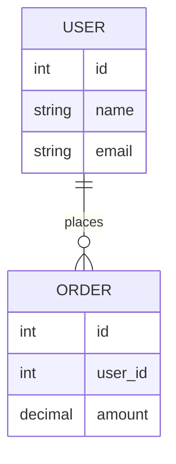

# `Mermaid`

是一种 **用文本描述图表，然后自动生成图形的工具**，特别适合写在 **Markdown** 以及其他轻量级简单图表场景中，支持多种图表：

- 流程图（Flowchart）
- 时序图（Sequence Diagram）
- 类图（Class Diagram）
- 状态图（State Diagram）
- 甘特图（Gantt）
- Git 提交图
- ER 图（数据库关系图）
- 用户旅程图等

# ER图

`Entity–Relationship Diagram`是一种 **数据库设计图**，用来描述：

- 数据中有哪些对象（实体）
- 这些对象之间有什么关系
- 每个对象有哪些属性

## JSON

JSON（JavaScript Object Notation）意为 JavaScript 对象表示法，是一种轻量级的数据表示格式。它使用类似 JavaScript 对象的结构来表示数据，常用于前后端通信中的数据交换，以及配置文件的存储。 