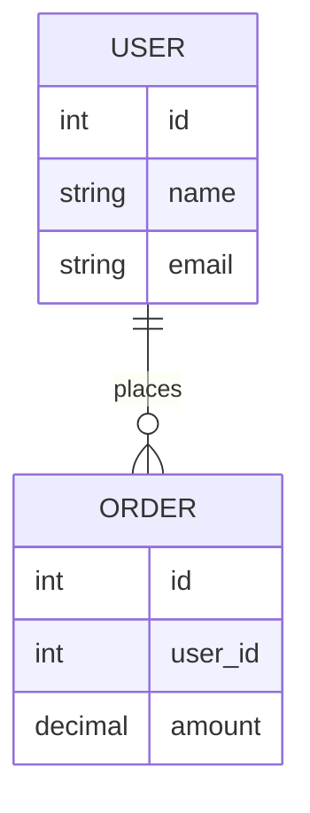

# `Mermaid`

是一种 **用文本描述图表，然后自动生成图形的工具**，特别适合写在 **Markdown** 以及其他轻量级简单图表场景中，支持多种图表：

- 流程图（Flowchart）
- 时序图（Sequence Diagram）
- 类图（Class Diagram）
- 状态图（State Diagram）
- 甘特图（Gantt）
- Git 提交图
- ER 图（数据库关系图）
- 用户旅程图等

# ER图

`Entity–Relationship Diagram`是一种 **数据库设计图**，用来描述：

- 数据中有哪些对象（实体）
- 这些对象之间有什么关系
- 每个对象有哪些属性

# `JSON`

`JSON`（`JavaScript Object Notation`）意为 JavaScript 对象表示法，是一种轻量级的数据表示格式。它使用类似 JavaScript 对象的结构来表示数据，常用于前后端通信中的数据交换，以及配置文件的存储。 

# 对象存储

对象存储（Object Storage）是一种数据存储方式，相比文件存储以层级目录管理数据、块存储以固定大小的数据块管理数据，对象存储将数据封装为对象进行存储和管理。

每个对象由三部分组成：

- Data：数据本身，可以是任意二进制内容，如图片、视频、JSON等。
- Metadata：元数据，即数据的属性信息，如大小、类型、创建时间等
- Key：对象的唯一标识，是一个字符串。通过 Key 可以在存储系统中定位并访问该对象

<h3>特点</h3>

- 扁平结构：不存在真实的层级目录结构，基于 Key 直接定位并访问对象。
- 不支持随机修改：对象一旦写入后不可部分修改，更新数据需要整体覆盖。
- 基于 HTTP API 访问：HTTP 协议本身无状态，请求之间相互独立，服务端无需维护客户端会话状态，易于横向扩展，天然适合构建分布式系统。
- 高扩展性与高可用性：底层采用分布式架构，支持海量数据存储和多副本/纠删码保障数据可靠性。
- 面向非结构化数据进行存储：适合存储图片、视频、文档、JSON 等任意二进制数据

# `S3`

`S3`是由Amazon Web Services（简称 **AWS**）定义的一套基于 HTTP/HTTPS 的对象存储服务访问规范。

<h3>规范内容</h3>

**资源模型**

`S3` 在对象（Object）之上引入了桶（Bucket）的概念,桶类似于命名空间。多个对象可以存储在同一个桶中，并通过「Bucket + Key」的组合唯一标识并访问对象。

**操作方式**

|     操作     | HTTP方法 |           示例            |
| :----------: | :------: | :-----------------------: |
|   上传对象   |   PUT    |    PUT /{bucket}/{key}    |
|   获取对象   |   GET    |    GET /{bucket}/{key}    |
|   删除对象   |  DELETE  |  DELETE /{bucket}/{key}   |
| 列出对象列表 |   GET    | GET /{bucket}?list-type=2 |

**鉴权机制**

S3 定义了一套签名认证机制：

- Access Key / Secret Key
- 签名算法（如 AWS Signature V4）