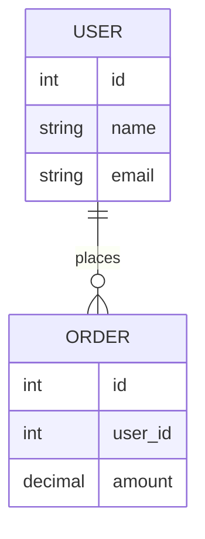

# `Mermaid`

是一种 **用文本描述图表，然后自动生成图形的工具**，特别适合写在 **Markdown** 以及其他轻量级简单图表场景中，支持多种图表：

- 流程图（Flowchart）
- 时序图（Sequence Diagram）
- 类图（Class Diagram）
- 状态图（State Diagram）
- 甘特图（Gantt）
- Git 提交图
- ER 图（数据库关系图）
- 用户旅程图等

## 流程图

```
flowchart TD

  A[开始] --> B{是否满足条件?}

  B -- 是 --> C[执行操作]

  B -- 否 --> D[结束]

  C --> D
```

### 子图

```
subgraph <title>
    graph definition
end
```

修改子图的方向：

```
subgraph
    direction 方向关键字
    graph definiton
end
```

### 基本结构

使用 flowchart 或 graph 关键字声明类型，并指定方向。

- TD / TB：从上到下

- LR：从左到右

- BT：从下到上

- RL：从右到左

### 节点

格式为 节点编码(节点名称)，后续可以直接使用节点编码引用上面定义的节点。可以用不同的括号定义其形状：

- A[方形]：默认矩形节点

- B(圆角矩形)：圆角节点

- C([体育场形])：体育场形节点

- D{菱形}：决策节点

- E((圆形))：圆形节点

- F[(圆柱)]：数据库形状

### 连接

使用不同的箭头连接节点，表达流程方法

- A --> B：带箭头的实线连接

- A --- B：不带箭头的实线连接

- A -.-> B：带箭头的虚线连接

- A ==> B：带箭头的粗线连接

- 可以在连接线上添加文字：A --是--> 

## 时序图

### 基本结构

通过 sequenceDiagram 关键字声明

### 参与者

用 participant 定义参与者，也可以使用 actor 表示角色

- 可以定义参与者的同时使用 as 为其取别名

- 也可以直接在发送消息时定义参与者

```
participant 用户 as U  
```

### 消息

定义参与者之间发送的消息

- A->>B: 消息：带箭头的实线

- A-->>B: 消息：带箭头的虚线

- A-xB: 消息：末端带叉的实线（通常表示销毁）

- A-)B: 消息：末端带空心箭头的实线（表示异步）

# ER图

`Entity–Relationship Diagram`是一种 **数据库设计图**，用来描述：

- 数据中有哪些对象（实体）
- 这些对象之间有什么关系
- 每个对象有哪些属性




# `JSON`

`JSON`（`JavaScript Object Notation`）意为 JavaScript 对象表示法，是一种轻量级的数据表示格式。它使用类似 JavaScript 对象的结构来表示数据，常用于前后端通信中的数据交换，以及配置文件的存储。 

# 对象存储

对象存储（Object Storage）是一种数据存储方式，相比文件存储以层级目录管理数据、块存储以固定大小的数据块管理数据，对象存储将数据封装为对象进行存储和管理。

每个对象由三部分组成：

- Data：数据本身，可以是任意二进制内容，如图片、视频、JSON等。
- Metadata：元数据，即数据的属性信息，如大小、类型、创建时间等
- Key：对象的唯一标识，是一个字符串。通过 Key 可以在存储系统中定位并访问该对象

<h3>特点</h3>

- 扁平结构：不存在真实的层级目录结构，基于 Key 直接定位并访问对象。
- 不支持随机修改：对象一旦写入后不可部分修改，更新数据需要整体覆盖。
- 基于 HTTP API 访问：HTTP 协议本身无状态，请求之间相互独立，服务端无需维护客户端会话状态，易于横向扩展，天然适合构建分布式系统。
- 高扩展性与高可用性：底层采用分布式架构，支持海量数据存储和多副本/纠删码保障数据可靠性。
- 面向非结构化数据进行存储：适合存储图片、视频、文档、JSON 等任意二进制数据

# `S3`

`S3`是由Amazon Web Services（简称 **AWS**）定义的一套基于 HTTP/HTTPS 的对象存储服务访问规范。

<h3>规范内容</h3>

**资源模型**

`S3` 在对象（Object）之上引入了桶（Bucket）的概念,桶类似于命名空间。多个对象可以存储在同一个桶中，并通过「Bucket + Key」的组合唯一标识并访问对象。

**操作方式**

|     操作     | HTTP方法 |           示例            |
| :----------: | :------: | :-----------------------: |
|   上传对象   |   PUT    |    PUT /{bucket}/{key}    |
|   获取对象   |   GET    |    GET /{bucket}/{key}    |
|   删除对象   |  DELETE  |  DELETE /{bucket}/{key}   |
| 列出对象列表 |   GET    | GET /{bucket}?list-type=2 |

**鉴权机制**

S3 定义了一套签名认证机制：

- Access Key / Secret Key
- 签名算法（如 AWS Signature V4）

# 句柄(`Handle`)

句柄是资源管理者为系统中的资源提供的一种**间接访问机制**，本质是一个**资源标识符**。系统内部通常通过一张映射表，将句柄映射到真实资源对象。程序通过句柄访问资源，而不是直接操作资源本身，从而提高安全性、实现资源解耦以及统一的生命周期管理。

- 句柄本质上是一种用于实现资源间接访问的设计模式，最典型的应用场景是在操作系统的资源管理中，但在运行时系统和应用程序中也广泛存在。

# 背压

`Backpressure`是一种流量控制机制，当下游处理能力不足时，通过阻塞、排队或拒绝等方式限制上游的生产速度，使系统整体达到供需平衡，防止系统被压垮。

- 背压的本质就是让系统自我感知下游压力并反向调节。

# 反阿克曼函数

一种增长极度缓慢的函数，在人类计算机可处理的数值范围内，其值小于4，可以近似为常数。

# 文件描述符

File Descriptor（FD）是 Unix/Linux 操作系统为进程维护的，用于唯一标识该进程已打开文件或 I/O 资源的非负整数标识符，进程通过该标识访问内核中的文件或 socket 等资源。类似于其他操作系统中给进程提供的用于文件和IO操作的句柄。

# IO多路复用

IO多路复用是操作系统中IO处理的一种重要机制，它允许一个线程同时监听多个I/O资源如`socket`,文件等)的事件，从而提高IO并发处理能力。

- 对于`LInux/Unix`系统，I/O资源使用`FD`(文件描述符)标识，也就是监听多个文件描述符。

<h3>核心思想</h3>

IO多路复用的核心思想是由内核监控多个 IO 资源的就绪状态，并在资源就绪时通知应用。

- 传统非阻塞IO通常是应用主动查询 IO 状态，而非被动等待内核通知。

操作系统提供系统调用，让内核监听多个 IO 资源事件状态，没有就绪 IO 事件则阻塞在系统调用上，当某个 IO 事件就绪时返回给进程，从而避免了应用层阻塞等待或轮询空转。

## 经典实现

<h3><code>select</code></h3>

使用一个固定大小的位图(`fd_set`)记录所有被监控的`fd`(每一位表示一个`fd`是否被监听)，每次系统调用都让内核扫描一遍`fd_set`，查看是否存在就绪的`fd`。如果没有就阻塞等待。被 IO 事件唤醒后，会再次进入系统调用，并重新全量扫描 fd 。

**缺点**

- `fd`存在数量限制，位图的默认大小为1024，也就是最多能监听1024个`fd`。
- 每次系统调用都涉及`fd_set`从用户态到内核态的全量拷贝以及`fd_set`的全量扫描
- `fd_set`会被内核修改(内核会将不存在就绪事件的`fd`在位图中置为0)，每次调用都需要重新构造`fd_set`。

<h3><code>poll</code></h3>

`poll`是`select`的改进版，使用结构体数组(`pollfd`)代替位图记录被监控的`fd`，但没有改变`select`模型。

```
struct pollfd {
    int fd;
    short events;
    short revents;
};
```

**优点**

- 不存在`fd`的数量限制，数组可以随意设置大小

**缺点**

- 每次调用都需要全量扫描数组
- 仍然存在数组从用户态到内核态的全量拷贝

<h3><code>epoll</code></h3>

`epoll`相比于`select/poll`的核心是由内核维护就绪的`fd`集合，在 IO 事件发生时通过事件驱动机制更新集合，从而避免每次调用进行全量扫描所有`fd`。

`epoll`的执行过程分为三个阶段(或者说三个系统调用函数)：

1. **`epoll_create`：**创建内核`epoll`对象，这个内核对象包含三个结构：
   - **红黑树：**存储所有注册的`fd`。
   - **就绪队列(`ready list`)：**一个链表结构，记录已就绪的`fd`。
   - **等待队列：**记录阻塞在 epoll_wait 的进程/线程
2. **`epoll_ctl`：**用于注册`fd`。
   - 将`fd`加入到红黑树中
   - 在 fd 对应的 IO 资源上注册 epoll 回调函数，当IO状态变化，会自动触发`epoll`回调，将`fd`加入就绪队列，并唤醒正在`epoll_wait`的线程。
3. **`epoll_wait`：**阻塞线程等待IO事件。当 IO 事件发生时，内核通过回调机制唤醒阻塞线程。`epoll_wait `被唤醒后，从 `ready list` 中拷贝就绪 fd 到用户空间，清空 ready list，并返回结果。

**优点**

- 没有 fd 数量限制
- 通过`epoll`内核对象管理注册的`fd`，减少重复的用户态到内核态的全量数据拷贝
- 避免全量扫描`fd`，可以在O(1)时间复杂度内获取就绪`fd`。

# Windows Shell（ShellExecute）机制

是`Win + R`运行窗口的底层机制。它不仅能执行 `.exe`，还可以：

- 打开文件（比如 `.txt`、`.html`）
- 打开系统组件（比如 `control`、`regedit`）
- 访问路径（比如 `C:\`）
- 解析 URL / 协议

## `LaTeX`

# `WebRTC`

全称 **Web Real-Time Communication**，是一种让浏览器或应用程序能够**直接进行实时音视频通信和数据传输的技术**。

<h4>特点</h4>

- **低延迟：**实时性强
- 无需插件，浏览器原生支持
- 安全

<h4>应用场景</h4>

- 实时共享屏幕
- 点对点文件传输
- 网页视频聊天

## 核心功能

<h4>音视频通信</h4>

- 支持摄像头 + 麦克风
- 实现点对点视频通话

<h4> 数据通道</h4>

- 可以直接发送文本、文件、游戏数据
- 延迟很低（适合实时应用）

<h4>点对点连接（P2P）</h4>

- 两个客户端直接连接,不一定需要服务器转发

# RTMP

RTMP（Real-Time Messaging Protocol）是一种**实时音视频传输协议**，最早由 Adobe 为 Flash 播放器设计。

<h4>特点</h4>

- 低延迟
- 基于 TCP 长连接
- 支持流式传输

<h4>应用场景</h4>

- 直播

# SRS

全称`Simple Realtime Server`，是一个开源流媒体服务器。

<h4>应用场景</h4>

- 视频直播
- 音视频推流
- 低延迟直播

## 核心功能

<h4>接收推流</h4>

接收`OBS`/`FFmpeg`/手机直播 SDK 等向`SRS`推送的`RTMP/WebRTC`视频流。

<h4>协议转换</h4>

<h4>分发视频流</h4>

将视频流分发给用户。

## 部署

可以直接使用`Docker`部署。

```
docker run -it  \
-p 1935:1935 \
-p 1985:1985 \
-p 8080:8080 \
ossrs/srs
```

| 端口 | 用途                     |
| ---- | ------------------------ |
| 1935 | RTMP 推流                |
| 1985 | API接口                  |
| 8080 | HTTP服务（播放页面/FLV） |

# FLV

全称`Flash Video Format`，是由 Adobe 推出的一种视频文件封装格式，专门用于配合 Adobe Flash Player 在网页中播放视频，主要用于早期的网页视频播放。

<h4>特点</h4>

- **适合网络传输(早期)：**文件体积小，适合低带宽环境，支持边下边播（流式播放）。
- **依赖`Flash`播放器**
- **封装结构简单**

## `HTTP-FLV`

是一种基于`FLV`和`HTTP`的流媒体传输方案，服务端和客户端建立`HTTP`长连接，服务端基于`chunked`分块传输`FLV`数据流，客户端可以边收边播。

# `WebSocket`

`WebSocket`是一种基于 TCP 的全双工实时通信协议。允许在单个 TCP 连接上进行全双工通信，专门用于在 **客户端和服务器之间建立持久、双向的实时通信**，从而弥补 HTTP 协议在实时交互上的不足。

**URL示例**

```
ws://example.com/ws?room_id=1001&token=xxx
```

<h4>特点</h4>

- **双向实时通信：**不像 HTTP 是请求-响应模式，WebSocket建立连接后，**客户端和服务器可以随时互相发送消息**。
- **长连接：**连接建立后会一直保持，不需要每次交互都重新建立 TCP 连接，降低了延迟和资源消耗。
- **轻量数据传输：**数据帧开销小，不像 HTTP 每次都需要完整的头部信息，适合实时数据传输。
- **实时性强：**适合聊天应用、股票行情、游戏、物联网设备等需要即时数据更新的场景。

<h4>工作原理</h4>

**握手阶段**

- 浏览器通过 HTTP 协议发起一个特殊的请求（请求头带 `Upgrade: websocket`），向服务器声明希望升级到 WebSocket 协议。
- 服务器同意后返回 101 状态码，表示协议切换成功。
- 之后，连接就变成 WebSocket 连接，保持长连接。

**数据传输阶段**

- 双方可以随时发送消息，消息以 **数据帧（frame）** 形式传输，支持文本或二进制。

**关闭连接**

- 任意一方都可以发送关闭帧，关闭连接。

## 帧(`Frame`)

`WebSocket`对应用层提供以`Message`(消息)作为单位的传输服务，实际传输时`WebSocket`会将数据封装为数据帧`frame`，以帧为单位进行数据传输。

`WebSocket`中有许多种不同功能的帧：

- `Text Frame` ：文本帧
- `Binary Frame`：二进制帧
- `Ping Frame` ：心跳检测
- `Pong Frame` ：心跳响应
- `Close Frame` ：关闭连接

## 主流语言支持

<h3><code>gorilla/websocket</code></h3>

`Go`中最主流的`WebSocket`库，与`Go`原生`net/http`配合很好。

**安装**

```
go get github.com/gorilla/websocket
```

**使用示例**

```go
var upgrader = websocket.Upgrader{
    CheckOrigin: func(r *http.Request) bool {
        return true
    },
}

func wsHandler(w http.ResponseWriter, r *http.Request) {

    // HTTP升级为WebSocket
    conn, err := upgrader.Upgrade(w, r, nil)
    if err != nil {
        return
    }

    defer conn.Close()

    for {

        // 读取消息
        messageType, msg, err := conn.ReadMessage()
        if err != nil {
            break
        }

        fmt.Println(string(msg))

        // 回写消息
        conn.WriteMessage(messageType, msg)
    }
}

func main() {
    http.HandleFunc("/ws", wsHandler)
    http.ListenAndServe(":8080", nil)
}
```


<h3><code>Spring WebSocket</code></h3>


## `WebSocket Secure`

WebSocket Secure（WSS）是在 WebSocket 协议基础上，通过 TLS/SSL 提供加密传输能力的安全通信协议。类似于`http`与`https`。

**URL示例**

```
ws://example.com/ws?room_id=1001&token=xxx
```


# `HTTP`

<h4>版本更迭</h4>

目前`HTTP`有四个主流版本：

**HTTP 0.9**

最早的版本（1991）

特点：

```
只有 GET
没有 Header
没有状态码
只能传 HTML
```

请求长这样：

```
GET /index.html
```

服务器直接回 HTML，非常原始。

**HTTP/1.0**

1996 年正式标准化。

新增：

- Header
- 状态码
- POST
- Content-Type

开始像现代 HTTP，但：

```
一次请求
一次 TCP
```

请求完就断开，性能很差。

**HTTP/1.1**

最经典、寿命最长的版本。

新增很多关键能力：

- Keep-Alive 长连接
- Host 头
- Chunked Transfer
- Cache 控制
- Pipeline（后来基本废弃）

真正奠定现代 Web，现在大量系统仍在使用。

**HTTP/2**

发布于2015 年。

最大变化：

```
文本协议
→
二进制协议
```

核心能力：

- 多路复用
- Header 压缩
- Stream
- Frame
- Server Push（现基本废弃）

**HTTP/3**

最新主流版本。

最大的变化：

```
TCP
→
QUIC（基于 UDP）
```

也就是说：

HTTP/3 不再跑在 TCP 上。

HTTP/3 为什么出现

HTTP/2 虽然解决了：

```
HTTP 层队头阻塞
```

但仍有：

```
TCP 队头阻塞
```

比如：

TCP 丢一个包：

```
整个连接都得等重传
```

即使别的 Stream 没问题也要等。

------

HTTP/3 的 QUIC：

```
每个流独立
```

丢包影响更小。

而且：

- 握手更快
- TLS 内置
- 移动网络切换更稳

现在：

- Chrome
- Edge
- Cloudflare
- YouTube

大量使用 HTTP/3。

# 灰度测试

又称为灰度发布/金丝雀发布，是一种渐进式软件发布策略。在新版本正式全面上线前，先向一小部分用户或服务器推出，观察其稳定性、性能和用户反馈，确认无误后再逐步扩大范围，最终完全替换旧版本。

# WebService

# WebView

WebView 是一个嵌入式浏览器组件，它允许开发者在原生应用中直接加载和显示网页内容。它的核心是渲染引擎，负责解析 HTML/CSS/JavaScript 并绘制页面。

- 不同平台的WebView实现不同

## JSBridge

JSBridge是WebView 的核心能力，它允许JavaScript 与原生代码双向通信

# MVVM

MVVM（Model-View-ViewModel）是一种软件架构模式，旨在将用户界面（UI）与业务逻辑和数据分离。它是 MVC 模式的演进。

## 核心组件

<h3> Model（模型）</h3>

封装应用程序的数据和业务逻辑

<h3>View(视图)</h3>

封装应用程序的数据和业务逻辑

<h3>ViewModel(视图模型)</h3>

连接 View 和 Model 的桥梁，持有 View 需要的数据状态，并处理 UI 相关的逻辑，但不直接引用 View。

# MP3

MP3是一种有损压缩的音频文件格式。

## 特点

- 有损压缩：去除人耳不敏感的频段信息，压缩率约1:10

- 广泛兼容：几乎所有设备和播放器支持

- VBR支持：可变比特率，在复杂段落用更高码率，简单段落降低码率以节省空间

## 组成

### ID3标签

存储了该音频的元数据(非必须)，ID3标签有两个版本：

- ID3v1：位于文件末尾，固定128字节，包含标题、艺术家、专辑等基本信息

- ID3v2：位于文件开头，支持更丰富的元数据（封面、歌词、评论等），长度可变

由于物理位置完全不同，ID3v1和ID3v2可以同时存在，为了兼容旧播放器，在写入 ID3v2时，会同时把精简信息写入 ID3v1。

### 音频帧

一个MP3文件可以包含多个音频帧，每帧独立解码。每个帧由帧头（4字节）和主数据（压缩音频数据）组成。

# Sqlite

SQLite 是一个 嵌入式关系型数据库。

## 特点

- 无服务器架构 ：不需要独立的数据库服务器进程，数据库以 单个文件 的形式存储在磁盘上。应用程序通过 SQLite 库直接读写这个文件，无需网络通信。

- 动态类型： SQLite 采用 动态类型 系统（Manifest Typing），列的类型声明只是建议性的，实际存储时可以存入任意类型的数据。

- 采用 B-tree 结构组织数据，主要包含两类文件：
  - 主数据库文件（.db）：包含表、索引、视图等所有数据

  - 事务日志（.wal/.journal）：保证 ACID 事务的原子性

- 并发控制：写操作独占锁，同一时间只能有一个写操作；读操作共享锁，多个读操作可以并行执行

# SLA

SLA 是 Service Level Agreement（服务等级协议）的缩写,这是服务提供者与客户之间签订的正式合同或协议，明确规定了服务的质量标准、性能指标、响应时间、可用性要求等内容。

# 具身智能

具身智能（Embodied Intelligence）是人工智能领域的一个重要研究方向，指智能体通过物理或虚拟的"身体"与环境进行交互，从而获取、处理和应用知识的能力。

# Temporal

Temporal 是一个开源的微服务编排引擎，用于构建可靠的、可恢复的分布式应用。它的核心思想是：将业务逻辑写成普通代码，由 Temporal 保证执行的可靠性和持久性。

## 核心概念

### Workflow（工作流）

定义业务流程的代码，描述一系列步骤的执行顺序和逻辑。工作流是持久化的，执行状态会被记录下来，进程崩溃后可以恢复。

### Activity（活动）

工作流中的单个操作步骤，通常是与外部系统交互的代码（如调用 API、数据库操作等）。Activity 是无状态的，可以重试。

### Task Queue（任务队列）

Workflow 和 Activity 任务的缓冲队列，Worker 从队列中拉取任务执行。

### Worker（工作者）

执行 Workflow 和 Activity 的进程。Worker 从 Task Queue 轮询任务并执行。

### Temporal Server 

核心服务，负责持久化状态、调度任务、管理队列、提供 API。

## 工作原理

```
  ┌─────────────────┐

  │ Temporal Server │ ← 存储状态、调度任务

  └────────┬────────┘

           │

  ┌────────▼────────┐

  │  Task Queue     │ ← 任务队列（Workflow Task / Activity Task）

  └────────┬────────┘

           │

  ┌────────▼────────┐

  │   Worker        │ ← 拉取任务，执行 Workflow/Activity 代码

  └─────────────────┘
```

# 状态机

状态机（State Machine）是一种描述系统在不同状态之间如何转换的数学模型，核心思想是：系统在任意时刻只能处于一个确定的状态，当收到特定事件/输入时，会按规则转换到另一个状态。

## 核心组成

| 要素               | 说明                                  |
| ------------------ | ------------------------------------- |
| 状态（State）      | 系统某一时刻的稳定情况                |
| 事件（Event）      | 触发状态变化的外部信号                |
| 转换（Transition） | 从一个状态到另一个状态的规则          |
| 动作（Action）     | 状态转换时或进入/退出状态时执行的操作 |

## 常见类型

1. 有限状态机（FSM）：状态数量有限，最常用

2. Mealy 机：输出依赖于当前状态 + 输入

3. Moore 机：输出仅依赖于当前状态

# MQTT

MQTT（Message Queuing Telemetry Transport，消息队列遥测传输）是一种轻量级的发布/订阅（Pub/Sub）消息协议，专为低带宽、高延迟或不可靠网络环境设计。

## 核心概念

| 概念                | 说明                                                      |
| ------------------- | --------------------------------------------------------- |
| 发布/订阅模型       | 客户端通过 Broker（代理）间接通信，解耦发送方和接收方     |
| 主题（Topic）       | 消息的分类路径，如 `sensor/temperature`                   |
| QoS（服务质量）     | 消息投递等级：0（最多一次）、1（至少一次）、2（恰好一次） |
| 持久会话（Session） | 客户端断线后保留订阅和未送达消息                          |
| 遗嘱消息（Will）    | 客户端异常断开时，Broker 自动发布通知                     |

## 协议特点

- 轻量：头部最小仅 2 字节，适合嵌入式设备

- 低功耗：基于 TCP，支持心跳保活（Keep Alive）

- 双向通信：任何客户端既可发布也可订阅

- 三种消息模式：
  - 保留消息（Retained）：新订阅者立即收到最新一条消息
  - 遗愿消息（LWT）：异常断线通知
  - 清洁会话（Clean Session）：断线后是否清除状态

# OpenResty

OpenResty 是一个基于 Nginx + LuaJIT 的高性能 Web 平台，通过将 Lua 脚本嵌入 Nginx 内部，使其具备强大的动态处理能力。

- Nginx只具有流量转发的功能，搭配Lua脚本，解决"Nginx 缺乏业务处理能力"的问题。

# 一致性Hash算法

一致性哈希是一种分布式负载均衡与数据分片算法，核心目的是最小化节点增减时的数据迁移成本。

## 核心思想

假设有 N 个节点，使用传统 Hash (hash(key) % N)映射数据，当 N 发生变化时，几乎所有 key 的节点位置都会改变，大量数据需要迁移，缓存失效，数据库压力飙升。

一致性哈希的核心思想为哈希环 + 顺时针寻址 + 虚拟节点。

一致性哈希将节点和数据 key 都映射到同一个哈希环（ 一个[0, 2^32 - 1] 的整数空间，首尾相接形成环）上，每个 key 顺时针找到最近的节点，即为其归属节点。

新增节点时，只影响环上相邻区间，其他数据不动；删除节点时，该节点的数据顺时针迁移到下一个节点，其余不动。

- 传统哈希把节点数纳入映射公式，一致性哈希把节点和 key 独立映射到同一固定空间，再通过"就近原则"关联，这就是节点增减时影响范围小的本质。

## 使用场景

| 场景           | 用途                                          |
| -------------- | --------------------------------------------- |
| 分布式缓存     | Memcached 集群、Redis Cluster 数据分片        |
| CDN / 负载均衡 | 请求按 URL 哈希分配到固定节点，提升缓存命中率 |
| 分布式存储     | Cassandra、DynamoDB 的数据分区                |
| P2P 网络       | BitTorrent 的 DHT 路由表                      |

## 虚拟节点

节点哈希值分布不均时，某些节点会承担过多数据（数据倾斜），可以将每个物理节点映射为多个虚拟节点，均匀撒在环上，这样即使节点少，也能在环上均匀分布，负载更均衡。

## 实现

# Lua

Lua 是一种轻量级、可扩展的脚本语言。

------

# 注释

```lua
-- 单行注释

--[[
    多行注释
    可以嵌套
--]]
```

------

# 变量

Lua 中的变量没有变量类型，可以随意赋值为任意类型。

```lua
-- 全局变量(默认)
name = "Lua"
age = 25

-- 局部变量
local score = 90
```

------

# 数据类型

Lua 中有 `nil`, `boolean`, `number`, `string`, `table`, `function`, `userdata`, `thread` 等数据类型。

------

# String

```lua
s = "Hello" .. " World"  -- 字符串拼接
len = #s                 -- 获取长度
```

------

# Table

表（table）是 Lua 中的唯一的复合数据结构，是一切复杂数据的基础，可以通过它实现数组，字典，对象，模块等多种结构。

- table 可以使用任意类型的值（除 nil 和 NAN）作为键，值可以是任意 Lua 类型
- 自动增长和缩小
- 引用类型

## 原理

Lua 的 table 在底层被实现为两部分混合结构：

```
┌─────────────────┐
│   数组部分      │  ← 连续整数键 1..n 的值
│  [1][2][3][4]   │
├─────────────────┤
│   哈希部分      │  ← 非连续整数键、字符串键、其他类型键
│  key → value    │
└─────────────────┘
```

从 1 开始的连续整数键，会被存入数组部分，其余键会被存入哈希部分。

这使其同时具备数组的高性能遍历和哈希表的灵活键值映射。

- table 中的数组部分索引从 1 开始

------

## 创建/初始化

使用 `{}` 创建 table，通过键值对初始化其值，键值对的基本格式为 `[key] = value`，key 使用 `[]` 包裹。

```lua
-- 空表
local t = {}

-- 初始化
local t1 = { ["name"] = "xiaoliu"}
```

为了方便使用 table 实现数组和字典等结构，table 也提供了数组和字典风格的简化等价初始化语法。

### 数组风格

数组下标默认从 1 开始。

```lua
local arr = { "苹果", "香蕉", "橙子" }

-- 等价于
local arr = {
    [1] = "苹果",
    [2] = "香蕉",
    [3] = "橙子"
}
```

### 字典风格

key 为字符串类型。

```lua
local person = {
    name = "张三",
    age = 20,
    gender = "男"
}

-- 等价于

local person = {
    ["name"] = "张三",
    ["age"] = 20,
    ["gender"] = "男"
}
```

### 混合写法

```lua
local mix = {
    "第一个元素", -- [1]
    name = "李四",
    100, -- [2]
    height = 180
}
```

------

# 访问元素

```lua
-- t[key]为通用语法，支持所有类型的键
t[1]
```

对于字符串键，提供了 `t.key` 的语法糖进行元素访问。

```lua
t.name
```

------

# 新增/修改元素

直接对元素赋值，不存在自动新增，存在则覆盖原值。

```lua
-- t[key] = xxx为通用语法，支持所有类型的键
t[1] = "测试"

-- 对于字符串键，提供了 t.key = xxx 的特殊语法
t.age = 18
```

------

# 删除元素

删除元素即将其赋值为 `nil`。

table 不会主动释放空间，仅标记为空；数组段中的 nil 会破坏连续长度。

```lua
local t = {10,20,30}

t[2] = nil -- 删除第二个元素

print(t[2]) -- nil
```

- 访问 Table 中不存在的键会返回 nil。
- 将一个键的值设为 nil 等同于从表中删除该键值对。

------

# 模块

```lua
-- 定义模块
local module = {}

module.hello = function()
    print("Hello")
end

return module


-- 加载模块
local m = require("module")
```

------

# 其他操作

## 数组长度

使用 `#t` 获取数组部分长度，只计算连续整数 `1,2,3...` 无中断的数组长度，遇到第一个 nil 停止。

```lua
local t = {"a","b","c"}

print(#t) -- 3
```

------

## 遍历

### ipairs

- 只遍历连续整数数组段，从 1 开始，遇到 nil 立刻终止
- 不遍历字符串、浮点等非整数键

```lua
for i, v in ipairs(t) do
    print(i, v)
end

-- 只取值
for _, v in pairs(t) do end

-- 只取键
for k in pairs(t) do end
```

### pairs

遍历 table 所有键值对。

```lua
for k, v in pairs(person) do
    print(k, v)
end
```

------

# 内置函数

Lua 提供了 table 库来操作 Table。

| 函数                               | 描述                                                    | 示例                                          |
| ---------------------------------- | ------------------------------------------------------- | --------------------------------------------- |
| `table.insert(list, [pos,] value)` | 在 list 的 pos 位置插入 value，默认位置是末尾。         | `table.insert(t, 2, "new")`                   |
| `table.remove(list, [pos])`        | 移除 list 中 pos 位置的元素并返回它，默认移除最后一个。 | `local v = table.remove(t, 1)`                |
| `table.concat(list, [sep, i, j])`  | 将 list 中 i 到 j 的元素用 sep 连接成字符串。           | `local s = table.concat(t, ", ")`             |
| `table.sort(list, [comp])`         | 对 list 进行排序，可传入自定义比较函数 comp。           | `table.sort(t, function(a,b) return a>b end)` |
| `table.move(a1, f, e, t, [a2])`    | 将表 a1 中从 f 到 e 的元素移动到表 a2 的 t 位置。       | `table.move(src, 1, 3, 5, dst)`               |

- `table.concat`、`table.insert`、`table.remove` 等函数主要操作 Table 的数组部分，会忽略非数字键。

------

# 元表

元表是 table 的一个高级特性，允许改变或扩展一个 table 的默认行为。

常用的元表属性有：

- `__index`：当访问一个表中不存在的键时被调用，常用于实现继承或提供默认值。
- `__newindex`：当给一个表中不存在的键赋值时被调用，可用于监控或过滤对表的写入操作。
- `__add`、`__sub` 等：用于重载算术运算符。
- `__eq`、`__lt` 等：用于重载关系运算符。
- `__call`：让 Table 可以像函数一样被调用。
- `__tostring`：自定义 Table 被 `print()` 时的输出。

## 获取元表

```lua
getmetatable()
```

## 设置元表

```lua
-- 为 originTable 设置元表并返回 originTable
table = setmetatable(originTable, metaTable)
```

------

# 流程控制语句

```lua
-- if-else
if age > 18 then
    print("Adult")
elseif age == 18 then
    print("Just adult")
else
    print("Minor")
end


-- for 循环
for i = 1, 10 do
    print(i)
end


-- while 循环
while count < 5 do
    count = count + 1
end


-- repeat-until（至少执行一次）
repeat
    print("loop")
until condition
```

------

# 函数

```lua
function add(a, b)
    return a + b
end


-- 匿名函数
local mul = function(x, y)
    return x * y
end


-- 可变参数
function sum(...)
    local total = 0

    for _, v in ipairs({...}) do
        total = total + v
    end

    return total
end
```

------

# 垃圾回收

- 垃圾回收器会在没有引用指向一个 Table 时自动回收其内存。

------

# 协程

Lua 自带协程库，位于 `coroutine` 模块中。

## 核心 API

| 函数                        | 作用                                                         | 返回值                            |
| --------------------------- | ------------------------------------------------------------ | --------------------------------- |
| `coroutine.create(f)`       | 创建一个协程（传入一个函数），返回协程句柄。                 | 线程（thread）对象                |
| `coroutine.resume(co, ...)` | 启动或恢复协程 co，可传入参数。                              | boolean（是否成功）+ 函数的返回值 |
| `coroutine.yield(...)`      | 挂起当前协程，并返回数据给 resume 的调用者。                 | 返回下一次 resume 传入的参数      |
| `coroutine.status(co)`      | 查看协程状态："suspended"（挂起）、"running"、"dead"（结束）。 | 状态字符串                        |
| `coroutine.wrap(f)`         | 创建协程并返回一个函数，每次调用该函数就相当于 resume。      | 函数（无状态布尔返回，直接传值）  |

# 关联数组

关联数组是一种通过键（Key）而非连续整数索引访问元素的数据结构，每个键对应唯一的值，可动态扩展和高效查找。

# EAM

EAM是Enterprise Asset Management 的缩写，EAM系统是指企业资产管理系统

# Spec Coding

SPEC Coding即在使用AI变成时通过 Specification-Driven Development（规格驱动开发），核心理念是：在让AI写代码之前，先由人或人与AI协作，把要做什么、怎么做（即规格说明，Specification）写清楚。

## 特征

| 特征     | Vibe Coding（氛围编程）                                  | Spec Coding（规格驱动编程）                                  |
| -------- | -------------------------------------------------------- | ------------------------------------------------------------ |
| 核心     | 感觉驱动：给 AI 一句模糊的意图或指令，直接生成代码       | 规范驱动：先产出结构化、详尽的规格文档，再交由 AI 按“蓝图”实现 |
| 过程     | 对话式、迭代式：通过不断和 AI 对话、调整指令来完善代码   | 规划式、工程化：遵循“规范 → 设计 → 任务 → 实现”的清晰流程    |
| 适用场景 | 探索性、一次性：快速验证想法、编写一次性脚本、内部小工具 | 生产级、长期维护：企业级应用、多人协作、对可靠性和可追溯性要求高的项目 |
| 优点     | 速度快，适合快速试错                                     | 质量高、可维护，大幅减少返工，过程可控                       |
| 缺点     | 质量不可控，容易产生“屎山”代码，难以维护和协作           | 前期投入较大，需要花费时间编写和维护规格文档                 |

一个典型的Spec Coding工作流通常包含以下四个阶段：

1. 需求 (Requirements)：将产品想法或用户故事转化为结构化的需求文档，明确功能目标和验收标准。

2. 设计 (Design)：基于需求文档，生成技术设计文档，包括数据模型、API接口设计、组件设计等。

3. 任务 (Tasks)：将设计方案拆解为一系列可执行的、有依赖关系的原子任务。

4. 实现 (Implementation)：AI按照任务列表，逐一进行代码实现。

这个流程的关键是，每个阶段的产出都由人来审核和确认，确保方向正确，从而让AI的编程过程变得可控和可追溯。

#  Transformer

Transformer 是一种深度学习神经网络架构，2017 年由 Google 在《Attention Is All You Need》中提出。核心是完全基于注意力机制（Attention）并行处理数据，彻底放弃了 RNN/CNN 的串行计算方式。

## 优势

在Transformer之前，RNN及其变体（如LSTM）是处理序列数据（如文本）的主流。但它们存在两个根本问题：

1. 串行处理：必须按顺序一个词一个词地处理，无法充分利用现代GPU的并行计算能力，训练速度慢。

2. 长距离依赖：当句子很长时，开头的信息在传递到结尾时可能会“衰减”或“消失”，难以捕捉长距离的词语关联。

Transformer通过自注意力机制（Self-Attention） 让每个词都能直接“看到”句子中的所有其他词，并计算出它们之间的关联强度

## 自注意力机制

# 分词

## 基于词典的分词方法

核心思想是维护一部足够大的机器词典，按一定策略匹配出词串。

- 正向最大匹配法 (FMM)

从左到右，每次切出词典中最长的词。简单快速，但容易局部最优，忽略后面能成词的可能。

- 逆向最大匹配法 (BMM)

从右到左匹配，通常比正向略准（汉语偏正结构中心词在后）。同样存在歧义处理不强的问题。

- 双向最大匹配法

同时用 FMM 和 BMM 切分，然后根据规则（如词数少、单字少）选一个结果，或借助外部统计再判断。

- 最短路径法（N-最短路径）

把所有可能的词构建成有向无环图（DAG），边的权重可以用词频取负对数，然后求最短路径（最优切分组合）。

优点：速度快、实现简单。

缺点：严重依赖词典规模和质量，对歧义和未登录词（新词、专名）处理能力弱。

# 编码小技巧

Redis中使用scan分批扫描替代keys

在Spring的Redis包中，包含RedisCacheWriter接口，原生实现的 clean() 方法使用 keys 命令在大数据量下会阻塞 Redis。这里重写了 clean()，使用 SCAN 命令分批迭代，避免生产环境性能风险：

```
Cursor<byte[]> cursor = connection.scan(

  new ScanOptions.ScanOptionsBuilder().match(new String(pattern)).count(1000).build());

Set<byte[]> byteSet = new HashSet<>();

while (cursor.hasNext()) {

  byteSet.add(cursor.next());

}
```

- 在清理场景，可以配合异步内存释放命令

# AIGC

AIGC 是英文 Artificial Intelligence Generated Content 的缩写，中文直译为“人工智能生成内容”。目前 AIGC 的应用已经非常广泛，常见形式包括：

- 文本生成：如 ChatGPT 写文章、报告、邮件，或进行诗歌创作。

- 图像生成：如 Midjourney、Stable Diffusion 根据文字描述（Prompt）生成图片。

- 视频生成：如 Sora、可灵 AI 生成动态视频，或数字人播报。

- 音频生成：AI 作曲、语音克隆（TTS）、播客配音。

- 代码与3D模型生成：GitHub Copilot 写代码，或 AI 生成三维资产。

# To B/To C

To B即To Business，指的是以企业、政府、学校等组织机构为主要客户，向其提供产品或服务的商业模式。To C即 To Consumer，即即面向个人消费者的模式。

# OCR

OCR 是 Optical Character Recognition（光学字符识别）的缩写，它可以将图片上的文字提取出，变成可编辑的文本。

它的核心运作逻辑分三步：

- 图像预处理：把照片变正、去噪、提高对比度，让文字更清晰。
- 文字检测：找出图片里哪里是文字区域（区分文字和背景）。
- 字符识别：将检测到的笔画形状与字库比对，转换成计算机能识别的编码（如 UTF-8）。

# ACL

ACL(Access Control List,访问控制列表)是常见的权限控制机制,核心思想是:为每个资源维护一个"谁可以做什么"的列表。

## 核心数据模型

ACL的核心数据模型是一个表示谁可以对什么资源做什么的三元组。

```
(Subject, Resource, Action) (主体, 资源, 操作)
```

# Blob

Binary Large Object，二进制大对象，指存储二进制数据的容器/数据类型。

## 常见场景

1. 数据库中
   - 用于存储二进制数据，如图片、音频、视频、PDF等
   - MySQL、Oracle、SQLite等都有 BLOB 类型
   - 例如：BLOB、MEDIUMBLOB、LONGBLOB

2. JavaScript / 浏览器中

Blob 对象表示不可变的原始数据，常见用途：

```
// 创建一个文本 Blobconst blob = new Blob(['Hello World'], { type: 'text/plain' }); // 文件下载const url = URL.createObjectURL(blob); const a = document.createElement('a'); a.href = url; a.download = 'hello.txt'; a.click(); // 读取文件const file = input.files[0]; // File 也是 Blob 的子类const reader = new FileReader(); reader.readAsText(file);
```

3. Web API 中的文件上传/下载
   - FormData 传输二进制
   - Canvas 导出图片：canvas.toBlob(callback)
   - Fetch 请求体：fetch(url, { body: blob })

核心特点

| 特性       | 说明                        |
| ---------- | --------------------------- |
| 二进制存储 | 原始字节流，不解析内容      |
| 不可变     | 创建后内容不可修改          |
| 可分片     | 支持 slice() 切割           |
| 类型可标识 | 通过 MIME type 描述内容类型 |

简单说，Blob 就是"一大坨二进制数据"的通用封装。

# MQTT

MQTT(Message Queuing Telemetry Transport,消息队列遥测传输)是一种轻量级的发布/订阅模式的消息协议,由IBM于1999年开发,现由OASIS标准化。

## 特点

- 轻量级:协议头最小仅2字节,适合网络带宽有限、资源受限的环境
- 发布/订阅模式:解耦消息发送者(Publisher)与接收者(Subscriber),通过Broker(代理服务器)中转
- 基于TCP:运行在TCP之上,保证消息可靠传输
- 支持QoS:提供三种服务质量等级
  - QoS 0:最多一次(发完即忘)
  - QoS 1:至少一次(可能重复)
  - QoS 2:刚好一次(保证不重复)

- 支持遗嘱消息(Will):客户端异常断开时由Broker代发通知
- 支持保留消息(Retained):新订阅者可立即收到最新状态

# 不使用@Transactional而是手动控制事务的一些场景

项目代码中许多批量SQL场景没有添加 @Transactional 注解进行事务控制，受此问题启发，考虑一些手动控制事务的场景。

- 批量处理分批提交 ：个人认为这可以通过提取分批处理作为一个小方法，再此方法中添加@Transactional解决


- 避免长事务 ： 避免长事务导致连接长时间被占用，进而连接池中连接耗尽。


- 事务中需要动态判断是否回滚


# 扩散读/扩散写

这是消息的两种分发策略——消息在哪一侧被扩散

```
扩散写（Write Fanout）： 
	发消息时就扩散好，每个接收者一份 
	写的时候费力，读/推的时候简单 
扩散读（Read Fanout）： 
	消息只存一份，读的时候再去找哪些人需要 
	写的时候简单，读/推的时候费力
```

# JTA

# 数据面/控制面

**数据面（Data Plane）** 和 **控制面（Control Plane）**是分布式系统，网络系统，云原生架构中的一种架构思想。其核心思想为决策与执行分离解耦。

控制面决定该怎么做，负责维护系统状态、计算决策并向执行组件下发规则。数据面负责具体执行，根据控制面的决策，对业务数据进行实际处理。

在系统设计中，常常追求控制面和数据面的分离，也就是将决策与执行分离。这一方面可以实现职责解耦、提升系统可维护性，同时也避免高频业务流量影响低频控制逻辑，从而提高系统的扩展性和性能。

控制面与数据面分离，不仅是职责上的分离（谁负责决策，谁负责执行），更重要的是数据面具备独立运行能力，通过缓存或本地状态保存控制面的决策结果，在处理业务数据时无需实时依赖控制面。

# TLS

TLS 是 **Transport Layer Security（传输层安全协议）** 的缩写，它是一种用于在网络通信中提供**加密、身份认证和数据完整性保护**的协议。

TLS 位于传输层（TCP）和应用层协议之间，为应用层提供安全保障，常见的HTTPS,WSS等安全协议均是基于TLS实现。

# SSL

# API/SPI

API全称为 `Application Programming Interface`，意为应用程序编程接口，是一组软件组件之间交互的规范，包含可调用的功能，协议和约束等等，让一个程序能够访问另一个程序提供的功能或数据。

- **定义交互契约**：规定如何调用、输入什么、返回什么。
- **隐藏实现细节**：调用方只依赖接口，不依赖内部实现。
- **提供能力**：API 的主要作用是让服务提供方暴露能力给调用方。

SPI全称为`Service Provider Interface`，意为服务提供接口， 是一种**面向扩展的接口规范**，由框架定义接口，由第三方或业务方提供具体实现，框架在运行时通过服务发现与加载机制加载这些接口实现，从而实现实现动态扩展。

- **由框架/平台定义接口**
- **由服务提供者实现接口**
- **运行时发现实现**
- **实现功能扩展和解耦**

总的来说API 是一套面向调用者（Consumer）的接口规范，用于规定其他程序如何使用某个组件提供的能力。SPI 是一套面向扩展者（Provider）的接口规范，用于规定其他程序如何扩展某个系统提供的能力。

# CI/CD

CI/CD是软件开发中的核心自动化方法论，是一种自动化的软件开发与交付流程。CI(Continuous Integration)意为持续集成，每次合并代码时，由CI系统自动触发构建和自动化测试。CD(Continuous Delivery/Continuous Deployment)意为持续交付/部署，代码通过CI测试后，自动构建并部署到预发布环境等待人工确认部署或直接自动部署到生产环境。

# JSONL

JSONL 的全称是 JSON Lines(或NDJSON，Newline Delimited JSON)，是一种基于JSON的文本文件格式。它要求文件的每一行必须是一个完整的 JSON 对象，并以换行符（\n）分割。常用于大模型训练，尤其是工具调用能力的训练。

- 普通JSON文件在存储多个JSON对象时，要以数组(`[]`)的形式存储。

# 消融实验(Ablation Study)

# 无障碍树

无障碍树（Accessibility Tree）是浏览器为辅助技术（如屏幕阅读器）创建的一种特殊数据结构，核心作用是过滤掉纯视觉的样式信息，只保留有意义的页面结构和内容。

- 无障碍树是DOM树的简化子集或派生树，过滤掉了样式节点
  无障碍树的每个节点包含以下信息：
- 角色 (Role)： 这个元素是什么？例如，按钮(button)、链接(link)、标题(heading)、复选框(checkbox)等。
- 名称 (Name)： 这个元素的“名字”是什么？例如，一个“搜索”按钮，其名称就是“搜索”。
- 状态 (State)： 这个元素当前处于什么状态？例如，复选框是“已选中(checked)”还是“未选中”。
- 描述 (Description)： 提供额外的说明信息，类似于HTML中的title属性或aria-describedby属性

# `JSON Schema`

`JSON Schema` 是一种用 JSON 描述 JSON数据的结构、类型的标准规范。

```
{
  "type": "object",
  "properties": {
    "username": {
      "type": "string",
      "description": "用户名"
    },
    "age": {
      "type": "integer",
      "minimum": 0
    },
    "role": {
      "type": "string",
      "enum": [
        "admin",
        "user"
      ]
    }
  },
  "required": [
    "username",
    "role"
  ]
}
```

## 常用关键字

<h3><code>type</code></h3>

定义 JSON 数据类型，常见类型有：

- `object`：对象
- `string`：字符串
- `integer`：整数
- `number`：数字
- `boolean`：布尔
- `array`：数组
- `null`：空值

<h3><code>properties</code></h3>

定义对象字段,描述 JSON 对象有哪些属性。

<h3><code>required</code></h3>

定义必填字段，默认情况下，`properties` 里的字段都是可选的。

<h3><code>items</code></h3>

定义数组元素类型，专门用于`type`为`array`的JSON数据。

```
{
  "type": "array",
  "items": {
    "type": "string"
  }
}
```

<h3><code>description</code></h3>

为整个JSON数据/对象字段/数组元素添加描述信息

# SOP 

Standard Operating Procedure，标准作业程序。是针对某项重复性工作，所制定的最佳行动说明文档。 

# 推理(Reasoning)模型

- 推理模型与思维链的关系

# 预写日志

预写日志(`Write-Ahead Logging，WAL`)是一种对数据文件做任何修改之前，先将对应的修改记录写入日志文件，并确保日志落盘的机制

- 日志采用追加(Append)操作顺序写入日志文件，避免了直接更新数据文件的大量随机磁盘IO，解决了性能瓶颈
- 支持崩溃恢复，如果修改数据时崩溃，可以重放(redo) WAL 中的日志补偿数据，保证数据不丢失

## 检查点

定期将WAL中记录的修改批量刷入数据文件，并记录一个检查点，标记之前的数据已经落入磁盘，可以归档或删除。

- 避免 WAL 无限增长，一方面浪费磁盘，另一方面崩溃恢复时可以只重放检查点后的日志

# BM25

BM25（Best Matching 25） 是一种在现代搜索引擎中广泛使用的文本相关性评分算法，用于评估文档与用户搜索查询的匹配程度，并据此对文档进行排序

# ANI / AGI / ASI
AGI（通用人工智能） 和 ANI（弱人工智能） 以及 ASI（超级人工智能）是人工智能的三个发展阶段。
AGI 是 Artificial General Intelligence 的缩写，中文翻译为通用人工智能
# 共现关系
共现关系（Co-occurrence）指的是两个或多个事物（如词语、商品、事件或实体）在同一个特定的上下文环境中同时出现的现象。
# SOTA
State Of The Art 的缩写，中文直译是“艺术级的”，在人工智能和计算机科学领域，特指“当前最优”或“业界最佳水平”。
# Glob
是一种使用通配符（Wildcard）来匹配文件路径和文件名的语法规则，可以理解为专门用来“批量搜索文件”的简化版正则表达式。

# RPA

# `Celery`

# `Lean`

`Lean`是一种专门用于**形式化数学证明和程序验证**的语言，同时也是一个交互式定理证明器。它用代码把数学定义、定理和证明严格地写出来，后让计算机检查是否正确。

- 形式化的意思就是把原本用自然语言表达的概念、规则、推理，改写成一种定义严格、没有歧义、机器可以检查的形式。

09.11 19:58
# ValKey
Valkey 是一个开源的内存型 Key-Value 数据库,要 Redis 的开源分支 fork 而来，与 Redis 高度兼容。
- ValKey是开源社区由于 Redis更换开源许可证而基于Redis 7.2.4(许可证变化前最后一个 BSD版本) fork 而来的独立项目，项目控制权采用社区治理模式，主要是避免Redis的许可证风险 + 单一厂商控制风险。M
 # Mem0
## 安装
```
pip install mem0ai
```
- 默认情况下, mem0使用 OpenAI 的 LLM、Embedding，本地Qdrant保存向量，SQlite保存历史记录；可以自行替换组件。
# OSS
Open Source Software(开源软件)的简称。
# Qdrant
Qdrant是一个专门用于向量存储和相似度检索的开源向量数据库,它支持本地嵌入(类似SQlite)，也支持部署为独立数据库服务，通过网络访问。

# Celery
`Celery` 是一个用 Python 编写的分布式任务队列系统，用于把耗时任务从主程序里拆出去，交给后台 worker 异步执行，比如：
- 发送邮件、短信
- 图片/视频处理
- 数据同步、爬虫
- 定时任务
- 耗时计算
- 重试任务
## 核心组件
- Producer / Client：发送任务的一方，比如 Django/Flask 应用。
- Broker：消息中间件，负责暂存和转发任务，可以是 RabbitMQ、Redis。
- Worker：真正执行任务的进程，可以启动多个，横向扩展。
- Result Backend：保存任务结果，常用 Redis、数据库等。
- Beat：定时任务调度器，按计划把任务发给 Broker。

# 开放协议

开放协议是指协议的通信规范公开，任何符合规范的实现都可以基于此协议参与通信。

著名的开放协议有 `HTTP`,`TCP/IP`,`A2A`等。

# P=NP问题

`P`意为`Polynomial Time`，指能够在多项式时间内求解的问题。如时间复杂度`O(n),O(nlogn),O(n^3)`等都属于多项式时间，可以将其视为可以高效求解的问题集合。	

`NP`意为`Nondeterministic Polynomial Time`，可以理解为给出候选答案，可以在多项式时间内验证它是否正确的问题。

`P=NP`问题是指如果一个问题的答案能够在多项式时间内被验证，是否一定存在一个算法可以在多项式时间内求解。

<h3>NP-hard问题</h3>

意为 NP 困难问题。假设一个问题 A，所有 NP 问题都可以在多项式时间内转化成 A，那么 A 就是 `NP-hard` 问题。

- 这表示 `NP-hard` 问题至少和 `NP` 中最困难的问题一样难

<h3>Np-Complete问题</h3>

意为 NP 完全问题。这类问题需要满足两个条件：

- **条件1：**问题本身属于 NP 问题，也就是可以在多项式时间内验证
- **条件2：**问题属于 `NP-hard` 问题。

因此NP-Complete 可以理解为 NP 中最难的一批问题。

# Jev

`Jev` 是 `TypeSafe AI` 在 2026 年 9 月推出的一类决策模型，它相比于 `LLM`，不会生成长文本，而是根据输入状态输出结构化的判断数据，并给出置信度。

`Jev` 的输入包含`state`(一个可以分析的文本)，`questions`(需要Jev基于`state`决策的问题)，然后它会输出一个`json`结构的决策答案。

<h4>优点</h4>

核心为四点：速度快，成本低，决策任务准确度高，输出天然结构化。

- 使用并行采样，而不是 `LLM` 那样逐 `token` 生成文本，在一次输入中，问一个问题和问 n 个问题的响应时间基本没有差别
- `LLM` 的训练目标是生成读起来通顺的文本，而 `Jev` 的训练目标是让决策更加准确。
- 输出天然结构化、类型安全，输出范围预先确定，便于程序直接处理。

<h4>应用场景</h4>

`Jev` 可以类比于一个智能的 `if` 语句，可以用于所有决策与判断场景。

- 对内容进行分类与打标签，如邮件分类。
- 作为 `Agent` 的决策与路由层。
- 风控与审核内容
- 实时游戏决策

`Jev` 目前的 API 提供了三种决策原语：

- **Noul：**二元判断，询问是不是，也就是判断题
- **Choice：**从给定选项中选择一个，也就是选择题
- **Score：**在预定义的尺度上进行连续评分，也就是打分题。

对于 `Score` 原语，在输入时相比于只给定评分范围，最好进一步明确评分尺度的语义或关键锚点，以减少歧义并提高评分稳定性。例如，应使用“请评价这封邮件的紧急程度：`0` 表示完全不紧急，`10` 表示极其紧急”，而不是仅说明“请在 `0～10` 之间评分”。

# 原语(`primitive`)

一个系统中最基础、最小的操作单元，其他复杂功能可以由这些基本单元组合出来。

# `CAP` 定理

又称为布鲁尔(Brewer)定理。定理内容可以概括为：对于一个分布式系统，当网络分区（Partition）发生时，不可能同时保证一致性（Consistency）和可用性（Availability）。

网络分区是指分布式系统中的节点无法在规定时限内可靠通信(网络故障、延迟过高等原因)，从而形成彼此隔离的节点集合。

| 字母 |                             含义                             |
| :--: | :----------------------------------------------------------: |
|  C   | Consistency，一致性。写操作成功后，所有节点都返回最新写入的数据 |
|  A   | Availability，可用性。每次请求都能在有限时间内获得非错误响应，但不保证返回的数据一定是最新的。 |
|  P   | Partition Tolerance，分区容错性。当分布式系统部分节点之间发生网络分区时，系统仍然能够继续工作。 |

当发生网络分区时，如果两个分区都继续接受读写请求，就可能产生数据不一致，从而无法保证 **C**。如果为了保证一致性，只允许其中一个分区继续提供服务，而让另一侧拒绝请求，则无法保证 **A**。因此，在网络分区已经发生的前提下，系统无法同时保证 C 和 A，只能二选一。

# 谷歌浏览器扩展程序开发

一个完整的浏览器插件项目包含以下文件/文件夹：

- **`manifest.json`：**清单文件，用于描述扩展程序的功能和配置

以下扩展程序组件需要重新加载更改才会生效：

|      扩展程序组件      |  是否需要重新加载  |
| :--------------------: | :----------------: |
|          清单          |         是         |
|     Service Worker     |         是         |
|        内容脚本        | 是（包括托管网页） |
|       弹出式窗口       |         否         |
|       “选项”页面       |         否         |
| 其他扩展程序 HTML 网页 |         否         |

<h3><code>manifest.json</code></h3>

一个`Json`格式的文件，用于描述扩展程序的功能和配置。

```json
{
  "name": "Hello Extensions",
  "description": "Base Level Extension",
  "version": "1.0",
  "manifest_version": 3,
  "action": {
    "default_popup": "hello.html", //点击扩展程序时弹出的页面
    "default_icon": "hello_extensions.png" //扩展程序的图标
  }
}
```

# Playwright

`Playwright` 是一个**浏览器自动化框架**，主要用来通过代码控制浏览器，由微软开发，支持 JavaScript / TypeScript、Python、Java、.NET等语言。
